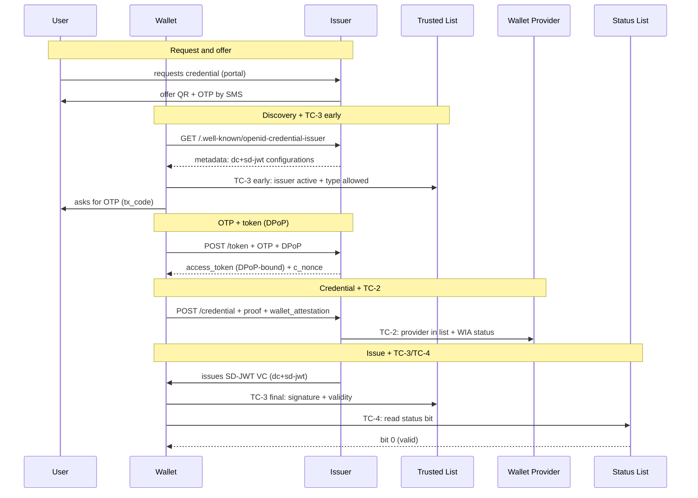
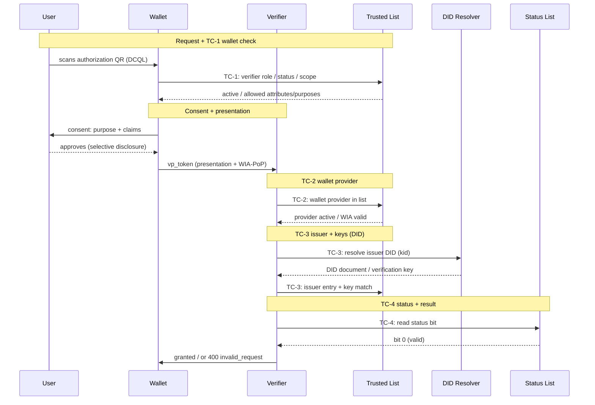

# Thailand's VC stack

{/*
AGENT NOTES (hidden — not rendered on the site):

This page summarises the Thai chapters, which are the single
source of truth. Where this page and the Thai text differ, the Thai text is
correct. Each item links to the Thai chapter that defines it.

Source chapters (paths under th/thai-vc-arf/ unless noted):
- Issuing a credential: 05-standards-and-compliance.md, 08-implementation-guidelines.md, 08.1-issuance-full-flow-detail.md
- Presenting a credential: 05-standards-and-compliance.md, 08-implementation-guidelines.md, 08.2-oid4vp-full-flow-detail.md
- The Trusted Lists: 00-minimal-interoperability-reference.md, 12.1-trust-list-publication-profile.md, th/research/42-trusted-list-lote-jwt-format.md (JWT structure); th/research/41-trustlist-serving-filecdn-etag-binary.md (CDN access)
- Revocation and status: 13-vc-status-and-revocation.md, 12-key-management-and-trustlist-deployment.md, 10-wallet-unit-attestation.md

Full source of truth (Thai): ARF index (th/thai-vc-arf/README.md).
*/}

This page describes Thailand's credential stack, in the terms a counterpart system uses to check compatibility.

## Current PoC stage

This page describes the planned specification. The current proof of concept implements only:

1. A single LoTE that holds issuers, verifiers, and wallet providers. The target profile instead uses three separate signed JWTs.
2. A wallet app that trusts entities only through the Trusted List, with no certificates. Entities publish a public key in the Trusted List, either as a `did:web` reference or as a public key string.
3. Wallet Instance Attestation (WIA) is not implemented yet.

## Short version

The five building blocks:

- **Credential format:** The system supports multiple formats. v1.1 used JSON-LD per W3C VC Data Model, which is still supported, and adds IETF SD-JWT VC (`dc+sd-jwt`) as the recommended format for new issuance.
- **Issuance protocol:** OpenID for Verifiable Credential Issuance (OID4VCI) 1.0 Final, pre-authorized code flow.
- **Presentation protocol:** OpenID for Verifiable Presentations (OID4VP) 1.0 Final, with DCQL queries.
- **Trust:** three related Trusted Lists with LoTE-inspired payloads in signed JWTs, served over a CDN. All three trust models use the relevant Trusted List; Trust Model 3 does not require a CA chain.
- **Credential status:** IETF Token Status List, published by each issuer.

For a counterpart assessing convergence: Thailand uses the OID4VCI, OID4VP, and SD-JWT VC stack. Recognition of a Thai Trusted List entry in the EU requires a trust agreement, role and assurance mapping, a bridge list, and conformance evidence.

## Issuing a credential

Issuance runs OID4VCI 1.0 Final, pre-authorized code flow, and issues only SD-JWT VC (`dc+sd-jwt`).

Before the wallet asks the user for the OTP, it checks the issuer against the Trusted List (TC-3 early). If the issuer is not `active` for that credential type, the flow stops.

At assurance level IAL2.3 and above, the access token is bound to a wallet key with DPoP (RFC 9449).

The credential request carries the wallet's attestation, signed by the wallet provider. The issuer checks the provider on the Trusted List (TC-2) and validates the attestation before signing.

Before storing the VC, the wallet checks the issuer signature, the validity window, and the status bit (TC-3 final and TC-4).

## Presenting a credential

Presentation runs OID4VP 1.0 Final with DCQL.

Before showing a consent screen, the wallet checks the verifier against the Trusted List (TC-1): is the verifier `active`, and are the requested claims and purpose within what it registered? If not, the wallet sends nothing.

The verifier then checks three things:

- TC-2: the wallet provider is on the Trusted List and the wallet attestation is valid and fresh. This check is mandatory for Thai government wallets. For a private wallet, it depends on the verifier's confidence level (standard or enhanced).
- TC-3: the issuer is on the Trusted List, and the issuer's DID resolves to the key that signed the credential.
- TC-4: the status bit is read from the issuer's status list.

The verifier must also check the issuer's status, scope, and the credential's own status before accepting it.

Identifiers: organisations use `did:web`, holders use `did:jwk`, and Thai identity rails such as NDID resolve as custom methods through the ETDA Trust Gateway (the universal resolver).

## The Trusted List

ETDA audits organisations that act as issuers, verifiers, or wallet providers. The target profile publishes three related Trusted Lists as signed compact JWTs with LoTE-inspired payloads: `iss.txt`, `ver.txt`, and `wp.txt` on the [ETDA CDN profile](../../th/thai-vc-arf/12.1-trust-list-publication-profile.md). Each `.txt` file contains a compact JWT. Consumers fetch the relevant whole file on demand, without an API key, and validate ETDA's signature before using it.

The [decoded JWT examples](../../th/research/42-trusted-list-lote-jwt-format.md) use `LoTE.TrustedEntitiesList[]` for organisations and `TrustedEntityServices[]` for services. The issuer example is a three-part compact JWS with one organisation and three issuance services. It shows public keys, a certificate, and identifiers. Organisation and service status and authorised credential types remain to be defined in the Thai profile, along with their validation rules, before a consumer can make an authorisation decision.

Participants fetch the relevant whole-file Trusted List lazily when a connection needs a trust decision. They use `ETag` for revalidation, without an API key, background polling, or delta API. They fail closed if the file or its signature cannot be verified, or if required status and scope cannot be established. Entity-level revocation reaches each participant at its next lazy pull.

Consumers determine an entity's authorisation from the Trusted List and obtain signature-verification keys from its linked DID document where applicable. ETDA signs the list from FIPS 140-3 Level 3 HSMs under an M-of-N quorum, with an offline emergency key.

### Trusted List examples

The JWTs below illustrate the LoTE structure. Their signatures remain unverified, and the issuer JWT lacks required status and scope fields. They cannot be used as authorisation test vectors. [Source analysis](../../th/research/42-trusted-list-lote-jwt-format.md).

1. Issuer: eyJhbGciOiJFUzI1NiIsInR5cCI6IkpPU0UiLCJpYXQiOjE3ODkwMzA2MDIsIng1YyI6WyJNSUlCUGpDQjVxQURBZ0VDQWhRelVlbmtacnB3TGFjVEhqMDd4RXo4bENpOFV6QUtCZ2dxaGtqT1BRUURBakFQTVEwd0N3WURWUVFEREFSRlZFUkJNQjRYRFRJMk1EZ3hNekUxTVRNME4xb1hEVEkzTURneE16RTFNVE0wTjFvd0R6RU5NQXNHQTFVRUF3d0VSVlJFUVRCWk1CTUdCeXFHU000OUFnRUdDQ3FHU000OUF3RUhBMElBQkVKNnRGamJVVEJQQnRlcGFsWjVGUktMVDZxVnFrbzFvTk1naUlvdXI4RmFxUHAyQUxPbk90bGpwZnl4NmdoZ3YvV3lVWkgwRlhNdDluTTN2dTdzd25paklEQWVNQTRHQTFVZER3RUIvd1FFQXdJSGdEQU1CZ05WSFJNQkFmOEVBakFBTUFvR0NDcUdTTTQ5QkFNQ0EwY0FNRVFDSUc4Z1dWdjZBL2VjU2ZhWFJ2T014Q0kyR0FWYlNlTDk3ZmwyT2R4NCtwU1pBaUIwbXZ5MTB4VzN5dTJDc0ZnSkRqc1BaSTZBV3ZKeGd2VlptQXJMQTlhY1FRPT0iXSwieDV0I1MyNTYiOiJsY1BDaTAxaVFfbkIyQWRZRzVKcEMxTlh3dEVncm9GczhVT2hma21GM2ZzIn0.eyJMb1RFIjp7Ikxpc3RBbmRTY2hlbWVJbmZvcm1hdGlvbiI6eyJMb1RFVmVyc2lvbklkZW50aWZpZXIiOjEsIkxvVEVTZXF1ZW5jZU51bWJlciI6MiwiTG9URVR5cGUiOiJodHRwOi8vdXJpLmV0c2kub3JnLzE5NjAyL0xvVEVUeXBlL0VVUHViRUFBUHJvdmlkZXJzTGlzdCIsIlNjaGVtZU9wZXJhdG9yTmFtZSI6W3sibGFuZyI6ImVuIiwidmFsdWUiOiJFbGVjdHJvbmljIFRyYW5zYWN0aW9ucyBEZXZlbG9wbWVudCBBZ2VuY3kgKEVUREEpIn1dLCJTY2hlbWVJbmZvcm1hdGlvblVSSSI6W3sibGFuZyI6ImVuIiwidXJpVmFsdWUiOiJodHRwczovL3d3dy5ldGRhLm9yLnRoIn1dLCJTdGF0dXNEZXRlcm1pbmF0aW9uQXBwcm9hY2giOiJodHRwOi8vdXJpLmV0ZGEub3IudGgvMTk2MDIvVGhhaUlzc3VlcnNMaXN0L1N0YXR1c0RldG4vRVREQSIsIlNjaGVtZVR5cGVDb21tdW5pdHlSdWxlcyI6W3sibGFuZyI6ImVuIiwidXJpVmFsdWUiOiJodHRwOi8vdXJpLmV0ZGEub3IudGgvMTk2MDIvVGhhaUlzc3VlcnMvc2NoZW1lcnVsZXMvRVREQSJ9XSwiU2NoZW1lVGVycml0b3J5IjoiVEgiLCJTY2hlbWVOYW1lIjpbeyJsYW5nIjoiZW4iLCJ2YWx1ZSI6IlRoYWkgSXNzdWVycyBMaXN0In1dLCJIaXN0b3JpY2FsSW5mb3JtYXRpb25QZXJpb2QiOjM2NSwiRGlzdHJpYnV0aW9uUG9pbnRzIjpbXSwiU2NoZW1lRXh0ZW5zaW9ucyI6W10sIkxpc3RJc3N1ZURhdGVUaW1lIjoiMjAyNi0wOS0xMFQwODo1Njo0Mi45NzdaIiwiTmV4dFVwZGF0ZSI6IjIwMjYtMDktMTFUMDg6NTY6NDIuOTc3WiJ9LCJUcnVzdGVkRW50aXRpZXNMaXN0IjpbeyJUcnVzdGVkRW50aXR5SW5mb3JtYXRpb24iOnsiVEVOYW1lIjpbeyJsYW5nIjoiZW4iLCJ2YWx1ZSI6IkVsZWN0cm9uaWMgVHJhbnNhY3Rpb25zIERldmVsb3BtZW50IEFnZW5jeSAoRVREQSkifV19LCJUcnVzdGVkRW50aXR5U2VydmljZXMiOlt7IlNlcnZpY2VJbmZvcm1hdGlvbiI6eyJTZXJ2aWNlVHlwZUlkZW50aWZpZXIiOiJodHRwOi8vdXJpLmV0c2kub3JnLzE5NjAyL1N2Y1R5cGUvUHViRUFBL0lzc3VhbmNlIiwiU2VydmljZU5hbWUiOlt7ImxhbmciOiJlbiIsInZhbHVlIjoiUm9sZSBtb2RlbCBjZXJ0aWZpY2F0ZSJ9XSwiU2VydmljZURpZ2l0YWxJZGVudGl0eSI6eyJQdWJsaWNLZXlWYWx1ZXMiOlt7Imt0eSI6Ik9LUCIsImNydiI6IkVkMjU1MTkiLCJ4IjoiaEZCU0ZTZXJRblBMMVBOVXA5TnZRTDlqUUJPamJmSU1ScGRwUUEyaUFnSSJ9XSwiT3RoZXJJZHMiOlsiZGlkOmtleTp6Nk1rb01rdTFlYVlGRDdyR25oUzlyRDJiR3l5ZHZQbUUzVWlXNTdNUVlkQVlqSlIiXX19fSx7IlNlcnZpY2VJbmZvcm1hdGlvbiI6eyJTZXJ2aWNlVHlwZUlkZW50aWZpZXIiOiJodHRwOi8vdXJpLmV0c2kub3JnLzE5NjAyL1N2Y1R5cGUvUHViRUFBL0lzc3VhbmNlIiwiU2VydmljZU5hbWUiOlt7ImxhbmciOiJlbiIsInZhbHVlIjoiRW1wbG95ZWVJRCBkZW1vIn1dLCJTZXJ2aWNlRGlnaXRhbElkZW50aXR5Ijp7Ik90aGVySWRzIjpbXSwiWDUwOVNLSXMiOltdLCJQdWJsaWNLZXlWYWx1ZXMiOltdLCJYNTA5Q2VydGlmaWNhdGVzIjpbeyJ2YWwiOiJNSUlCbERDQ0FVYWdBd0lCQWdJVWIxYjlLVHdDTEVidHR6Wit2VXdTRGtYS2tOTXdCUVlESzJWd01EWXhGVEFUQmdOVkJBTU1ERUZqYldVZ1VtOXZkQ0JEUVRFTE1Ba0dBMVVFQmd3Q1EwZ3hFREFPQmdOVkJBb01CMEZqYldVZ1EyOHdIaGNOTWpZd09ESTRNREF3TURBd1doY05NamN3T0RNd01EQXdNREF3V2pBMk1SVXdFd1lEVlFRRERBeEJZMjFsSUZKdmIzUWdRMEV4Q3pBSkJnTlZCQVlNQWtOSU1SQXdEZ1lEVlFRS0RBZEJZMjFsSUVOdk1Db3dCUVlESzJWd0F5RUFKY0FXbk91Y0NjMU1FNVhOMjNtSDBlcmpNTnRkWi83YlpJeXdXNmZMZ1dpalpqQmtNQjhHQTFVZEl3UVlNQmFBRk9MTlNYSmZaVncwYklKNDdLY1RyWFdiR1AvZk1BNEdBMVVkRHdFQi93UUVBd0lCQmpBZEJnTlZIUTRFRmdRVTRzMUpjbDlsWERSc2duanNweE90ZFpzWS85OHdFZ1lEVlIwVEFRSC9CQWd3QmdFQi93SUJBREFGQmdNclpYQURRUUQvZ3g5a1MzSCt2WVdQcCtCS0I2dmRTMmZMY1hqSDk0dTNrdmgyc3Z4Z2xqMnU4SVY4em5lQTVudjhzNWZyNlNCMTdOclBaMXl6cHZkYU1JRzVqRXdNIiwic3BlY1JlZiI6IiIsImVuY29kaW5nIjoiIn1dLCJYNTA5U3ViamVjdE5hbWVzIjpbXX19fSx7IlNlcnZpY2VJbmZvcm1hdGlvbiI6eyJTZXJ2aWNlVHlwZUlkZW50aWZpZXIiOiJodHRwOi8vdXJpLmV0c2kub3JnLzE5NjAyL1N2Y1R5cGUvUHViRUFBL0lzc3VhbmNlIiwiU2VydmljZU5hbWUiOlt7ImxhbmciOiJlbiIsInZhbHVlIjoiUHJvY2l2aXMgRGVtbyBQSUQgSXNzdWVyIn1dLCJTZXJ2aWNlRGlnaXRhbElkZW50aXR5Ijp7IlB1YmxpY0tleVZhbHVlcyI6W3sia3R5IjoiRUMiLCJjcnYiOiJQLTI1NiIsIngiOiJwMFk0MVhZU2RxMGljOGV2Wi1tT1RPenllQlhWOE1ZbnRIMGJfSEJqb00wIiwieSI6IlU3ODVFbnZyR3VNSlVnWDNLVGdrUzV6c2RxQjhfVWV0ZW1HM1NIcEJxZjAifV0sIk90aGVySWRzIjpbImRpZDp3ZWI6aXNzdWVyLnRvbnloZXJlLndvcms6c3NpOmRpZC13ZWI6djE6NDdhNzRjMTctZGU1Ny00ODc2LWFkYTUtZDcwNzg2YWU4MDM4Il19fX1dfV19fQ.OGq2Sj4pbb1csy_kOzWa_gbeMPbBaL6MhWv-yQLykWrQ56gabFZaJfM3eZmyhUYJRfYp-7kevUCBxaRpLBvhKQ
2. Verifier: eyJhbGciOiJFUzI1NiIsInR5cCI6IkpPU0UiLCJpYXQiOjE3ODkwMzUwMzMsIng1YyI6WyJNSUlCUGpDQjVxQURBZ0VDQWhRelVlbmtacnB3TGFjVEhqMDd4RXo4bENpOFV6QUtCZ2dxaGtqT1BRUURBakFQTVEwd0N3WURWUVFEREFSRlZFUkJNQjRYRFRJMk1EZ3hNekUxTVRNME4xb1hEVEkzTURneE16RTFNVE0wTjFvd0R6RU5NQXNHQTFVRUF3d0VSVlJFUVRCWk1CTUdCeXFHU000OUFnRUdDQ3FHU000OUF3RUhBMElBQkVKNnRGamJVVEJQQnRlcGFsWjVGUktMVDZxVnFrbzFvTk1naUlvdXI4RmFxUHAyQUxPbk90bGpwZnl4NmdoZ3YvV3lVWkgwRlhNdDluTTN2dTdzd25paklEQWVNQTRHQTFVZER3RUIvd1FFQXdJSGdEQU1CZ05WSFJNQkFmOEVBakFBTUFvR0NDcUdTTTQ5QkFNQ0EwY0FNRVFDSUc4Z1dWdjZBL2VjU2ZhWFJ2T014Q0kyR0FWYlNlTDk3ZmwyT2R4NCtwU1pBaUIwbXZ5MTB4VzN5dTJDc0ZnSkRqc1BaSTZBV3ZKeGd2VlptQXJMQTlhY1FRPT0iXSwieDV0I1MyNTYiOiJsY1BDaTAxaVFfbkIyQWRZRzVKcEMxTlh3dEVncm9GczhVT2hma21GM2ZzIn0.eyJMb1RFIjp7Ikxpc3RBbmRTY2hlbWVJbmZvcm1hdGlvbiI6eyJMb1RFVmVyc2lvbklkZW50aWZpZXIiOjEsIkxvVEVTZXF1ZW5jZU51bWJlciI6MiwiTG9URVR5cGUiOiJodHRwOi8vdXJpLmV0ZGEub3IudGgvMTk2MDIvTG9URVR5cGUvVGhhaVZlcmlmaWVyc0xpc3QiLCJTY2hlbWVPcGVyYXRvck5hbWUiOlt7ImxhbmciOiJlbiIsInZhbHVlIjoiRWxlY3Ryb25pYyBUcmFuc2FjdGlvbnMgRGV2ZWxvcG1lbnQgQWdlbmN5IChFVERBKSJ9XSwiU2NoZW1lSW5mb3JtYXRpb25VUkkiOlt7ImxhbmciOiJlbiIsInVyaVZhbHVlIjoiaHR0cHM6Ly93d3cuZXRkYS5vci50aCJ9XSwiU3RhdHVzRGV0ZXJtaW5hdGlvbkFwcHJvYWNoIjoiaHR0cDovL3VyaS5ldGRhLm9yLnRoLzE5NjAyL1RoYWlWZXJpZmllcnNMaXN0L1N0YXR1c0RldG4vRVREQSIsIlNjaGVtZVR5cGVDb21tdW5pdHlSdWxlcyI6W3sibGFuZyI6ImVuIiwidXJpVmFsdWUiOiJodHRwOi8vdXJpLmV0ZGEub3IudGgvMTk2MDIvVGhhaVZlcmlmaWVycy9zY2hlbWVydWxlcy9FVERBIn1dLCJTY2hlbWVUZXJyaXRvcnkiOiJUSCIsIlNjaGVtZU5hbWUiOlt7ImxhbmciOiJlbiIsInZhbHVlIjoiVGhhaSBWZXJpZmllcnMgTGlzdCJ9XSwiSGlzdG9yaWNhbEluZm9ybWF0aW9uUGVyaW9kIjozNjUsIkRpc3RyaWJ1dGlvblBvaW50cyI6W10sIlNjaGVtZUV4dGVuc2lvbnMiOltdLCJMaXN0SXNzdWVEYXRlVGltZSI6IjIwMjYtMDktMTBUMTA6MTA6MzMuOTI4WiIsIk5leHRVcGRhdGUiOiIyMDI2LTA5LTExVDEwOjEwOjMzLjkyOFoifSwiVHJ1c3RlZEVudGl0aWVzTGlzdCI6W3siVHJ1c3RlZEVudGl0eUluZm9ybWF0aW9uIjp7IlRFTmFtZSI6W3sibGFuZyI6ImVuIiwidmFsdWUiOiJFbGVjdHJvbmljIFRyYW5zYWN0aW9ucyBEZXZlbG9wbWVudCBBZ2VuY3kgKEVUREEpIn1dfSwiVHJ1c3RlZEVudGl0eVNlcnZpY2VzIjpbeyJTZXJ2aWNlSW5mb3JtYXRpb24iOnsiU2VydmljZVR5cGVJZGVudGlmaWVyIjoiaHR0cDovL3VyaS5ldGRhLm9yLnRoLzE5NjAyL1N2Y1R5cGUvVmVyaWZpZXIiLCJTZXJ2aWNlTmFtZSI6W3sibGFuZyI6ImVuIiwidmFsdWUiOiJQcm9jaXZpcyBEZW1vIEJhbmsgVmVyaWZpZXIifV0sIlNlcnZpY2VEaWdpdGFsSWRlbnRpdHkiOnsiUHVibGljS2V5VmFsdWVzIjpbeyJrdHkiOiJFQyIsImNydiI6IlAtMjU2IiwieCI6IjVYemtpV0s4UWl1Y3N3SENLakk1S3dyM3JXZkZ6SDlBWElhN0FwMXpDeTgiLCJ5IjoidU9XYThGZU5nbTlyc0hiZmpBczZxTVZnb21Fa1JoMHl1QS1JRjhQUXFwRSJ9XSwiT3RoZXJJZHMiOlsiZGlkOndlYjp2ZXJpZmllci50b255aGVyZS53b3JrOnNzaTpkaWQtd2ViOnYxOmU1NDNlYTBlLTBhMTAtNGZmNS1iOGZhLTE0MTRmMGYzYWI5YyJdfX19XX1dfX0.u92cxz56yft9MttrtaOGJ7keqWsV8GX1BLfNQaMHToaQKnyrqcWBgkfrVQ5aRJHtociOro9EwGhWQrbiwHB-ag
3. Wallet Provider: eyJhbGciOiJFUzI1NiIsInR5cCI6IkpPU0UiLCJpYXQiOjE3ODg3ODExNDgsIng1YyI6WyJNSUlCUGpDQjVxQURBZ0VDQWhRelVlbmtacnB3TGFjVEhqMDd4RXo4bENpOFV6QUtCZ2dxaGtqT1BRUURBakFQTVEwd0N3WURWUVFEREFSRlZFUkJNQjRYRFRJMk1EZ3hNekUxTVRNME4xb1hEVEkzTURneE16RTFNVE0wTjFvd0R6RU5NQXNHQTFVRUF3d0VSVlJFUVRCWk1CTUdCeXFHU000OUFnRUdDQ3FHU000OUF3RUhBMElBQkVKNnRGamJVVEJQQnRlcGFsWjVGUktMVDZxVnFrbzFvTk1naUlvdXI4RmFxUHAyQUxPbk90bGpwZnl4NmdoZ3YvV3lVWkgwRlhNdDluTTN2dTdzd25paklEQWVNQTRHQTFVZER3RUIvd1FFQXdJSGdEQU1CZ05WSFJNQkFmOEVBakFBTUFvR0NDcUdTTTQ5QkFNQ0EwY0FNRVFDSUc4Z1dWdjZBL2VjU2ZhWFJ2T014Q0kyR0FWYlNlTDk3ZmwyT2R4NCtwU1pBaUIwbXZ5MTB4VzN5dTJDc0ZnSkRqc1BaSTZBV3ZKeGd2VlptQXJMQTlhY1FRPT0iXSwieDV0I1MyNTYiOiJsY1BDaTAxaVFfbkIyQWRZRzVKcEMxTlh3dEVncm9GczhVT2hma21GM2ZzIn0.eyJMb1RFIjp7Ikxpc3RBbmRTY2hlbWVJbmZvcm1hdGlvbiI6eyJMb1RFVmVyc2lvbklkZW50aWZpZXIiOjEsIkxvVEVTZXF1ZW5jZU51bWJlciI6MSwiTG9URVR5cGUiOiJodHRwOi8vdXJpLmV0c2kub3JnLzE5NjAyL0xvVEVUeXBlL0VVV2FsbGV0UHJvdmlkZXJzTGlzdCIsIlNjaGVtZU9wZXJhdG9yTmFtZSI6W3sibGFuZyI6ImVuIiwidmFsdWUiOiJFbGVjdHJvbmljIFRyYW5zYWN0aW9ucyBEZXZlbG9wbWVudCBBZ2VuY3kgKEVUREEpIn1dLCJTY2hlbWVJbmZvcm1hdGlvblVSSSI6W3sibGFuZyI6ImVuIiwidXJpVmFsdWUiOiJodHRwczovL3d3dy5ldGRhLm9yLnRoIn1dLCJTdGF0dXNEZXRlcm1pbmF0aW9uQXBwcm9hY2giOiJodHRwOi8vdXJpLmV0c2kub3JnLzE5NjAyL1dhbGxldFByb3ZpZGVyc0xpc3QvU3RhdHVzRGV0bi9FVSIsIlNjaGVtZVR5cGVDb21tdW5pdHlSdWxlcyI6W3sibGFuZyI6ImVuIiwidXJpVmFsdWUiOiJodHRwOi8vdXJpLmV0c2kub3JnLzE5NjAyL1dhbGxldFByb3ZpZGVyc0xpc3Qvc2NoZW1lcnVsZXMvRVUifV0sIlNjaGVtZVRlcnJpdG9yeSI6IlRIIiwiU2NoZW1lTmFtZSI6W3sibGFuZyI6ImVuIiwidmFsdWUiOiJXYWxsZXQgUHJvdmlkZXJzIExpc3QifV0sIkhpc3RvcmljYWxJbmZvcm1hdGlvblBlcmlvZCI6MzY1LCJEaXN0cmlidXRpb25Qb2ludHMiOltdLCJTY2hlbWVFeHRlbnNpb25zIjpbXSwiTGlzdElzc3VlRGF0ZVRpbWUiOiIyMDI2LTA5LTA3VDExOjM5OjA4LjM5NVoiLCJOZXh0VXBkYXRlIjoiMjAyNi0wOS0wOFQxMTozOTowOC4zOTVaIn0sIlRydXN0ZWRFbnRpdGllc0xpc3QiOltdfX0.Izh_JYqPikXvdYGKdYJY6I26VuWuLtWwCX1eKtvqxnVSMRsxxtV_K7Wx6lbp_1C7RemaFT52ZrAOZa5t1SmZ6g

## Revocation and status

Each issuer publishes its own Token Status List (`draft-ietf-oauth-status-list-18`). Status bits: 0 valid, 1 revoked, 2 suspended, 3 rotated (key rotation).

Issuers target publication of a change within 15 minutes; the full process may take longer. Verifiers must validate the status URL against the source defined by the Thai profile, check the credential-supplied URL against that source, and read the status bit on every presentation (TC-4). The current JWT examples do not show a status-URL field. [Source analysis](../../th/research/42-trusted-list-lote-jwt-format.md).

Revocation also happens above the credential level. If ETDA suspends or withdraws an issuer, all of that issuer's credentials stop verifying without any per-credential write, because the issuer's role record is no longer `active`. If a wallet provider revokes a wallet attestation, issuers that bound credentials to that wallet unit must revoke them in turn. Every credential also dies at `validUntil` without any of the above.

Emergency revocation reaches each entity at its next lazy pull, with no background polling and no push channel.
