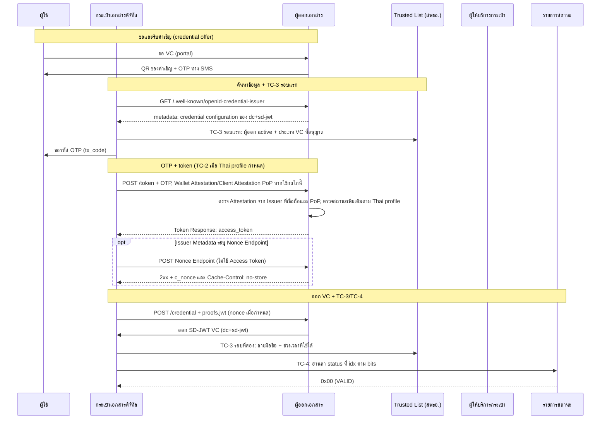
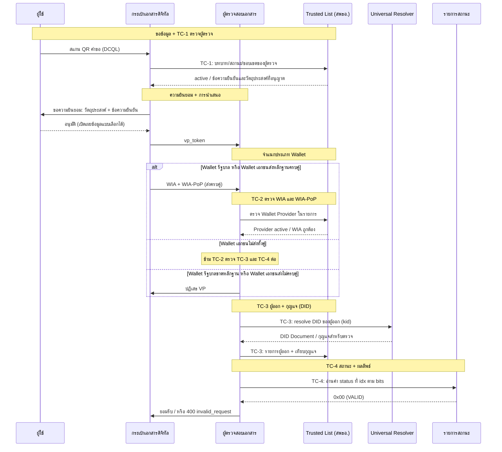

# ชุด VC ของประเทศไทย — สรุปหนึ่งหน้า

{/* METADATA (agent-only — not rendered to readers)
> **สถานะ:** 📄 Reference — บทสรุปหนึ่งหน้า จัดทำขึ้นเพื่อให้ระบบของคู่ภาคี (counterpart system) ใช้ตรวจสอบความสอดคล้องกัน มิได้เป็นบทในรายงานต้นฉบับของ สพธอ.
> **แหล่งข้อมูล:** [Thai VC ARF](README.md) — รายงานทางเทคนิคของสำนักงานพัฒนาธุรกรรมทางอิเล็กทรอนิกส์ (สพธอ.) เวอร์ชัน 1.1 และส่วนขยายเวอร์ชัน 2.0/2.1 ซึ่งเป็นแหล่งข้อมูลอ้างอิงหลักของเอกสารฉบับนี้
> **เอกสารที่เกี่ยวข้อง:** [§5 มาตรฐานและข้อปฏิบัติ](05-standards-and-compliance.md) · [§8 Implementation Guidelines](08-implementation-guidelines.md) · [§8.1 OID4VCI Full Flow](08.1-issuance-full-flow-detail.md) · [§8.2 OID4VP Full Flow](08.2-oid4vp-full-flow-detail.md) · [§6.5 กลไกการสร้างความน่าเชื่อถือ](06.5-trust-building-mechanism.md) · [§7 การทำงานร่วมกันข้ามระบบนิเวศ](07-cross-ecosystem-interoperability.md) · [§9 Trust Model 3](09-trust-model-3.md) · [§12 Key Management และ Trusted List Deployment](12-key-management-and-trustlist-deployment.md) · [§13 VC Status และ Revocation](13-vc-status-and-revocation.md) · [research/41 การให้บริการ Trusted List ผ่าน CDN](../research/41-trustlist-serving-filecdn-etag-binary.md)
*/}

---

{/*
บันทึกสำหรับ agent (ซ่อน — ไม่แสดงบนเว็บไซต์):

บทความนี้สรุปบทภาษาไทยใน th/thai-vc-arf/ ซึ่งเป็นแหล่งข้อมูลอ้างอิงหลัก
กรณีบทความนี้กับบทภาษาไทยขัดกัน ให้ยึดบทภาษาไทย

บทต้นทาง (path ภายใต้ th/thai-vc-arf/ เว้นแต่ระบุไว้เป็นอย่างอื่น):
- การออก VC: 05-standards-and-compliance.md, 08-implementation-guidelines.md, 08.1-issuance-full-flow-detail.md
- การแสดง VC: 05-standards-and-compliance.md, 08-implementation-guidelines.md, 08.2-oid4vp-full-flow-detail.md
- Trusted List: 06.5-trust-building-mechanism.md, 07-cross-ecosystem-interoperability.md, 09-trust-model-3.md, 12-key-management-and-trustlist-deployment.md, th/research/41-trustlist-serving-filecdn-etag-binary.md
- การเพิกถอนและสถานะ: 13-vc-status-and-revocation.md, 12-key-management-and-trustlist-deployment.md, 10-wallet-unit-attestation.md

ดัชนีแหล่งข้อมูลอ้างอิงหลัก (ภาษาไทย): th/thai-vc-arf/README.md
ฉบับภาษาอังกฤษของบทสรุปนี้: en/thai-vc-arf/00-minimal-interoperability-reference.md
*/}

หน้านี้อธิบายชุดมาตรฐาน VC ของประเทศไทย ในมุมที่ระบบคู่ภาคีใช้ตรวจสอบความเข้ากันได้

## สถานะ PoC ปัจจุบัน

หน้านี้กำหนดรูปแบบเป้าหมายสำหรับการพัฒนา ต้นแบบ (PoC) ปัจจุบันมี 3 ส่วน:

1. LoTE (List of Trusted Entities) รายการเดียวที่บรรจุผู้ออก ผู้ตรวจ และผู้ให้บริการกระเป๋าทั้งหมด
2. แอปกระเป๋าที่เชื่อถือเอนทิตีผ่าน Trusted List เท่านั้น ไม่ใช้ใบรับรอง เอนทิตีแต่ละรายประกาศกุญแจสาธารณะใน Trusted List ในรูป `did:web` หรือสายอักขระกุญแจสาธารณะ
3. Wallet Instance Attestation (WIA) ยังไม่ได้ทำ

## ฉบับย่อ

องค์ประกอบหลัก 5 ส่วน คือ

- **รูปแบบ VC:** ระบบรองรับหลายรูปแบบ โดย v1.1 ใช้ JSON-LD ตาม W3C VC Data Model ซึ่งยังคงรองรับ และเพิ่ม IETF SD-JWT VC (`dc+sd-jwt`) เป็นรูปแบบที่แนะนำสำหรับการออกใหม่
- **โปรโตคอลการออก:** OpenID for Verifiable Credential Issuance (OID4VCI) 1.0 Final แบบ pre-authorized code flow
- **โปรโตคอลการแสดง:** OpenID for Verifiable Presentations (OID4VP) 1.0 Final พร้อม DCQL
- **ความน่าเชื่อถือ:** Trusted List ตาม ETSI TS 119 602 ซึ่ง สพธอ. เป็นผู้ลงลายมือชื่อและเผยแพร่ผ่าน CDN โดยไม่ใช้สายใบรับรองของ CA
- **สถานะ VC:** IETF Token Status List ซึ่งผู้ออกแต่ละรายเผยแพร่เอง

สำหรับคู่ภาคีที่ประเมินการลู่เข้าหากัน (convergence): ประเทศไทยใช้ชุด OID4VCI + OID4VP + SD-JWT VC เดียวกับ EU แต่รายการใน Trusted List ของไทยไม่ได้รับการยอมรับใน EU โดยอัตโนมัติ การยอมรับต้องมีข้อตกลงความน่าเชื่อถือ (trust agreement) การเทียบบทบาทและระดับการรับรอง (trust mapping) รายการเชื่อม (bridge list) และหลักฐานการทดสอบความสอดคล้อง (conformance evidence)

## การออก VC

การออกใช้ OID4VCI 1.0 Final แบบ pre-authorized code flow ระบบยังคงรองรับ VC เดิมตาม W3C Verifiable Credentials Data Model v1.1 และเพิ่ม SD-JWT VC (`dc+sd-jwt`) สำหรับการออกเอกสารใหม่

ก่อนขอรหัส OTP จากผู้ใช้ กระเป๋าจะตรวจผู้ออกกับ Trusted List ก่อน (Trust Check 3 รอบแรก ย่อเป็น TC-3 รอบแรก) ถ้าผู้ออกไม่ได้ `active` สำหรับประเภท VC นั้น กระบวนการจะหยุดทันที

ที่ระดับ IAL2.3 ขึ้นไป access token จะผูกกับกุญแจของกระเป๋าด้วย DPoP (RFC 9449)

หากเลือกใช้ Wallet Attestation client authentication ตาม OID4VCI Appendix E, Wallet ส่ง Attestation ใน PAR หรือ Token Request พร้อม Client Attestation PoP ตามมาตรฐานที่อ้างถึง. Authorization Server ตรวจลายมือชื่อ Attestation จาก Issuer ที่เชื่อถือและตรวจ PoP. Credential Request ส่ง `proofs.jwt` เพื่อพิสูจน์การครอบครองกุญแจที่จะผูกกับ VC. Trust source และการตรวจสถานะ Wallet เพิ่มเติมเป็นไปตาม Thai profile. แผนภาพนี้ใช้ Pre-Authorized Code Flow จึงแสดง client authentication ที่ Token Request.

ก่อนจัดเก็บ VC กระเป๋าจะตรวจลายมือชื่อของผู้ออก ช่วงเวลาที่ใช้ได้ และค่า status ใน Status List (TC-3 รอบที่สอง และ TC-4)

## การแสดง VC

การแสดงใช้ OID4VP 1.0 Final พร้อม DCQL แทน Presentation Exchange

ก่อนแสดงหน้าขอความยินยอม กระเป๋าจะตรวจผู้ตรวจกับ Trusted List (Trust Check 1 ย่อเป็น TC-1) ว่า `active` อยู่หรือไม่ และข้อความยืนยัน (claims) กับวัตถุประสงค์ (purpose) ที่ขอ อยู่ในขอบเขตที่ลงทะเบียนไว้หรือไม่ ถ้าไม่ กระเป๋าจะไม่ส่งอะไรออกไปเลย

จากนั้นผู้ตรวจจะตรวจ 3 ข้อ คือ

- Trust Check 2 (TC-2): **ใน OID4VP** Wallet รัฐบาลต้องส่ง WIA และ WIA-PoP และ Verifier ต้องตรวจทั้งคู่; Wallet เอกชนเลือกส่งทั้งคู่หรือไม่ส่งทั้งคู่ได้ หากเอกชนไม่ส่งทั้งคู่ Verifier ข้าม TC-2 และตรวจ TC-3/TC-4 ต่อ หากส่งไม่ครบหรือรายการใดตรวจไม่ผ่าน ให้ปฏิเสธ VP Verifier ต้องจำแนกประเภท Wallet โดยใช้ข้อมูล Wallet Provider จากแหล่งที่เชื่อถือได้และเป็นอิสระจาก WIA ตามที่ Thai profile กำหนด; หากไม่มีข้อมูล ตรวจความสดใหม่ไม่ได้ หรือจำแนกประเภทไม่ได้ ให้ปฏิเสธ VP (ดู [§8.4.2](08-implementation-guidelines.md) และ [§12.1.4](12.1-trust-list-publication-profile.md)) กฎนี้เป็นส่วนขยาย OID4VP และไม่เปลี่ยนข้อกำหนด OID4VCI
- Trust Check 3 (TC-3): ผู้ออกอยู่ใน Trusted List และ DID ของผู้ออก resolve ได้เป็นกุญแจที่ใช้ลงลายมือชื่อใน VC
- Trust Check 4 (TC-4): อ่านค่า status ที่ index ของ VC ตามความกว้าง `bits` จาก Status List ของผู้ออก

ลายมือชื่อถูกต้องอย่างเดียวไม่พอที่จะยอมรับ VC

ตัวระบุ: หน่วยงานใช้ `did:web` ผู้ถือใช้ `did:jwk` ส่วนระบบตัวตนของไทย เช่น NDID ใช้ custom DID method และ resolve ผ่าน ETDA Trust Gateway ซึ่งทำหน้าที่เป็น Universal Resolver

## Trusted List

สพธอ. ตรวจรับรอง (audit) ทุกหน่วยงานที่จะเป็นผู้ออก ผู้ตรวจ หรือผู้ให้บริการกระเป๋า แล้วลงลายมือชื่อบันทึกไว้ใน Trusted List ที่เกี่ยวข้องจำนวน 3 รายการ แยกตามบทบาท และจัดทำในรูปแบบ JWT เผยแพร่ผ่าน CDN โดยไม่ต้องใช้ API key ลายมือชื่อของ สพธอ. คือเหตุผลเดียวที่ทำให้เชื่อถือรายการนี้ได้ [research/41]

payload ของ JWT รูปแบบเป้าหมายใช้ `LoTE.ListAndSchemeInformation` สำหรับชนิดรายการ ลำดับ และเวลา ใช้ `LoTE.TrustedEntitiesList[]` สำหรับองค์กร และใช้ `TrustedEntityServices[].ServiceInformation` สำหรับแต่ละบริการ กุญแจสาธารณะหรือ DID ของบริการอยู่ใน `ServiceDigitalIdentity.PublicKeyValues[]` หรือ `OtherIds[]` ตามลำดับ [research/42](../research/42-trusted-list-lote-jwt-format.md)

Thai profile ต้องระบุสถานะระดับองค์กรและระดับบริการ ช่วงเวลาที่มีผล และขอบเขตสิทธิ์รายบทบาท โดยผู้ออกต้องระบุประเภท VC ที่ออกได้ และผู้ตรวจต้องระบุ claims กับวัตถุประสงค์ที่ขอได้ สถานะทั้งสองระดับต้องเป็น `active` ก่อนเชื่อถือเอนทิตี ทั้งนี้ JWT ตัวอย่างปัจจุบันยังแสดงฟิลด์เหล่านี้ไม่ครบ จึงใช้เป็น test vector สำหรับตัดสินสิทธิ์ไม่ได้ [research/42](../research/42-trusted-list-lote-jwt-format.md)

ผู้เข้าร่วมดึง Trusted List ที่เกี่ยวข้องฉบับเต็มเฉพาะตอนต้องตัดสินความน่าเชื่อถือ ไม่มีการ polling อยู่เบื้องหลัง ไม่ใช้ API key, delta หรือไฟล์ CBOR และถ้าดึงหรือตรวจลายมือชื่อไม่ได้ ให้ปฏิเสธการเชื่อมต่อนั้น (fail closed) การเพิกถอนในระดับเอนทิตีจะไปถึงแต่ละเอนทิตีเมื่อดึงครั้งถัดไป [research/41]

ผู้ตรวจต้องใช้ Trusted List เพื่อตัดสินสิทธิ์ของเอนทิตี และใช้ DID Document เพื่อรับกุญแจสำหรับตรวจลายมือชื่อ สพธอ. ลงลายมือชื่อ Trusted List จาก HSM ระดับ FIPS 140-3 Level 3 ด้วยเกณฑ์ M-of-N เช่น 3-of-5 พร้อมกุญแจฉุกเฉิน (emergency key) ที่เก็บแบบออฟไลน์

### ตัวอย่าง Trusted List

JWT ตัวอย่างต่อไปนี้ใช้ศึกษาโครงสร้าง LoTE ทั้งสามรายการมีสามส่วนของ compact JWS เอกสารนี้ยังไม่ได้ตรวจลายมือชื่อหรือใบรับรอง และฟิลด์สถานะกับขอบเขตสิทธิ์ยังไม่ครบ จึงห้ามใช้เป็น test vector สำหรับตัดสินสิทธิ์ [research/42](../research/42-trusted-list-lote-jwt-format.md)

1. ผู้ออก: eyJhbGciOiJFUzI1NiIsInR5cCI6IkpPU0UiLCJpYXQiOjE3ODkwMzA2MDIsIng1YyI6WyJNSUlCUGpDQjVxQURBZ0VDQWhRelVlbmtacnB3TGFjVEhqMDd4RXo4bENpOFV6QUtCZ2dxaGtqT1BRUURBakFQTVEwd0N3WURWUVFEREFSRlZFUkJNQjRYRFRJMk1EZ3hNekUxTVRNME4xb1hEVEkzTURneE16RTFNVE0wTjFvd0R6RU5NQXNHQTFVRUF3d0VSVlJFUVRCWk1CTUdCeXFHU000OUFnRUdDQ3FHU000OUF3RUhBMElBQkVKNnRGamJVVEJQQnRlcGFsWjVGUktMVDZxVnFrbzFvTk1naUlvdXI4RmFxUHAyQUxPbk90bGpwZnl4NmdoZ3YvV3lVWkgwRlhNdDluTTN2dTdzd25paklEQWVNQTRHQTFVZER3RUIvd1FFQXdJSGdEQU1CZ05WSFJNQkFmOEVBakFBTUFvR0NDcUdTTTQ5QkFNQ0EwY0FNRVFDSUc4Z1dWdjZBL2VjU2ZhWFJ2T014Q0kyR0FWYlNlTDk3ZmwyT2R4NCtwU1pBaUIwbXZ5MTB4VzN5dTJDc0ZnSkRqc1BaSTZBV3ZKeGd2VlptQXJMQTlhY1FRPT0iXSwieDV0I1MyNTYiOiJsY1BDaTAxaVFfbkIyQWRZRzVKcEMxTlh3dEVncm9GczhVT2hma21GM2ZzIn0.eyJMb1RFIjp7Ikxpc3RBbmRTY2hlbWVJbmZvcm1hdGlvbiI6eyJMb1RFVmVyc2lvbklkZW50aWZpZXIiOjEsIkxvVEVTZXF1ZW5jZU51bWJlciI6MiwiTG9URVR5cGUiOiJodHRwOi8vdXJpLmV0c2kub3JnLzE5NjAyL0xvVEVUeXBlL0VVUHViRUFBUHJvdmlkZXJzTGlzdCIsIlNjaGVtZU9wZXJhdG9yTmFtZSI6W3sibGFuZyI6ImVuIiwidmFsdWUiOiJFbGVjdHJvbmljIFRyYW5zYWN0aW9ucyBEZXZlbG9wbWVudCBBZ2VuY3kgKEVUREEpIn1dLCJTY2hlbWVJbmZvcm1hdGlvblVSSSI6W3sibGFuZyI6ImVuIiwidXJpVmFsdWUiOiJodHRwczovL3d3dy5ldGRhLm9yLnRoIn1dLCJTdGF0dXNEZXRlcm1pbmF0aW9uQXBwcm9hY2giOiJodHRwOi8vdXJpLmV0ZGEub3IudGgvMTk2MDIvVGhhaUlzc3VlcnNMaXN0L1N0YXR1c0RldG4vRVREQSIsIlNjaGVtZVR5cGVDb21tdW5pdHlSdWxlcyI6W3sibGFuZyI6ImVuIiwidXJpVmFsdWUiOiJodHRwOi8vdXJpLmV0ZGEub3IudGgvMTk2MDIvVGhhaUlzc3VlcnMvc2NoZW1lcnVsZXMvRVREQSJ9XSwiU2NoZW1lVGVycml0b3J5IjoiVEgiLCJTY2hlbWVOYW1lIjpbeyJsYW5nIjoiZW4iLCJ2YWx1ZSI6IlRoYWkgSXNzdWVycyBMaXN0In1dLCJIaXN0b3JpY2FsSW5mb3JtYXRpb25QZXJpb2QiOjM2NSwiRGlzdHJpYnV0aW9uUG9pbnRzIjpbXSwiU2NoZW1lRXh0ZW5zaW9ucyI6W10sIkxpc3RJc3N1ZURhdGVUaW1lIjoiMjAyNi0wOS0xMFQwODo1Njo0Mi45NzdaIiwiTmV4dFVwZGF0ZSI6IjIwMjYtMDktMTFUMDg6NTY6NDIuOTc3WiJ9LCJUcnVzdGVkRW50aXRpZXNMaXN0IjpbeyJUcnVzdGVkRW50aXR5SW5mb3JtYXRpb24iOnsiVEVOYW1lIjpbeyJsYW5nIjoiZW4iLCJ2YWx1ZSI6IkVsZWN0cm9uaWMgVHJhbnNhY3Rpb25zIERldmVsb3BtZW50IEFnZW5jeSAoRVREQSkifV19LCJUcnVzdGVkRW50aXR5U2VydmljZXMiOlt7IlNlcnZpY2VJbmZvcm1hdGlvbiI6eyJTZXJ2aWNlVHlwZUlkZW50aWZpZXIiOiJodHRwOi8vdXJpLmV0c2kub3JnLzE5NjAyL1N2Y1R5cGUvUHViRUFBL0lzc3VhbmNlIiwiU2VydmljZU5hbWUiOlt7ImxhbmciOiJlbiIsInZhbHVlIjoiUm9sZSBtb2RlbCBjZXJ0aWZpY2F0ZSJ9XSwiU2VydmljZURpZ2l0YWxJZGVudGl0eSI6eyJQdWJsaWNLZXlWYWx1ZXMiOlt7Imt0eSI6Ik9LUCIsImNydiI6IkVkMjU1MTkiLCJ4IjoiaEZCU0ZTZXJRblBMMVBOVXA5TnZRTDlqUUJPamJmSU1ScGRwUUEyaUFnSSJ9XSwiT3RoZXJJZHMiOlsiZGlkOmtleTp6Nk1rb01rdTFlYVlGRDdyR25oUzlyRDJiR3l5ZHZQbUUzVWlXNTdNUVlkQVlqSlIiXX19fSx7IlNlcnZpY2VJbmZvcm1hdGlvbiI6eyJTZXJ2aWNlVHlwZUlkZW50aWZpZXIiOiJodHRwOi8vdXJpLmV0c2kub3JnLzE5NjAyL1N2Y1R5cGUvUHViRUFBL0lzc3VhbmNlIiwiU2VydmljZU5hbWUiOlt7ImxhbmciOiJlbiIsInZhbHVlIjoiRW1wbG95ZWVJRCBkZW1vIn1dLCJTZXJ2aWNlRGlnaXRhbElkZW50aXR5Ijp7Ik90aGVySWRzIjpbXSwiWDUwOVNLSXMiOltdLCJQdWJsaWNLZXlWYWx1ZXMiOltdLCJYNTA5Q2VydGlmaWNhdGVzIjpbeyJ2YWwiOiJNSUlCbERDQ0FVYWdBd0lCQWdJVWIxYjlLVHdDTEVidHR6Wit2VXdTRGtYS2tOTXdCUVlESzJWd01EWXhGVEFUQmdOVkJBTU1ERUZqYldVZ1VtOXZkQ0JEUVRFTE1Ba0dBMVVFQmd3Q1EwZ3hFREFPQmdOVkJBb01CMEZqYldVZ1EyOHdIaGNOTWpZd09ESTRNREF3TURBd1doY05NamN3T0RNd01EQXdNREF3V2pBMk1SVXdFd1lEVlFRRERBeEJZMjFsSUZKdmIzUWdRMEV4Q3pBSkJnTlZCQVlNQWtOSU1SQXdEZ1lEVlFRS0RBZEJZMjFsSUVOdk1Db3dCUVlESzJWd0F5RUFKY0FXbk91Y0NjMU1FNVhOMjNtSDBlcmpNTnRkWi83YlpJeXdXNmZMZ1dpalpqQmtNQjhHQTFVZEl3UVlNQmFBRk9MTlNYSmZaVncwYklKNDdLY1RyWFdiR1AvZk1BNEdBMVVkRHdFQi93UUVBd0lCQmpBZEJnTlZIUTRFRmdRVTRzMUpjbDlsWERSc2duanNweE90ZFpzWS85OHdFZ1lEVlIwVEFRSC9CQWd3QmdFQi93SUJBREFGQmdNclpYQURRUUQvZ3g5a1MzSCt2WVdQcCtCS0I2dmRTMmZMY1hqSDk0dTNrdmgyc3Z4Z2xqMnU4SVY4em5lQTVudjhzNWZyNlNCMTdOclBaMXl6cHZkYU1JRzVqRXdNIiwic3BlY1JlZiI6IiIsImVuY29kaW5nIjoiIn1dLCJYNTA5U3ViamVjdE5hbWVzIjpbXX19fSx7IlNlcnZpY2VJbmZvcm1hdGlvbiI6eyJTZXJ2aWNlVHlwZUlkZW50aWZpZXIiOiJodHRwOi8vdXJpLmV0c2kub3JnLzE5NjAyL1N2Y1R5cGUvUHViRUFBL0lzc3VhbmNlIiwiU2VydmljZU5hbWUiOlt7ImxhbmciOiJlbiIsInZhbHVlIjoiUHJvY2l2aXMgRGVtbyBQSUQgSXNzdWVyIn1dLCJTZXJ2aWNlRGlnaXRhbElkZW50aXR5Ijp7IlB1YmxpY0tleVZhbHVlcyI6W3sia3R5IjoiRUMiLCJjcnYiOiJQLTI1NiIsIngiOiJwMFk0MVhZU2RxMGljOGV2Wi1tT1RPenllQlhWOE1ZbnRIMGJfSEJqb00wIiwieSI6IlU3ODVFbnZyR3VNSlVnWDNLVGdrUzV6c2RxQjhfVWV0ZW1HM1NIcEJxZjAifV0sIk90aGVySWRzIjpbImRpZDp3ZWI6aXNzdWVyLnRvbnloZXJlLndvcms6c3NpOmRpZC13ZWI6djE6NDdhNzRjMTctZGU1Ny00ODc2LWFkYTUtZDcwNzg2YWU4MDM4Il19fX1dfV19fQ.OGq2Sj4pbb1csy_kOzWa_gbeMPbBaL6MhWv-yQLykWrQ56gabFZaJfM3eZmyhUYJRfYp-7kevUCBxaRpLBvhKQ
2. ผู้ตรวจ: eyJhbGciOiJFUzI1NiIsInR5cCI6IkpPU0UiLCJpYXQiOjE3ODkwMzUwMzMsIng1YyI6WyJNSUlCUGpDQjVxQURBZ0VDQWhRelVlbmtacnB3TGFjVEhqMDd4RXo4bENpOFV6QUtCZ2dxaGtqT1BRUURBakFQTVEwd0N3WURWUVFEREFSRlZFUkJNQjRYRFRJMk1EZ3hNekUxTVRNME4xb1hEVEkzTURneE16RTFNVE0wTjFvd0R6RU5NQXNHQTFVRUF3d0VSVlJFUVRCWk1CTUdCeXFHU000OUFnRUdDQ3FHU000OUF3RUhBMElBQkVKNnRGamJVVEJQQnRlcGFsWjVGUktMVDZxVnFrbzFvTk1naUlvdXI4RmFxUHAyQUxPbk90bGpwZnl4NmdoZ3YvV3lVWkgwRlhNdDluTTN2dTdzd25paklEQWVNQTRHQTFVZER3RUIvd1FFQXdJSGdEQU1CZ05WSFJNQkFmOEVBakFBTUFvR0NDcUdTTTQ5QkFNQ0EwY0FNRVFDSUc4Z1dWdjZBL2VjU2ZhWFJ2T014Q0kyR0FWYlNlTDk3ZmwyT2R4NCtwU1pBaUIwbXZ5MTB4VzN5dTJDc0ZnSkRqc1BaSTZBV3ZKeGd2VlptQXJMQTlhY1FRPT0iXSwieDV0I1MyNTYiOiJsY1BDaTAxaVFfbkIyQWRZRzVKcEMxTlh3dEVncm9GczhVT2hma21GM2ZzIn0.eyJMb1RFIjp7Ikxpc3RBbmRTY2hlbWVJbmZvcm1hdGlvbiI6eyJMb1RFVmVyc2lvbklkZW50aWZpZXIiOjEsIkxvVEVTZXF1ZW5jZU51bWJlciI6MiwiTG9URVR5cGUiOiJodHRwOi8vdXJpLmV0ZGEub3IudGgvMTk2MDIvTG9URVR5cGUvVGhhaVZlcmlmaWVyc0xpc3QiLCJTY2hlbWVPcGVyYXRvck5hbWUiOlt7ImxhbmciOiJlbiIsInZhbHVlIjoiRWxlY3Ryb25pYyBUcmFuc2FjdGlvbnMgRGV2ZWxvcG1lbnQgQWdlbmN5IChFVERBKSJ9XSwiU2NoZW1lSW5mb3JtYXRpb25VUkkiOlt7ImxhbmciOiJlbiIsInVyaVZhbHVlIjoiaHR0cHM6Ly93d3cuZXRkYS5vci50aCJ9XSwiU3RhdHVzRGV0ZXJtaW5hdGlvbkFwcHJvYWNoIjoiaHR0cDovL3VyaS5ldGRhLm9yLnRoLzE5NjAyL1RoYWlWZXJpZmllcnNMaXN0L1N0YXR1c0RldG4vRVREQSIsIlNjaGVtZVR5cGVDb21tdW5pdHlSdWxlcyI6W3sibGFuZyI6ImVuIiwidXJpVmFsdWUiOiJodHRwOi8vdXJpLmV0ZGEub3IudGgvMTk2MDIvVGhhaVZlcmlmaWVycy9zY2hlbWVydWxlcy9FVERBIn1dLCJTY2hlbWVUZXJyaXRvcnkiOiJUSCIsIlNjaGVtZU5hbWUiOlt7ImxhbmciOiJlbiIsInZhbHVlIjoiVGhhaSBWZXJpZmllcnMgTGlzdCJ9XSwiSGlzdG9yaWNhbEluZm9ybWF0aW9uUGVyaW9kIjozNjUsIkRpc3RyaWJ1dGlvblBvaW50cyI6W10sIlNjaGVtZUV4dGVuc2lvbnMiOltdLCJMaXN0SXNzdWVEYXRlVGltZSI6IjIwMjYtMDktMTBUMTA6MTA6MzMuOTI4WiIsIk5leHRVcGRhdGUiOiIyMDI2LTA5LTExVDEwOjEwOjMzLjkyOFoifSwiVHJ1c3RlZEVudGl0aWVzTGlzdCI6W3siVHJ1c3RlZEVudGl0eUluZm9ybWF0aW9uIjp7IlRFTmFtZSI6W3sibGFuZyI6ImVuIiwidmFsdWUiOiJFbGVjdHJvbmljIFRyYW5zYWN0aW9ucyBEZXZlbG9wbWVudCBBZ2VuY3kgKEVUREEpIn1dfSwiVHJ1c3RlZEVudGl0eVNlcnZpY2VzIjpbeyJTZXJ2aWNlSW5mb3JtYXRpb24iOnsiU2VydmljZVR5cGVJZGVudGlmaWVyIjoiaHR0cDovL3VyaS5ldGRhLm9yLnRoLzE5NjAyL1N2Y1R5cGUvVmVyaWZpZXIiLCJTZXJ2aWNlTmFtZSI6W3sibGFuZyI6ImVuIiwidmFsdWUiOiJQcm9jaXZpcyBEZW1vIEJhbmsgVmVyaWZpZXIifV0sIlNlcnZpY2VEaWdpdGFsSWRlbnRpdHkiOnsiUHVibGljS2V5VmFsdWVzIjpbeyJrdHkiOiJFQyIsImNydiI6IlAtMjU2IiwieCI6IjVYemtpV0s4UWl1Y3N3SENLakk1S3dyM3JXZkZ6SDlBWElhN0FwMXpDeTgiLCJ5IjoidU9XYThGZU5nbTlyc0hiZmpBczZxTVZnb21Fa1JoMHl1QS1JRjhQUXFwRSJ9XSwiT3RoZXJJZHMiOlsiZGlkOndlYjp2ZXJpZmllci50b255aGVyZS53b3JrOnNzaTpkaWQtd2ViOnYxOmU1NDNlYTBlLTBhMTAtNGZmNS1iOGZhLTE0MTRmMGYzYWI5YyJdfX19XX1dfX0.u92cxz56yft9MttrtaOGJ7keqWsV8GX1BLfNQaMHToaQKnyrqcWBgkfrVQ5aRJHtociOro9EwGhWQrbiwHB-ag
3. ผู้ให้บริการกระเป๋า: eyJhbGciOiJFUzI1NiIsInR5cCI6IkpPU0UiLCJpYXQiOjE3ODg3ODExNDgsIng1YyI6WyJNSUlCUGpDQjVxQURBZ0VDQWhRelVlbmtacnB3TGFjVEhqMDd4RXo4bENpOFV6QUtCZ2dxaGtqT1BRUURBakFQTVEwd0N3WURWUVFEREFSRlZFUkJNQjRYRFRJMk1EZ3hNekUxTVRNME4xb1hEVEkzTURneE16RTFNVE0wTjFvd0R6RU5NQXNHQTFVRUF3d0VSVlJFUVRCWk1CTUdCeXFHU000OUFnRUdDQ3FHU000OUF3RUhBMElBQkVKNnRGamJVVEJQQnRlcGFsWjVGUktMVDZxVnFrbzFvTk1naUlvdXI4RmFxUHAyQUxPbk90bGpwZnl4NmdoZ3YvV3lVWkgwRlhNdDluTTN2dTdzd25paklEQWVNQTRHQTFVZER3RUIvd1FFQXdJSGdEQU1CZ05WSFJNQkFmOEVBakFBTUFvR0NDcUdTTTQ5QkFNQ0EwY0FNRVFDSUc4Z1dWdjZBL2VjU2ZhWFJ2T014Q0kyR0FWYlNlTDk3ZmwyT2R4NCtwU1pBaUIwbXZ5MTB4VzN5dTJDc0ZnSkRqc1BaSTZBV3ZKeGd2VlptQXJMQTlhY1FRPT0iXSwieDV0I1MyNTYiOiJsY1BDaTAxaVFfbkIyQWRZRzVKcEMxTlh3dEVncm9GczhVT2hma21GM2ZzIn0.eyJMb1RFIjp7Ikxpc3RBbmRTY2hlbWVJbmZvcm1hdGlvbiI6eyJMb1RFVmVyc2lvbklkZW50aWZpZXIiOjEsIkxvVEVTZXF1ZW5jZU51bWJlciI6MSwiTG9URVR5cGUiOiJodHRwOi8vdXJpLmV0c2kub3JnLzE5NjAyL0xvVEVUeXBlL0VVV2FsbGV0UHJvdmlkZXJzTGlzdCIsIlNjaGVtZU9wZXJhdG9yTmFtZSI6W3sibGFuZyI6ImVuIiwidmFsdWUiOiJFbGVjdHJvbmljIFRyYW5zYWN0aW9ucyBEZXZlbG9wbWVudCBBZ2VuY3kgKEVUREEpIn1dLCJTY2hlbWVJbmZvcm1hdGlvblVSSSI6W3sibGFuZyI6ImVuIiwidXJpVmFsdWUiOiJodHRwczovL3d3dy5ldGRhLm9yLnRoIn1dLCJTdGF0dXNEZXRlcm1pbmF0aW9uQXBwcm9hY2giOiJodHRwOi8vdXJpLmV0c2kub3JnLzE5NjAyL1dhbGxldFByb3ZpZGVyc0xpc3QvU3RhdHVzRGV0bi9FVSIsIlNjaGVtZVR5cGVDb21tdW5pdHlSdWxlcyI6W3sibGFuZyI6ImVuIiwidXJpVmFsdWUiOiJodHRwOi8vdXJpLmV0c2kub3JnLzE5NjAyL1dhbGxldFByb3ZpZGVyc0xpc3Qvc2NoZW1lcnVsZXMvRVUifV0sIlNjaGVtZVRlcnJpdG9yeSI6IlRIIiwiU2NoZW1lTmFtZSI6W3sibGFuZyI6ImVuIiwidmFsdWUiOiJXYWxsZXQgUHJvdmlkZXJzIExpc3QifV0sIkhpc3RvcmljYWxJbmZvcm1hdGlvblBlcmlvZCI6MzY1LCJEaXN0cmlidXRpb25Qb2ludHMiOltdLCJTY2hlbWVFeHRlbnNpb25zIjpbXSwiTGlzdElzc3VlRGF0ZVRpbWUiOiIyMDI2LTA5LTA3VDExOjM5OjA4LjM5NVoiLCJOZXh0VXBkYXRlIjoiMjAyNi0wOS0wOFQxMTozOTowOC4zOTVaIn0sIlRydXN0ZWRFbnRpdGllc0xpc3QiOltdfX0.Izh_JYqPikXvdYGKdYJY6I26VuWuLtWwCX1eKtvqxnVSMRsxxtV_K7Wx6lbp_1C7RemaFT52ZrAOZa5t1SmZ6g

## การเพิกถอนและสถานะ

ผู้ออกแต่ละรายเผยแพร่ Token Status List ของตนเอง (อ้าง revision ในบรรณานุกรม) ค่า status ที่ IETF กำหนดคือ `0x00 = VALID`, `0x01 = INVALID`, `0x02 = SUSPENDED`; `0x03 = rotated` เป็นส่วนขยาย Thai profile ไม่ใช่ความหมายที่ IETF ลงทะเบียน ค่า `bits` ใน Status List คือความกว้างของช่องต่อรายการ: ต้องมีอย่างน้อย `bits: 2` เมื่อใช้ `SUSPENDED` หรือ `rotated`

ผู้ออกมีเป้าหมายเผยแพร่การเปลี่ยนแปลงภายใน 15 นาที โดยระยะเวลารวมของกระบวนการอาจนานกว่านั้น ผู้ตรวจต้องอ่านตำแหน่ง Status List จากข้อมูลที่ Thai profile กำหนดไว้ใน Trusted List และอ่านค่า status ที่ index ตามความกว้าง `bits` ทุกครั้งที่มีการนำเสนอ (TC-4) โดย JWT ตัวอย่างใน [research/42](../research/42-trusted-list-lote-jwt-format.md) ยังไม่แสดงฟิลด์ตำแหน่งดังกล่าว

นอกจากระดับ VC รายใบแล้ว การเพิกถอนยังทำได้ที่ระดับที่สูงกว่า ถ้า สพธอ. ระงับหรือเพิกถอนผู้ออก VC ทุกใบของผู้ออกนั้นจะตรวจไม่ผ่านทันที โดยไม่ต้องเปลี่ยนค่า status รายใบ เพราะรายการบทบาทของผู้ออกไม่ได้ `active` อีกต่อไป ถ้าผู้ให้บริการกระเป๋าเพิกถอน wallet attestation ผู้ออกที่ผูก VC ไว้กับหน่วยกระเป๋านั้นต้องเพิกถอน VC เหล่านั้นตามไปด้วย และ VC ทุกใบจะหมดอายุที่ `validUntil` โดยไม่ต้องอาศัยกลไกใดข้างต้น

การเพิกถอนฉุกเฉินจะไปถึงแต่ละเอนทิตีเมื่อดึงครั้งถัดไป โดยไม่มี message broker หรือการ polling เบื้องหลัง ตาม [§12.8](12-key-management-and-trustlist-deployment.md)

---

**การนำทาง:** [⬆️ สารบัญ ARF](README.md) · [บทที่ 1 — ขอบข่าย ➡️](01-scope.md)
