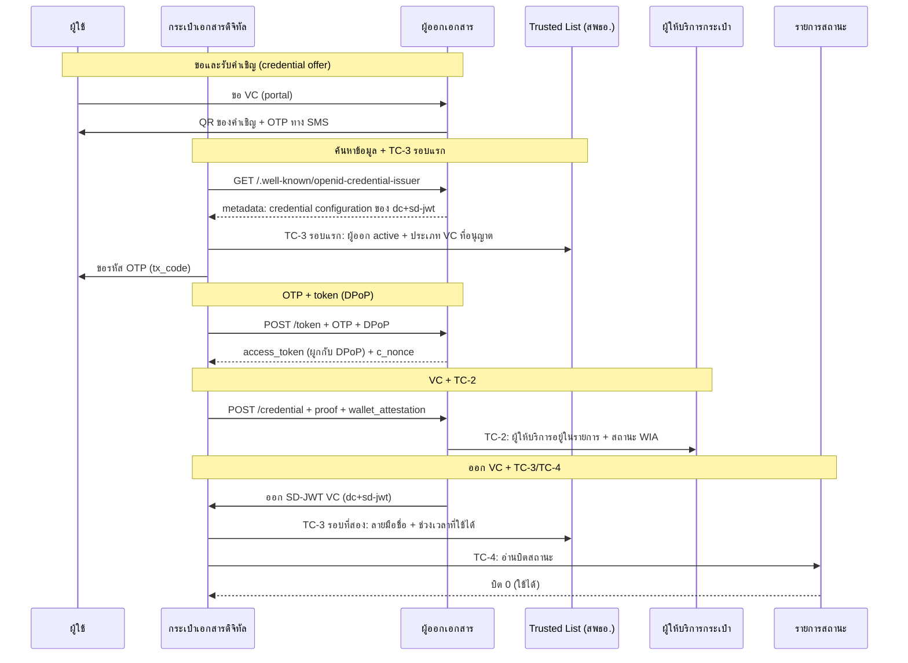
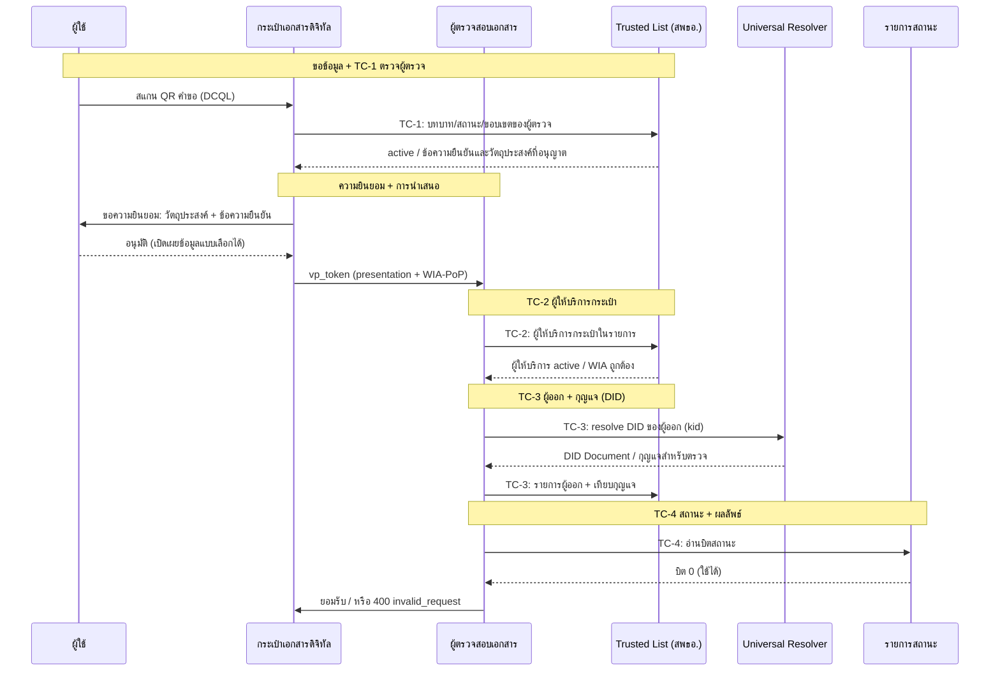

# ชุด VC ของประเทศไทย — สรุปหนึ่งหน้า

{/* METADATA (agent-only — not rendered to readers)
> **สถานะ:** 📄 Reference — บทสรุปหนึ่งหน้า จัดทำขึ้นเพื่อให้ระบบของคู่ภาคี (counterpart system) ใช้ตรวจสอบความสอดคล้องกัน มิได้เป็นบทในรายงานต้นฉบับของ สพธอ.
> **แหล่งข้อมูล:** [Thai VC ARF](README.md) — รายงานทางเทคนิคของสำนักงานพัฒนาธุรกรรมทางอิเล็กทรอนิกส์ (สพธอ.) เวอร์ชัน 1.1 และส่วนขยายเวอร์ชัน 2.0/2.1 ซึ่งเป็นแหล่งข้อมูลอ้างอิงหลักของเอกสารฉบับนี้
> **เอกสารที่เกี่ยวข้อง:** [§5 มาตรฐานและข้อปฏิบัติ](05-standards-and-compliance.md) · [§8 Implementation Guidelines](08-implementation-guidelines.md) · [§8.1 OID4VCI Full Flow](08.1-issuance-full-flow-detail.md) · [§8.2 OID4VP Full Flow](08.2-oid4vp-full-flow-detail.md) · [§6.5 กลไกการสร้างความน่าเชื่อถือ](06.5-trust-building-mechanism.md) · [§7 การทำงานร่วมกันข้ามระบบนิเวศ](07-cross-ecosystem-interoperability.md) · [§9 Trust Model 3](09-trust-model-3.md) · [§12 Key Management และ Trusted List Deployment](12-key-management-and-trustlist-deployment.md) · [§13 VC Status และ Revocation](13-vc-status-and-revocation.md) · [research/41 การให้บริการ Trusted List ผ่าน CDN](../research/41-trustlist-serving-filecdn-etag-binary.md)
*/}

---

{/*
บันทึกสำหรับ agent (ซ่อน — ไม่แสดงบนเว็บไซต์):

บทความนี้เป็นบทสรุป มิใช่คำแปล บทภาษาไทยใน th/thai-vc-arf/ เป็นแหล่งข้อมูลอ้างอิงหลัก
กรณีบทความนี้กับบทภาษาไทยขัดกัน ให้ยึดบทภาษาไทย

บทต้นทาง (path ภายใต้ th/thai-vc-arf/ เว้นแต่ระบุไว้เป็นอย่างอื่น):
- การออก VC: 05-standards-and-compliance.md, 08-implementation-guidelines.md, 08.1-issuance-full-flow-detail.md
- การแสดง VC: 05-standards-and-compliance.md, 08-implementation-guidelines.md, 08.2-oid4vp-full-flow-detail.md
- Trusted List: 06.5-trust-building-mechanism.md, 07-cross-ecosystem-interoperability.md, 09-trust-model-3.md, 12-key-management-and-trustlist-deployment.md, th/research/41-trustlist-serving-filecdn-etag-binary.md
- การเพิกถอนและสถานะ: 13-vc-status-and-revocation.md, 12-key-management-and-trustlist-deployment.md, 10-wallet-unit-attestation.md

ดัชนีแหล่งข้อมูลอ้างอิงหลัก (ภาษาไทย): th/thai-vc-arf/README.md
ฉบับภาษาอังกฤษของบทสรุปนี้: en/thai-vc-arf/00-minimal-interoperability-reference.md
*/}

หน้านี้อธิบายชุดมาตรฐาน VC ของประเทศไทย ในมุมที่ระบบคู่ภาคีใช้ตรวจสอบความเข้ากันได้

## สถานะ PoC ปัจจุบัน

หน้านี้คือข้อกำหนดที่วางแผนไว้ ไม่ใช่สิ่งที่ทำแล้ว ต้นแบบ (PoC) ปัจจุบันมีแค่ 3 ส่วน:

1. LoTE (List of Trusted Entities) รายการเดียวที่บรรจุผู้ออก ผู้ตรวจ และผู้ให้บริการกระเป๋าทั้งหมด
2. แอปกระเป๋าที่เชื่อถือเอนทิตีผ่าน Trusted List เท่านั้น ไม่ใช้ใบรับรอง เอนทิตีแต่ละรายประกาศกุญแจสาธารณะใน Trusted List ในรูป `did:web` หรือสายอักขระกุญแจสาธารณะ
3. Wallet Instance Attestation (WIA) ยังไม่ได้ทำ

## ฉบับย่อ

องค์ประกอบหลัก 5 ส่วน คือ

- **รูปแบบ VC:** ระบบรองรับหลายรูปแบบ โดย v1.1 ใช้ JSON-LD ตาม W3C VC Data Model ซึ่งยังคงรองรับ และเพิ่ม IETF SD-JWT VC (`dc+sd-jwt`) เป็นรูปแบบที่แนะนำสำหรับการออกใหม่
- **โปรโตคอลการออก:** OpenID for Verifiable Credential Issuance (OID4VCI) 1.0 Final แบบ pre-authorized code flow
- **โปรโตคอลการแสดง:** OpenID for Verifiable Presentations (OID4VP) 1.0 Final พร้อม DCQL
- **ความน่าเชื่อถือ:** Trusted List ตาม ETSI TS 119 602 ซึ่ง สพธอ. เป็นผู้ลงลายมือชื่อและเผยแพร่ผ่าน CDN โดยไม่ใช้สายใบรับรองของ CA
- **สถานะ VC:** IETF Token Status List ซึ่งผู้ออกแต่ละรายเผยแพร่เอง

สำหรับคู่ภาคีที่ประเมินการลู่เข้าหากัน (convergence): ประเทศไทยใช้ชุด OID4VCI + OID4VP + SD-JWT VC เดียวกับ EU แต่รายการใน Trusted List ของไทยไม่ได้รับการยอมรับใน EU โดยอัตโนมัติ การยอมรับต้องมีข้อตกลงความน่าเชื่อถือ (trust agreement) การเทียบบทบาทและระดับการรับรอง (trust mapping) รายการเชื่อม (bridge list) และหลักฐานการทดสอบความสอดคล้อง (conformance evidence)

## การออก VC

ตัวอย่างการออกด้านล่างใช้ OID4VCI 1.0 Final แบบ pre-authorized code flow และออก SD-JWT VC (`dc+sd-jwt`) โดยระบบยังรองรับ JSON-LD VC รูปแบบเดิมตามที่ระบุในฉบับย่อ

ก่อนขอรหัส OTP จากผู้ใช้ กระเป๋าจะตรวจผู้ออกกับ Trusted List ก่อน (Trust Check 3 รอบแรก ย่อเป็น TC-3 รอบแรก) ถ้าผู้ออกไม่ได้ `active` สำหรับประเภท VC นั้น กระบวนการจะหยุดทันที

ที่ระดับ IAL2.3 ขึ้นไป access token จะผูกกับกุญแจของกระเป๋าด้วย DPoP (RFC 9449)

คำขอรับ VC จะแนบ Wallet Attestation ที่ผู้ให้บริการกระเป๋าเป็นผู้ลงลายมือชื่อ ผู้ออกจะตรวจผู้ให้บริการใน Trusted List (TC-2) และตรวจ attestation ก่อนลงลายมือชื่อ

ก่อนจัดเก็บ VC กระเป๋าจะตรวจลายมือชื่อของผู้ออก ช่วงเวลาที่ใช้ได้ และบิตสถานะ (TC-3 รอบที่สอง และ TC-4)

## การแสดง VC

การแสดงใช้ OID4VP 1.0 Final พร้อม DCQL แทน Presentation Exchange

ก่อนแสดงหน้าขอความยินยอม กระเป๋าจะตรวจผู้ตรวจกับ Trusted List (Trust Check 1 ย่อเป็น TC-1) ว่า `active` อยู่หรือไม่ และข้อความยืนยัน (claims) กับวัตถุประสงค์ (purpose) ที่ขอ อยู่ในขอบเขตที่ลงทะเบียนไว้หรือไม่ ถ้าไม่ กระเป๋าจะไม่ส่งอะไรออกไปเลย

จากนั้นผู้ตรวจจะตรวจ 3 ข้อ คือ

- Trust Check 2 (TC-2): ผู้ให้บริการกระเป๋าอยู่ใน Trusted List และ wallet attestation ถูกต้องและยังสดใหม่ ข้อนี้บังคับสำหรับกระเป๋าของหน่วยงานรัฐ สำหรับกระเป๋าเอกชน ขึ้นกับระดับความเชื่อมั่นของผู้ตรวจ คือ ทั่วไป (standard) หรือเข้มงวด (enhanced)
- Trust Check 3 (TC-3): ผู้ออกอยู่ใน Trusted List และ DID ของผู้ออก resolve ได้เป็นกุญแจที่ใช้ลงลายมือชื่อใน VC
- Trust Check 4 (TC-4): อ่านบิตสถานะจากรายการสถานะของผู้ออก

ลายมือชื่อถูกต้องอย่างเดียวไม่พอที่จะยอมรับ VC

ตัวระบุ: หน่วยงานใช้ `did:web` ผู้ถือใช้ `did:jwk` ส่วนระบบตัวตนของไทย เช่น NDID ใช้ custom DID method และ resolve ผ่าน ETDA Trust Gateway ซึ่งทำหน้าที่เป็น Universal Resolver

## Trusted List

สพธอ. ตรวจรับรอง (audit) ทุกหน่วยงานที่จะเป็นผู้ออก ผู้ตรวจ หรือผู้ให้บริการกระเป๋า แล้วลงลายมือชื่อบันทึกไว้ในรายการเดียว รายการนี้เป็น JWT ที่ลงลายมือชื่อตาม ETSI TS 119 602 เผยแพร่ผ่าน CDN โดยไม่ต้องใช้ API key ลายมือชื่อของ สพธอ. คือเหตุผลเดียวที่ทำให้เชื่อถือรายการนี้ได้

หนึ่งรายการคือหนึ่งหน่วยงาน ซึ่งอาจมีหนึ่งบทบาทหรือมากกว่า เอนทิตีทุกรายประกาศกุญแจสาธารณะ ไม่โดยตรงก็ในรูปการอ้างอิง DID Document แต่ละบทบาทระบุชนิดของบทบาท สถานะ ช่วงเวลาที่ใช้ได้ และขอบเขตเฉพาะบทบาท คือ ผู้ออกระบุประเภท VC ที่ออกได้ ผู้ตรวจระบุข้อความยืนยันและวัตถุประสงค์ที่ขอได้ สถานะต้องเป็น `active` ทั้งในระดับหน่วยงานและระดับบทบาท

ผู้เข้าร่วมดึง Trusted List เฉพาะตอนต้องตัดสินความน่าเชื่อถือ ไม่มีการ polling อยู่เบื้องหลัง และถ้าดึงไม่ได้ ให้ปฏิเสธการเชื่อมต่อนั้น (fail closed) การเพิกถอนในระดับเอนทิตีจะไปถึงแต่ละเอนทิตีเมื่อดึงครั้งถัดไป

Trusted List คือตัวตัดสินว่าเอนทิตีใดมีสิทธิ์กระทำการ ไม่ใช่ DID Document เพราะ DID Document ให้แค่กุญแจสำหรับตรวจลายมือชื่อ ไม่ได้ให้สิทธิ์อนุญาต สพธอ. ลงลายมือชื่อ Trusted List จาก HSM ระดับ FIPS 140-3 Level 3 ด้วยเกณฑ์ M-of-N เช่น 3-of-5 พร้อมกุญแจฉุกเฉิน (emergency key) ที่เก็บแบบออฟไลน์

### ตัวอย่าง Trusted List

ตัวอย่างต่อไปนี้เป็นค่า JWT แบบ compact serialization สำหรับแสดงรูปแบบของรายการที่ลงลายมือชื่อแล้ว ไม่ใช่ค่าที่ใช้ในระบบจริง
1. ผู้ออก: eyJhbGciOiJFUzI1NiIsInR5cCI6IkpPU0UiLCJpYXQiOjE3ODkwMzA2MDIsIng1YyI6WyJNSUlCUGpDQjVxQURBZ0VDQWhRelVlbmtacnB3TGFjVEhqMDd4RXo4bENpOFV6QUtCZ2dxaGtqT1BRUURBakFQTVEwd0N3WURWUVFEREFSRlZFUkJNQjRYRFRJMk1EZ3hNekUxTVRNME4xb1hEVEkzTURneE16RTFNVE0wTjFvd0R6RU5NQXNHQTFVRUF3d0VSVlJFUVRCWk1CTUdCeXFHU000OUFnRUdDQ3FHU000OUF3RUhBMElBQkVKNnRGamJVVEJQQnRlcGFsWjVGUktMVDZxVnFrbzFvTk1naUlvdXI4RmFxUHAyQUxPbk90bGpwZnl4NmdoZ3YvV3lVWkgwRlhNdDluTTN2dTdzd25paklEQWVNQTRHQTFVZER3RUIvd1FFQXdJSGdEQU1CZ05WSFJNQkFmOEVBakFBTUFvR0NDcUdTTTQ5QkFNQ0EwY0FNRVFDSUc4Z1dWdjZBL2VjU2ZhWFJ2T014Q0kyR0FWYlNlTDk3ZmwyT2R4NCtwU1pBaUIwbXZ5MTB4VzN5dTJDc0ZnSkRqc1BaSTZBV3ZKeGd2VlptQXJMQTlhY1FRPT0iXSwieDV0I1MyNTYiOiJsY1BDaTAxaVFfbkIyQWRZRzVKcEMxTlh3dEVncm9GczhVT2hma21GM2ZzIn0
2. ผู้ตรวจ: eyJhbGciOiJFUzI1NiIsInR5cCI6IkpPU0UiLCJpYXQiOjE3ODkwMzUwMzMsIng1YyI6WyJNSUlCUGpDQjVxQURBZ0VDQWhRelVlbmtacnB3TGFjVEhqMDd4RXo4bENpOFV6QUtCZ2dxaGtqT1BRUURBakFQTVEwd0N3WURWUVFEREFSRlZFUkJNQjRYRFRJMk1EZ3hNekUxTVRNME4xb1hEVEkzTURneE16RTFNVE0wTjFvd0R6RU5NQXNHQTFVRUF3d0VSVlJFUVRCWk1CTUdCeXFHU000OUFnRUdDQ3FHU000OUF3RUhBMElBQkVKNnRGamJVVEJQQnRlcGFsWjVGUktMVDZxVnFrbzFvTk1naUlvdXI4RmFxUHAyQUxPbk90bGpwZnl4NmdoZ3YvV3lVWkgwRlhNdDluTTN2dTdzd25paklEQWVNQTRHQTFVZER3RUIvd1FFQXdJSGdEQU1CZ05WSFJNQkFmOEVBakFBTUFvR0NDcUdTTTQ5QkFNQ0EwY0FNRVFDSUc4Z1dWdjZBL2VjU2ZhWFJ2T014Q0kyR0FWYlNlTDk3ZmwyT2R4NCtwU1pBaUIwbXZ5MTB4VzN5dTJDc0ZnSkRqc1BaSTZBV3ZKeGd2VlptQXJMQTlhY1FRPT0iXSwieDV0I1MyNTYiOiJsY1BDaTAxaVFfbkIyQWRZRzVKcEMxTlh3dEVncm9GczhVT2hma21GM2ZzIn0.eyJMb1RFIjp7Ikxpc3RBbmRTY2hlbWVJbmZvcm1hdGlvbiI6eyJMb1RFVmVyc2lvbklkZW50aWZpZXIiOjEsIkxvVEVTZXF1ZW5jZU51bWJlciI6MiwiTG9URVR5cGUiOiJodHRwOi8vdXJpLmV0ZGEub3IudGgvMTk2MDIvTG9URVR5cGUvVGhhaVZlcmlmaWVyc0xpc3QiLCJTY2hlbWVPcGVyYXRvck5hbWUiOlt7ImxhbmciOiJlbiIsInZhbHVlIjoiRWxlY3Ryb25pYyBUcmFuc2FjdGlvbnMgRGV2ZWxvcG1lbnQgQWdlbmN5IChFVERBKSJ9XSwiU2NoZW1lSW5mb3JtYXRpb25VUkkiOlt7ImxhbmciOiJlbiIsInVyaVZhbHVlIjoiaHR0cHM6Ly93d3cuZXRkYS5vci50aCJ9XSwiU3RhdHVzRGV0ZXJtaW5hdGlvbkFwcHJvYWNoIjoiaHR0cDovL3VyaS5ldGRhLm9yLnRoLzE5NjAyL1RoYWlWZXJpZmllcnNMaXN0L1N0YXR1c0RldG4vRVREQSIsIlNjaGVtZVR5cGVDb21tdW5pdHlSdWxlcyI6W3sibGFuZyI6ImVuIiwidXJpVmFsdWUiOiJodHRwOi8vdXJpLmV0ZGEub3IudGgvMTk2MDIvVGhhaVZlcmlmaWVycy9zY2hlbWVydWxlcy9FVERBIn1dLCJTY2hlbWVUZXJyaXRvcnkiOiJUSCIsIlNjaGVtZU5hbWUiOlt7ImxhbmciOiJlbiIsInZhbHVlIjoiVGhhaSBWZXJpZmllcnMgTGlzdCJ9XSwiSGlzdG9yaWNhbEluZm9ybWF0aW9uUGVyaW9kIjozNjUsIkRpc3RyaWJ1dGlvblBvaW50cyI6W10sIlNjaGVtZUV4dGVuc2lvbnMiOltdLCJMaXN0SXNzdWVEYXRlVGltZSI6IjIwMjYtMDktMTBUMTA6MTA6MzMuOTI4WiIsIk5leHRVcGRhdGUiOiIyMDI2LTA5LTExVDEwOjEwOjMzLjkyOFoifSwiVHJ1c3RlZEVudGl0aWVzTGlzdCI6W3siVHJ1c3RlZEVudGl0eUluZm9ybWF0aW9uIjp7IlRFTmFtZSI6W3sibGFuZyI6ImVuIiwidmFsdWUiOiJFbGVjdHJvbmljIFRyYW5zYWN0aW9ucyBEZXZlbG9wbWVudCBBZ2VuY3kgKEVUREEpIn1dfSwiVHJ1c3RlZEVudGl0eVNlcnZpY2VzIjpbeyJTZXJ2aWNlSW5mb3JtYXRpb24iOnsiU2VydmljZVR5cGVJZGVudGlmaWVyIjoiaHR0cDovL3VyaS5ldGRhLm9yLnRoLzE5NjAyL1N2Y1R5cGUvVmVyaWZpZXIiLCJTZXJ2aWNlTmFtZSI6W3sibGFuZyI6ImVuIiwidmFsdWUiOiJQcm9jaXZpcyBEZW1vIEJhbmsgVmVyaWZpZXIifV0sIlNlcnZpY2VEaWdpdGFsSWRlbnRpdHkiOnsiUHVibGljS2V5VmFsdWVzIjpbeyJrdHkiOiJFQyIsImNydiI6IlAtMjU2IiwieCI6IjVYemtpV0s4UWl1Y3N3SENLakk1S3dyM3JXZkZ6SDlBWElhN0FwMXpDeTgiLCJ5IjoidU9XYThGZU5nbTlyc0hiZmpBczZxTVZnb21Fa1JoMHl1QS1JRjhQUXFwRSJ9XSwiT3RoZXJJZHMiOlsiZGlkOndlYjp2ZXJpZmllci50b255aGVyZS53b3JrOnNzaTpkaWQtd2ViOnYxOmU1NDNlYTBlLTBhMTAtNGZmNS1iOGZhLTE0MTRmMGYzYWI5YyJdfX19XX1dfX0.u92cxz56yft9MttrtaOGJ7keqWsV8GX1BLfNQaMHToaQKnyrqcWBgkfrVQ5aRJHtociOro9EwGhWQrbiwHB-ag
3. ผู้ให้บริการกระเป๋า: eyJhbGciOiJFUzI1NiIsInR5cCI6IkpPU0UiLCJpYXQiOjE3ODg3ODExNDgsIng1YyI6WyJNSUlCUGpDQjVxQURBZ0VDQWhRelVlbmtacnB3TGFjVEhqMDd4RXo4bENpOFV6QUtCZ2dxaGtqT1BRUURBakFQTVEwd0N3WURWUVFEREFSRlZFUkJNQjRYRFRJMk1EZ3hNekUxTVRNME4xb1hEVEkzTURneE16RTFNVE0wTjFvd0R6RU5NQXNHQTFVRUF3d0VSVlJFUVRCWk1CTUdCeXFHU000OUFnRUdDQ3FHU000OUF3RUhBMElBQkVKNnRGamJVVEJQQnRlcGFsWjVGUktMVDZxVnFrbzFvTk1naUlvdXI4RmFxUHAyQUxPbk90bGpwZnl4NmdoZ3YvV3lVWkgwRlhNdDluTTN2dTdzd25paklEQWVNQTRHQTFVZER3RUIvd1FFQXdJSGdEQU1CZ05WSFJNQkFmOEVBakFBTUFvR0NDcUdTTTQ5QkFNQ0EwY0FNRVFDSUc4Z1dWdjZBL2VjU2ZhWFJ2T014Q0kyR0FWYlNlTDk3ZmwyT2R4NCtwU1pBaUIwbXZ5MTB4VzN5dTJDc0ZnSkRqc1BaSTZBV3ZKeGd2VlptQXJMQTlhY1FRPT0iXSwieDV0I1MyNTYiOiJsY1BDaTAxaVFfbkIyQWRZRzVKcEMxTlh3dEVncm9GczhVT2hma21GM2ZzIn0.eyJMb1RFIjp7Ikxpc3RBbmRTY2hlbWVJbmZvcm1hdGlvbiI6eyJMb1RFVmVyc2lvbklkZW50aWZpZXIiOjEsIkxvVEVTZXF1ZW5jZU51bWJlciI6MSwiTG9URVR5cGUiOiJodHRwOi8vdXJpLmV0c2kub3JnLzE5NjAyL0xvVEVUeXBlL0VVV2FsbGV0UHJvdmlkZXJzTGlzdCIsIlNjaGVtZU9wZXJhdG9yTmFtZSI6W3sibGFuZyI6ImVuIiwidmFsdWUiOiJFbGVjdHJvbmljIFRyYW5zYWN0aW9ucyBEZXZlbG9wbWVudCBBZ2VuY3kgKEVUREEpIn1dLCJTY2hlbWVJbmZvcm1hdGlvblVSSSI6W3sibGFuZyI6ImVuIiwidXJpVmFsdWUiOiJodHRwczovL3d3dy5ldGRhLm9yLnRoIn1dLCJTdGF0dXNEZXRlcm1pbmF0aW9uQXBwcm9hY2giOiJodHRwOi8vdXJpLmV0c2kub3JnLzE5NjAyL1dhbGxldFByb3ZpZGVyc0xpc3QvU3RhdHVzRGV0bi9FVSIsIlNjaGVtZVR5cGVDb21tdW5pdHlSdWxlcyI6W3sibGFuZyI6ImVuIiwidXJpVmFsdWUiOiJodHRwOi8vdXJpLmV0c2kub3JnLzE5NjAyL1dhbGxldFByb3ZpZGVyc0xpc3Qvc2NoZW1lcnVsZXMvRVUifV0sIlNjaGVtZVRlcnJpdG9yeSI6IlRIIiwiU2NoZW1lTmFtZSI6W3sibGFuZyI6ImVuIiwidmFsdWUiOiJXYWxsZXQgUHJvdmlkZXJzIExpc3QifV0sIkhpc3RvcmljYWxJbmZvcm1hdGlvblBlcmlvZCI6MzY1LCJEaXN0cmlidXRpb25Qb2ludHMiOltdLCJTY2hlbWVFeHRlbnNpb25zIjpbXSwiTGlzdElzc3VlRGF0ZVRpbWUiOiIyMDI2LTA5LTA3VDExOjM5OjA4LjM5NVoiLCJOZXh0VXBkYXRlIjoiMjAyNi0wOS0wOFQxMTozOTowOC4zOTVaIn0sIlRydXN0ZWRFbnRpdGllc0xpc3QiOltdfX0.Izh_JYqPikXvdYGKdYJY6I26VuWuLtWwCX1eKtvqxnVSMRsxxtV_K7Wx6lbp_1C7RemaFT52ZrAOZa5t1SmZ6g

## การเพิกถอนและสถานะ

ผู้ออกแต่ละรายเผยแพร่ Token Status List ของตนเอง (`draft-ietf-oauth-status-list-18`) บิตสถานะมีความหมายดังนี้ 0 = ใช้ได้ 1 = ถูกเพิกถอน 2 = ถูกระงับ 3 = หมุนเวียนกุญแจ

ผู้ออกเผยแพร่การเปลี่ยนแปลงภายใน 15 นาที (นี่คือเป้าหมายการเผยแพร่ของผู้ออก ไม่ใช่การรับประกันตลอดกระบวนการ) ผู้ตรวจจะอ่าน `status_url` จากรายการใน Trusted List ไม่ใช่จากตัว VC และอ่านบิตสถานะทุกครั้งที่มีการนำเสนอ (TC-4)

นอกจากระดับ VC รายใบแล้ว การเพิกถอนยังทำได้ที่ระดับที่สูงกว่า ถ้า สพธอ. ระงับหรือเพิกถอนผู้ออก VC ทุกใบของผู้ออกนั้นจะตรวจไม่ผ่านทันที โดยไม่ต้องเขียนบิตรายใบ เพราะรายการบทบาทของผู้ออกไม่ได้ `active` อีกต่อไป ถ้าผู้ให้บริการกระเป๋าเพิกถอน wallet attestation ผู้ออกที่ผูก VC ไว้กับหน่วยกระเป๋านั้นต้องเพิกถอน VC เหล่านั้นตามไปด้วย และ VC ทุกใบจะหมดอายุที่ `validUntil` โดยไม่ต้องอาศัยกลไกใดข้างต้น

การเพิกถอนฉุกเฉินจะไปถึงแต่ละเอนทิตีเมื่อดึงครั้งถัดไป โดยไม่มีการ polling เบื้องหลัง ทั้งนี้ [§12.8](12-key-management-and-trustlist-deployment.md) กำหนดกลไกแจ้งเตือนการเพิกถอนฉุกเฉินแบบ push ผ่าน message broker ไว้เป็นชั้นเสริมนอกเหนือจากการดึงปกติ

---

**การนำทาง:** [⬆️ สารบัญ ARF](README.md) · [บทที่ 1 — ขอบข่าย ➡️](01-scope.md)
