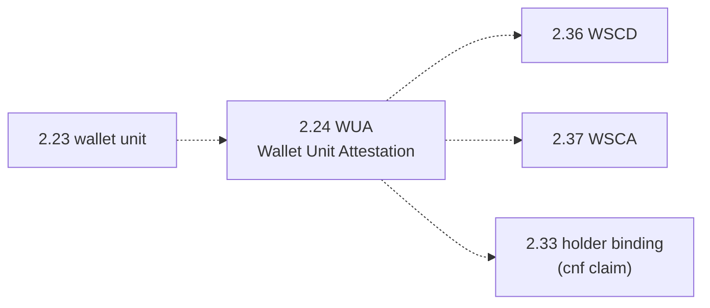
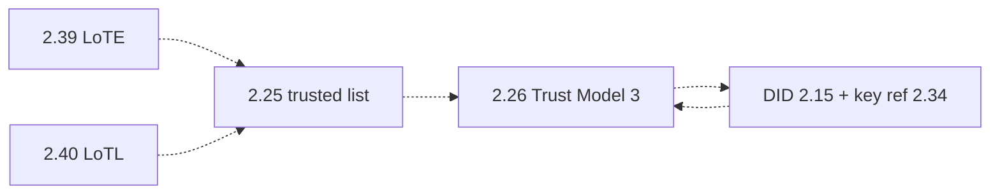
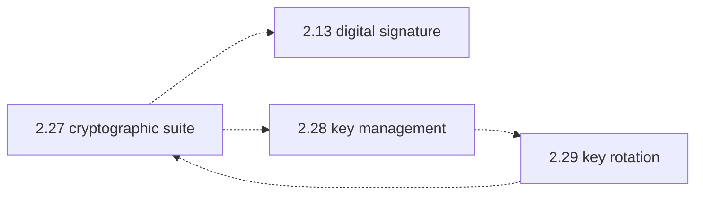
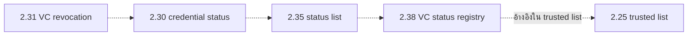
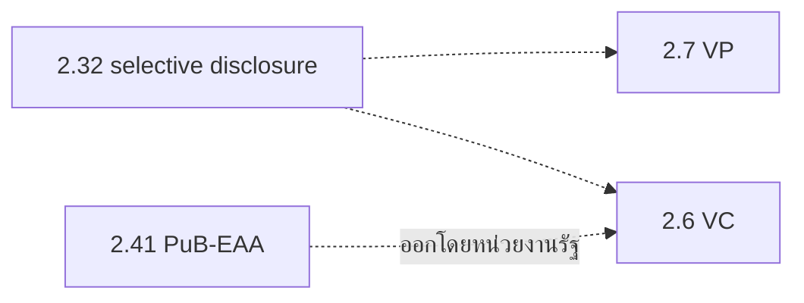

# 2. บทนิยาม

{/* METADATA (agent-only — not rendered to readers)
> **สถานะ:** 📄 Thai VC ARF v2.0 — คงนิยามเดิมจากเวอร์ชัน 1.1 และเพิ่มนิยามสำหรับ v2.0
> **เวอร์ชัน:** 2.0-draft (MASA-124)
> **วันที่ปรับปรุง:** 4 สิงหาคม 2569
> **แหล่งข้อมูลเดิม:** [Thai-VC-ARF-v1-1.pdf](https://www.etda.or.th/getattachment/Our-Service/Digital-Trusted-services-Infrastructure/VC-and-Digital-Document-Wallet/Information/รายงานทางเทคนค-Thai-VC-ARF-v1-1.pdf) — รายงานทางเทคนิค: กรอบแนวทางการทำงานร่วมกันของเอกสารรับรองดิจิทัลสำหรับประเทศไทย เวอร์ชัน 1.1 มกราคม 2568
> **เอกสารที่เกี่ยวข้อง:** [ดัชนีเอกสาร ARF](README.md) · [อภิธานศัพท์กลาง](../../00-glossary.md)
*/}

---

บทนี้รวบรวมบทนิยามของคำที่ใช้ตลอดรายงานฉบับนี้ เพื่อให้ผู้อ่านตีความคำในบทอื่นได้ตรงกัน

ความหมายของคำที่ใช้ในรายงานฉบับนี้ มีดังต่อไปนี้

2.1  ผู้สมัคร (applicant) หมายถึง เอนทิตีที่ยื่นขอเอกสารรับรองจากผู้ออกเอกสาร (issuer) โดยผู้สมัครอาจจะเป็นเจ้าของข้อความ (subject) ในเอกสารรับรองหรือไม่ก็ได้

2.2 กระเป๋าเอกสารดิจิทัล (digital document wallet) หมายถึง โปรแกรมที่จัดเก็บและช่วยให้ผู้ถือเอกสารสามารถเข้าถึงและใช้งาน VC ได้อย่างมั่นคงปลอดภัย [2]

2.3 ผู้ให้บริการกระเป๋าเอกสารดิจิทัล (digital document wallet provider) หมายถึง เอนทิตีที่ทำหน้าที่พัฒนาและ/หรือดำเนินการเกี่ยวกับกระเป๋าเอกสารดิจิทัล ให้แก่ผู้ออกเอกสาร ผู้ถือเอกสาร หรือผู้ตรวจสอบเอกสาร

2.4 เจ้าของข้อความ (subject) หมายถึง เอนทิตีที่ถูกกล่าวอ้างถึงในข้อความยืนยัน (claim) [2]

2.5 ข้อความยืนยัน (claim) หมายถึง ข้อความเกี่ยวกับเจ้าของข้อความ (subject) ที่จะถูกรับรองโดยผู้ออกเอกสาร (issuer) [2]

2.6 เอกสารรับรองดิจิทัล (verifiable credential: VC) หมายถึง ชุดของข้อความยืนยันอย่างน้อยหนึ่งรายการที่ถูกรับรองโดยผู้ออกเอกสาร (issuer) ทั้งนี้ VC มีคุณสมบัติที่สามารถตรวจพบการเปลี่ยนแปลงใด ๆ ที่เกิดกับความถูกต้องครบถ้วนของข้อมูลและตรวจสอบลายมือชื่ออิเล็กทรอนิกส์ของผู้ออกเอกสารได้ด้วยกระบวนการเข้ารหัสลับ [2]

ข้อสังเกต: ข้อความยืนยันใน VC อาจเกี่ยวกับเจ้าของข้อความ (subject) ที่มากกว่าหนึ่งราย เช่น ข้อความยืนยันในทะเบียนสมรส

2.7 เอกสารสำแดงดิจิทัล (verifiable presentation: VP) หมายถึง VC อย่างน้อยหนึ่งชุด ที่ผู้ถือเอกสาร (holder) ใช้แสดงต่อผู้ตรวจสอบเอกสาร (verifier) ทั้งนี้ VP มีคุณสมบัติที่สามารถตรวจพบการเปลี่ยนแปลงใด ๆ ที่เกิดกับความถูกต้องครบถ้วนของข้อมูล และตรวจสอบลายมือชื่ออิเล็กทรอนิกส์ของผู้ถือเอกสารและตรวจสอบ VC ที่เกี่ยวข้องได้ด้วยกระบวนการเข้ารหัสลับ [2]

2.8 เอนทิตี (entity) หมายถึง สิ่งที่มีอยู่จริง เช่น บุคคล องค์กร หรืออุปกรณ์ ซึ่งถูกกล่าวอ้างในการใช้งาน VC และ VP [2]

2.9 ผู้ออกเอกสาร (issuer) หมายถึง เอนทิตีที่ทำหน้าที่รับรองข้อความยืนยันโดยออกเป็น VC ให้แก่ผู้ถือเอกสาร [2]

2.10 ผู้ถือเอกสาร (holder) หมายถึง เอนทิตีที่เป็นเจ้าของ VC อย่างน้อยหนึ่งชุด โดยจัดเก็บไว้ในกระเป๋าเอกสารดิจิทัล (digital document wallet) และสามารถใช้ VC สร้างเป็น VP [2] ทั้งนี้ ผู้ถือเอกสารมีอีกชื่อเรียกหนึ่งว่า ผู้ใช้งานกระเป๋าเอกสารดิจิทัล

2.11 ผู้ตรวจสอบเอกสาร (verifier) หมายถึง เอนทิตีที่สามารถตรวจสอบความถูกต้องครบถ้วนของ VC และ VP ด้วยกระบวนการเข้ารหัสลับ รวมถึงตรวจสอบสถานะการใช้งานและความสอดคล้องตามโครงสร้างข้อมูลของ VC และ VP [2]

2.12 ระบบทะเบียนเอกสารรับรอง (verifiable data registry) หมายถึง ระบบที่ช่วยสนับสนุนการสร้างและการตรวจสอบความถูกต้องครบถ้วนของ VC และ VP โดยข้อมูลที่มีการจัดเก็บในระบบนี้ เช่น ตัวระบุ (identifier) และกุญแจสาธารณะ (public key) ของเอนทิตีที่เกี่ยวข้อง รวมถึงรายการเพิกถอน (revocation list) และเค้าร่าง (schema) ของ VC หรือ VP [2]

2.13 ลายมือชื่อดิจิทัล (digital signature) หมายถึง ลายมือชื่ออิเล็กทรอนิกส์ ที่ได้จากกระบวนการเข้ารหัสลับข้อมูลอิเล็กทรอนิกส์ซึ่งช่วยให้สามารถยืนยันตัวเจ้าของลายมือชื่อและตรวจพบการเปลี่ยนแปลงของข้อความและลายมือชื่ออิเล็กทรอนิกส์ได้รวมถึงการทำให้เจ้าของลายมือชื่อไม่สามารถปฏิเสธความรับผิดจากข้อความที่ตนเองลงลายมือชื่อได้ [3]

{/* pdf page 8 */}

2.14 ตัวระบุ (identifier) หมายถึง Uniform Resource Identifier (URI) ที่ระบุถึงเอนทิตี เอกสารรับรอง หรือ ข้อมูลอื่น ๆ ที่เกี่ยวข้อง [4]

2.15 ตัวระบุแบบกระจายศูนย์ (decentralized identifier: DID) หมายถึง ตัวระบุ (identifier) ที่มีความคงอยู่ถาวร (persistence) ที่มีเอกลักษณ์เฉพาะในระดับสากล ซึ่งไม่จำเป็นต้องอาศัยหน่วยงานกลางผู้รับผิดชอบในการลงทะเบียน และมักถูกสร้างขึ้นและ/หรือลงทะเบียนโดยใช้วิธีการเข้ารหัสลับ [4]

2.16 DID subject หมายถึง เอนทิตีที่ถูกระบุโดย DID และถูกอธิบายไว้ใน DID Document [4]

2.17 DID document หมายถึง ชุดข้อมูลที่ใช้ในการอธิบาย DID subject รวมไปถึงกลไกที่เกี่ยวข้องกับ DID subject นั้น เช่น กุญแจสาธารณะที่ DID subject สามารถใช้ในการยืนยันตัวตนหรือพิสูจน์ความเกี่ยวข้องกับ DID นั้น [4]

2.18 DID method (Decentralized Identifiers Methodologies) หมายถึง กลไกเฉพาะสำหรับแต่ละ DID ที่ใช้ในการสร้าง ดึงข้อมูล (resolve) อัปเดต และระงับการใช้งาน DID รวมไปถึง DID document ที่เกี่ยวข้องกับ DID นั้น [4]

2.19 DID resolver หมายถึง ส่วนประกอบที่เป็นซอฟต์แวร์หรือฮาร์ดแวร์ที่ใช้ในกระบวนการ DID resolution ซึ่งทำงานโดยใช้ DID เป็นอินพุต และได้เอาต์พุตเป็น DID document [4]

2.20 Universal Resolver หมายถึง เครื่องมือหรือบริการที่ใช้สนับสนุนการทำงานร่วมกันระหว่างหลาย DID method ในกระบวนการ DID resolution และการดึงข้อมูล (resolve) DID Document

2.21 เค้าร่าง (schema) หมายถึง ข้อมูลที่กำหนดโครงสร้าง (structure) และรูปแบบ (format) ของ VC และ/หรือ VP โดยสามารถแบ่งออกเป็น 2 ประเภท ได้แก่ (1) เค้าร่างสำหรับการตรวจสอบข้อมูล (data verification schema) สำหรับตรวจสอบโครงสร้างและเนื้อหาของ VC และ (2) เค้าร่างสำหรับการเข้ารหัสข้อมูล (data encoding schema) สำหรับการแปลงเนื้อของ VC จากรูปแบบ (format) หนึ่งไปยังอีกรูปแบบหนึ่ง [5]

2.22 การทำงานร่วมกัน (interoperability) หมายถึง ความสามารถ (ทางเทคนิค) ในการแลกเปลี่ยนและใช้ข้อมูลระหว่างระบบ/ส่วนประกอบตั้งแต่สองระบบขึ้นไป ซึ่งทำงานร่วมกันได้โดยผู้ดำเนินการไม่จำเป็นต้องแทรกแซงการดำเนินการในแต่ละครั้ง [IEEE+ eHealth Governance Initiative]

{/* pdf page 9 */}

## นิยามเพิ่มเติมสำหรับเวอร์ชัน 2.0

นิยามในข้อ 2.1 ถึงข้อ 2.22 คงข้อความและความหมายตาม Thai VC ARF เวอร์ชัน 1.1 ไว้ทุกประการ นิยามต่อไปนี้เป็นส่วนเพิ่มเติมสำหรับเวอร์ชัน 2.0 และต้องตีความร่วมกับอภิธานศัพท์กลาง ทั้งนี้ ในกรณีที่คำในส่วนนี้ต่างจากคำในเอกสารเวอร์ชันก่อน ให้ใช้คำในส่วนนี้เฉพาะเนื้อหาที่เพิ่มในเวอร์ชัน 2.0

2.23 หน่วยกระเป๋าเอกสาร (wallet unit) หมายถึง การติดตั้งหรือการทำงานหนึ่งชุดของกระเป๋าเอกสารดิจิทัล ซึ่งอยู่ภายใต้การควบคุมของผู้ใช้งานหนึ่งรายบนอุปกรณ์หรือสภาพแวดล้อมเฉพาะ [D1]

2.24 หลักฐานรับรองหน่วยกระเป๋าเอกสาร (wallet unit attestation: WUA) หมายถึง หลักฐานอิเล็กทรอนิกส์ที่ผู้ให้บริการกระเป๋าเอกสารดิจิทัลออกให้แก่ wallet unit เพื่อรับรองคุณลักษณะของ wallet unit และผูกกุญแจสาธารณะของ wallet unit กับหลักฐานดังกล่าว ผู้ตรวจสอบต้องตรวจลายมือชื่อ ระยะเวลามีผล และสถานะของ WUA ตามข้อกำหนดที่เกี่ยวข้อง [D1]

_ข้อสังเกต:_ เนื้อหาใหม่ของรายงานฉบับนี้ต้องใช้คำว่า WUA แทน Wallet Trust Evidence (WTE) เมื่อกล่าวถึงหลักฐานของ wallet unit ตาม EUDI ARF ทั้งนี้ การปรับคำดังกล่าวไม่เปลี่ยนความหมายของนิยามเดิมในข้อ 2.1 ถึงข้อ 2.22

_ข้อสังเกต:_ WUA เป็นคำรวม (umbrella term) ประกอบด้วยหลักฐานสองประเภท ได้แก่ Wallet Instance Attestation (WIA) ซึ่งรับรองความเป็นของแท้ของ wallet instance และ Key Attestation (KA) ซึ่งรับรองการจัดเก็บกุญแจใน WSCD รายละเอียดการใช้งาน การเพิกถอน และสถานะของ WIA และ KA อยู่ใน [บทที่ 10 — Wallet Unit Attestation](10-wallet-unit-attestation.md) [D1]

2.25 รายการที่เชื่อถือได้ (trusted list) หมายถึง ชุดข้อมูลที่หน่วยงานกำกับดูแลเผยแพร่เพื่อระบุเอนทิตี บทบาท สถานะ ขอบเขตสิทธิ์ และข้อมูลอ้างอิงกุญแจหรือ certificate ที่ใช้ประกอบการตัดสินความน่าเชื่อถือ ระบบที่ใช้รายการดังกล่าวต้องตรวจสอบความถูกต้องของลายมือชื่อ แหล่งที่มา เวอร์ชัน และความสดใหม่ของรายการก่อนนำไปใช้ [D2]

2.26 แบบจำลองความน่าเชื่อถือที่ 3 (Trust Model 3) หมายถึง แบบจำลองที่เอนทิตีจัดการคู่กุญแจของตนเอง และใช้ DID หรือข้อมูลอ้างอิงกุญแจร่วมกับ trusted list เพื่อยืนยันบทบาท สถานะ และขอบเขตสิทธิ์ โดยไม่กำหนดให้ certificate chain ที่ออกโดย CA เป็นกลไกหลักสำหรับความน่าเชื่อถือของเอนทิตี [D2]

2.27 ชุดวิธีการเข้ารหัสลับ (cryptographic suite) หมายถึง ชุดข้อกำหนดที่ระบุอัลกอริทึม การแทนข้อมูลกุญแจ การสร้าง proof หรือ digital signature และกระบวนการตรวจสอบที่ต้องใช้ร่วมกันเพื่อคุ้มครอง authenticity และ integrity ของข้อมูล [D3]

2.28 การบริหารจัดการกุญแจ (key management) หมายถึง กระบวนการควบคุมวงจรชีวิตของกุญแจเข้ารหัสลับ ตั้งแต่การสร้าง การจัดเก็บ การใช้งาน การสำรอง การกู้คืน การหมุนเปลี่ยน การระงับ และการทำลายกุญแจ ผู้ดำเนินการต้องกำหนดผู้รับผิดชอบและหลักฐานตรวจสอบย้อนหลังสำหรับแต่ละขั้นตอน

2.29 การหมุนเปลี่ยนกุญแจ (key rotation) หมายถึง การเปลี่ยนกุญแจเข้ารหัสลับเดิมเป็นกุญแจใหม่ตามกำหนดเวลา เมื่อความเสี่ยงเปลี่ยนแปลง หรือเมื่อสงสัยว่ากุญแจรั่วไหล ระบบต้องรักษาความต่อเนื่องของการตรวจสอบข้อมูลที่ลงลายมือชื่อไว้ก่อนการเปลี่ยนกุญแจตามนโยบายที่กำหนด

2.30 สถานะเอกสารรับรอง (credential status) หมายถึง ข้อมูลที่ทำให้ผู้ตรวจสอบเอกสารสามารถพิจารณาได้ว่า VC ยังใช้งานได้ ถูกระงับ หรือถูกเพิกถอน โดยไม่เปลี่ยนเนื้อหาของ VC ที่ออกแล้ว [D4]

2.31 การเพิกถอนเอกสารรับรอง (VC revocation) หมายถึง การเปลี่ยนสถานะของ VC ให้ไม่สามารถใช้เป็นหลักฐานที่เชื่อถือได้ก่อนสิ้นสุดระยะเวลามีผล ผู้ออกเอกสารต้องเผยแพร่สถานะตามวิธีและระยะเวลาที่นโยบายกำหนด

2.32 การเปิดเผยแบบเลือกได้ (selective disclosure) หมายถึง ความสามารถของผู้ถือเอกสารในการเลือกเปิดเผยเฉพาะข้อมูลที่จำเป็นจาก VC ต่อผู้ตรวจสอบเอกสาร [D5]

2.33 การผูกผู้ถือเอกสาร (holder binding) หมายถึง กลไกที่ทำให้ผู้ตรวจสอบเอกสารสามารถตรวจสอบได้ว่าผู้แสดง VC หรือ VP เป็นผู้ควบคุมกุญแจหรือปัจจัยที่ผูกไว้กับเอกสารนั้น

2.34 ข้อมูลอ้างอิงกุญแจ (key reference) หมายถึง ตัวระบุหรือข้อมูลที่ใช้ค้นหา verification method หรือกุญแจสาธารณะสำหรับตรวจสอบ digital signature หรือ proof โดยไม่เปิดเผยกุญแจส่วนตัว

2.35 รายการสถานะ (status list) หมายถึง ข้อมูลที่เผยแพร่เพื่อแสดงสถานะของ credential หรือหลักฐานรับรองหลายรายการในโครงสร้างเดียว โดยต้องมีกลไกคุ้มครอง integrity และต้องกำหนดนโยบายความสดใหม่ของข้อมูล [D4]

2.36 อุปกรณ์เข้ารหัสลับของกระเป๋าเอกสาร (wallet secure cryptographic device: WSCD) หมายถึง ส่วนประกอบฮาร์ดแวร์หรือซอฟต์แวร์ที่ทำหน้าที่จัดเก็บและใช้งานกุญแจเข้ารหัสลับของ wallet unit อย่างมั่นคงปลอดภัย ได้แก่ Secure Enclave StrongBox TEE และ HSM ที่ผ่านการรับรองตาม profile ที่ สพธอ. กำหนด [D1]

2.37 แอปพลิเคชันเข้ารหัสลับของกระเป๋าเอกสาร (wallet secure cryptographic application: WSCA) หมายถึง ส่วนประกอบซอฟต์แวร์ที่ทำหน้าที่เป็นตัวกลางระหว่าง wallet unit กับ WSCD เพื่อเรียกใช้กระบวนการเข้ารหัสลับตามที่ profile กำหนด [D1]

2.38 ทะเบียนสถานะเอกสารรับรอง (VC status registry) หมายถึง บริการที่ผู้ออกเอกสารเป็นผู้ดำเนินการเอง หรือมอบหมายให้ผู้ดำเนินการภายนอกเป็นผู้ดูแล เพื่อรับการปรับปรุงสถานะจากผู้ออกเอกสารและเผยแพร่ status list ในรูปแบบ `statuslist+jwt` พร้อมบันทึกตรวจสอบย้อนหลัง ทะเบียนนี้ไม่ใช่บริการที่ สพธอ. ดำเนินการ โดย สพธอ. กำหนดข้อกำหนดและบันทึกตัวระบุ `status_url` และ `kid` ของผู้ออกเอกสารแต่ละรายไว้ใน trusted list [D6]

2.39 รายการที่เชื่อถือได้ (list of trusted entities: LoTE) หมายถึง คำเรียกตามมาตรฐาน ETSI TS 119 602 ซึ่งเทียบเท่ากับ trusted list ในข้อ 2.25 โดยใช้ในบริบทการทำงานร่วมกับสหภาพยุโรป [D7]

2.40 รายการรวมรายการที่เชื่อถือ (list of trusted lists: LoTL) หมายถึง รายการที่รวบรวม trusted list ของหลายเขตอำนาจศาล เพื่อให้ผู้ตรวจสอบสามารถค้นหา trusted list ที่เกี่ยวข้องกับเอนทิตีที่อยู่ภายใต้เขตอำนาจศาลนั้นได้ [D7]

2.41 การรับรองคุณลักษณะทางอิเล็กทรอนิกส์ของหน่วยงานภาครัฐ (public body electronic attestation of attributes: PuB-EAA) หมายถึง การรับรองคุณลักษณะทางอิเล็กทรอนิกส์ที่ออกโดยหน่วยงานของรัฐ เช่น สปสช. หรือกรมที่ดิน ภายใต้กรอบงานของ EUDI ARF [D1]

2.42 ค่าเชื่อมโยงตัวระบุ (confirmation claim: `cnf`) หมายถึง ข้อมูลอ้างอิงใน payload ของ VC ที่ระบุกุญแจสาธารณะของผู้ถือเอกสาร เพื่อให้ผู้ตรวจสอบสามารถพิสูจน์ว่าผู้ถือควบคุมกุญแจส่วนตัวที่จับคู่กับ VC นั้นได้ [D8]

## การใช้คำบอกระดับข้อบังคับ

คำว่า “ต้อง” ให้มีความหมายเทียบเท่า MUST คำว่า “ควร” ให้มีความหมายเทียบเท่า SHOULD และคำว่า “อาจ” ให้มีความหมายเทียบเท่า MAY การใช้คำดังกล่าวในรายงานฉบับนี้ระบุระดับข้อบังคับ ไม่ใช่ส่วนหนึ่งของนิยามเดิมในข้อ 2.1 ถึงข้อ 2.22

{/* METADATA (agent-only — not rendered to readers)
## สถานะของข้อความ

- **ข้อเท็จจริง:** ข้อ 2.1 ถึงข้อ 2.22 คัดจาก Thai VC ARF เวอร์ชัน 1.1 ส่วนข้อ 2.23 ถึงข้อ 2.42 อ้างอิงมาตรฐานและเอกสารโครงการตามรายการอ้างอิง
- **ข้อวิเคราะห์:** การเพิ่มนิยามใหม่แยกจากนิยามเดิมช่วยให้ตรวจสอบได้ว่าความหมายเดิมไม่ถูกแก้ไข และลดความกำกวมระหว่าง WTE กับ WUA รวมถึงความชัดเจนระหว่าง trusted list กับ LoTL/LoTE และระหว่าง status list กับ VC status registry
- **สมมติฐาน:** Trust Model 3 ในเวอร์ชัน 2.0 ใช้ DID หรือ key reference ร่วมกับ trusted list เป็นกลไกหลัก ทั้งนี้ รายละเอียดเชิงบังคับของข้อมูลและกระบวนการต้องเป็นไปตามบทที่ 11 และ profile ที่ สพธอ. ประกาศใช้

## แหล่งอ้างอิงสำหรับนิยามเพิ่มเติม

รายการอ้างอิงในบทนี้ใช้ตัวนำหน้า `D` (Definitions) ได้แก่ [D1] ถึง [D8] เพื่อไม่ให้ปนกับหมายเลขอ้างอิงในบรรณานุกรมกลาง (บทที่ 16) ส่วนเลข [2] ถึง [5] ในข้อ 2.1 ถึงข้อ 2.22 ยังอ้างถึงบรรณานุกรมกลางตามเดิม

[D1] European Commission, “European Digital Identity Wallet Architecture and Reference Framework,” เวอร์ชัน 2.9.0, หัวข้อ Wallet Unit Attestation, https://eudi.dev/2.9.0/main/ และ https://eudi.dev/2.9.0/discussion-topics/c-wallet-unit-attestation/ (เข้าถึงเมื่อ 4 สิงหาคม 2569)

[D2] Thailand Document Wallet Working Group, “Trust Architecture — 3 Trust Models” และ “3 Trust Architecture Models — Fact-Based Analysis,” ฉบับใน repository ณ 4 สิงหาคม 2569, [research/32](../research/32-trustlist-3models.md) และ [research/33](../research/33-trust-architecture-models-factbase-analysis.md) (เข้าถึงเมื่อ 4 สิงหาคม 2569)

[D3] World Wide Web Consortium (W3C), “Verifiable Credential Data Integrity 1.0,” W3C Recommendation, 15 พฤษภาคม 2568, https://www.w3.org/TR/vc-data-integrity/ (เข้าถึงเมื่อ 4 สิงหาคม 2569)

[D4] Internet Engineering Task Force (IETF), “Token Status List,” draft-ietf-oauth-status-list-18, 20 ตุลาคม 2568, https://datatracker.ietf.org/doc/draft-ietf-oauth-status-list/ (เข้าถึงเมื่อ 4 สิงหาคม 2569)

[D5] World Wide Web Consortium (W3C), “Verifiable Credentials Data Model v2.0,” W3C Recommendation, 15 พฤษภาคม 2568, https://www.w3.org/TR/vc-data-model-2.0/ (เข้าถึงเมื่อ 4 สิงหาคม 2569)

[D6] สำนักงานพัฒนาธุรกรรมทางอิเล็กทรอนิกส์ (สพธอ.) และคณะทำงาน, “VC Status Registry — แนวทางการให้บริการ status list สำหรับผู้ออกเอกสาร,” เอกสารในโครงการ ณ 4 สิงหาคม 2569, [th/usecase/09-vc-status-registry.md](../usecase/09-vc-status-registry.md) (เข้าถึงเมื่อ 4 สิงหาคม 2569)

[D7] European Telecommunications Standards Institute (ETSI), “ETSI TS 119 602 — Electronic Signatures and Infrastructures (ESI); Lists of Trusted Entities (LoTEs),” https://www.etsi.org/deliver/etsi_ts/119600_119699/119602/ (เข้าถึงเมื่อ 4 สิงหาคม 2569)

[D8] European Commission, “Commission Implementing Regulation (EU) 2024/2979 — implementing Directive 1999/93/EC as regards the validation of qualified electronic signatures and qualified electronic seals (Holder Binding / cnf claim reference),” 28 พฤศจิกายน 2567, https://eur-lex.europa.eu/eli/reg_impl/2024/2979/oj (เข้าถึงเมื่อ 4 สิงหาคม 2569)

## แผนภาพความสัมพันธ์ระหว่างนิยามใหม่ (Traceability)

แผนภาพต่อไปนี้แสดงความสัมพันธ์ระหว่างนิยามใหม่ในเวอร์ชัน 2.0 เพื่อให้ตรวจสอบได้ว่าแต่ละนิยามถูกใช้ในบริบทใดในเอกสารฉบับนี้และฉบับอื่น ๆ ของโครงการ โดยแบ่งเป็น 5 กลุ่มตามหัวข้อ

**กลุ่มที่ 1 หน่วยกระเป๋าเอกสารและหลักฐานรับรอง (WUA)**

**กลุ่มที่ 2 Trusted list และ Trust Model 3**

**กลุ่มที่ 3 ชุดวิธีการเข้ารหัสลับและวงจรชีวิตกุญแจ**

**กลุ่มที่ 4 สถานะและการเพิกถอน VC**

**กลุ่มที่ 5 การเปิดเผยแบบเลือกได้และการออกเอกสารโดยหน่วยงานรัฐ**

## ตารางตรวจสอบย้อนกลับ (Traceability Matrix)

ตารางนี้ระบุการใช้นิยามใหม่ในเอกสารอื่น ๆ ของโครงการ เพื่อให้ผู้อ่านตามรอยคำนิยามไปยังการใช้งานจริงในบทอื่นได้

| นิยาม | ใช้ในเอกสาร (TH) | ใช้ในเอกสาร (EN) | อ้างอิงมาตรฐาน |
|-------|------------------|-------------------|----------------|
| 2.23 wallet unit | §5 (Wallet Roles), §7 (Trusted List), §8 (Impl. Guidelines) | §5, §7, §8 | EUDI ARF 2.9.0 [D1] |
| 2.24 WUA | §5, §7, §9, §10 (Wallet Unit Attestation topic) | §5, §7, §9, §10 | EUDI ARF 2.9.0 [D1] |
| 2.25 trusted list | §7, §9 (Trust Model 3) | §7, §9 | ETSI TS 119 602 [D7], research/32, research/33 |
| 2.26 Trust Model 3 | §7, §9 | §7, §9 | research/32, research/33 [D2] |
| 2.27 cryptographic suite | §7, §9, §11 (S8 Security) | §7, §9, §11 | W3C VC Data Integrity 1.0 [D3] |
| 2.28 key management | §9, §12 | §9, §12 | research/31, FIPS 140-2 Level 3 (ยอมรับ FIPS 140-3 เป็นมาตรฐานสืบทอด) |
| 2.29 key rotation | §9, §12 | §9, §12 | CIR (EU) 2024/2979 [D8] |
| 2.30 credential status | §13 | §13 | IETF Token Status List [D4] |
| 2.31 VC revocation | §13 | §13 | IETF Token Status List [D4] |
| 2.32 selective disclosure | §5, §7 | §5, §7 | W3C VC DM 2.0 [D5] |
| 2.33 holder binding | §5, §7, §9 | §5, §7, §9 | CIR (EU) 2024/2979 [D8] |
| 2.34 key reference | §7, §9 | §7, §9 | W3C DID Core 1.0 |
| 2.35 status list | §13 | §13 | IETF Token Status List [D4] |
| 2.36 WSCD | §5, §7, §9, §10 | §5, §7, §9, §10 | EUDI ARF 2.9.0 [D1] |
| 2.37 WSCA | §5, §7, §9, §10 | §5, §7, §9, §10 | EUDI ARF 2.9.0 [D1] |
| 2.38 VC status registry | §13, usecase/09 | §13, usecase/09 (EN mirror) | usecase/09 [D6] |
| 2.39 LoTE | §7, §9 | §7, §9 | ETSI TS 119 602 [D7] |
| 2.40 LoTL | §7, §9 | §7, §9 | ETSI TS 119 602 [D7], CID 2025/2164 |
| 2.41 PuB-EAA | §5, §7 | §5, §7 | EUDI ARF 2.9.0 [D1] |
| 2.42 `cnf` | §5, §7, §9 | §5, §7, §9 | CIR (EU) 2024/2979 [D8] |

> **หมายเหตุ:** หมายเลข § ในคอลัมน์ “ใช้ในเอกสาร” อ้างอิงบทในรายงานฉบับนี้ ได้แก่ §7 การทำงานร่วมกันข้ามระบบนิเวศและ Trusted List §9 Trust Model 3 §10 Wallet Unit Attestation (WUA) §11 ชุดวิธีการเข้ารหัสลับ (cryptographic suites) §12 การบริหารจัดการกุญแจและการติดตั้ง Trusted List §13 สถานะและการเพิกถอน VC และ §14 แบบจำลองภัยคุกคามและการทดสอบความสอดคล้อง

---
*/}

**การนำทาง:** [⬅️ บทที่ 1 — ขอบข่าย](01-scope.md) · [⬆️ สารบัญ ARF](README.md) · [บทที่ 3 — ภาพรวมการใช้งาน ➡️](03-usage-overview.md)
