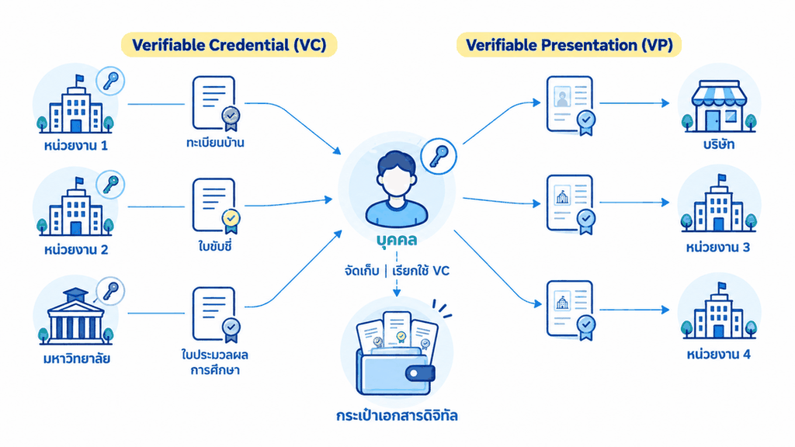
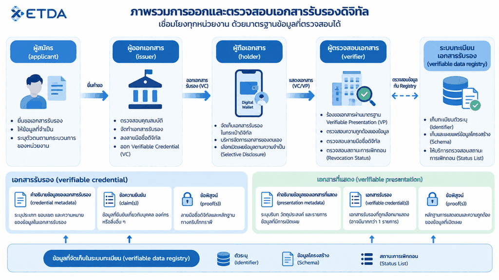
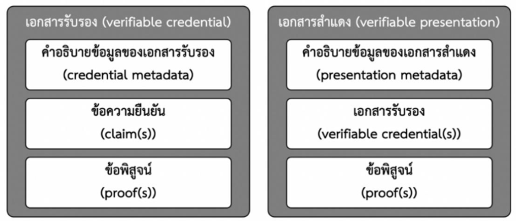

# 3. ภาพรวมการใช้งาน

{/* METADATA (agent-only — not rendered to readers)
> **สถานะ:** 📄 Reference — เอกสารแปลงจาก PDF ต้นฉบับของ สพธอ. (Thai VC ARF v1.1, มกราคม 2568)
> **แหล่งข้อมูล:** [Thai-VC-ARF-v1-1.pdf](https://www.etda.or.th/getattachment/Our-Service/Digital-Trusted-services-Infrastructure/VC-and-Digital-Document-Wallet/Information/รายงานทางเทคนค-Thai-VC-ARF-v1-1.pdf) — รายงานทางเทคนิค: กรอบแนวทางการทำงานร่วมกันของเอกสารรับรองดิจิทัลสำหรับประเทศไทย
> **เอกสารที่เกี่ยวข้อง:** [ดัชนีเอกสาร ARF](README.md)
*/}

---

ในปัจจุบันเอกสารในรูปแบบของข้อมูลอิเล็กทรอนิกส์เริ่มมีการใช้งานแพร่หลายมากยิ่งขึ้น แต่การใช้งานยังคงถูกจำกัดอยู่ในแค่บางกรณี เนื่องจากการออกหนังสือหรือเอกสารบางส่วนยังคงอยู่ในรูปแบบกระดาษ ส่วนเอกสารอิเล็กทรอนิกส์ที่มีใช้งานอยู่นั้นก็มีรูปแบบและมาตรฐานที่หลากหลาย เอกสารที่ออกโดยหน่วยงานหนึ่งอาจต้องใช้วิธีการในการจัดเก็บและวิธีการในการตรวจสอบที่แตกต่างกันไปตามเทคโนโลยีที่ใช้งาน

การใช้งานเอกสารอิเล็กทรอนิกส์ในระยะหลัง เริ่มมีแนวคิดของการนำเอกสารรับรองดิจิทัล (verifiable credential: VC) และเอกสารสำแดงดิจิทัล (verifiable presentation: VP) มาใช้งาน โดยเอกสารรับรองดิจิทัลและเอกสารสำแดงดิจิทัลนั้น มีคุณสมบัติที่ช่วยให้สามารถตรวจสอบความถูกต้องของเอกสารได้ว่าเอกสารดังกล่าวออกโดยหน่วยงานนั้นจริง และบุคคลที่ยื่นเอกสารเป็นเจ้าของเอกสารนั้นจริง นอกจากนั้น ยังช่วยเพิ่มความเป็นส่วนตัวให้กับผู้ใช้งาน เนื่องจากในบางกรณี ผู้ใช้งานสามารถเลือกแสดงข้อมูลในเอกสารบางส่วนได้

อย่างไรก็ตาม การนำ VC และ VP มาใช้งานนั้น ระบบที่ให้บริการแต่ละระบบจำเป็นต้องมีความสามารถในการทำงานร่วมกัน (interoperability) เพื่อให้สามารถเชื่อมต่อกันได้และสามารถตรวจสอบข้อมูลข้ามระบบได้อย่างมีประสิทธิภาพ เนื่องจากเอกสารบางประเภทอาจมีความเกี่ยวข้องกับหลายหน่วยงานไม่ว่าจะเป็นองค์กรภาครัฐ บริษัทเอกชน สถาบันการศึกษา หรือบริการออนไลน์ต่าง ๆ

การใช้งานเอกสารรับรองดิจิทัลในภาพรวม ตั้งแต่การออกเอกสารจนถึงการตรวจสอบ แสดงได้ดังรูปที่ 1

**รูปที่ 1 ภาพรวมการใช้งานของเอกสารรับรองดิจิทัล**

{/* pdf page 10 */}

## 3.1. บทบาทและความสัมพันธ์ของผู้เกี่ยวข้อง

(1) ผู้สมัคร (applicant) และ ผู้ถือเอกสาร (holder)

(2) ผู้ออกเอกสาร (issuer)

(3) ผู้ตรวจสอบเอกสาร (verifier)

(4) ผู้ให้บริการกระเป๋าเอกสารดิจิทัล (digital document wallet provider)

(5) ระบบทะเบียนเอกสารรับรอง (verifiable data registry)

การใช้งานกระเป๋าเอกสารดิจิทัลสำหรับเอกสารรับรองดิจิทัล ประกอบด้วยเอนทิตีและระบบที่เกี่ยวข้อง ได้แก่ ผู้สมัคร (applicant) ผู้ถือเอกสาร (holder) ผู้ออกเอกสาร (issuer) ผู้ตรวจสอบเอกสาร (verifier) ผู้ให้บริการกระเป๋าเอกสารดิจิทัล (digital document wallet provider) รวมไปถึงระบบทะเบียนเอกสารรับรอง (verifiable data registry) โดยบทบาทและความสัมพันธ์ของเอนทิตีที่เกี่ยวข้องเป็นไปตามรูปที่ 2

**รูปที่ 2 บทบาทของผู้ที่เกี่ยวข้องกับการใช้งานเอกสารรับรองดิจิทัล**

(1) ผู้สมัคร (applicant) ยื่นขอเอกสารรับรองดิจิทัลจากผู้ออกเอกสาร (issuer) พร้อมทั้งกำหนดให้จัดส่ง VC มายังกระเป๋าเอกสารดิจิทัลของผู้ถือเอกสาร (holder) ทั้งนี้ ผู้ออกเอกสารอาจกำหนดให้ผู้สมัครกรอกข้อมูลที่เกี่ยวข้องหรือแนบเอกสารเพิ่มเติม เพื่อให้ผู้ออกเอกสารตรวจสอบความถูกต้องก่อนออกเอกสารรับรองดิจิทัล

(2) ผู้ถือเอกสาร (holder) ใช้งานและควบคุมการทำงานกระเป๋าเอกสารดิจิทัลที่ให้บริการโดยผู้ให้บริการกระเป๋าเอกสารดิจิทัล (digital document wallet provider) โดยกระเป๋าเอกสารดิจิทัลนั้นอาจอยู่ในรูปแบบแอปพลิเคชันบนอุปกรณ์เคลื่อนที่หรือเว็บไซต์

ข้อสังเกต: ผู้สมัคร ผู้ถือเอกสาร และเจ้าของข้อความ (subject) อาจเป็นบุคคลเดียวกันหรือไม่ก็ได้ ตัวอย่างเช่น บิดาเป็นผู้สมัครยื่นขอเอกสารรับรองดิจิทัลซึ่งมีบุตรเป็นเจ้าของข้อความ จากนั้นจัดเก็บ VC เอกสารรับรอง ในกระเป๋าเอกสารดิจิทัลของมารดาซึ่งมีบทบาทเป็นผู้ถือเอกสาร

{/* pdf page 11 */}

(3) ผู้ถือเอกสารสามารถสร้าง VP โดยใช้ข้อมูลจาก VC จากนั้นแสดง VP ต่อผู้ตรวจสอบเอกสาร (verifier) ซึ่งผู้ตรวจสอบเอกสารสามารถตรวจสอบความถูกต้องครบถ้วนของ VP ดังกล่าวได้ โดยอาศัยข้อมูลในระบบทะเบียนเอกสารรับรอง (verifiable data registry)

(4) ระบบทะเบียนเอกสารรับรอง (verifiable data registry) เป็นตัวกลางในการสนับสนุนการสร้างและตรวจสอบเอกสารรับรอง โดยทำหน้าที่ลงทะเบียนตัวระบุ (identifier) รวมไปถึงกุญแจสาธารณะ (public key) ของแต่ละเอนทิตี และเค้าร่าง (schema) ของ VC และ VP

ทั้งนี้ ผู้ออกเอกสารและผู้ตรวจสอบเอกสารอาจเป็นบุคคลซึ่งใช้งานกระเป๋าเอกสารดิจิทัลเช่นเดียวกันกับผู้ถือเอกสาร หรืออาจเป็นระบบขององค์กรที่ทำหน้าที่ออก VC เอกสารรับรองดิจิทัลหรือตรวจสอบ VP ในกรณีนี้ ระบบขององค์กรจะถือเป็นกระเป๋าเอกสารดิจิทัลขององค์กร (enterprise digital wallet) ซึ่งทำหน้าที่บริหารจัดการเอกสารรับรองดิจิทัลสำหรับองค์กรนั้น

## 3.2. เอกสารรับรองดิจิทัลและเอกสารสำแดงดิจิทัล

เอกสารรับรองดิจิทัล (verifiable credential: VC) อาจเป็นเอกสารที่ออกโดยหน่วยงานของรัฐหรือเอกสารอิเล็กทรอนิกส์ใด ๆ ที่ออกให้เพื่อรับรองข้อความที่เกี่ยวข้องกับเจ้าของข้อความ (subject) ซึ่งเอกสารรับรองดิจิทัลนี้จะมีคุณสมบัติที่สามารถตรวจสอบได้ว่าเอกสารนั้นไม่ถูกเปลี่ยนแปลง และสามารถยืนยันตัวบุคคลผู้ออกเอกสารได้ ทั้งนี้ เมื่อพิจารณาตาม Verifiable Credentials Data Model ของ W3C จะสามารถสรุปองค์ประกอบของ VC ได้ ดังนี้

(1) คำอธิบายข้อมูล (metadata) ของ VC ซึ่งอาจรวมถึงตัวระบุ (identifier) ของเอนทิตีที่เกี่ยวข้อง ข้อมูลของผู้ออกเอกสาร หรือวันหมดอายุของเอกสารรับรอง

(2) ข้อความยืนยัน (claim) ซึ่งอาจมีเพียงข้อความยืนยันเดียวหรือหลายข้อความ โดยเป็นข้อมูลที่ยืนยันเกี่ยวกับเจ้าของข้อความ ซึ่งอาจเป็นบุคคลธรรมดา นิติบุคคล สิ่งของ หรือซอฟต์แวร์

(3) ข้อพิสูจน์ (proof) ของ VC ซึ่งอาจมีข้อพิสูจน์เดียวหรือหลายข้อพิสูจน์ โดยเป็นข้อมูลที่เป็นลายมือชื่อดิจิทัลของผู้ออกเอกสาร

เอกสารสำแดงดิจิทัล (verifiable presentation: VP) คือ ชุดข้อมูลที่ผู้ถือเอกสารสร้างขึ้นจาก VC โดย VP นั้นจะมีคุณสมบัติที่สามารถตรวจสอบได้ว่าเอกสารนั้นไม่ถูกเปลี่ยนแปลง (integrity) และสามารถยืนยันตัวผู้ถือเอกสารได้ (authenticity) ทั้งนี้ เมื่อพิจารณาตาม Verifiable Credentials Data Model ของ W3C จะสามารถสรุปองค์ประกอบของ VP ได้ ดังนี้

(1) คำอธิบายข้อมูล (metadata) ของ VP

(2) เอกสารรับรอง (verifiable credential: VC) ซึ่งอาจมี VC เดียวหรือหลาย VC ก็ได้ ทั้งนี้ VP อาจไม่ใช้ข้อมูลจาก VC โดยตรง แต่อาจใช้ข้อมูลซึ่งสร้าง (derived) มาจาก VC อีกที

(3) ข้อพิสูจน์ (proof) ของ VP ซึ่งอาจมีข้อพิสูจน์เดียวหรือหลายข้อพิสูจน์ก็ได้ โดยเป็นข้อมูลที่เป็นลายมือชื่อดิจิทัลของผู้ถือเอกสาร

{/* pdf page 12 */}

องค์ประกอบพื้นฐานของ VC และ VP สรุปได้ตามรูปที่ 3

**รูปที่ 3 องค์ประกอบพื้นฐานของเอกสารรับรองและเอกสารสำแดง**

## 3.3. ระบบทะเบียนเอกสารรับรอง (verifiable data registry)

ในการใช้งานเอกสารรับรองดิจิทัล เอนทิตีที่เกี่ยวข้องจะใช้งานกระเป๋าเอกสารดิจิทัลร่วมกับระบบทะเบียนเอกสารรับรอง โดยระบบทะเบียนเอกสารรับรองจะถูกนำมาใช้สนับสนุนการทำงานและจัดเก็บข้อมูลต่าง ๆ เช่น

- ทะเบียนตัวระบุ (identifier) หรือตัวระบุแบบกระจายศูนย์ (decentralized identifier: DID) รวมไปถึง DID Document ของผู้ที่เกี่ยวข้อง เช่น ผู้ถือเอกสาร ผู้ออกเอกสาร หรือผู้ตรวจสอบเอกสาร

ข้อสังเกต: การตรวจสอบ VC หรือ VP สามารถทำได้โดยการนำ DID ของ issuer หรือ holder มาใช้ในการดึงข้อมูล (resolve) DID Document ที่ถูกลงทะเบียนไว้ในระบบทะเบียนเอกสารรับรอง เพื่อนำ public key มาใช้ตรวจสอบลายมือชื่อดิจิทัล

- ทะเบียนเค้าร่างของเอกสารรับรอง (credential schema)

ข้อสังเกต: เพื่อให้ผู้ออกเอกสาร (issuer) สามารถเลือกใช้งานเค้าร่างของเอกสารรับรองได้ เมื่อต้องมีการออกเอกสารรับรองในลักษณะเดียวกัน โดยเอกสารรับรองที่ออกตาม credential schema เดียวกัน จะมีโครงสร้าง (structure) เนื้อหา (content) และรูปแบบ (format) ที่สอดคล้องกัน

- ทะเบียนรายการเพิกถอนเอกสารรับรอง (revocation registry)

นอกจากนี้ ระบบทะเบียนเอกสารรับรองอาจถูกนำมาใช้เป็นทะเบียนรายชื่อของเอนทิตีต่าง ๆ ในระบบได้ เช่น

- รายชื่อผู้ให้บริการกระเป๋าเอกสารดิจิทัล (digital document wallet providers)
- รายชื่อผู้ออกเอกสาร (issuers)
- รายชื่อผู้ตรวจสอบเอกสาร (verifiers)
- รายชื่อผู้ให้บริการออกใบรับรอง (certification authorities: CA)

ทั้งนี้ ระบบทะเบียนเอกสารรับรองสามารถพัฒนาได้หลากหลายรูปแบบ เช่น รูปแบบรวมศูนย์ (centralized) ด้วยระบบฐานข้อมูล หรือรูปแบบกระจายศูนย์ (decentralized) ด้วยเทคโนโลยีบล็อกเชน (blockchain) หรือโครงสร้างพื้นฐานใบรับเหตุการณ์กุญแจ (key event receipt infrastructure: KERI) หรือรูปแบบผสม

> 📌 **หมายเหตุ (ส่วนขยายนอกรายงานต้นฉบับ):** แนวทางการจัดทำรายชื่อของเอนทิตีแบบกระจายศูนย์ในระยะแรก อ้างอิงตาม Trust Model 3 (Trusted List + DID) ดังรายละเอียดใน [§9 Trust Model 3](09-trust-model-3.md)

{/* pdf page 13 */}

---

**การนำทาง:** [⬅️ บทที่ 2 — บทนิยาม](02-definitions.md) · [⬆️ สารบัญ ARF](README.md) · [บทที่ 4 — แนวคิดและองค์ประกอบที่ส่งเสริมการทำงานร่วมกัน ➡️](04-interoperability-concepts.md)
