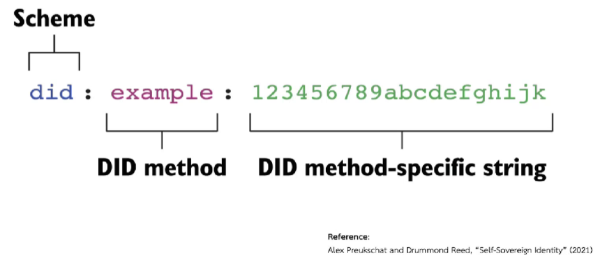
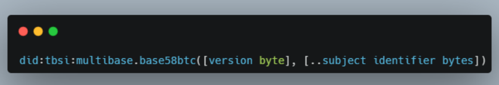
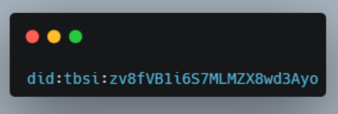
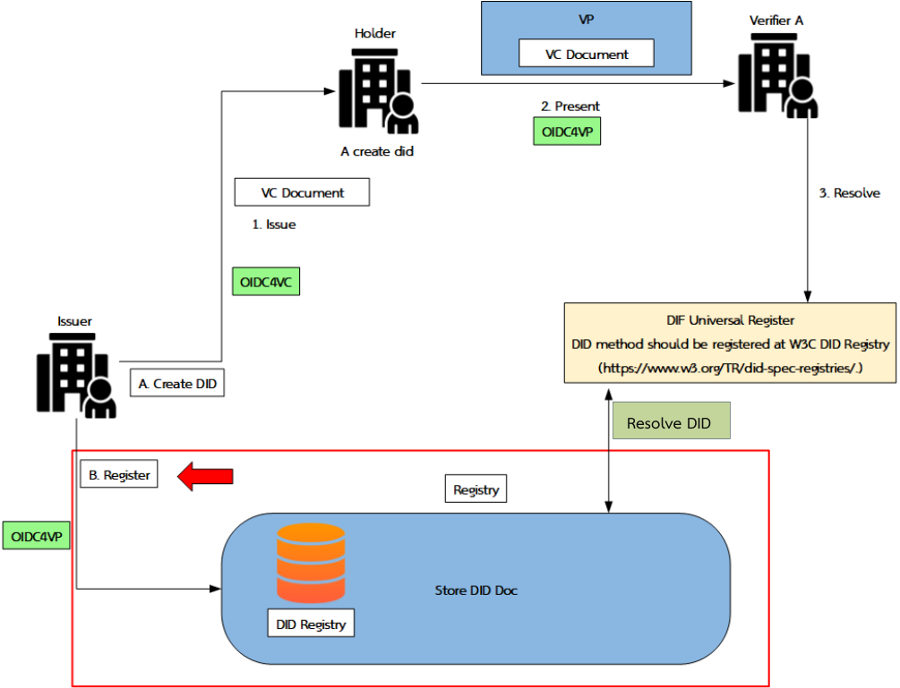
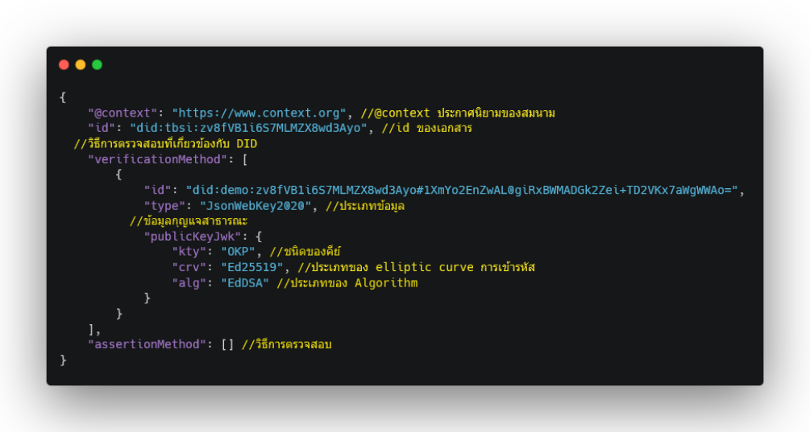
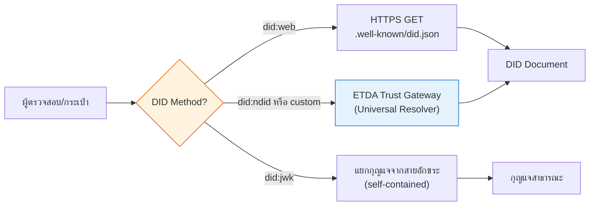
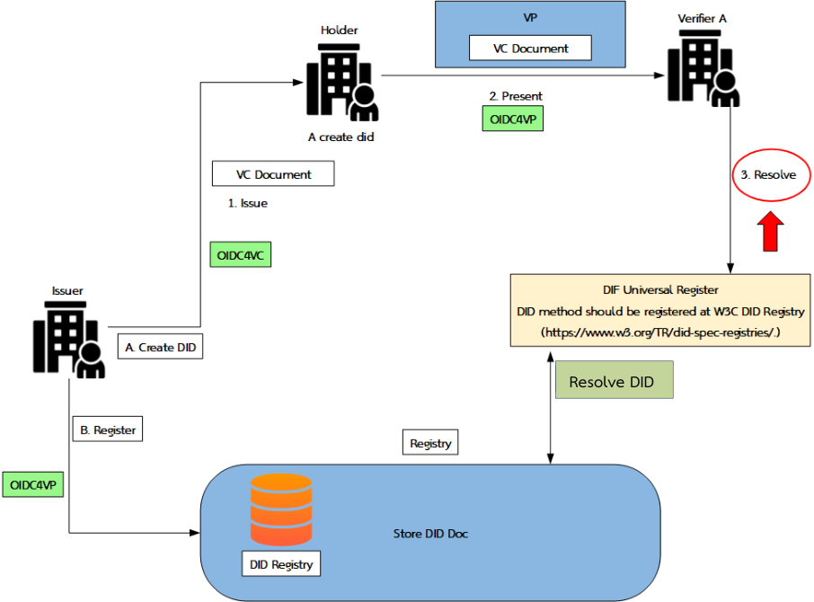
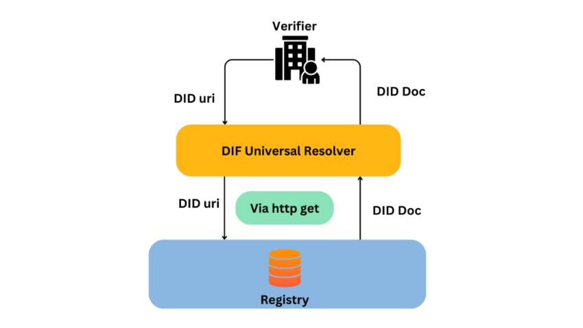
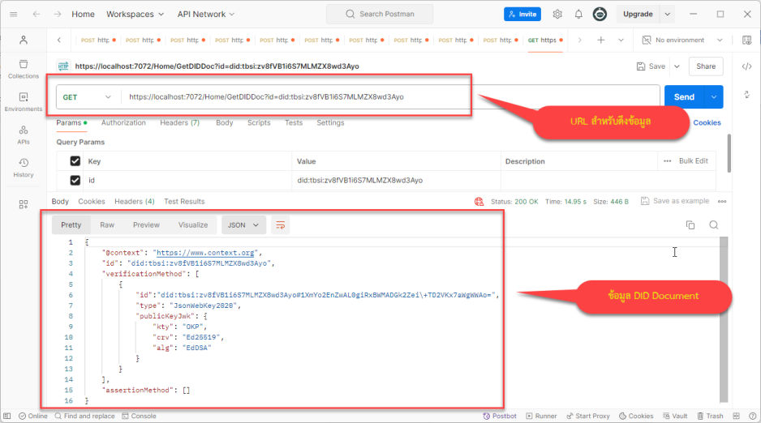
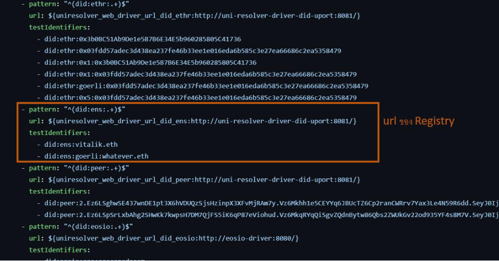

# 6. Decentralized Identifiers Methodologies

{/* METADATA (agent-only — not rendered to readers)
> **สถานะ:** 📄 Reference — เอกสารแปลงจาก PDF ต้นฉบับของ สพธอ. (Thai VC ARF v1.1, มกราคม 2568)
> **แหล่งข้อมูล:** [Thai-VC-ARF-v1-1.pdf](https://www.etda.or.th/getattachment/Our-Service/Digital-Trusted-services-Infrastructure/VC-and-Digital-Document-Wallet/Information/รายงานทางเทคนค-Thai-VC-ARF-v1-1.pdf) — รายงานทางเทคนิค: กรอบแนวทางการทำงานร่วมกันของเอกสารรับรองดิจิทัลสำหรับประเทศไทย
> **เอกสารที่เกี่ยวข้อง:** [ดัชนีเอกสาร ARF](README.md)
*/}

---

บทนี้อธิบายวิธีการของตัวระบุแบบกระจายศูนย์ (decentralized identifier: DID) ที่รายงานฉบับนี้ใช้ ครอบคลุมรูปแบบ DID การสร้างและการลงทะเบียน DID Document และการดึงข้อมูล (resolve) DID Document

เป็นตัวระบุ (identifier) บนระบบทะเบียนเอกสารรับรอง (verifiable data registry) แบบกระจายศูนย์ที่ใช้ URL ในการเชื่อมโยงกับเอนทิตี้ โดยทั่วไป DID จะนำมาใช้ใน VC เพื่อแสดงความเชื่อมโยงไปยังเจ้าของข้อความซึ่งทำให้สามารถส่งต่อหรือโอนย้าย VC จากกระเป๋าเอกสารดิจิทัลหนึ่งไปยังกระเป๋าเอกสารดิจิทัลอีกอันหนึ่งได้โดยไม่จำเป็นต้องออก VC ชุดใหม่อย่างไรก็ตาม VC ไม่จำเป็นต้องใช้ identifier เป็น DID ก็ได้

## 6.1. รูปแบบ DID

อ้างอิงตาม W3C โครงสร้างของ DID สามารถแสดงได้ตามรูปที่ 18 ซึ่งประกอบด้วย 3 ส่วน ได้แก่ (1) scheme (2) DID method และ (3) DID method-specific string

**รูปที่ 18 โครงสร้าง DID**

## 6.2. การสร้างและการลงทะเบียน DID Document

ยกตัวอย่างการทำ Digital Document โครงสร้างของ DID จะเป็นตามรูปที่ 19 ในส่วนของ DID method จะระบุเป็น “tbsi” และ DID method-specific ขึ้นต้นด้วยตัวอักษร “z” และชุดข้อความสุ่ม 16 ตัวอักษร

**รูปที่ 19 ตัวอย่างโครงสร้าง DID**

จากโครงสร้าง DID ข้างต้น เมื่อทำการสร้าง DID จะมีลักษณะองค์ประกอบ ตามรูปที่ 20

{/* pdf page 45 */}

**รูปที่ 20 DID ID**

ข้อมูลที่ได้จากการสร้าง DID จะนำไปใช้ในการสร้าง DID Document เพื่อใช้ในการลงทะเบียน (Register) ในระบบ Registry ตามรูปที่ 21 การลงทะเบียนใน Registry จะทำโดยใช้โปรโตคอล OID4VP ซึ่งข้อมูลที่นำมาใช้ในการลงทะเบียน คือ DID Document ในรายงานฉบับนี้จะเป็นการลงทะเบียนแบบออฟไลน์ (Offline)

**รูปที่ 21 การลงทะเบียน DID Document**

(1) DID Document

เป็นชุดข้อมูลที่อธิบาย DID ประกอบด้วยข้อมูลที่ใช้ในการเข้ารหัสลับ (encrypted data) และกุญแจสาธารณะ (public key) ดังแสดงตามรูปที่ 22

{/* pdf page 46 */}

**รูปที่ 22 โครงสร้าง DID Document**

## 6.3. การดึงข้อมูล (Resolve) DID Document

ระบบของประเทศไทยใช้ DID Method หลัก 3 รูปแบบ แต่ละรูปแบบมีวิธี resolve ต่างกัน ดังนี้

| DID Method | ผู้ใช้ | วิธี Resolve | ต้อง Resolver กลาง? |
|------------|--------|-------------|:-------------------:|
| `did:web` | หน่วยงาน (Issuer, Verifier, Wallet Provider) | HTTPS GET ไปที่ `/.well-known/did.json` ของโดเมนต์นั้น | ไม่ |
| `did:jwk` | ผู้ถือเอกสาร (Holder) | กุญแจสาธารณะฝังอยู่ในสายอักขระ DID โดยตรง ไม่ต้องดึงจากที่อื่น | ไม่ |
| `did:ndid` | ระบบตัวตนของไทย (เช่น NDID) | ส่งคำขอไปยัง ETDA Trust Gateway ซึ่งทำหน้าที่เป็น Universal Resolver | ใช่ |

{/* TODO: อัปเดตแผนภาพและรายละเอียดการ resolve ของ did:ndid เมื่อมีการกำหนด spec ของ did:ndid method อย่างเป็นทางการ */}

DID Document ที่ได้จากการ resolve จะมีกุญแจสาธารณะที่ใช้ตรวจลายมือชื่อของเอนทิตีนั้น ทั้งนี้ การ resolve ผ่าน DIF Universal Resolver ยังคงเป็นกลไกสำหรับ custom DID method ที่ยังไม่ได้จดทะเบียนใน W3C DID method registry

{/* pdf page 47 */}

**รูปที่ 23 ขั้นตอน Resolve DID Document**

**รูปที่ 24 การดึงข้อมูลผ่าน http get**

ในตัวอย่าง จะเป็นการแสดงถึงการเรียกในรูปแบบ http get โดย Key ที่ส่งไปพร้อมกับ URL คือ DID ของ Issuer ที่ได้มาจากข้อมูลของ VC และเมื่อส่งข้อมูลในรูปแบบ URL แล้วข้อมูลถูกต้อง ทาง Registry จะตอบกลับเป็น DID Document มาให้ โดย DID Document จะเป็นของ Issuer ที่ได้ทำการลงทะเบียนไว้กับ Registry

{/* pdf page 48 */}

**รูปที่ 25 ข้อมูลที่ผ่านการ resolve**

**รูปที่ 26 การตั้งค่า Registry สำหรับ DIF Universal Resolver**

{/* pdf page 49 */}

---

**การนำทาง:** [⬅️ บทที่ 5 — มาตรฐานและข้อปฏิบัติสำหรับ VC และ VP](05-standards-and-compliance.md) · [⬆️ สารบัญ ARF](README.md) · [บทที่ 6.5 — กลไกการสร้างความน่าเชื่อถือ (Trust-Building Mechanism) ➡️](06.5-trust-building-mechanism.md)
