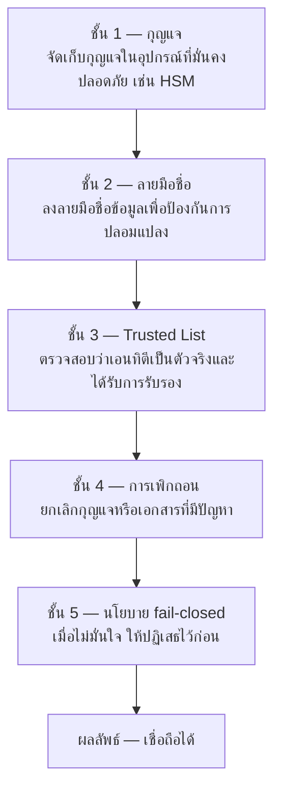
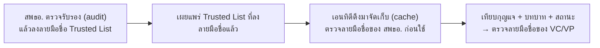
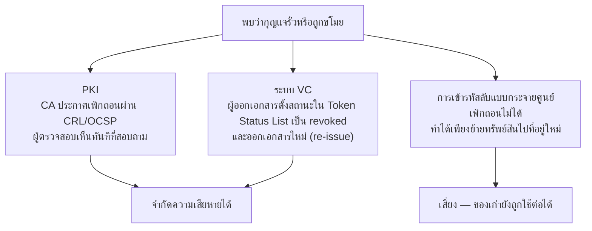
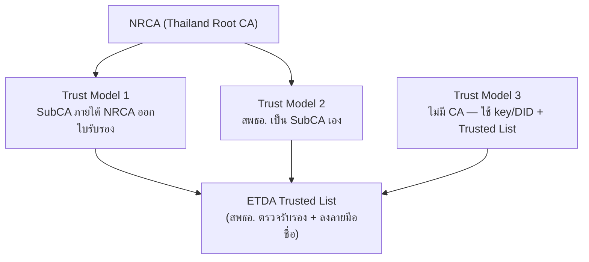

# 6.5 กลไกการสร้างความน่าเชื่อถือ (Trust-Building Mechanism): Trusted List และแบบจำลองความน่าเชื่อถือ 3 รูปแบบ

{/* METADATA (agent-only — not rendered to readers)
> **สถานะ:** 📊 ส่วนขยาย (extension) — จัดทำเพิ่มเติมโดยคณะทำงาน VC มิได้เป็นส่วนหนึ่งของรายงานต้นฉบับ Thai VC ARF เวอร์ชัน 1.1
> **แหล่งข้อมูล:** สรุปและสังเคราะห์จากการวิเคราะห์เปรียบเทียบช่องโหว่ความปลอดภัยของ PKI การเข้ารหัสลับ และระบบ VC [G1] การเปรียบเทียบสถาปัตยกรรมความน่าเชื่อถือ 3 รูปแบบ [G2] [G3] และมาตรฐานที่เกี่ยวข้อง ได้แก่ W3C DID Core [G4] OID4VCI [G5] OID4VP [G6] SD-JWT VC [G7] IETF Token Status List [G8] ETSI TS 119 602 [G9]
> **เอกสารที่เกี่ยวข้อง:** [§3.3 ระบบทะเบียนเอกสารรับรอง](03-usage-overview.md) · [§6 DID Methodologies](06-did-methodologies.md) · [§7 การทำงานร่วมกันข้ามระบบนิเวศและผลของ Trusted List](07-cross-ecosystem-interoperability.md) · [§9 Trust Model 3](09-trust-model-3.md) · [research/31 ช่องโหว่ PKI/คริปโทฯ vs VC](../research/31-security-gaps-pki-crypto-vs-vc.md) · [ดัชนี ARF](README.md)
*/}

---

บทนี้เป็นส่วนขยายของรายงาน Thai VC ARF เวอร์ชัน 1.1 จัดทำขึ้นเพื่อเป็นบทเกริ่นนำเรื่องกลไกการสร้างความน่าเชื่อถือ (trust-building mechanism) ก่อนเข้าสู่บทที่ 7 (การทำงานร่วมกันข้ามระบบนิเวศและผลของ Trusted List) บทที่ 8 (Implementation Guidelines) และบทที่ 9 (Trust Model 3) โดยรายงานต้นฉบับเวอร์ชัน 1.1 ระบุไว้ใน [§3.3](03-usage-overview.md) ว่าระบบทะเบียนเอกสารรับรอง (verifiable data registry) อาจจัดเก็บรายชื่อของเอนทิตี (entity) ได้ แต่มิได้อธิบายว่ากลไกที่ทำให้รายชื่อดังกล่าวน่าเชื่อถือทำงานอย่างไร ทั้งบทที่ 7 อ้างถึง "ผลของ Trusted List" และบทที่ 9 กล่าวถึง Trust Model 3 โดยตรง จึงจำเป็นต้องมีบทเกริ่นนำเพื่อให้ผู้อ่านเข้าใจพื้นฐานก่อน

บทนี้ครอบคลุม 3 ส่วน ดังนี้ (1) ความหมายของ Trusted List และประโยชน์ของ Trusted List ต่อระบบ (2) สรุปพื้นฐานเปรียบเทียบระหว่างโครงสร้างพื้นฐานกุญแจสาธารณะ (public key infrastructure: PKI) กับการเข้ารหัสลับแบบกระจายศูนย์ (decentralized cryptography) ตาม [G1] และ (3) ภาพรวมของแบบจำลองความน่าเชื่อถือ (trust model) ทั้ง 3 รูปแบบ เพื่อให้ผู้อ่านเข้าใจ Trust Model 1 และ Trust Model 2 ก่อนศึกษารายละเอียดของ Trust Model 3 ในบทที่ 9

อย่างไรก็ตาม บทนี้เป็นบทเกริ่นนำเชิงภาพรวม มิได้ทดแทนรายละเอียดในบทอื่น รายละเอียดของ Trust Model 3 อยู่ในบทที่ 9 รายละเอียดการจัดการกุญแจ (key management) และการหมุนกุญแจ (key rotation) อยู่ในบทที่ 12 และรายละเอียดสถานะและการเพิกถอน (revocation) อยู่ในบทที่ 13

---

## 6.5.1 บทบาทของบทนี้และขอบเขต

รายงานฉบับนี้กำหนดให้บทนี้ทำหน้าที่เชื่อม (bridge) ระหว่างบทที่ว่าด้วยตัวระบุแบบกระจายศูนย์ (decentralized identifier: DID) ใน [§6](06-did-methodologies.md) กับบทที่ว่าด้วยการทำงานร่วมกันและความน่าเชื่อถือใน [§7](07-cross-ecosystem-interoperability.md) ถึง [§9](09-trust-model-3.md) โดยมีขอบเขต ดังนี้

1. **อยู่ในขอบเขต** — ความหมายและประโยชน์ของ Trusted List ภาพรวมของช่องโหว่ความปลอดภัย (security gap) ที่ระบบต้องปิด การเปรียบเทียบแนวทาง PKI กับการเข้ารหัสลับแบบกระจายศูนย์ และภาพรวมของแบบจำลองความน่าเชื่อถือทั้ง 3 รูปแบบ
2. **ไม่อยู่ในขอบเขต** — กระบวนการทำงานเชิงลึกของ Trust Model 3 (อยู่ในบทที่ 9) การจัดการกุญแจและการหมุนกุญแจ (อยู่ในบทที่ 12) โครงสร้างข้อมูลสถานะและการเพิกถอน (อยู่ในบทที่ 13) และการเชื่อมโยงข้ามพรมแดน ซึ่งมีรายละเอียดในแหล่งอ้างอิงเฉพาะเรื่อง

---

## 6.5.2 ปัญหาความน่าเชื่อถือที่ระบบต้องแก้

ก่อนอธิบายว่า Trusted List ช่วยอะไร รายงานฉบับนี้สรุปช่องโหว่ความปลอดภัยที่ระบบเอกสารรับรองดิจิทัลต้องปิดไว้ก่อน โดยอ้างอิงการวิเคราะห์ตาม [G1] ซึ่งจัดช่องโหว่หลักเป็น 7 หมวด (G1–G7) ดังตารางต่อไปนี้

| หมวด | ช่องโหว่ | ประเด็นที่ต้องตอบ |
|:---:|---------|-------------------|
| G1 | การปลอมตัวเป็นผู้ออกเอกสาร (impersonation) | ผู้ตรวจสอบทราบได้อย่างไรว่าผู้ลงลายมือชื่อเป็นตัวจริง |
| G2 | กุญแจรั่วหรือถูกขโมย (key compromise) | เมื่อกุญแจรั่วไหล จะจำกัดความเสียหายอย่างไร |
| G3 | การเพิกถอน (revocation) | ยกเลิกสิ่งที่ออกไปแล้วได้หรือไม่ และเร็วเพียงใด |
| G4 | การนำลายมือชื่อเก่ามาใช้ซ้ำ (replay) | ป้องกันการนำข้อมูลเก่ามาใช้หลอกได้อย่างไร |
| G5 | จุดล้มเหลวจุดเดียว (single point of failure) | หากศูนย์กลางหยุดทำงาน ระบบยังตรวจสอบได้หรือไม่ |
| G6 | ความเป็นส่วนตัว (privacy) | ตรวจสอบได้โดยไม่เปิดเผยข้อมูลเกินจำเป็นหรือไม่ |
| G7 | การกู้คืนกุญแจของผู้ใช้ (user key recovery) | เมื่อผู้ใช้ทำกุญแจหาย จะกู้คืนได้หรือไม่ |

**ตารางที่ 6.5-1 ช่องโหว่ความปลอดภัย 7 หมวด (G1–G7)** [G1]

รายงานฉบับนี้ยึดหลักการป้องกันเป็นชั้น (defense-in-depth) กล่าวคือ ระบบที่มั่นคงปลอดภัยไม่ควรพึ่งการป้องกันชั้นเดียว แต่ต้องซ้อนหลายชั้น เพื่อให้เมื่อชั้นหนึ่งบกพร่อง ยังมีชั้นถัดไปรองรับ ดังรูปที่ 6.5-1

**รูปที่ 6.5-1 การป้องกันเป็นชั้น (defense-in-depth)** [G1]

---

## 6.5.3 ความหมายของ Trusted List และการแก้ปัญหาความน่าเชื่อถือ

ระบบรายชื่อที่น่าเชื่อถือ (Trusted List) หมายถึง รายการของเอนทิตีที่ได้รับการตรวจรับรอง (audit) และลงลายมือชื่อดิจิทัล (digital signature) กำกับโดยสำนักงานพัฒนาธุรกรรมทางอิเล็กทรอนิกส์ (สพธอ.) เพื่อใช้ตัดสินว่าเอนทิตีใดได้รับอนุญาตให้ทำหน้าที่ผู้ออกเอกสาร (issuer) ผู้ตรวจสอบเอกสาร (verifier) หรือผู้ให้บริการกระเป๋าเอกสารดิจิทัล (digital document wallet provider) รายการทั้งสามประเภทเผยแพร่เป็น JWT ที่มี payload แบบ LoTE; ตัวอย่างที่มีอยู่แสดงข้อมูลกุญแจหรือ DID ใน `ServiceDigitalIdentity` แต่ฟิลด์สถานะและขอบเขตสิทธิ์บางส่วนยังต้องกำหนดใน Thai profile ก่อนใช้ตัดสินใจจริง [G2] [G9] [รูปแบบ JWT ที่อ้างอิง LoTE](../research/42-trusted-list-lote-jwt-format.md)

Trusted List ช่วยแก้ปัญหาความน่าเชื่อถือ ดังนี้

1. **ปิด G1 (การปลอมตัว)** — เอนทิตีทุกรายต้องผ่านการตรวจรับรองจาก สพธอ. ก่อนถูกบันทึกลง Trusted List ผู้ตรวจสอบจึงเทียบกุญแจในลายมือชื่อกับกุญแจใน Trusted List เพื่อยืนยันว่าเป็นตัวจริง
2. **ช่วยปิด G3 (การเพิกถอน)** — เมื่อเอนทิตีมีปัญหา สพธอ. เปลี่ยนสถานะใน Trusted List เป็นระงับ (suspended) หรือเพิกถอน (revoked) ได้ ทำให้ผู้ตรวจสอบปฏิเสธเอนทิตีนั้นได้
3. **รองรับ G5 (จุดล้มเหลวจุดเดียว)** — เอนทิตีดึงข้อมูล Trusted List มาจัดเก็บไว้ในเครื่อง (local cache) แล้วตรวจสอบระหว่างกันได้โดยไม่ต้องเรียกไปยัง สพธอ. ทุกครั้ง จึงกระจายสำเนา Trusted List ไปหลายจุดได้

ผู้รับ Trusted List ต้องตรวจสอบลายมือชื่อดิจิทัลของ สพธอ. ทุกครั้ง รวมถึงกรณีที่รับไฟล์ผ่านโครงข่ายกระจายเนื้อหา (content delivery network: CDN) กลไกการทำงานพื้นฐานแสดงได้ดังรูปที่ 6.5-2 โดยมีรายละเอียดเชิงลึกในบทที่ 9

**รูปที่ 6.5-2 กลไกพื้นฐานของ Trusted List — ตรวจรับรอง ลงลายมือชื่อ เผยแพร่ และตรวจสอบ** [G2] [G9]

---

## 6.5.4 ความน่าเชื่อถือ 2 สายหลัก: PKI และการเข้ารหัสลับแบบกระจายศูนย์

รายงานฉบับนี้สรุปพื้นฐานตาม [G1] ว่า วิธีทำให้ลายมือชื่อดิจิทัลน่าเชื่อถือมี 2 สายหลัก ได้แก่ PKI ซึ่งมีตัวกลางที่เชื่อถือได้ และการเข้ารหัสลับแบบกระจายศูนย์ ซึ่งไม่มีตัวกลาง เนื้อหาส่วนนี้เป็นบทสรุปเพื่อให้เข้าใจว่าเหตุใดระบบ VC ของไทยจึงเลือกแนวทางแบบผสม รายละเอียดฉบับเต็มอยู่ใน [research/31](../research/31-security-gaps-pki-crypto-vs-vc.md)

### 6.5.4.1 PKI — มีตัวกลางที่เชื่อถือได้

PKI ใช้ผู้ให้บริการออกใบรับรอง (certification authority: CA) เป็นตัวกลางตรวจสอบตัวตนก่อนออกใบรับรอง (certificate) แล้วสร้างห่วงโซ่ความเชื่อถือ (chain of trust) ไล่ขึ้นไปถึง Root CA [G10] PKI ปิดช่องโหว่ได้ ดังนี้

1. **G1 การปลอมตัว** — CA ตรวจตัวตนก่อนออกใบรับรอง และมีห่วงโซ่ความเชื่อถือให้ตรวจสอบย้อนกลับได้ [G10]
2. **G2 กุญแจรั่ว** — จัดเก็บกุญแจในฮาร์ดแวร์ความมั่นคงปลอดภัย (hardware security module: HSM) [G14] และกำหนดอายุการใช้กุญแจ (cryptoperiod) ตามคำแนะนำการจัดการกุญแจ [G15]
3. **G3 การเพิกถอน** — ประกาศยกเลิกใบรับรองผ่านบัญชีเพิกถอน (certificate revocation list: CRL) หรือตรวจสถานะแบบเรียลไทม์ผ่าน OCSP (online certificate status protocol) [G10] [G11]

จุดแข็งของ PKI คือมีผู้รับผิดชอบชัดเจนและเพิกถอนสิ่งที่รั่วไหลได้จริง จึงเหมาะกับงานระดับชาติที่ต้องมีความรับผิดชอบตามกฎหมาย ทั้งนี้ จุดอ่อนคือ หาก CA ถูกเจาะจะกระทบทั้งระบบ (G5) จึงต้องป้องกัน CA อย่างเข้มงวด [G1]

### 6.5.4.2 การเข้ารหัสลับแบบกระจายศูนย์ — ไม่มีตัวกลาง

การเข้ารหัสลับแบบกระจายศูนย์ เช่น เทคโนโลยีบล็อกเชน (blockchain) ใช้แนวคิดตรงข้าม คือไม่มีตัวกลาง ผู้ใช้แต่ละรายถือกุญแจของตนเอง และมีบัญชีสาธารณะ (ledger) ที่แก้ย้อนหลังไม่ได้ [G12] แนวทางนี้มีจุดเด่นและข้อจำกัด ดังนี้

1. **G5 จุดล้มเหลวจุดเดียว — ปิดได้ดีที่สุด** เพราะกระจายศูนย์ (decentralized) ไม่มีศูนย์กลางจุดเดียวให้หยุดทำงาน [G12]
2. **G7 การกู้คืนกุญแจ — ปิดได้ดี** ด้วยแนวคิดวลีกู้คืน (seed phrase) และการกู้คืนบัญชีโดยบุคคลหรืออุปกรณ์ที่ไว้วางใจ (social recovery) [G1]
3. **G3 การเพิกถอน — ทำไม่ได้ในระดับกุญแจดิบ** เนื่องจากไม่มีตัวกลางคอยยกเลิก หากกุญแจรั่วจึงทำได้เพียงย้ายทรัพย์สินไปยังที่อยู่ใหม่ [G12]

รายงานฉบับนี้จึงประเมินว่า แนวคิด "ไม่มีตัวกลาง" ไม่เหมาะเป็นแกนหลักของเอกสารรับรองระดับชาติ เพราะระบบต้องเพิกถอนสิ่งที่รั่วไหลได้ อย่างไรก็ตาม แนวคิดการกู้คืนกุญแจของผู้ใช้ (G7) มีประโยชน์ และอาจนำมาใช้เสริมเฉพาะกุญแจในเครื่องของผู้ถือเอกสาร [G1]

### 6.5.4.3 ตารางเปรียบเทียบและบทเรียนสำหรับระบบ VC

การเปรียบเทียบความสามารถในการปิดช่องโหว่ของ 2 สายหลัก และบทเรียนสำหรับระบบ VC สรุปได้ดังตารางที่ 6.5-2 โดยใช้สัญลักษณ์ ✅ = ปิดได้ดี · 🟡 = ปิดได้บางส่วน · ❌ = ปิดไม่ได้หรือไม่เหมาะ

| ช่องโหว่ | PKI | การเข้ารหัสลับแบบกระจายศูนย์ | บทเรียนสำหรับระบบ VC |
|---------|:---:|:---:|---------------------|
| G1 การปลอมตัว | ✅ | 🟡 | ใช้แนว PKI — มีตัวกลางตรวจตัวตน (Trusted List) |
| G2 กุญแจรั่ว | ✅ | 🟡 | ใช้แนว PKI (HSM + cryptoperiod) |
| G3 การเพิกถอน | ✅ | ❌ | จำเป็นต้องมี — ใช้ Trusted List status ร่วมกับ Token Status List [G8] |
| G4 การใช้ซ้ำ | ✅ | ✅ | ใช้ได้ทั้งคู่ (timestamp / nonce) |
| G5 จุดล้มเหลวจุดเดียว | 🟡 | ✅ | ใช้แนวการเข้ารหัสลับแบบกระจายศูนย์ — กระจายสำเนา Trusted List หลายจุด |
| G6 ความเป็นส่วนตัว | 🟡 | 🟡 | ใช้การเปิดเผยข้อมูลแบบเลือกได้ (selective disclosure) ด้วย SD-JWT VC [G7] |
| G7 การกู้คืนกุญแจผู้ใช้ | ❌ | ✅ | ใช้แนวการเข้ารหัสลับแบบกระจายศูนย์ เสริมเฉพาะกุญแจในเครื่องผู้ใช้ |

**ตารางที่ 6.5-2 การปิดช่องโหว่ G1–G7: PKI เทียบกับการเข้ารหัสลับแบบกระจายศูนย์** [G1]

รายงานฉบับนี้จึงสรุปว่า ระบบ VC ของไทยเลือก **ยืมแกนของ PKI เป็นหลัก** (มีตัวกลาง คือ ETDA Trusted List) เพื่อปิด G1 และ G3 ซึ่งจำเป็นต่อเอกสารระดับชาติ แล้วหยิบแนวคิดของการเข้ารหัสลับแบบกระจายศูนย์มาเสริมเฉพาะที่จำเป็น ได้แก่ การกระจายสำเนา Trusted List (ปิด G5) และการกู้คืนกุญแจในเครื่องผู้ใช้ (ปิด G7) การตอบสนองต่อกรณีกุญแจรั่วของแต่ละแนวทางเปรียบเทียบได้ดังรูปที่ 6.5-3 [G1]

**รูปที่ 6.5-3 การตอบสนองต่อกรณีกุญแจรั่วของแต่ละแนวทาง** [G1]

---

## 6.5.5 แบบจำลองความน่าเชื่อถือ 3 รูปแบบ

จากการเปรียบเทียบสถาปัตยกรรมความน่าเชื่อถือ [G2] [G3] รายงานฉบับนี้จำแนกแบบจำลองความน่าเชื่อถือของระบบ VC ไว้ 3 รูปแบบ โดยทั้ง 3 รูปแบบยืมแกนของ PKI ร่วมกัน (มีตัวกลาง คือ Trusted List ที่ สพธอ. กำกับดูแล) แต่ต่างกันที่ "ตัวกลางหนักหรือเบา" ความหมายของแต่ละแบบจำลอง มีดังนี้

**ข้อกำหนดร่วม:** ไม่ว่าเลือกใช้ Trust Model 1, Trust Model 2 หรือ Trust Model 3 ผู้เข้าร่วมทุกฝ่ายต้องได้รับการตรวจรับรองและปรากฏใน Trusted List ที่เกี่ยวข้องก่อนนำข้อมูลความน่าเชื่อถือไปใช้ตัดสินใจ ระบบต้องดึง ตรวจลายมือชื่อ และตรวจสถานะ บทบาท และช่วงเวลาที่มีผลใช้ได้ของ Trusted List ตามขั้นตอนเดียวกัน ความแตกต่างของแต่ละแบบจำลองมีเฉพาะวิธีผูกและตรวจสอบกุญแจ ได้แก่ สายใบรับรองใน Trust Model 1 และ 2 หรือ DID/key reference ใน Trust Model 3 เท่านั้น [G2] [G3]

1. **Trust Model 1 — CA Delegation** หมายถึง แบบจำลองที่มีผู้ให้บริการออกใบรับรองระดับรอง (subordinate CA: SubCA) ภายใต้ผู้ให้บริการออกใบรับรองแห่งชาติ (Thailand National Root Certification Authority: NRCA) เป็นผู้ออกใบรับรองให้ผู้ออกเอกสารและผู้ตรวจสอบเอกสาร แล้วลงทะเบียนข้อมูลความน่าเชื่อถือไว้ใน Trusted List โดย สพธอ. ทำหน้าที่ตรวจรับรองเอนทิตีและกำกับดูแล Trusted List [G2] [G13]
2. **Trust Model 2 — ETDA SubCA** หมายถึง แบบจำลองที่คล้าย Trust Model 1 แต่ สพธอ. เป็น SubCA ภายใต้ NRCA เองเพื่อออกใบรับรอง แบบจำลองนี้ต้องดำเนินการและตรวจประเมิน (audit) เทียบเท่า SubCA สาธารณะเต็มรูปแบบ [G2]
3. **Trust Model 3 — Trusted List + DID** หมายถึง แบบจำลองที่ไม่ใช้ CA เป็นสายความน่าเชื่อถือหลัก เอนทิตีสร้างคู่กุญแจ (key pair) และ DID ของตนเอง แล้วนำมาลงทะเบียนต่อ สพธอ. เมื่อผ่านการตรวจรับรองจึงถูกบันทึกลง Trusted List โดย สพธอ. ควบคุมการตรวจรับรองและลงลายมือชื่อกำกับ Trusted List [G2] [G4]

การเปรียบเทียบทั้ง 3 แบบจำลอง สรุปได้ดังตารางที่ 6.5-3

| หัวข้อ | Trust Model 1 (CA Delegation) | Trust Model 2 (ETDA SubCA) | Trust Model 3 (Trusted List + DID) |
|--------|-------------------------------|----------------------------|---------------------------------|
| ผู้ออกใบรับรอง | SubCA ภายใต้ NRCA | สพธอ. เป็น SubCA ภายใต้ NRCA | ไม่มี CA สำหรับความน่าเชื่อถือของเอนทิตี |
| ที่มาของกุญแจ | เอนทิตีสร้างเอง ผูกกับใบรับรอง | เอนทิตีสร้างเอง ผูกกับใบรับรอง | เอนทิตีสร้างเอง (key/DID) |
| การตรวจรับรอง | สพธอ. ตรวจรับรองเอนทิตี | สพธอ. ตรวจรับรองเอนทิตี | สพธอ. ตรวจรับรองเอนทิตี |
| ที่จัดเก็บความน่าเชื่อถือ | Trusted List | Trusted List | Trusted List |
| ต้นทุนและความซับซ้อน | สูง (ค่าตรวจประเมิน CA) | สูงที่สุด (ตั้ง SubCA + ค่าตรวจประเมินต่อเนื่อง) | ต่ำที่สุด (ไม่มีค่าตรวจประเมิน CA) |

**ตารางที่ 6.5-3 การเปรียบเทียบแบบจำลองความน่าเชื่อถือ 3 รูปแบบ** [G2] [G3]

รายงานฉบับนี้กำหนดให้ **Trust Model 3 เป็นแนวทางหลักในระยะแรก (พ.ศ. 2570–2571)** เนื่องจากมีต้นทุนและความซับซ้อนต่ำที่สุด ไม่มีภาระค่าตรวจประเมินและค่าลิขสิทธิ์ซอฟต์แวร์ของ CA และสอดคล้องกับผลการวิเคราะห์เชิงข้อเท็จจริงและการพิจารณาของคณะทำงาน [G2] [G3] ความสัมพันธ์ของทั้ง 3 แบบจำลองแสดงได้ดังรูปที่ 6.5-4 ทั้งนี้ รายละเอียดของ Trust Model 3 มีอยู่ในบทที่ 9

**รูปที่ 6.5-4 ความสัมพันธ์ของแบบจำลองความน่าเชื่อถือทั้ง 3 รูปแบบกับ Trusted List** [G2] [G3]

---

## 6.5.6 สรุปและการเชื่อมโยงกับบทถัดไป

รายงานฉบับนี้สรุปสาระสำคัญของบทนี้ ดังนี้

1. Trusted List คือรายการเอนทิตีที่ สพธอ. ตรวจรับรองและลงลายมือชื่อกำกับ ผู้รับต้องตรวจลายมือชื่อก่อนใช้รายการดังกล่าว
2. ระบบ VC เลือกยืมแกนของ PKI เป็นหลัก เพราะต้องเพิกถอนสิ่งที่รั่วไหลได้ (G3) แล้วเสริมด้วยแนวคิดกระจายศูนย์เฉพาะที่จำเป็น (G5, G7)
3. ไม่ว่าใช้ Trust Model 1, 2 หรือ 3 ผู้เข้าร่วมต้องใช้ Trusted List ที่เกี่ยวข้องตามข้อกำหนดเดียวกัน ส่วนความแตกต่างอยู่ที่การผูกและตรวจสอบกุญแจ
4. Trust Model 3 เป็นแนวทางหลักในระยะแรก

บทถัดไปต่อยอดจากบทนี้ ดังนี้ [§7](07-cross-ecosystem-interoperability.md) อธิบายการทำงานร่วมกันข้ามระบบนิเวศและผลของ Trusted List [§8](08-implementation-guidelines.md) อธิบายการนำไปปฏิบัติด้วย OID4VCI [G5] และ OID4VP [G6] และ [§9](09-trust-model-3.md) อธิบายรายละเอียดของ Trust Model 3

---

{/* METADATA (agent-only — not rendered to readers)
## บรรณานุกรม (References)

- [G1] คณะทำงาน VC, "ช่องโหว่ความปลอดภัย: PKI และคริปโทฯ ปิดอย่างไร เทียบกับระบบ VC (Model 1–3)" — [research/31-security-gaps-pki-crypto-vs-vc.md](../research/31-security-gaps-pki-crypto-vs-vc.md)
- [G2] คณะทำงาน VC, "Trust Architecture: 3 โมเดลตรวจสอบความน่าเชื่อถือ" — [research/32-trustlist-3models.md](../research/32-trustlist-3models.md)
- [G3] คณะทำงาน VC, "3 Trust Architecture Models — Fact-Based Analysis" — [research/33-trust-architecture-models-factbase-analysis.md](../research/33-trust-architecture-models-factbase-analysis.md)
- [G4] World Wide Web Consortium (W3C), "Decentralized Identifiers (DIDs) v1.0", 19 July 2022 — https://www.w3.org/TR/did-core/
- [G5] OpenID Foundation, "OpenID for Verifiable Credential Issuance 1.0", Final — https://openid.net/specs/openid-4-verifiable-credential-issuance-1_0.html
- [G6] OpenID Foundation, "OpenID for Verifiable Presentations 1.0", Final — https://openid.net/specs/openid-4-verifiable-presentations-1_0.html
- [G7] IETF, "SD-JWT-based Verifiable Credentials (SD-JWT VC)" — https://datatracker.ietf.org/doc/draft-ietf-oauth-sd-jwt-vc/
- [G8] IETF, "Token Status List (`statuslist+jwt`)" — https://datatracker.ietf.org/doc/draft-ietf-oauth-status-list/
- [G9] European Telecommunications Standards Institute (ETSI), "ETSI TS 119 602 — Lists of Trusted Entities (LoTEs)" — https://www.etsi.org/deliver/etsi_ts/119600_119699/119602/
- [G10] IETF, "RFC 5280 — Internet X.509 Public Key Infrastructure Certificate and CRL Profile" — https://www.rfc-editor.org/rfc/rfc5280
- [G11] IETF, "RFC 6960 — X.509 Internet Public Key Infrastructure Online Certificate Status Protocol (OCSP)" — https://www.rfc-editor.org/rfc/rfc6960
- [G12] NIST, "NIST IR 8202 — Blockchain Technology Overview", 2018 — https://csrc.nist.gov/pubs/ir/8202/final
- [G13] Thailand National Root Certification Authority (Thailand NRCA) — https://www.nrca.go.th/
- [G14] NIST, "FIPS PUB 140-2 / 140-3 — Security Requirements for Cryptographic Modules" — https://csrc.nist.gov/pubs/fips/140-3/final
- [G15] NIST, "SP 800-57 Part 1 Rev.5 — Recommendation for Key Management (cryptoperiod §5.3.6)" — https://csrc.nist.gov/pubs/sp/800/57/pt1/r5/final

---
*/}

**การนำทาง:** [⬅️ บทที่ 6 — Decentralized Identifiers Methodologies](06-did-methodologies.md) · [⬆️ สารบัญ ARF](README.md) · [บทที่ 7 — การทำงานร่วมกันข้ามระบบนิเวศและผลของ Trusted List ➡️](07-cross-ecosystem-interoperability.md)
