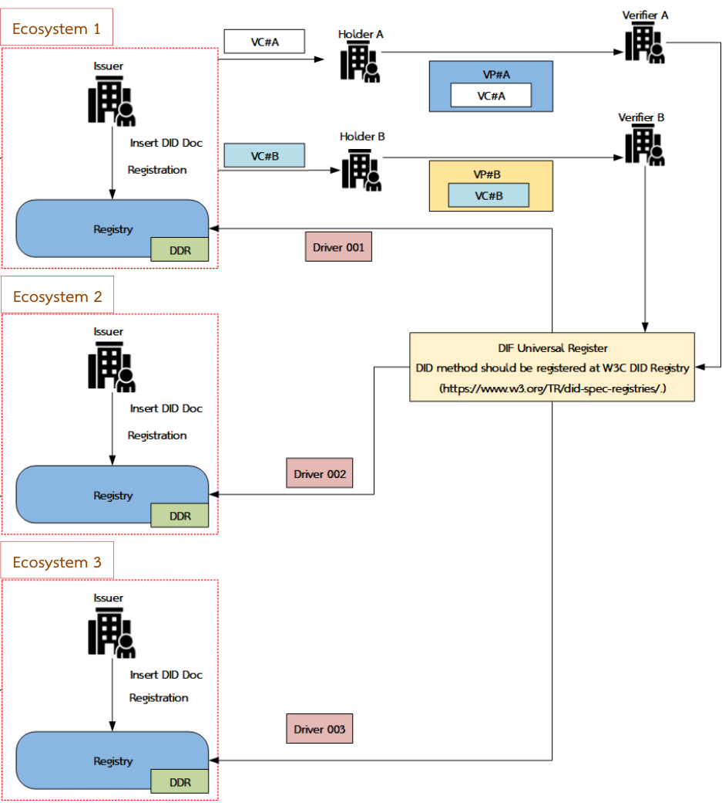
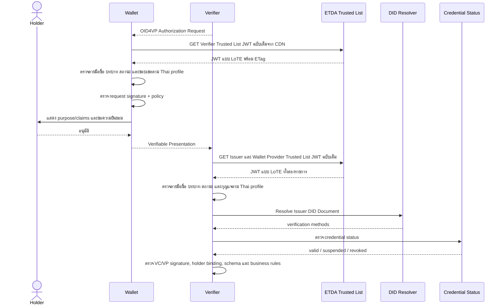

# 7. การทำงานร่วมกันข้ามระบบนิเวศและผลของ Trusted List

{/* METADATA (agent-only — not rendered to readers)
> **สถานะ:** 📄 ส่วนปรับปรุงสำหรับ Thai VC ARF v2.0 (MASA-125)
> **แหล่งข้อมูล:** [Thai-VC-ARF-v1-1.pdf](https://www.etda.or.th/getattachment/Our-Service/Digital-Trusted-services-Infrastructure/VC-and-Digital-Document-Wallet/Information/รายงานทางเทคนค-Thai-VC-ARF-v1-1.pdf) · [ดัชนีเอกสาร ARF](README.md)
> **เวอร์ชัน:** 2.0-draft.2
> **วันที่ปรับปรุง:** 4 สิงหาคม 2569
> **ขอบเขต:** การทำงานร่วมกันระหว่าง Issuer, Wallet และ Verifier ภายในประเทศ รวมถึงเงื่อนไขการเชื่อมโยงกับ EUDI Wallet
> **คำสำคัญเชิงข้อกำหนด:** คำว่า **ต้อง (MUST)**, **ควร (SHOULD)** และ **อาจ (MAY)** ให้ตีความตาม RFC 2119/RFC 8174 [R1]
> **เอกสารที่เกี่ยวข้อง:** [ดัชนีเอกสาร ARF](README.md) · [08-implementation-guidelines.md](08-implementation-guidelines.md) · [09-trust-model-3.md](09-trust-model-3.md)
*/}

---

## 7.0 ภาพรวมการทำงานร่วมกันข้ามระบบนิเวศ (ฐานจากเวอร์ชัน 1.1)

การทำงานร่วมกัน (interoperability) ข้ามระบบนิเวศ (ecosystem) ช่วยให้ผู้ถือเอกสาร (holder) ขอและใช้เอกสารรับรองดิจิทัลจากระบบนิเวศใดก็ได้ตามข้อมูลที่ต้องการ ตัวอย่างตามรูปที่ 27 ประกอบด้วยระบบนิเวศ 3 ระบบ

**รูปที่ 27 การทำงานร่วมกัน (interoperability) ระหว่างระบบนิเวศ**

จากรูปที่ 27 กระบวนการทำงานร่วมกันข้ามระบบนิเวศมีขั้นตอน ดังนี้

1. ผู้ออกเอกสาร (issuer) ในแต่ละระบบนิเวศต้องสร้าง DID Document ในรูปแบบ Legal Person แล้วนำไปลงทะเบียน (register) ในระบบทะเบียนเอกสารรับรอง (registry)
2. ผู้ถือเอกสารร้องขอข้อมูลจากระบบนิเวศใดก็ได้ตามข้อมูลที่ต้องการ โดย VC ที่ได้รับจากผู้ออกเอกสารของแต่ละระบบนิเวศจะถูกจัดเก็บไว้ในกระเป๋าเอกสารดิจิทัลของผู้ถือเอกสาร
3. ผู้ถือเอกสารส่งข้อมูลให้ผู้ตรวจสอบเอกสาร (verifier) โดยต้องจัดทำข้อมูลให้อยู่ในรูปแบบ VP ก่อนเสมอ
4. เมื่อผู้ตรวจสอบเอกสารต้องการตรวจสอบความถูกต้องของข้อมูลที่ได้รับ ต้องมี DID Document ของผู้ออก VC ก่อน จึงเรียกดู DID Document ของผู้ออกเอกสารที่ลงทะเบียนไว้ผ่าน DIF Universal Resolver
5. DIF Universal Resolver ส่งกลับ (return) DID Document ของผู้ออกเอกสารที่ลงทะเบียนไว้ในระบบทะเบียนให้แก่ผู้ตรวจสอบเอกสาร
6. ผู้ตรวจสอบเอกสารนำ DID Document ที่ได้ไปตรวจสอบความถูกต้องของ VC ต่อไป

> **ส่วนขยายเวอร์ชัน 2.0:** หัวข้อ 7.1–7.10 ต่อไปนี้เพิ่มชั้น Trusted List เข้ากับภาพรวมข้างต้น เพื่อกำหนดว่าเอนทิตีใดได้รับการรับรองให้ทำหน้าที่ใด มีสถานะใด และมีขอบเขตเพียงใด โดยใช้ร่วมกับการ resolve DID ตามข้างต้น

---

## 7.1 วัตถุประสงค์

หัวข้อนี้กำหนดผลของ Trusted List ต่อการทำงานร่วมกัน (interoperability) ระหว่างระบบนิเวศ โดยต่อยอดจากแนวทางเดิมที่ Verifier ต้อง resolve DID Document ของ Issuer เพื่อใช้ตรวจลายมือชื่อ VC การมี Trusted List เพิ่มชั้นข้อมูลเชิงธรรมาภิบาลว่าเอนทิตีใดได้รับการรับรองให้ปฏิบัติหน้าที่ใด มีสถานะใด และมีขอบเขตการออกหรือขอข้อมูลเพียงใด

**ข้อเท็จจริง:** OID4VCI 1.0 Final กำหนด protocol สำหรับการออก VC และ OID4VP 1.0 Final กำหนด protocol สำหรับการร้องขอและนำเสนอ Credential แต่มาตรฐานทั้งสองมิได้ทำให้เอนทิตีต่างระบบนิเวศเชื่อถือกันโดยอัตโนมัติ การตัดสินใจด้าน trust ยังคงขึ้นกับ trust framework, policy และ profile ของแต่ละระบบนิเวศ [R2] [R3]

**ข้อวิเคราะห์:** Trusted List เป็นชั้นนโยบายด้าน trust ที่ใช้ร่วมกับ OID4VCI/OID4VP, DID resolution, protocol, schema, การตรวจลายมือชื่อ, สถานะ credential และกฎหมายที่ใช้บังคับ

## 7.2 ผลต่อ ecosystem เมื่อมี Trusted List

เมื่อ สพธอ. เผยแพร่ Trusted List ที่ลงลายมือชื่อดิจิทัลแล้ว ecosystem จะได้รับผลดังต่อไปนี้

1. **การค้นพบ trust anchor ร่วมกัน:** Wallet, Issuer และ Verifier สามารถใช้รายการเดียวกันเพื่อตรวจ role, status, validity, key reference และ policy metadata ของคู่กรณี
2. **Cross-issuer verification:** Verifier สามารถรับ VC จาก Issuer หลายรายได้ หาก Issuer นั้นอยู่ใน Trusted List มี role และสถานะที่ถูกต้อง และได้รับอนุญาตให้ออก credential type ที่นำเสนอ
3. **Cross-verifier presentation:** Wallet สามารถตรวจ Verifier ก่อนส่งข้อมูล และบังคับใช้ขอบเขต purpose/allowed claims ตามข้อมูลที่ Trusted List หรือเอกสารกำกับระบุ เพื่อลดความเสี่ยงจากผู้ตรวจสอบที่ไม่รู้จักหรือขอข้อมูลเกินจำเป็น
4. **ลดการทำ bilateral onboarding ซ้ำในประเทศ:** ผู้เข้าร่วมไม่จำเป็นต้องแลก public key หรือสร้าง allowlist แยกกับทุกคู่กรณี หากทุกฝ่ายยอมรับ governance ของ Trusted List เดียวกัน
5. **เพิกถอนและระงับสิทธิ์จากจุดกำกับร่วม:** การเปลี่ยน status ใน Trusted List ทำให้ทุกระบบที่ refresh ตาม policy สามารถบังคับผลได้อย่างสม่ำเสมอ อย่างไรก็ดี ผลไม่เกิดขึ้นทันทีในระบบที่ยังใช้ cache เก่า
6. **การตรวจสอบย้อนหลัง:** version, issued time และการลงลายมือชื่อของ Trusted List สนับสนุน audit trail ว่าผู้ตรวจใช้ trust state ใด ณ เวลาตัดสินใจ

Trusted List **มิได้รับรองความถูกต้องของเนื้อหา VC ทุกฉบับ** และ **มิได้แทนที่** การตรวจลายมือชื่อ VC/VP, holder binding, validity, credential status, schema และ policy ของ use case

## 7.3 ข้อกำหนดสำหรับการทำงานร่วมกันภายในประเทศ

ผู้เข้าร่วม ecosystem **ต้อง (MUST)** ปฏิบัติดังต่อไปนี้

1. ตรวจลายมือชื่อและความถูกต้องของ Trusted List ก่อนใช้ข้อมูลภายในรายการ
2. ตรวจชนิดบริการจาก `ServiceInformation.ServiceTypeIdentifier` ตรวจสถานะระดับองค์กรและบริการ ช่วงเวลาที่มีผล กุญแจหรือ DID จาก `ServiceDigitalIdentity` และขอบเขตสิทธิ์ตาม Thai profile ที่ประกาศใช้ [research/42](../research/42-trusted-list-lote-jwt-format.md)
3. resolve DID Document และตรวจลายมือชื่อของ VC, VP หรือ request object แยกจากการตรวจ Trusted List
4. ตรวจ credential status และ holder binding ตาม profile ของ credential
5. ปฏิเสธ transaction เมื่อ Trusted List หรือ role หมดอายุ ถูกระงับ หรือถูกเพิกถอน เว้นแต่ governance policy กำหนด exception ที่มีหลักฐานตรวจสอบย้อนหลัง
6. ใช้ OID4VCI 1.0 Final สำหรับ issuance และ OID4VP 1.0 Final สำหรับ presentation ตาม national profile [R2] [R3]

ผู้เข้าร่วม **ควร (SHOULD)** รองรับ Issuer และ Verifier มากกว่าหนึ่งรายโดยไม่ผูกกับ vendor เดียว และ **ควร (SHOULD)** แยกการตัดสินใจ 4 ชั้นให้ชัดเจน ได้แก่ protocol conformance, cryptographic validity, trust authorization และ business acceptance

ผู้เข้าร่วม **อาจ (MAY)** ใช้ Universal Resolver เพื่อรองรับ DID Method หลายชนิด แต่ผลจาก Resolver เพียงอย่างเดียวไม่ถือเป็นหลักฐานว่าเอนทิตีได้รับอนุญาตภายใต้ Trusted List

## 7.4 ลำดับการตรวจสอบข้าม Issuer และ Verifier

ผล `trusted` จาก Trusted List หมายถึงเอนทิตีผ่านเงื่อนไขตาม governance ของรายการ ณ version และเวลาที่ตรวจเท่านั้น มิได้หมายถึง transaction นั้นผ่านทุกเงื่อนไขโดยอัตโนมัติ

## 7.5 การทำงานร่วมกันกับ EUDI Wallet

**ข้อเท็จจริง:** EUDI Architecture and Reference Framework (EUDI ARF) เป็นกรอบสถาปัตยกรรมและ reference framework ของระบบ EUDI Wallet รายงานฉบับนี้ใช้ **EUDI ARF 2.9.0** เป็น baseline ให้สอดคล้องกับบทอื่นของรายงาน ส่วน eIDAS Regulation (EU) 2024/1183 กำหนดกรอบกฎหมายของ European Digital Identity Framework [R5]

**ฉบับใหม่กว่า — ผลกระทบอยู่ระหว่างการทบทวน:** มีการเผยแพร่ EUDI ARF **v3.0.0** เมื่อ 23 กรกฎาคม 2569 (2026-07-23) [R4] ซึ่งใหม่กว่า baseline 2.9.0 ผลกระทบของฉบับนี้อยู่ระหว่างการทบทวนใน QA Gate จึงยังไม่นำมาใช้เป็น baseline ของรายงาน ทั้งนี้ การพิจารณาว่า Trusted List ทำงานร่วมกับ EUDI ได้หรือไม่ ต้องอิงกับฉบับที่ปลายทางประกาศใช้จริง ณ เวลานั้น

**องค์ประกอบใหม่ใน EUDI ARF v3.0.0 ที่อยู่ระหว่างการทบทวนผลกระทบต่อ Trusted List interoperability** [R4]:

- **Trust-anchor retrieval** — กำหนดให้ Wallets, Relying Parties และ Issuers รองรับทั้ง **ETSI TS 119 612 Trusted Lists** และ **ETSI TS 119 602 Lists of Trusted Entities (LoTEs)** สำหรับดึงข้อมูล trust anchor ที่ปลายทาง
- **Relying Party Services** — แนวคิดใหม่ที่เพิ่มบทบาทผู้ให้บริการที่เกี่ยวข้องกับ Relying Party registration ตาม Commission Implementing Regulation (EU) 2025/848
- **Functional Conformance Assessment Framework (FCAF)** — ชุดทดสอบกลางที่เผยแพร่และดูแลที่ `https://conformance.eudi.dev` ผู้ที่อ้าง conformance กับ EUDI ARF **ต้อง (MUST)** อ้างผลทดสอบจากแหล่งนี้เป็นหลักฐาน
- **Alignment with the amending Commission Implementing Regulations** — CIR 2024/2977 (PID/EAA), CIR 2024/2979 (integrity/core functionalities), CIR 2024/2980 (ecosystem notifications), CIR 2024/2982 (protocols/interfaces) และ CIR 2025/848 (Wallet-Relying Party registration)

**ข้อเท็จจริง:** การใช้ OID4VCI/OID4VP 1.0 Final [R2] [R3], SD-JWT VC หรือ DID ที่เหมือนกันช่วยลดความต่างของ protocol และ credential format แต่ **ไม่ทำให้ Thai Trusted List ได้รับการยอมรับใน EUDI ecosystem โดยอัตโนมัติ** เนื่องจาก EUDI trust infrastructure อิงกับ ETSI TS 119 612/602 และ rulebook (PID, mDL, EAA) ที่กำหนดเงื่อนไขของตนเอง

สำหรับการเชื่อมโยงข้ามพรมแดน ผู้ดำเนินการ **ต้อง (MUST)** จัดให้มีองค์ประกอบเพิ่มเติมอย่างน้อยดังนี้

1. **Trust agreement หรือ recognition arrangement:** ระบุคู่ภาคี ขอบเขต credential/use case ระดับ assurance หน้าที่รับผิด ความรับผิดทางกฎหมาย การตรวจประเมิน การเพิกถอน และการระงับข้อพิพาท กรณี EU อ้างอิงคือกระบวนการ third-country recognition ภายใต้ Regulation (EU) 2024/1183 [R5]
2. **Trust mapping:** แปลง role, status, assurance และ policy ของ Thai Trusted List ให้ตรงกับ trust model และ rulebook ที่ปลายทางยอมรับ (เช่น PID Rulebook, mDL Rulebook) [R4]
3. **Technical profile agreement:** ตกลง credential format, protocol profile, cryptographic suites, identifier/client authentication, status mechanism และ schema ให้สอดคล้องกับ Credential Format Profile ที่ EUDI ARF กำหนด
4. **Trusted-list distribution/bridge:** หากปลายทางกำหนดรูปแบบหรือ trust anchor ต่างกัน (เช่น ETSI TS 119 612 XML หรือ LoTEs) **ต้อง (MUST)** มี bridge หรือ dual publication ที่ปลายทางตรวจสอบได้ โดย **ต้อง (MUST NOT)** อ้างว่า bridge เท่ากับ legal recognition
5. **Conformance evidence:** ผลทดสอบ **ต้อง (MUST)** มาจาก Functional Conformance Assessment Framework ที่ EUDI เผยแพร่ที่ `https://conformance.eudi.dev` หรือ pilot ที่ตรวจสอบย้อนกลับได้ ก่อนประกาศรองรับ cross-border
6. **Operational readiness:** ผู้ดูแล **ต้อง (MUST)** จัดให้มี audit, monitoring, SLA และ 24/7 operations ตามระดับความเสี่ยงที่คู่ภาคีกำหนด

**ข้อวิเคราะห์:** Thai Trusted List ตาม [§9](09-trust-model-3.md) อาจทำหน้าที่เป็นฐานข้อมูลต้นทางสำหรับ bridge ไปยัง EUDI trust infrastructure ได้ เพราะมีข้อมูลเอนทิตี role status และ key reference ที่มี governance กำกับ การวิเคราะห์รูปแบบ cross-border ที่เป็นไปได้ (Hybrid · Split TL · Bridge Service) อยู่ใน [`th/research/34-trustlist-domestic-and-crossborder.md`](../research/34-trustlist-domestic-and-crossborder.md) — เอกสารฉบับนี้ไม่คัดลอกผลวิเคราะห์ แต่ใช้เป็นข้อมูลอ้างอิงเชิงสถาปัตยกรรมเท่านั้น การนำไปใช้จริงขึ้นกับข้อตกลง technical profile และ conformance evidence ที่คู่ภาคียอมรับ

**ข้อจำกัด:** หัวข้อนี้กำหนดสถาปัตยกรรม โดยยังไม่มีผลทดสอบ interoperability จริง จึง **ห้าม (MUST NOT)** ใช้ข้อความว่า "รองรับ EUDI" หรือ "ได้รับการรับรองจาก EU" ในเอกสาร UI หรือข้อเสนอใด ๆ จนกว่าจะมีหลักฐานตามข้อ 1–6 ครบถ้วน

## 7.6 สิ่งที่ Trusted List ทำได้และทำไม่ได้

| ประเด็น | Trusted List ทำได้ | Trusted List เพียงอย่างเดียวทำไม่ได้ |
|---|---|---|
| ความเชื่อถือข้าม Issuer | ให้รายการ Issuer ที่ได้รับอนุญาตและสถานะล่าสุดตามรอบ refresh | รับรองว่า VC ทุกฉบับมีข้อมูลถูกต้อง |
| ความเชื่อถือ Verifier | ให้ Wallet ตรวจ identity/role/scope ก่อนเปิดเผยข้อมูล | รับประกันว่า Verifier จะปฏิบัติตาม purpose หลังรับข้อมูล |
| Protocol interoperability | ระบุ protocol/profile ที่รองรับ | ทำให้ implementation ที่ไม่ conform ทำงานร่วมกันได้ |
| DID interoperability | ให้ key reference และ policy สำหรับ DID | ทำให้ทุก DID Method resolve ได้โดยไม่มี driver/resolver |
| Revocation | ระงับหรือเพิกถอนสิทธิ์ระดับ entity/role | แทน credential-level status หรือทำให้ cache เก่ารู้ผลทันที |
| EUDI interoperability | เป็นข้อมูลต้นทางสำหรับ trust mapping/bridge | ก่อให้เกิด EU recognition หรือ cross-border trust โดยอัตโนมัติ |

## 7.7 ข้อจำกัดและการจัดการความเสี่ยง

1. **Cache freshness:** Client **ต้อง (MUST)** ตรวจ `LoTE.ListAndSchemeInformation.NextUpdate` เมื่อเกินกำหนดหรือหมดอายุ **ต้อง (MUST)** ไม่ถือว่าสถานะเดิมยัง active โดยปริยาย [research/42](../research/42-trusted-list-lote-jwt-format.md)
2. **Governance concentration:** การรวม trust decision ไว้ที่ Trusted List ทำให้ signing key และกระบวนการอนุมัติเป็นจุดสำคัญ ผู้ดูแล **ต้อง (MUST)** ใช้ key protection, dual control, audit log และ incident response
3. **Semantic mismatch:** ชื่อ credential เหมือนกันอาจมี schema หรือ assurance ต่างกัน ผู้เข้าร่วม **ต้อง (MUST)** ตรวจ rulebook/schema version ไม่ใช้ชื่อประเภทเพียงอย่างเดียว
4. **Privacy:** รายการสาธารณะ **ต้อง (MUST)** ไม่บรรจุข้อมูลส่วนบุคคลของ Holder และ **ควร (SHOULD)** บรรจุเฉพาะข้อมูลของนิติบุคคล/บริการที่จำเป็นต่อการตัดสินใจ trust
5. **Cross-border overstatement:** เอกสารหรือ UI **ต้อง (MUST NOT)** ระบุว่า “รองรับ EUDI” หรือ “ได้รับการรับรองจาก EU” จนกว่าจะมี trust agreement, technical profile และหลักฐาน conformance ที่เกี่ยวข้อง

## 7.8 Evidence matrix

| ID | ข้ออ้าง/ข้อกำหนด | หลักฐานปฐมภูมิ | สถานะตรวจสอบ | ข้อจำกัด |
|---|---|---|---|---|
| E-01 | OID4VCI กำหนด API สำหรับ issuance | OID4VCI 1.0 Final, Abstract และ metadata/security sections [R2] | ตรวจจาก HTML ต้นฉบับเมื่อ 4 ส.ค. 2569 | ไม่กำหนด Thai governance หรือ cross-border recognition |
| E-02 | OID4VP กำหนด protocol สำหรับ requesting/presenting Credentials และให้ trust framework/policy มีผลต่อการใช้ข้อมูล Verifier | OID4VP 1.0 Final, Abstract และ transaction data/Verifier information text [R3] | ตรวจจาก HTML ต้นฉบับเมื่อ 4 ส.ค. 2569 | ไม่สร้าง trust ระหว่าง ecosystem อัตโนมัติ |
| E-03 | EUDI ARF เป็น reference framework ที่มี release version ชัดเจน และ v3.0.0 เพิ่ม Trust-anchor retrieval สำหรับ Trusted Lists / LoTEs, Relying Party Services, และ Functional Conformance Assessment Framework (FCAF) | EUDI ARF GitHub Releases, release v3.0.0 (`published_at` = 2026-07-23T19:10:17Z) และ release body ระบุองค์ประกอบทั้งสาม [R4] | ตรวจ GitHub Releases API 4 ส.ค. 2569 เวลา 12:xx น. ICT — release JSON เก็บไว้ในแหล่งตรวจของ run นี้ | release ใหม่กว่า baseline 2.9.0 ของรายงาน ผลกระทบอยู่ระหว่างการทบทวน ต้องทำ version impact review ใน QA Gate ก่อนปรับ baseline |
| E-04 | eIDAS 2.0 เป็นกรอบกฎหมาย European Digital Identity Framework | Regulation (EU) 2024/1183, OJ L, 30.4.2024 [R5] | อ้างอิง primary legal act; endpoint EUR-Lex ตอบ 202/no body ในรอบตรวจนี้ | ไม่ตีความว่า third country ได้ recognition อัตโนมัติ |
| E-05 | DID resolution ให้ verification material แต่ไม่ให้ governance authorization | W3C DID Core 1.0, DID Resolution/DID Document [R6] | ตรวจตาม W3C Recommendation | ต้องใช้ร่วมกับ Trusted List และ policy |
| E-06 | คำ MUST/SHOULD/MAY ใช้ในความหมาย normative | RFC 2119 และ RFC 8174 [R1] | ตรวจตาม RFC published | คำไทยในเอกสารใส่คำอังกฤษกำกับเพื่อลดความกำกวม |

## 7.9 สมมติฐานและช่องว่างที่ต้องติดตาม

**สมมติฐาน:** Thai VC ARF v2.0 ใช้ ETDA-signed Trusted List เป็น national trust anchor สำหรับ domestic ecosystem และผู้เข้าร่วมยอมรับ governance policy ฉบับเดียวกัน

**ช่องว่างที่ต้องติดตาม:**

- รายงานฉบับนี้ใช้ EUDI ARF **2.9.0** เป็น baseline ของทั้งเล่ม ส่วน release **v3.0.0** (23 กรกฎาคม 2569 / 2026-07-23) [R4] เป็นฉบับใหม่กว่า ซึ่งรวมองค์ประกอบใหม่ (Trust-anchor retrieval, Relying Party Services, FCAF) ที่อาจกระทบ requirements ด้าน trust list และ conformance ผลกระทบของ v3.0.0 อยู่ระหว่างการทบทวน โดย QA Gate **ควร (SHOULD)** ตรวจ breaking changes ก่อนปรับ baseline ในฉบับถัดไป
- ยังไม่มี trust agreement/recognition arrangement ระหว่าง Thai ecosystem กับ EU Member State ที่ระบุในขอบเขตงานนี้ จึง **ต้อง (MUST NOT)** อ้างว่าเปิดใช้งาน cross-border ได้แล้ว กรณี EU ให้อิงกระบวนการ third-country recognition ภายใต้ Regulation (EU) 2024/1183 [R5]
- ยังไม่มีผล conformance suite (FCAF) หรือ cross-border pilot ที่แนบกับหัวข้อนี้ จึงใช้หัวข้อนี้เป็นข้อกำหนดเชิงสถาปัตยกรรม เมื่อมี conformance suite พร้อมใช้งาน **ควร (SHOULD)** เก็บผลทดสอบจากแหล่งกลาง (เช่น `https://conformance.eudi.dev`) ไว้ในภาคผนวกของฉบับถัดไป
- การวิเคราะห์รูปแบบ cross-border ที่เป็นไปได้ (Hybrid · Split TL · Bridge Service) อยู่ใน [`th/research/34-trustlist-domestic-and-crossborder.md`](../research/34-trustlist-domestic-and-crossborder.md) เอกสารฉบับนี้ใช้อ้างอิงผลวิเคราะห์ต้นทุนและความเสี่ยงจากงานวิจัยดังกล่าว

{/* METADATA (agent-only — not rendered to readers)
## 7.10 แหล่งอ้างอิง

- **[R1]** IETF, *Key words for use in RFCs to Indicate Requirement Levels*, RFC 2119, March 1997; and *Ambiguity of Uppercase vs Lowercase in RFC 2119 Key Words*, RFC 8174, May 2017. https://www.rfc-editor.org/rfc/rfc2119 และ https://www.rfc-editor.org/rfc/rfc8174 — เข้าถึง 4 สิงหาคม 2569 (เปลี่ยนเส้นทางเป็น `https://www.rfc-editor.org/info/rfc2119/` และ `info/rfc8174/`)
- **[R2]** OpenID Foundation, *OpenID for Verifiable Credential Issuance 1.0*, Final, 16 September 2025. https://openid.net/specs/openid-4-verifiable-credential-issuance-1_0.html — เข้าถึงและตรวจ HTML ต้นฉบับ 4 สิงหาคม 2569; Abstract = "This specification defines an API for the issuance of Verifiable Credentials."
- **[R3]** OpenID Foundation, *OpenID for Verifiable Presentations 1.0*, Final, 9 July 2025. https://openid.net/specs/openid-4-verifiable-presentations-1_0.html — เข้าถึงและตรวจ HTML ต้นฉบับ 4 สิงหาคม 2569; Abstract = "This specification defines a protocol for requesting and presenting Credentials."
- **[R4]** European Commission / EUDI Wallet Consortium, *EUDI Wallet Architecture and Reference Framework*, release v3.0.0, `published_at` = 2026-07-23T19:10:17Z. https://github.com/eu-digital-identity-wallet/eudi-doc-architecture-and-reference-framework/releases/tag/v3.0.0 — เข้าถึงผ่าน GitHub Releases API 4 สิงหาคม 2569; online: https://eudi.dev
- **[R5]** European Parliament and Council, *Regulation (EU) 2024/1183 amending Regulation (EU) No 910/2014 as regards establishing the European Digital Identity Framework*, OJ L, 30 April 2024. https://eur-lex.europa.eu/eli/reg/2024/1183/oj — เข้าถึง 4 สิงหาคม 2569 (endpoint EUR-Lex ตอบ HTTP 202 พร้อม body ว่างในรอบตรวจสำหรับ content-fetch)
- **[R6]** W3C, *Decentralized Identifiers (DIDs) v1.0*, W3C Recommendation, 19 July 2022. https://www.w3.org/TR/did-core/ — เข้าถึง 4 สิงหาคม 2569

**แหล่งอ้างอิงที่เกี่ยวข้องในระบบนิเวศ (ไม่ได้ใช้เป็นหลักฐานหลักของข้อกำหนดในหัวข้อนี้):**

- Thai Trusted List cross-border scenarios analysis: [`th/research/34-trustlist-domestic-and-crossborder.md`](../research/34-trustlist-domestic-and-crossborder.md)
- EUDI ARF v2.8+ alignment background: [`th/research/30-eu-aligned-trust-model-adaptation.md`](../research/30-eu-aligned-trust-model-adaptation.md)
- PKI/VC security gap context: [`th/research/31-security-gaps-pki-crypto-vs-vc.md`](../research/31-security-gaps-pki-crypto-vs-vc.md)
- EUDI Conformance Assessment: https://conformance.eudi.dev — ยังไม่มีผลทดสอบระบบจริงที่แนบกับหัวข้อนี้

---
*/}

**การนำทาง:** [⬅️ บทที่ 6.5 — กลไกการสร้างความน่าเชื่อถือ (Trust-Building Mechanism)](06.5-trust-building-mechanism.md) · [⬆️ สารบัญ ARF](README.md) · [บทที่ 8 — Implementation Guidelines (OID4VCI / OID4VP) ➡️](08-implementation-guidelines.md)
