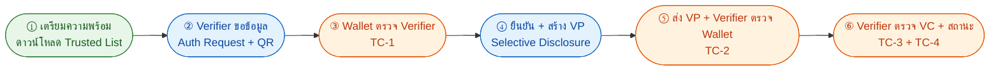

# 8. Implementation Guidelines — OID4VCI / OID4VP และแนวทางการนำไปใช้งาน

{/* METADATA (agent-only — not rendered to readers)
> **สถานะ:** Reference — เอกสารแปลงจาก PDF ต้นฉบับของ สพธอ. (Thai VC ARF v1.1, มกราคม 2568) และปรับปรุงเพิ่มเติมจากเอกสารใน trust-guide (th/public-site/vcdoc/docs/trust-guide) ภายใต้ข้อกำหนด MASA-158
> **เวอร์ชันเอกสาร:** v2.1.2 (2026-08-07) — ตัดแผนภาพ Trust Check (TC-1 ถึง TC-4) ฉบับย่อยออก และอธิบายกลไกการตรวจสอบด้วยข้อความเชิงบรรยายใน §8.4 เนื่องจากแผนภาพฉบับย่อยก่อให้เกิดความสับสนแก่ผู้อ่าน และเพิ่มป้ายกำกับ TC-1 ถึง TC-4 บนผังขั้นตอนภาพรวมของทั้ง OID4VCI (§8.2.2) และ OID4VP (§8.3.2) พร้อมตารางจับคู่ช่วง ↔ TC (MASA-165)
> **เวอร์ชัน:** v2.1 (Implementation Guidelines)
> **วันที่:** 7 สิงหาคม 2569
> **แหล่งข้อมูล:** [Thai-VC-ARF-v1-1.pdf](https://www.etda.or.th/getattachment/Our-Service/Digital-Trusted-services-Infrastructure/VC-and-Digital-Document-Wallet/Information/รายงานทางเทคนค-Thai-VC-ARF-v1-1.pdf) · trust-guide/03-issuance-flow/ · trust-guide/04-presentation-flow/ · [REF-MASA-158][REF-MASA-165]
> **เอกสารที่เกี่ยวข้อง:** [ดัชนีเอกสาร ARF](README.md) · [02-definitions.md](02-definitions.md) · [06-did-methodologies.md](06-did-methodologies.md) · [07-cross-ecosystem-interoperability.md](07-cross-ecosystem-interoperability.md) · [08.1 — OID4VCI Full Flow](08.1-issuance-full-flow-detail.md) · [08.2 — OID4VP Full Flow](08.2-oid4vp-full-flow-detail.md) · [09-trust-model-3.md](09-trust-model-3.md) · [15-appendix.md](15-appendix.md) · [16-bibliography.md](16-bibliography.md)
*/}

---

## 8.0. วัตถุประสงค์และขอบเขต

ข้อแนะนำเบื้องต้นการพัฒนาระบบจะช่วยให้การให้บริการและการแลกเปลี่ยนเอกสารรับรองดิจิทัลมีความมั่นคงปลอดภัย และช่วยคุ้มครองข้อมูลส่วนบุคคลของเอนทิตีต่าง ๆ ที่เกี่ยวข้อง รวมถึงช่วยจำกัดความซับซ้อนของแนวทางการพัฒนาเชิงเทคนิค (technical solution) เพื่อให้กระเป๋าเอกสารดิจิทัล (Document Wallet) และเอกสารรับรอง (Verifiable Credential — VC) สามารถทำงานร่วมกันได้

บทนี้ระบุข้อกำหนดเชิงเทคนิค (MUST / SHOULD / MAY) สำหรับการออก VC และการแสดง VP โดยใช้โปรโตคอลมาตรฐาน OID4VCI 1.0 และ OID4VP 1.0 ของ OpenID Foundation พร้อมแผนภาพผังขั้นตอนภาพรวม (Overview Flow) และอธิบายการทำงานร่วมกับรายชื่อผู้ที่ได้รับความเชื่อถือ (ETDA Trusted List) และการ resolve DID (DID Resolution) ในกรณีต่าง ๆ

{/* METADATA (agent-only — not rendered to readers)
> **ฐานที่มาของบท:** เนื้อหาบทนี้ปรับปรุงจากฐานเวอร์ชัน 1.1 ของรายงาน Thai VC ARF [REF-ARF-V11-SRC] ร่วมกับแผนภาพฉบับสมบูรณ์จากเอกสาร trust-guide (th/public-site/vcdoc/docs/trust-guide) ภายใต้ข้อกำหนดงาน MASA-158 [REF-MASA-158] แผนภาพ Sequence ฉบับสมบูรณ์และรายละเอียดทางเทคนิคระดับ field-by-field ของทั้ง OID4VCI และ OID4VP อยู่ใน [08.1-issuance-full-flow-detail.md](08.1-issuance-full-flow-detail.md) และ [08.2-oid4vp-full-flow-detail.md](08.2-oid4vp-full-flow-detail.md) ตามลำดับ กลไกการตรวจสอบความน่าเชื่อถือ 4 จุดตรวจ (TC-1 ถึง TC-4) อธิบายด้วยข้อความเชิงบรรยายใน §8.4
*/}

{/* METADATA (agent-only — not rendered to readers)
> **ศัพท์เทคนิค:** คงคำภาษาอังกฤษตามมาตรฐาน (เช่น Verifiable Credential — VC, Verifiable Presentation — VP, Issuer, Verifier, Holder, Trusted List, Status List) เพื่อความชัดเจนและสอดคล้องกับเอกสารอ้างอิงสากล [REF-OID4VCI][REF-OID4VP][REF-SDJWT][REF-TSL][REF-DID-CORE]
*/}

---

## 8.1. องค์ประกอบพื้นฐาน

### 8.1.1. กรณีศึกษา

รายงานฉบับนี้ใช้กรณีศึกษา การออกใบประมวลผลการศึกษา (Transcript) ของสถาบันการศึกษาในประเทศไทย เป็นตัวอย่างประกอบแผนภาพและคำอธิบาย เพื่อให้ผู้อ่านเห็นภาพการนำ OID4VCI/OID4VP ไปใช้งานจริง

### 8.1.2. ข้อกำหนดทางเทคนิค

ตารางนี้สรุปโปรไฟล์การทำงานร่วมกันจากบทต่าง ๆ ของ Thai VC ARF โดยใช้คำ MUST เฉพาะข้อที่บทต้นทางกำหนดไว้:

| หัวข้อ | ข้อกำหนดทางเทคนิค | บทใน Thai VC ARF |
|--------|---------------------|---------------|
| รูปแบบเอกสารรับรอง | รองรับทั้ง JSON-LD VC ตาม W3C VC Data Model (รูปแบบเดิม) และ IETF SD-JWT VC (`dc+sd-jwt`); ตัวอย่างกระแสงานในบทนี้ใช้ `dc+sd-jwt` | [บทที่ 0](00-minimal-interoperability-reference.md), [บทที่ 5](05-standards-and-compliance.md) |
| การออกเอกสาร | MUST ใช้ OID4VCI 1.0 Final; กระแสงานในรายงานใช้ pre-authorized code ร่วมกับ `tx_code` | [บทที่ 5](05-standards-and-compliance.md), [ภาคผนวก 8.1](08.1-issuance-full-flow-detail.md) |
| การแสดงเอกสาร | MUST ใช้ OID4VP 1.0 Final พร้อม DCQL; ผู้ตรวจส่ง Request Object ที่ลงลายมือชื่อแล้วให้กระเป๋าตรวจสอบ | [บทที่ 5](05-standards-and-compliance.md), [ภาคผนวก 8.2](08.2-oid4vp-full-flow-detail.md) |
| ชุดอัลกอริทึม | Wallet MUST รองรับทั้ง `EdDSA` (Ed25519) และ `ES256` (P-256); Issuer และ Verifier MUST ยอมรับทั้งสองชุด โดย Ed25519 เป็นตัวเลือกที่แนะนำเมื่อฮาร์ดแวร์รองรับ | [บทที่ 11](11-cryptographic-suites.md) |
| การตรวจสถานะเอกสาร | MUST ใช้ IETF Token Status List (`statuslist+jwt`) สำหรับสถานะและการเพิกถอน VC | [บทที่ 13](13-vc-status-and-revocation.md) |
| การ resolve DID | `did:web` ดึง DID Document ผ่าน HTTPS; `did:jwk` มีกุญแจอยู่ใน DID; `did:ndid` และ custom DID method ใช้ ETDA Trust Gateway/Universal Resolver | [บทที่ 6](06-did-methodologies.md) |
| Trusted List | ดึงรายการที่ สพธอ. ลงลายมือชื่อผ่าน CDN และ MUST ตรวจลายมือชื่อก่อนใช้ข้อมูลบทบาท กุญแจ และสถานะ | [บทที่ 6.5](06.5-trust-building-mechanism.md), [บทที่ 12](12-key-management-and-trustlist-deployment.md) |
| หลักฐานจากกระเป๋า | ในกระแสงานที่ใช้ WUA กระเป๋าส่ง WIA และ KA; ผู้ออกตรวจหลักฐานและสถานะของ Wallet Provider ก่อนออก VC | [บทที่ 10](10-wallet-unit-attestation.md), [ภาคผนวก 8.1](08.1-issuance-full-flow-detail.md) |

{/* METADATA (agent-only — not rendered to readers)
> **ฐานจากเวอร์ชัน 1.1 และการปรับปรุงในเวอร์ชัน 2.0:** เวอร์ชัน 1.1 ใช้ JSON-LD VC ตาม W3C VC Data Model ซึ่งยังรองรับอยู่ เวอร์ชัน 2.0 เพิ่ม SD-JWT VC (`dc+sd-jwt`) และปรับตัวอย่างกระแสงานเป็น OID4VCI 1.0 Final กับ OID4VP 1.0 Final (พร้อม DCQL) บทที่ 11 ระบุการรองรับทั้ง EdDSA และ ES256 รายละเอียดการเปลี่ยนแปลงดูได้ที่ [ภาคผนวก ข — บันทึกการเปลี่ยนแปลง v1.1→v2.0](15-appendix.md)
*/}

{/* METADATA (agent-only — not rendered to readers)
> **หมายเหตุการเปลี่ยนชื่อ WTE → WUA:** เอกสารนี้ใช้คำว่า **WUA (Wallet Unit Attestation)** ตาม EUDI ARF 2.9.0 [REF-ARF] แทนคำว่า WTE เดิม — Wallet ของรัฐบาลไทยที่เข้าร่วม Trust Framework ต้องส่ง WUA ให้ Issuer/Verifier ตามที่ Trust Framework กำหนด หากไม่ส่งจะถือว่าไม่ผ่านจุดตรวจ TC-2 (กลไกอธิบายใน §8.4) บทนี้กล่าวถึง WUA เฉพาะที่ปรากฏในกระแสงาน OID4VCI/OID4VP ส่วนแนวคิด นิยาม และการนำ WUA มาใช้ตามมาตรฐาน EUDI ดูรายละเอียดที่ [บทที่ 10 — Wallet Unit Attestation (WUA)](10-wallet-unit-attestation.md)
*/}

### 8.1.3. บทบาทและผู้มีส่วนได้ส่วนเสีย

การแลกเปลี่ยน VC และ VP ประกอบด้วย 4 บทบาทหลัก MUST เข้าใจร่วมกันดังนี้:

| บทบาท | ความหมาย | ตัวอย่างในบริบทไทย |
|------|---------|----------------|
| **Issuer** | ผู้ออก VC เป็นผู้รับผิดชอบในการลงนามและเผยแพร่ Status List | สถาบันการศึกษา, กรมการปกครอง (DOPA), กรมการขนส่งทางบก (DLT) |
| **Holder (ผู้ถือ)** | ผู้ครอบครอง VC ในกระเป๋าเอกสารดิจิทัล (Document Wallet) และเป็นผู้สร้าง VP เมื่อต้องแสดง | ผู้ใช้งาน Document Wallet |
| **Verifier** | ผู้ขอและตรวจสอบ VP จากผู้ถือ ตามวัตถุประสงค์ที่ลงทะเบียนไว้กับ สพธอ. | สถานพยาบาล, สถาบันการเงิน, หน่วยงานภาครัฐ |
| **Wallet Provider (WP)** | ผู้พัฒนาและดูแลกระเป๋าเอกสารดิจิทัล ออก Wallet Unit Attestation (WUA) เพื่อรับรองแอป | สำนักงานพัฒนารัฐบาลดิจิทัล (DGA), ผู้ให้บริการกระเป๋าเอกสารเอกชน |

นอกจาก 4 บทบาทหลักแล้ว ยังมี **ETDA Trusted List (TL)** ทำหน้าที่:

1. **ควบคุมการเข้าถึง (access control)** — ในช่องทาง API key สำหรับการดึง Trusted List ผ่าน **ETDA Trust Gateway** ใช้สำหรับ `did:ndid` หรือ custom DID method เท่านั้น
2. **ควบคุมความเชื่อถือ (trust anchor)** — Trusted List ที่ดึงจาก **CDN** (โดยไม่ต้องใช้ API key) มีลายมือชื่อดิจิทัล (Detached JWS) ของ สพธอ. ผู้ตรวจ MUST verify ลายมือชื่อทุกครั้งที่ดึงจาก CDN

> รายละเอียดเกี่ยวกับ Trusted List schema, การใช้งาน API key กับ CDN และ Universal Resolver ดูได้ที่ [§9 Trust Model 3](09-trust-model-3.md) และ [draft/trust-framework-template.md §5](../draft/trust-framework-template.md) [REF-DRAFT-TFT]

### 8.1.4. รหัสสีในแผนภาพ

แผนภาพ Mermaid ในบทนี้ใช้สีเพื่อแยกประเภทของขั้นตอนอย่างชัดเจน:

| สี | ความหมาย | ผู้รับผิดชอบ |
|----|---------|------------|
| **เขียว** | การดาวน์โหลด Trusted List (เกิดก่อนผู้ใช้เริ่ม) | สพธอ. (ETDA) |
| **น้ำเงิน** | ขั้นตอนตามมาตรฐาน OID4VCI/OID4VP สากล | OpenID Foundation |
| **ส้ม** | จุดตรวจสอบความน่าเชื่อถือ (TC-1 ถึง TC-4) | Trust Framework (สพธอ.) |

---

## 8.2. การออกเอกสารรับรองดิจิทัล (OID4VCI) — Flow การรับเอกสารรับรอง

{/* METADATA (agent-only — not rendered to readers)
> **แหล่งข้อมูล:** trust-guide/03-issuance-flow/ · [08.1-issuance-full-flow-detail.md](08.1-issuance-full-flow-detail.md) · [REF-OID4VCI]
*/}

### 8.2.1. สถานการณ์

ผู้ใช้ต้องการรับเอกสารรับรองดิจิทัล (เช่น ใบประมวลผลการศึกษา Transcript) ไว้ในกระเป๋าเอกสารดิจิทัล โดยไม่ต้องเดินทางไปสถาบันการศึกษา

### 8.2.2. ผังขั้นตอนภาพรวม — Flow การรับเอกสารรับรอง (OID4VCI)

แผนภาพนี้แสดงภาพรวมทั้งกระบวนการ แบ่งเป็น 5 ช่วงหลัก (1) เตรียมความพร้อม (2) การรับคำเชิญและการค้นหาข้อมูลผู้ออกบัตร (3) การตรวจสอบความน่าเชื่อถือก่อนยืนยันตัวตน (4) การขอ Token และ Credential และ (5) การตรวจสอบก่อนบันทึก จุดตรวจความน่าเชื่อถือของระบบ Trust Framework (TC-1 ถึง TC-4) ที่ปรากฏใน Flow นี้มี 2 จุด คือ **ช่วงที่ 3 ตรวจสอบ Issuer ก่อนยืนยันตัวตน = TC-3 (รอบแรก)** และ **ช่วงที่ 5 ตรวจสอบ VC และสถานะก่อนบันทึก = TC-3 (รอบที่สอง) + TC-4** (กลไกแต่ละจุดอธิบายใน §8.4)

> **ตารางจับคู่ช่วง ↔ TC (OID4VCI):**

| ช่วง | ชื่อช่วง | จุดตรวจ TC ที่ทำงาน | ผู้ตรวจ | ผู้ถูกตรวจ | อธิบายกลไก |
|:----:|---------|:-----------------:|--------|----------|------------|
| ① | เตรียมความพร้อม | — | — | — | ดาวน์โหลด Trusted List (CDN + ตรวจ Detached JWS) และ WUA ของ Wallet เอง — ยังไม่มีปฏิสัมพันธ์กับคู่กรณี จึงไม่มี TC |
| ② | รับคำเชิญ + ค้นหาข้อมูล | — | — | — | Credential Offer, Issuer Discovery, /.well-known/openid-credential-issuer เป็นมาตรฐาน OID4VCI ล้วน ยังไม่มีการตรวจสอบความน่าเชื่อถือของ Issuer ในระดับ Trust Framework |
| ③ | ตรวจ Issuer ก่อนยืนยันตัวตน | **TC-3 (รอบแรก)** | Wallet (ฝั่งผู้ถือ) | Issuer | Wallet ตรวจ Credential Issuer Metadata เทียบกับ `issuer_entries` ใน Trusted List ก่อนขอ OTP/ยืนยันตัวตน เพื่อไม่ให้ข้อมูลยืนยันตัวตนรั่วไปยัง Issuer ที่ไม่ผ่านการรับรอง (รายละเอียด §8.4.3) |
| ④ | Token + Credential | — | — | — | Authorization Code, Token Endpoint, Credential Endpoint เป็น OID4VCI มาตรฐาน — การตรวจสอบด้านความน่าเชื่อถือเกิดกับตัว VC ที่ส่งกลับมาในช่วง ⑤ |
| ⑤ | ตรวจ VC + สถานะก่อนบันทึก | **TC-3 (รอบที่สอง) + TC-4** | Wallet (ฝั่งผู้ถือ) | Issuer + Status List | (1) TC-3 รอบที่สอง: ตรวจ SD-JWT VC ฉบับสมบูรณ์ — claims, iss, jti, ลายมือชื่อด้วย PK_iss, validFrom/Until, disclosures (รายละเอียด §8.4.3) (2) TC-4: ดึงและตรวจ Status List JWT เพื่อยืนยันว่า VC ยังไม่ถูกยกเลิก/ระงับ (รายละเอียด §8.4.4) |

> **หมายเหตุ (TC-2):** ใน OID4VCI Flow นี้ **TC-2 (ตรวจ Wallet) ทำงานฝั่ง Issuer** ไม่ได้แสดงเป็น node แยกในภาพรวมนี้ เนื่องจากผู้ตรวจคือ Issuer ซึ่งเป็นฝั่งตรงข้ามกับผู้ถือที่ผู้อ่านมองตามภาพ flow กลไก TC-2 ใน OID4VCI อธิบายใน §8.4.2 และรายละเอียดเชิงลำดับขั้นอยู่ใน [ภาคผนวก 8.1](08.1-issuance-full-flow-detail.md)

> **หมายเหตุ:** แผนภาพนี้เป็นผังขั้นตอนภาพรวมฉบับย่อ (oversimplified overview) เพื่อให้ผู้อ่านเห็นลำดับกระบวนการโดยรวม หากต้องการทำความเข้าใจขั้นตอน คำขอ-คำตอบ และการตรวจสอบความน่าเชื่อถือในรายละเอียด ให้ศึกษาจาก **[ภาคผนวก 8.1 — OID4VCI Full Flow ทางเทคนิคโดยละเอียด](08.1-issuance-full-flow-detail.md)** ซึ่งประกอบด้วยแผนภาพ Sequence ฉบับสมบูรณ์ คำอธิบายระดับ field-by-field และนโยบาย DPoP แยกตามระดับ IAL/AAL

### 8.2.3. แผนภาพ Sequence ฉบับสมบูรณ์และนโยบาย DPoP

กระบวนการออกเอกสารรับรองดิจิทัลตามมาตรฐาน OID4VCI ฉบับสมบูรณ์ประกอบด้วยทุกขั้นตอน ตั้งแต่การเตรียมระบบ (SETUP) การออกคำเชิญ (STEP 1) การค้นหาข้อมูลผู้ออกเอกสาร (STEP 2) การตรวจสอบความน่าเชื่อถือ (STEP 2.5) การยืนยันตัวตน (STEP 3) การขอ Token และ Credential (STEP 4–5) การออกเอกสาร (STEP 6) และการแจ้งเตือน (STEP 7) รวมถึงการตรวจสอบความสดใหม่ของ Trusted List (Freshness Check) การใช้กลไก DPoP (Demonstrating Proof of Possession — RFC 9449) สำหรับ IAL2.3 ขึ้นไป และการออกเอกสารแบบทันที (Immediate Issuance) หรือแบบรอ (Deferred Issuance)

รายละเอียดของแผนภาพ Sequence ฉบับสมบูรณ์ พร้อมคำอธิบายระดับ field-by-field และนโยบาย DPoP แยกตามระดับ IAL/AAL อยู่ใน **[ภาคผนวกของบทที่ 8 — OID4VCI Full Flow ทางเทคนิคโดยละเอียด](08.1-issuance-full-flow-detail.md)**

---

## 8.3. การแสดงและตรวจสอบเอกสารรับรองดิจิทัล (OID4VP) — Flow การแสดงเอกสารรับรอง

{/* METADATA (agent-only — not rendered to readers)
> **แหล่งข้อมูล:** trust-guide/04-presentation-flow/ · [08.2-oid4vp-full-flow-detail.md](08.2-oid4vp-full-flow-detail.md) · [REF-OID4VP]
*/}

### 8.3.1. สถานการณ์

ผู้ใช้ต้องการแสดงเอกสารรับรองดิจิทัล เช่น ใบประมวลผลการศึกษา Transcript ให้หน่วยงานที่ขอตรวจสอบ (เช่น สถานศึกษาปลายทาง หรือนายจ้าง) โดยเปิดเผยเฉพาะข้อมูลที่จำเป็น (Selective Disclosure)

### 8.3.2. ผังขั้นตอนภาพรวม — Flow การแสดงเอกสารรับรอง (OID4VP)

แผนภาพนี้แสดงภาพรวมทั้งกระบวนการ แบ่งเป็น 6 ช่วงหลัก (1) เตรียมความพร้อม (2) Verifier ขอข้อมูล (3) Wallet ตรวจ Verifier (4) ยืนยันและสร้าง VP (5) ส่ง VP และตรวจ Wallet และ (6) Verifier ตรวจ VC และสถานะ จุดตรวจความน่าเชื่อถือของระบบ Trust Framework (TC-1 ถึง TC-4) ปรากฏใน Flow นี้ครบทั้ง 4 จุด ได้แก่ **ช่วงที่ 3 Wallet ตรวจ Verifier = TC-1**, **ช่วงที่ 5 Verifier ตรวจ Wallet = TC-2**, **ช่วงที่ 6 Verifier ตรวจ VC = TC-3**, และ **ช่วงที่ 6 Verifier ตรวจสถานะ VC = TC-4** (กลไกแต่ละจุดอธิบายใน §8.4)

> **ตารางจับคู่ช่วง ↔ TC (OID4VP):**

| ช่วง | ชื่อช่วง | จุดตรวจ TC ที่ทำงาน | ผู้ตรวจ | ผู้ถูกตรวจ | อธิบายกลไก |
|:----:|---------|:-----------------:|--------|----------|------------|
| ① | เตรียมความพร้อม | — | — | — | Wallet/Verifier ดาวน์โหลด Trusted List (CDN + ตรวจ Detached JWS) — ยังไม่มีปฏิสัมพันธ์ระหว่างคู่กรณี จึงไม่มี TC |
| ② | Verifier ขอข้อมูล | — | — | — | Verifier สร้าง Authorization Request, Request Object (JWS), แสดง QR/ deep link ตาม OID4VP มาตรฐาน — การยืนยันตัวตนของ Verifier จะเกิดในช่วง ③ |
| ③ | Wallet ตรวจ Verifier | **TC-1** | Wallet (ฝั่งผู้ถือ) | Verifier | ด่านสำคัญที่สุดของฝั่ง Wallet — ก่อนยินยอมให้ข้อมูล Wallet ตรวจ Trusted List, ตรวจลายมือชื่อ Request Object, ตรวจ scope กับ `allowed_attributes`/`allowed_purposes` ของ Verifier (รายละเอียด §8.4.1) |
| ④ | ยืนยัน + สร้าง VP | — | — | — | แสดง Consent UI ให้ผู้ใช้กดยินยอม, จับคู่ Disclosure, สร้าง VP ตาม DCQL เป็น OID4VP มาตรฐาน — ยังไม่มีการตรวจสอบข้ามฝั่งในระดับ Trust Framework |
| ⑤ | ส่ง VP + ตรวจ Wallet | **TC-2** | Verifier | Wallet (WIA) | Verifier ตรวจ Wallet Instance Attestation: iss/PK_wp ใน Trusted List, ลายมือชื่อ WIA, WIA-PoP, ป้องกัน replay ด้วย jti (รายละเอียด §8.4.2) |
| ⑥ | Verifier ตรวจ VC + สถานะ | **TC-3 + TC-4** | Verifier | Issuer + Status List | (1) TC-3: ตรวจ SD-JWT VC ใน `vp_token` — iss/jti, ดึง PK_iss ผ่าน DID Resolution, ตรวจลายมือชื่อ, validFrom/Until, disclosures ตรงกับ DCQL (รายละเอียด §8.4.3) (2) TC-4: ดึงและตรวจ Status List JWT เพื่อยืนยันว่า VC ยังไม่ถูกยกเลิก/ระงับ (รายละเอียด §8.4.4) |

> **หมายเหตุ:** แผนภาพนี้เป็นผังขั้นตอนภาพรวมฉบับย่อ (oversimplified overview) เพื่อให้ผู้อ่านเห็นลำดับกระบวนการโดยรวม หากต้องการทำความเข้าใจขั้นตอน คำขอ-คำตอบ และการตรวจสอบความน่าเชื่อถือในรายละเอียด ให้ศึกษาจาก **[ภาคผนวก 8.2 — OID4VP Full Flow ทางเทคนิคโดยละเอียด](08.2-oid4vp-full-flow-detail.md)** ซึ่งประกอบด้วยแผนภาพ Sequence ฉบับสมบูรณ์ คำอธิบายระดับ field-by-field และสรุปจุดตรวจ L1–L7

### 8.3.3. แผนภาพ Sequence ฉบับสมบูรณ์ — OID4VP

กระบวนการแสดงและตรวจสอบเอกสารสำแดงดิจิทัลตามมาตรฐาน OID4VP ฉบับสมบูรณ์ประกอบด้วยทุกขั้นตอน ตั้งแต่การเตรียมระบบ (SETUP) การสร้างคำขอ (Step 1) การโอนข้ามอุปกรณ์ (Step 2) การดึง Request Object (Step 2.5) การตรวจสอบผู้ตรวจสอบเอกสาร การจับคู่ข้อมูลในเครื่องและการขอความยินยอม (Step 3) การสร้างเอกสารสำแดงและ Proof of Possession (Step 4) การส่งคำตอบ (Step 5) และการตรวจสอบฝั่งผู้ตรวจสอบเอกสาร (Step 6) ซึ่งรวมถึงการตรวจสอบผู้ให้บริการกระเป๋า การผูกผู้ถือเอกสาร (KB-JWT) การตรวจสอบผู้ออกเอกสาร และการตรวจสอบสถานะเอกสาร

รายละเอียดของแผนภาพ Sequence ฉบับสมบูรณ์ พร้อมคำอธิบายระดับ field-by-field และสรุปจุดตรวจ L1–L7 อยู่ใน **[ภาคผนวกของบทที่ 8 — OID4VP Full Flow ทางเทคนิคโดยละเอียด](08.2-oid4vp-full-flow-detail.md)**

---

## 8.4. กลไกการตรวจสอบความน่าเชื่อถือ 4 จุดตรวจ (TC-1 ถึง TC-4)

ทั้ง 2 กระบวนการ (OID4VCI และ OID4VP) ใช้ชุดจุดตรวจเดียวกัน ต่างกันที่ผู้ดำเนินการตรวจและผู้ถูกตรวจ บทนี้อธิบายกลไกด้วยข้อความเชิงบรรยายเพื่อให้ผู้อ่านเข้าใจการทำงานของแต่ละจุดตรวจ โดยไม่อาศัยแผนภาพลำดับการตัดสินใจ (decision flow) ฉบับย่อยซึ่งเคยก่อให้เกิดความสับสนในฉบับก่อนหน้า

### 8.4.1. TC-1 — กระเป๋าเอกสารดิจิทัลตรวจสอบผู้ตรวจสอบเอกสาร (Wallet ตรวจ Verifier)

จุดตรวจ TC-1 ปรากฏเฉพาะในกระบวนการ OID4VP และถือเป็นจุดควบคุมความปลอดภัยที่สำคัญที่สุดของฝั่งกระเป๋าเอกสารดิจิทัล เนื่องจากเป็นด่านสุดท้ายก่อนที่กระเป๋าจะส่งข้อมูลส่วนบุคคลของผู้ถือออกไปยังผู้ตรวจสอบเอกสาร

กลไกของ TC-1 ดำเนินการในช่วงระหว่างที่กระเป๋าเอกสารดิจิทัลดึง Request Object จากผู้ตรวจสอบเอกสาร และก่อนที่จะแสดง Consent UI ให้ผู้ใช้อนุมัติ มีลำดับขั้นตอนหลัก ดังนี้

1. **แยกกุญแจสาธารณะของผู้ตรวจสอบเอกสาร (Public Key — PK_v)** จาก Request Object ที่ลงนามแล้ว
2. **ตรวจสอบลายมือชื่อ Trusted List** ด้วย ETDA public key เพื่อยืนยันว่าข้อมูล Trusted List ที่จัดเก็บไว้ในเครื่องยังน่าเชื่อถือ
3. **ค้นหา PK_v ใน `verifier_entries` ของ Trusted List** ต้องพบรายการและมี `status = active` ภายในช่วงเวลาที่กำหนด หากไม่พบ ให้หยุดดำเนินการทันทีโดยไม่ส่งข้อมูลใด ๆ
4. **ตรวจสอบลายมือชื่อ Request Object ด้วย PK_v** พร้อมตรวจสอบ `aud`, `exp`/`iat` และค่า `nonce`
5. **ตรวจสอบขอบเขตข้อมูลที่ขอ** — `dcql_query.claims[].path` ต้องอยู่ภายใน `entry.allowed_attributes` ที่ลงทะเบียนไว้กับ สพธอ.
6. **ตรวจสอบวัตถุประสงค์** — `purpose` ต้องอยู่ใน `entry.allowed_purposes`

เมื่อผ่านทุกขั้นตอน กระเป๋าเอกสารดิจิทัลจึงจะแสดง Consent UI ให้ผู้ใช้อนุมัติการส่งข้อมูล หากขั้นตอนใดไม่ผ่าน กระเป๋าเอกสารดิจิทัล MUST หยุดดำเนินการทันทีและไม่ส่งข้อมูลใด ๆ ออกไป

### 8.4.2. TC-2 — การตรวจสอบความน่าเชื่อถือของกระเป๋าเอกสารดิจิทัล (Issuer/Verifier ตรวจ Wallet)

จุดตรวจ TC-2 ปรากฏทั้งใน OID4VCI และ OID4VP โดยมีจุดประสงค์เพื่อให้ผู้ออกเอกสารหรือผู้ตรวจสอบเอกสารยืนยันได้ว่าคำขอมาจากกระเป๋าเอกสารดิจิทัลที่ผ่านการรับรอง ไม่ใช่แอปพลิเคชันปลอม

ใน OID4VCI ผู้ออกเอกสารดำเนินการตรวจก่อนออกเอกสารรับรอง มีลำดับขั้นตอนหลัก ดังนี้

1. **แยก Wallet Provider ID จาก Wallet Attestation** ที่แนบมากับคำขอ Credential Request
2. **ค้นหา Wallet Provider ใน `wallet_provider_entries` ของ Trusted List** ต้องพบรายการและมี `status = active`
3. **ดึงกุญแจสาธารณะของ Wallet Provider (PK_wp)** จาก Trusted List entry
4. **ตรวจสอบสถานะของ Wallet Instance** ผ่าน Wallet Provider Registry
5. **ตรวจสอบลายมือชื่อ Wallet Attestation ด้วย PK_wp**
6. **ตรวจสอบตนเอง** ว่าประเภทเอกสารที่ขออยู่ใน `allowed_credential_types` ของผู้ออกเอกสารเอง

ใน OID4VP ผู้ตรวจสอบเอกสารดำเนินการตรวจหลังได้รับ Authorization Response โดยมีขั้นตอนหลัก ดังนี้

1. **แยก Wallet Instance Attestation (WIA)** ได้ `iss` (Wallet Provider ID) และ `PK_wp`
2. **ค้นหา PK_wp ใน `wallet_provider_entries` ของ Trusted List** หากไม่พบ ให้ตอบกลับด้วย `400 untrusted_wallet_provider`
3. **ตรวจสอบลายมือชื่อ WIA ด้วย PK_wp** พร้อมตรวจสอบช่วงเวลา `iat`/`exp`
4. **ตรวจสอบลายมือชื่อ WIA-PoP** ด้วย `WIA.cnf.jwk` พร้อมตรวจสอบ `iss`, `aud` และ `nonce`
5. **ทำเครื่องหมาย `jti` ว่าถูกใช้แล้ว** เพื่อป้องกันการโจมตีแบบ replay

หากขั้นตอนใดไม่ผ่าน ฝั่งที่ดำเนินการตรวจ MUST ปฏิเสธคำขอโดยไม่ออกเอกสารรับรองหรือไม่รับ VP

### 8.4.3. TC-3 — การตรวจสอบความน่าเชื่อถือของผู้ออกเอกสาร (Wallet/Verifier ตรวจ Issuer)

จุดตรวจ TC-3 ปรากฏทั้งใน OID4VCI และ OID4VP โดยมีจุดประสงค์เพื่อยืนยันว่าเอกสารรับรองที่ได้รับมีผู้ออกเอกสารที่น่าเชื่อถือและลายมือชื่อถูกต้อง

ใน OID4VCI มีการตรวจสอบ 2 รอบ ดังนี้

- **รอบแรก (ตรวจก่อนยืนยันตัวตน)** — กระเป๋าเอกสารดิจิทัลตรวจสอบข้อมูล Credential Issuer Metadata ที่ได้รับจากผู้ออกเอกสารควบคู่กับ Trusted List ก่อนที่จะขอ OTP จากผู้ใช้ เพื่อป้องกันการส่งข้อมูลยืนยันตัวตนไปยังผู้ออกเอกสารที่ไม่ผ่านการรับรอง
- **รอบที่สอง (ตรวจก่อนบันทึก)** — กระเป๋าเอกสารดิจิทัลตรวจสอบ SD-JWT VC ฉบับสมบูรณ์ที่ได้รับจากผู้ออกเอกสาร

ใน OID4VP ผู้ตรวจสอบเอกสารตรวจสอบ SD-JWT VC ที่อยู่ใน `vp_token` สำหรับแต่ละ credential ที่ผู้ถือส่งมา

กลไกของ TC-3 ในการตรวจแต่ละครั้งมีลำดับขั้นตอนหลัก ดังนี้

1. **แยก claims** จาก JWT payload ได้แก่ `iss`, `jti`, `sub`, `@context`, `type`
2. **ค้นหา Issuer ใน `issuer_entries` ของ Trusted List** ต้องพบรายการและมี `status = active`
3. **ตรวจสอบความสอดคล้องของข้อมูล** — `iss` และ `jti` ต้องตรงกับที่ปรากฏใน VC body, `@context` ต้องมี `https://www.w3.org/ns/credentials/v2`, และ `type` ต้องอยู่ใน `allowed_credential_types`
4. **ดึงกุญแจสาธารณะของผู้ออกเอกสาร (PK_iss)** โดย dereference `kid` ผ่าน DID Resolver
5. **ตรวจสอบลายมือชื่อ SD-JWT VC** ด้วย PK_iss
6. **ตรวจสอบช่วงเวลาใช้งาน** — `validFrom ≤ now ≤ validUntil`
7. **ตรวจสอบ disclosures** ในกรณี OID4VP — ต้อง hash ตรงกับ `_sd` ใน issuer_jwt และ DCQL query ต้อง match กับ `reconstructed_credential`

หากขั้นตอนใดไม่ผ่าน ฝั่งที่ดำเนินการตรวจ MUST ปฏิเสธคำขอหรือทิ้ง VC ทันที

### 8.4.4. TC-4 — การตรวจสอบสถานะเอกสาร (Wallet/Verifier ตรวจ Status List)

จุดตรวจ TC-4 ปรากฏทั้งใน OID4VCI และ OID4VP โดยมีจุดประสงค์เพื่อยืนยันว่าเอกสารรับรองที่ลงนามโดยผู้ออกเอกสารที่น่าเชื่อถือยังคงสถานะใช้งานได้ ไม่ถูกยกเลิกหรือระงับ

หลักการสำคัญ: ลายมือชื่อที่ถูกต้องตาม TC-3 ไม่ได้หมายความว่าเอกสารรับรองยังใช้ได้ ผู้ออกเอกสารอาจยกเลิกเอกสารรับรองได้ทุกเมื่อ ฝั่งที่ดำเนินการตรวจ MUST ตรวจสอบ Status List ทุกครั้ง แม้ว่า TC-3 จะผ่านแล้ว [REF-TSL]

กลไกของ TC-4 มีลำดับขั้นตอนหลัก ดังนี้

1. **อ่าน `uri` และ `idx`** จาก `status.status_list` ใน JWT payload
2. **ดึง Status List JWT** จาก `uri` โดยระบุ `Accept: application/statuslist+jwt`
3. **ตรวจสอบ Status List JWT** — ต้องมี `typ = "statuslist+jwt"`, `sub` ตรงกับ URI, ช่วงเวลา `iat`/`exp` ยังไม่หมดอายุ และลงนามโดย PK_iss ที่ตรวจได้ใน TC-3
4. **ถอดรหัส `lst`** — base64url decode แล้ว zlib decompress
5. **อ่าน bit ที่ตำแหน่ง `idx`** และตีความ — `0x00` หมายถึงใช้งานได้, `0x01` หมายถึงถูกยกเลิก (revoked), `0x02` หมายถึงถูกระงับ (suspended)

หากดึงหรือตรวจสอบ Status List JWT ไม่สำเร็จ ฝั่งที่ดำเนินการตรวจ MUST ปฏิเสธคำขอ (fail-closed) เนื่องจากไม่สามารถยืนยันสถานะของเอกสารรับรองได้

### 8.4.5. สรุปจุดตรวจ 4 ด่าน และการเทียบเคียงกับ PKI

ตารางต่อไปนี้สรุปหน้าที่ของจุดตรวจทั้ง 4 ด่าน และเทียบเคียงกับกลไกในโครงสร้างพื้นฐานกุญแจสาธารณะ (Public Key Infrastructure — PKI) เพื่อให้ผู้อ่านที่คุ้นเคยกับ PKI เข้าใจความสอดคล้อง

| รหัส | ตรวจอะไร | ใครตรวจ | ปรากฏใน | บังคับ? | เทียบเคียง PKI |
|------|---------|--------|---------|--------|---------------|
| **TC-1** | ตรวจว่าผู้ขอข้อมูลน่าเชื่อถือ | Wallet | OID4VP เท่านั้น | ใช่ — Wallet MUST ตรวจ Verifier ก่อนส่งข้อมูลใด ๆ | ตรวจ Relying Party identity |
| **TC-2** | ตรวจว่า Wallet น่าเชื่อถือ | Issuer (OID4VCI) / Verifier (OID4VP) | ทั้ง 2 Flow | ใช่ | ตรวจ Application identity |
| **TC-3** | ตรวจว่า Issuer น่าเชื่อถือ + ลายมือชื่อถูกต้อง | Wallet (OID4VCI) / Verifier (OID4VP) | ทั้ง 2 Flow | ใช่ — ใน OID4VCI ตรวจ 2 รอบ (early + full) | ตรวจ Issuer identity + signature |
| **TC-4** | ตรวจว่า VC ยังไม่ถูกยกเลิก | Wallet (OID4VCI) / Verifier (OID4VP) | ทั้ง 2 Flow | ใช่ — MUST ตรวจ Status List ทุกครั้ง | ตรวจ Status List (ทำหน้าที่คล้าย CRL แต่เป็น JWT bit-array ไม่ใช่ X.509) |

> **ข้อสังเกต:** กลไก Status List ใน TC-4 มีลักษณะคล้าย Certificate Revocation List (CRL) ใน PKI แต่ใช้รูปแบบ JWT bit-array ตามมาตรฐาน IETF Token Status List [REF-TSL] มิใช่ X.509 CRL ทั้งนี้ ความแตกต่างที่สำคัญคือ Status List ถูกลงนามโดยผู้ออกเอกสารโดยตรง ผู้ตรวจสอบจึงสามารถตรวจสอบลายมือชื่อได้โดยใช้กุญแจสาธารณะเดียวกับที่ใช้ตรวจสอบลายมือชื่อใน TC-3

---

## 8.5. การ resolve DID (DID Resolution) — 3 กรณี

เมื่อกระเป๋าเอกสารดิจิทัล (ใน OID4VCI) หรือผู้ตรวจสอบเอกสาร (ใน OID4VP) ต้องตรวจสอบลายมือชื่อของ VC ต้องดึงกุญแจสาธารณะของผู้ออกเอกสารจาก DID ก่อน มี 3 กรณีตาม DID method [REF-DID-CORE][REF-UR] ดังนี้

**กรณีที่ 1 — `did:web:issuer.example.th`:** ฝ่ายที่ตรวจสอบดึง DID Document โดยตรงจาก HTTPS GET ไปยัง `https://issuer.example.th/.well-known/did.json` กรณีนี้ต้องอาศัยเครือข่าย และผู้ดูแลคือ Issuer เอง

**กรณีที่ 2 — `did:key:z6Mki...`:** กุญแจสาธารณะถูกฝังอยู่ในสายอักขระของ DID โดยตรง (self-contained) ฝ่ายที่ตรวจสอบสามารถแยกกุญแจสาธารณะออกมาได้ทันทีโดยไม่ต้องอาศัยเครือข่าย ไม่มีผู้ดูแลส่วนกลาง

**กรณีที่ 3 — `did:ndid:...` หรือ custom DID method:** ฝ่ายที่ตรวจสอบส่งคำขอไปยัง ETDA Trust Gateway ซึ่งทำหน้าที่เป็น Universal Resolver กรณีนี้ต้องอาศัยเครือข่ายและใช้ API key ผู้ดูแลคือ สพธอ. (ETDA)

| DID method | วิธี resolve DID | ต้องเครือข่าย? | ผู้ดูแล |
|-----------|-------------|:------------:|---------|
| `did:web:issuer.example.th` | HTTPS GET `.well-known/did.json` | ใช่ | Issuer เอง |
| `did:key:z6Mki...` | แยกจากสายอักขระ DID (self-contained) | ไม่ | ไม่มี |
| `did:ndid:...` / custom | ETDA Trust Gateway Universal Resolver (API key) | ใช่ | สพธอ. (ETDA) |

> **สำคัญ:** ทั้ง 3 กรณีต้องดำเนินการภายหลังจากผ่าน TC-3 แล้ว กล่าวคือ การ resolve DID เกิดขึ้นหลังยืนยันความน่าเชื่อถือของผู้ออกเอกสารจาก Trusted List แล้ว เพื่อให้ทราบว่าต้องดึงกุญแจสาธารณะจากแหล่งใด
>
> **หมายเหตุ `did:ndid`:** ปัจจุบันยังไม่จดทะเบียนใน W3C DID method registry สพธอ. ต้องพัฒนา DID method spec + Universal Resolver driver เอง

---

## 8.6. กฎเสริมสำหรับการพัฒนา

นอกเหนือจากข้อกำหนดหลักใน 8.1.2 แล้ว การพัฒนาระบบ SHOULD ปฏิบัติตามกฎเสริมเหล่านี้เพื่อให้ระบบมีความปลอดภัยและทำงานร่วมกันได้:

| หัวข้อ | กฎเสริม (RFC 2119) | ที่มา |
|--------|--------------------|------|
| Access Token TTL | SHOULD ตั้งอายุสั้น (เช่น 5 นาที) และผูกกับอุปกรณ์ (DPoP หรือ cnf) — เป็นแนวปฏิบัติ ไม่ใช่ข้อกำหนดของ OID4VCI | [REF-OID4VCI] |
| Trusted List TTL | SHOULD ตั้งอายุไม่เกิน 24 ชั่วโมง และ SHOULD มีระบบ push notification เมื่อมีการเปลี่ยนแปลง | แนวปฏิบัติ [REF-ARF] |
| WUA | MUST ใช้ Wallet Unit Attestation ตาม EUDI ARF 2.9.0 (WUA_24) และ SHOULD ส่ง WUA ให้ Verifier ใน OID4VP flow (Thai-specific extension) | [REF-ARF] |
| DPoP | SHOULD ใช้ DPoP (RFC 9449) สำหรับ Access Token binding | [REF-DPOP] |
| PKCE | MUST ใช้ PKCE (RFC 7636) ใน Authorization Code flow | [REF-PKCE] |
| Consent UI | MUST แสดงข้อมูล Verifier, ข้อมูลที่ขอ, วัตถุประสงค์ และให้ผู้ใช้เลือกเปิดเผยเฉพาะที่จำเป็น | [REF-ARF] [REF-PDPA] |
| Audit log | MUST บันทึกเหตุการณ์การออก VC การแสดง VP และการตรวจสอบ โดยเก็บไว้ไม่น้อยกว่า 7 ปีตาม พ.ร.บ. ธุรกรรมทางอิเล็กทรอนิกส์ | [REF-ETA] |
| การป้องกันการโจมตีแบบ replay | MUST ใช้ nonce และ jti ในทุกคำขอ/คำตอบ และ SHOULD ตรวจสอบ jti ที่ถูกใช้ไปแล้ว | [REF-OID4VCI] [REF-OID4VP] |
| การบันทึกข้อมูลส่วนบุคคล | MUST ปฏิบัติตาม พ.ร.บ. คุ้มครองข้อมูลส่วนบุคคล (PDPA) 2562 และ SHOULD ใช้ Selective Disclosure เพื่อลดการเปิดเผยข้อมูล | [REF-PDPA] |

---

## 8.7. ข้อกำหนดของกรณีศึกษา (จากฉบับเวอร์ชัน 1.1)

รายงานฉบับนี้ศึกษาการออกและแสดงเอกสารรับรองดิจิทัล โดยใช้กรณีศึกษาการออกใบประมวลผลการศึกษา (Transcript) ของสถาบันการศึกษาในประเทศไทย ตามแผนภาพที่แสดงใน [§7](07-cross-ecosystem-interoperability.md) และ [§9](09-trust-model-3.md) โดยมีข้อกำหนดซึ่งคงไว้จากฉบับเวอร์ชัน 1.1 ดังนี้

1. การศึกษามุ่งเน้นไปที่ขั้นตอนการออกเอกสารรับรองดิจิทัล (VC) และการแสดงเอกสารสำแดงดิจิทัล (VP)
2. กระบวนการดึงข้อมูล (Resolve) DID Document ตามมาตรฐานของ W3C จะใช้ DIF Universal Resolver ซึ่งในรายงานฉบับนี้ใช้ DIF Universal Resolver จำลองของ สพธอ. (ETDA) ที่พัฒนาขึ้นเพื่อรองรับความพร้อมของการใช้งานของผู้ให้บริการในคณะทำงานส่งเสริมการพัฒนา Document Wallet และ Verifiable Credentials เพื่อไปดึงข้อมูล DID Document จาก Registry
3. ขั้นตอนการลงทะเบียน (Register) จะดำเนินการโดยใช้โปรโตคอล OID4VP ในรายงานฉบับนี้คณะทำงานส่งเสริมการพัฒนา Document Wallet และ Verifiable Credentials ได้สร้าง DID Document แล้วบันทึกลง Registry เอง

---

## 8.8. สรุป — ข้อกำหนด MUST / SHOULD / MAY

| หัวข้อ | MUST | SHOULD | MAY |
|--------|:----:|:------:|:---:|
| ใช้มาตรฐาน OID4VCI 1.0 + OID4VP 1.0 | ✅ | | |
| รองรับ JSON-LD VC เดิมและ `dc+sd-jwt` | ✅ | | |
| รองรับ EdDSA (Ed25519) และ ES256 (P-256) | ✅ | | |
| ใช้ IETF Token Status List | ✅ | | |
| ใช้ PKCE ใน Authorization Code flow | ✅ | | |
| ตรวจสอบ Issuer/Verifier/Wallet Provider ใน Trusted List | ✅ | | |
| ตรวจ Status List ก่อนใช้ VC (TC-4) | ✅ | | |
| ใช้ WUA (EUDI ARF 2.9.0) | ✅ | | |
| ส่ง WUA ให้ Verifier (Thai-specific) | | ✅ | |
| ใช้ DPoP สำหรับ Access Token binding | | ✅ | |
| ใช้ W3C DID Universal Resolver | ✅ | | |
| รองรับ `did:web` โดยตรง | | ✅ | |
| รองรับ `did:key` โดยตรง | | ✅ | |
| แสดง Consent UI ครบถ้วน | ✅ | | |
| เก็บ audit log ≥ 7 ปี | ✅ | | |
| ปฏิบัติตาม PDPA | ✅ | | |
| ใช้ Selective Disclosure | | ✅ | |

---

{/* METADATA (agent-only — not rendered to readers)
## อ้างอิง

- [REF-OID4VCI] OpenID Foundation, "OpenID for Verifiable Credential Issuance 1.0" — https://openid.net/specs/openid-4-verifiable-credential-issuance-1_0.html
- [REF-OID4VP] OpenID Foundation, "OpenID for Verifiable Presentations 1.0" — https://openid.net/specs/openid-4-verifiable-presentations-1_0.html
- [REF-SDJWT] IETF, "SD-JWT-based Verifiable Credentials" (draft-ietf-oauth-sd-jwt-vc)
- [REF-TSL] IETF, "Token Status List" (draft-ietf-oauth-status-list)
- [REF-DID-CORE] W3C, "Decentralized Identifiers (DIDs) v1.0", 19 July 2022
- [REF-ARF] European Commission, "EUDI Architecture and Reference Framework v2.9.0" — https://eudi.dev/2.9.0/main/
- [REF-EdDSA] IETF RFC 8032, "Edwards-Curve Digital Signature Algorithm (EdDSA)"
- [REF-UR] DIF, "Universal Resolver" — https://github.com/decentralized-identity/universal-resolver
- [REF-CIR-WUA] (EU) CIR 2024/2979, "Wallet Unit Attestation"
- [REF-DPOP] IETF RFC 9449, "OAuth 2.0 Demonstrating Proof-of-Possession (DPoP)"
- [REF-PKCE] IETF RFC 7636, "Proof Key for Code Exchange (PKCE)"
- [REF-PDPA] พ.ร.บ. คุ้มครองข้อมูลส่วนบุคคล พ.ศ. 2562
- [REF-ETA] พ.ร.บ. ว่าด้วยธุรกรรมทางอิเล็กทรอนิกส์ พ.ศ. 2544 และฉบับแก้ไข
- [REF-MASA-126] MASA-126 — S5 Implementation Guidelines (issue tracker)
- [REF-MASA-158] MASA-158 — Merge Full Flow from trust-guide into ARF, STEP 1.5 → 2.5 (2026-08-07)
- [REF-MASA-165] MASA-165 — Polish th/thai-vc-arf/08-implementation-guidelines.md: ตัด Trust Check flowchart ฉบับย่อย อธิบายกลไกด้วยข้อความเชิงบรรยาย และเพิ่มป้ายกำกับ TC-1 ถึง TC-4 บนผังขั้นตอนภาพรวม OID4VCI/OID4VP (2026-08-07)
- [REF-ARF-V11-SRC] Thai VC ARF v1.1 (มกราคม 2568), สพธอ. — [Thai-VC-ARF-v1-1.pdf](https://www.etda.or.th/getattachment/Our-Service/Digital-Trusted-services-Infrastructure/VC-and-Digital-Document-Wallet/Information/รายงานทางเทคนค-Thai-VC-ARF-v1-1.pdf)
- [REF-DRAFT-TFM] ฉบับร่าง Trust Flow ฉบับอธิบาย — [draft/trust-flow-minimal-explained.md](../draft/trust-flow-minimal-explained.md)
- [REF-DRAFT-TFT] ฉบับร่าง Trust Framework Template — [draft/trust-framework-template.md](../draft/trust-framework-template.md)

{/* METADATA (agent-only — not rendered to readers)
> **หมายเหตุการอ้างอิง:** เอกสารนี้ใช้รูปแบบ `[REF-XXX]` เพื่อให้ตรวจสอบการอ้างอิงสองทาง (two-way) ได้ ทุก `[REF-XXX]` ในเนื้อความมีอยู่ในรายการนี้ และทุกรายการในนี้ถูกอ้างถึงในเนื้อความ (ตามมาตรฐาน AGENTS.md §Output & Writing)
*/}

{/* pdf page 52 */}

---

**การนำทาง:** [บทที่ 7 — การทำงานร่วมกันข้ามระบบนิเวศและผลของ Trusted List](07-cross-ecosystem-interoperability.md) · [สารบัญ ARF](README.md) · [บทที่ 8.1 — OID4VCI Full Flow ทางเทคนิคโดยละเอียด](08.1-issuance-full-flow-detail.md)
