# ภาคผนวกบทที่ 8 — Full Flow OID4VCI ทางเทคนิคโดยละเอียด

{/* METADATA (agent-only — not rendered to readers)
> **สถานะ:** 📄 Reference — เอกสารขยายเพิ่มเติมสำหรับบทที่ 8 Implementation Guidelines
> **เวอร์ชัน:** v1.1
> **วันที่:** 7 สิงหาคม 2569
> **แหล่งข้อมูล:** trust-guide/03-issuance-flow/02-full-flow/ (MASA-158)
> **เอกสารที่เกี่ยวข้อง:** [บทที่ 8 — Implementation Guidelines](08-implementation-guidelines.md) · [บทที่ 9 — Trust Model 3](09-trust-model-3.md) · [ภาคผนวก 8.2 — OID4VP Full Flow](08.2-oid4vp-full-flow-detail.md)
*/}

---

## วัตถุประสงค์

ภาคผนวกนี้จัดทำขึ้นเพื่ออธิบายรายละเอียดทางเทคนิคของกระบวนการออกเอกสารรับรองดิจิทัลตามมาตรฐาน OID4VCI (OpenID for Verifiable Credential Issuance) [REF-OID4VCI] แบบเต็มรูปแบบ (Full Flow) ตั้งแต่การเตรียมระบบ (SETUP) จนถึงการแจ้งเตือนภายหลังการรับเอกสาร (STEP 7 — Notification) โดยครอบคลุมทุกขั้นตอนอย่างละเอียด พร้อมคำอธิบายระดับ field-by-field สำหรับสถาปนิกระบบ ผู้พัฒนาซอฟต์แวร์ และผู้ตรวจสอบความสอดคล้อง

{/* METADATA (agent-only — not rendered to readers)
> **หมายเหตุสำคัญ:** จุดตรวจ TC-3-EARLY ได้ย้ายจากตำแหน่ง STEP 1.5 (ก่อน Discovery) ไปยัง **STEP 2.5** (ภายหลัง Discovery ก่อน Authentication) ตามข้อกำหนด MASA-158 [REF-MASA-158] การอ้างอิง STEP ในภาคผนวกนี้สะท้อนตำแหน่งใหม่แล้ว
*/}

---

## D.0. แผนภาพ Sequence ฉบับสมบูรณ์ — Full Flow OID4VCI (STEP 1–7)

แผนภาพต่อไปนี้แสดงภาพรวมของกระบวนการทั้งหมดตั้งแต่ SETUP จนถึง STEP 7 (Notification):

```mermaid
%%{init: {"theme":"base","themeVariables":{"fontSize":"15px"},"flowchart":{"useMaxWidth":true,"htmlLabels":true,"curve":"linear"}}}%%
sequenceDiagram
    actor EU as 👤 ประชาชน
    participant W as 📱 Wallet
    participant WP as 🏢 Wallet Provider
    participant ETDA as 🛡️ ETDA Trusted List
    participant Issuer as 🏛️ Issuer
    participant SL as 📋 Issuer Status List

    rect rgb(210, 240, 210)
        note over W,Issuer: 🟢 [ETDA คุม] SETUP — ดึง ETDA Public Key + Trusted List
        W->>ETDA: GET https://trust.etda.or.th/.well-known/trust-anchor
        ETDA-->>W: ETDA Public Key (JWK)
        W->>W: เก็บ ETDA Public Key ไว้ใน Local Storage
        Issuer->>ETDA: GET https://trust.etda.or.th/.well-known/trust-anchor
        ETDA-->>Issuer: ETDA Public Key (JWK)
        Issuer->>Issuer: เก็บ ETDA Public Key ไว้ใน Local Storage
        W->>ETDA: GET /trustlist (CDN, ไม่ต้อง API key)
        ETDA-->>W: Trusted List JSON + Detached JWS Signature
        W->>W: Verify Detached JWS ด้วย ETDA Public Key
        W->>W: เก็บ Trusted List + บันทึก TTL (exp claim)
        Issuer->>ETDA: GET /trustlist (CDN)
        ETDA-->>Issuer: Trusted List JSON + Detached JWS Signature
        Issuer->>Issuer: Verify Detached JWS ด้วย ETDA Public Key
        Issuer->>Issuer: เก็บ Trusted List + บันทึก TTL (exp claim)
    end

    rect rgb(240, 240, 240)
        note over W,WP: ⚙️ [Wallet Provider ดูแล] SETUP — Wallet Unit Attestation (WUA)
        WP->>WP: ลงทะเบียน Wallet instance + เก็บข้อมูลไว้ใน Registry
        WP-->>W: Wallet Attestation JWT (ลงนามโดย Wallet Provider)
        W->>W: เก็บ Wallet Attestation ไว้ใน Local Storage
    end

    rect rgb(220, 240, 255)
        note over EU,Issuer: 🔵 [OID4VCI] STEP 1 — Credential Offer (รับคำเชิญ)
        EU->>Issuer: [1] เข้าสู่ระบบบริการ + กด "ขอเอกสารรับรองดิจิทัล"
        Issuer->>Issuer: [2] สร้าง pre_authorized_code + tx_code (OTP)
        Issuer-->>EU: [3] QR Code บนหน้าจอ
        Issuer-->>EU: [4] SMS OTP
        EU->>W: [5] สแกน QR Code
    end

    rect rgb(220, 240, 255)
        note over W,Issuer: 🔵 [OID4VCI] STEP 2 — Discovery (ดูข้อมูลผู้ออกเอกสาร)
        W->>Issuer: [6] GET /.well-known/openid-credential-issuer
        Issuer-->>W: [7] Credential Issuer Metadata (format, claims, token_endpoint)
        W->>W: [7.1] Scope Validation — ตรวจ credential_configurations_supported ว่ามีประเภทเอกสารที่ต้องการ ถ้าไม่พบ → หยุด
    end

    rect rgb(255, 237, 200)
        note over W,ETDA: 🟠 [ETDA Trust Model] STEP 2.5 — TC-3-EARLY: Trust Check: Issuer
        W->>W: [7.2] ตรวจเจ้าของลายเซ็นบน Credential Issuer Metadata ใน Local Trusted List
        W->>W: [7.3] ตรวจ status = active + valid_from ≤ now ≤ valid_until
        W->>W: [7.4] ตรวจ credential_configuration_id ∈ TL.allowed_credential_types
    end

    rect rgb(220, 240, 255)
        note over EU,W: 🔵 [OID4VCI] STEP 3 — Authentication (ยืนยันตัวตนด้วย OTP)
        W->>EU: [8] กรุณากรอกรหัส OTP ที่ได้รับทาง SMS
        EU->>W: [9] กรอก OTP
    end

    rect rgb(235, 230, 255)
        note over W,Issuer: 🔐 DPoP PRE-STEP 4 — สร้าง DPoP Key Pair (IAL2.3+/AAL2+)
        W->>W: [9.1] สร้าง DPoP key pair + เก็บ private key ใน Trusted Execution Environment (TEE)
        W->>W: สร้าง DPoP Proof JWT สำหรับ /token — type=dpop, method=POST, jti=unique
    end

    rect rgb(220, 240, 255)
        note over W,Issuer: 🔵 [OID4VCI] STEP 4 — Token Request (แลกบัตรผ่าน)
        W->>Issuer: [10] POST /token + pre_authorized_code + tx_code + DPoP-Proof header (IAL2.3+/AAL2+)
        Issuer->>Issuer: [11] Validate: pre_auth_code, OTP, single-use, DPoP Proof signature (IAL2.3+/AAL2+)
        Issuer->>Issuer: ผูก access_token กับ DPoP public key
        Issuer-->>W: [12] access_token (DPoP-bound) + c_nonce (expires_in: 300s)
    end

    rect rgb(220, 240, 255)
        note over W,Issuer: 🔵 [OID4VCI] STEP 5 — Credential Request (ขอรับเอกสารรับรองดิจิทัล)
        W->>W: [13] สร้าง Key Pair + ลงนาม JWT Proof ด้วย Private Key + c_nonce
        W->>W: [13.1] สร้าง DPoP Proof ใหม่สำหรับ /credential — htm:POST, jti:new-unique (IAL2.3+/AAL2+)
        W->>Issuer: [14] POST /credential + Authorization: DPoP *** DPoP-Proof + credential_configuration_id + proof.jwt + wallet_attestation
    end

    rect rgb(245, 245, 220)
        note over Issuer,WP: ⚙️ Trusted List Freshness Check (ก่อน STEP 5.5)
        alt Trusted List ยังไม่หมดอายุ (now < exp)
            Issuer->>Issuer: ใช้ Local Trusted List เดิม
        else Trusted List หมดอายุ
            Issuer->>ETDA: GET /trustlist (CDN)
            ETDA-->>Issuer: Trusted List JSON + Detached JWS Signature
            Issuer->>Issuer: Verify + Update Local Trusted List + reset TTL
        end
    end

    rect rgb(255, 237, 200)
        note over Issuer,WP: 🟠 [ETDA Trust Model] STEP 5.5 — TC-2: Trust Check: Wallet Provider
        Issuer->>Issuer: [15] แกะ wallet_attestation ได้ Wallet Provider ID
        Issuer->>Issuer: [16] ค้นหา WP ใน Local Trusted List ได้ WP endpoint
        Issuer->>WP: [17] GET WP_endpoint/.well-known/provider-info
        WP-->>Issuer: [18] Wallet Provider Public Key
        Issuer->>WP: [19] GET /wallet-registry?wallet_id=...
        WP-->>Issuer: [20] Wallet info + status (registered, valid)
        Issuer->>Issuer: [21] Verify wallet_attestation signature ด้วย WP Public Key
        Issuer->>Issuer: [21.1] Self-check — ตรวจ credential_configuration_id ที่ขอมาอยู่ใน allowed_credential_types ของ Issuer ไหม
    end

    rect rgb(220, 240, 255)
        note over W,Issuer: 🔵 [OID4VCI] STEP 6 — Issue VC (ออกเอกสารรับรองดิจิทัล)
        Issuer->>Issuer: [22] Validate Token + Key Proof + สร้าง SD-JWT VC
        note over Issuer: JOSE — typ:dc+sd-jwt, alg:ES256, kid:issuer.dopa.go.th#key-2025-1
        note over Issuer: JWT — iss, sub, jti, nbf, exp, cnf.jwk, _sd_alg:sha-256, status.status_list
        note over Issuer: VC body — @context, type, issuer, validFrom, validUntil, credentialSubject, credentialSchema, _sd
        alt Immediate Issuance
            Issuer-->>W: [23] credential: SD-JWT VC (เอกสารรับรองดิจิทัล)
        else Deferred Issuance
            Issuer-->>W: [23] transaction_id
            W->>Issuer: [24] POST /deferred_credential + transaction_id
            Issuer-->>W: [25] credential: SD-JWT VC (เอกสารรับรองดิจิทัล)
        end
    end

    rect rgb(245, 245, 220)
        note over W,Issuer: ⚙️ Trusted List Freshness Check (ก่อน STEP 6.5)
        alt Trusted List ยังไม่หมดอายุ (now < exp)
            W->>W: ใช้ Local Trusted List เดิม
        else Trusted List หมดอายุ
            W->>ETDA: GET /trustlist (CDN)
            ETDA-->>W: Trusted List JSON + Detached JWS Signature
            W->>W: Verify + Update Local Trusted List + reset TTL
        end
    end

    rect rgb(255, 237, 200)
        note over W,Issuer: 🟠 [ETDA Trust Model] STEP 6.5 — TC-3: Trust Check: Issuer
        W->>W: [26] แกะ iss, jti, sub จาก JWT payload
        W->>W: [27] Lookup iss ใน Local Trusted List → พบ status = active
        W->>W: [27.1] ตรวจ iss == issuer.id และ jti == id
        W->>W: [27.2] ตรวจ @context มี https://www.w3.org/ns/credentials/v2
        W->>W: [27.3] ตรวจ type มี VerifiableCredential และ type ที่ 2 อยู่ใน allowed_credential_types
    end

    rect rgb(220, 240, 255)
        note over W,Issuer: 🔵 [W3C VC-JOSE-COSE] Resolve Issuer Public Key ผ่าน JWKS
        W->>Issuer: [28] GET https://issuer.dopa.go.th/.well-known/jwt-vc-issuer
        Issuer-->>W: [29] JWKS — รายการ key พร้อม kid, alg, x, y
        W->>W: [29.1] kid matching: หา key ใน JWKS ที่ตรงกับ JOSE header, ดึง publicKeyJwk
    end

    rect rgb(255, 237, 200)
        note over W,Issuer: 🟠 [ETDA Trust Model] STEP 6.5 ต่อ — Verify + Validity + IETF Status
        W->>W: [30] Verify SD-JWT signature ด้วย publicKeyJwk (kid matched)
        W->>W: [30.1] ตรวจ nbf ตรงกับ validFrom (Unix vs ISO 8601) และ sub ตรงกับ credentialSubject.id
        W->>W: [30.2] ตรวจ validFrom ≤ now ≤ validUntil
        W->>SL: [30.3] GET status.status_list.uri (Accept: application/statuslist+jwt)
        SL-->>W: [30.4] statuslist+jwt
        W->>W: [30.5] Verify statuslist+jwt: iss, typ=statuslist+jwt, sub ตรงกับ uri
        W->>W: [30.6] ตรวจ iat ≤ now ≤ exp ของ statuslist+jwt
        W->>W: [30.7] Decode lst: base64url แล้ว zlib แล้วดึง bit ที่ index = 0 (valid)
    end

    rect rgb(220, 240, 255)
        note over W,Issuer: 🔵 [OID4VCI] STEP 7 — Notification (แจ้งว่ารับแล้ว, Optional)
        W->>Issuer: [31] POST /notification credential_id + event=credential_accepted
        Issuer-->>W: [32] 204 No Content
        W-->>EU: [33] บันทึกเอกสารรับรองดิจิทัลสำเร็จ
    end

```



**คำอธิบายแต่ละขั้นตอนโดยสังเขป:**

| ช่วง STEP | ขั้นตอน | คำอธิบาย |
|-----------|---------|----------|
| **SETUP** | ดึง ETDA Public Key + Trusted List | Wallet และ Issuer ดึง ETDA Public Key จาก `/.well-known/trust-anchor` แล้วใช้ตรวจสอบลายมือชื่อบน Trusted List ที่ดึงจาก CDN |
| **SETUP** | Wallet Attestation (WUA) | Wallet Provider ออก Wallet Attestation JWT ให้ Wallet ใช้พิสูจน์ว่าแอปพลิเคชันนี้ผ่านการรับรอง |
| **STEP 1** | Credential Offer | ผู้ใช้กดขอเอกสารรับรอง → Issuer สร้าง QR Code + ส่ง OTP ทาง SMS (pre_authorized_code + tx_code) |
| **STEP 2** | Discovery + Scope Validation | Wallet ดึง Credential Issuer Metadata → ตรวจสอบว่า credential type ที่ต้องการมีใน Metadata หรือไม่ |
| **STEP 2.5** | TC-3-EARLY | Wallet ตรวจสอบ Issuer ใน Trusted List + credential type ที่ได้รับอนุมัติ + Credential Issuer Metadata |
| **STEP 3** | Authentication | Wallet ขอ OTP → ผู้ใช้กรอก OTP → พิสูจน์ตัวตน |
| **PRE-STEP 4** | DPoP Key Pair (IAL2.3+/AAL2+) | Wallet สร้าง DPoP key pair — private key เก็บใน TEE |
| **STEP 4** | Token Request | POST /token ส่ง pre_authorized_code + OTP + DPoP Proof → ได้ access_token (DPoP-bound) |
| **STEP 5** | Credential Request | Wallet สร้าง Holder Key + JWT Proof → POST /credential พร้อม wallet_attestation |
| **STEP 5.5** | TC-2 | Issuer ตรวจสอบ WP ใน Trusted List + ดึง WP Public Key + ตรวจสอบสถานะ Wallet Instance |
| **STEP 6** | Issue VC | Issuer สร้าง SD-JWT VC ครบ 3 ชั้น → ส่ง credential ทันที (Immediate) หรือให้รอ (Deferred) |
| **STEP 6.5** | TC-3 + TC-4 | Wallet ตรวจสอบ Issuer ใน Trusted List + verify ลายมือชื่อ + ตรวจสอบ validity window + ตรวจสอบ Status List |
| **STEP 7** | Notification (Optional) | Wallet แจ้ง Issuer ว่ารับเอกสารแล้ว — เสริมสำหรับ audit log |

---

## D.1. คำอธิบายทุกขั้นตอนโดยละเอียด

### D.1.1. SETUP — การเตรียมระบบก่อนเริ่มใช้งาน

ขั้นตอนนี้ดำเนินการครั้งเดียวเมื่อติดตั้งกระเป๋าเอกสารดิจิทัล (Wallet) หรือนำระบบของผู้ออกเอกสาร (Issuer) ขึ้นสู่สภาพแวดล้อมการทำงานจริง ทุกฝ่ายต้องมีข้อมูลพื้นฐานสำหรับการตรวจสอบความน่าเชื่อถือระหว่างกันก่อนเริ่มกระบวนการใด ๆ

#### การดึง ETDA Public Key (Root of Trust)

กระเป๋าเอกสารดิจิทัลและผู้ออกเอกสาร MUST ดึง ETDA Public Key จาก endpoint ที่ สพธอ. ประกาศไว้ — กุญแจสาธารณะนี้เป็นจุดเริ่มต้นของห่วงโซ่ความเชื่อถือ (root of trust) ใช้สำหรับตรวจสอบลายมือชื่อดิจิทัลบน Trusted List

**คำขอ (Request):**
```http
GET https://trust.etda.or.th/.well-known/trust-anchor
```

**คำตอบ (Response):**
```json
{
  "kty": "EC", "crv": "P-256",
  "x": "ETDA_public_x_value", "y": "ETDA_public_y_value",
  "kid": "etda-trust-anchor-2025", "use": "sig"
}
```

> **ข้อสังเกต:** กุญแจนี้เป็นจุดเริ่มต้นของห่วงโซ่ความเชื่อถือ — สพธอ. อาจปรับปรุงกุญแจได้โดยไม่ต้องปรับใช้แอปพลิเคชันใหม่

#### การดึง Trusted List

กระเป๋าเอกสารดิจิทัลและผู้ออกเอกสารต่างดึง Trusted List จากโครงข่ายกระจายเนื้อหา (CDN) ของ สพธอ. พร้อมตรวจสอบลายมือชื่อดิจิทัลแบบแยกส่วน (Detached JWS) โดยไม่ต้องใช้ API Key เนื่องจากความน่าเชื่อถือของ Trusted List มาจากลายมือชื่อของ สพธอ. มิใช่จากการควบคุมการเข้าถึง

**คำขอ (Request) ตัวอย่าง:**
```http
GET https://trust.etda.or.th/trustlist
```

**คำตอบ (Response) ตัวอย่าง:**
```json
{
  "iss": "https://trust.etda.or.th",
  "iat": 1750000000,
  "exp": 1750086400,
  "entries": [
    {
      "type": "IssuerEntry",
      "credential_issuer": "https://issuer.dopa.go.th",
      "status": "active",
      "jwks_uri": "https://issuer.dopa.go.th/.well-known/jwt-vc-issuer",
      "allowed_credential_types": [["VerifiableCredential", "ThaiNationalIDCredential"]]
    },
    {
      "type": "WalletProviderEntry",
      "id": "wp-thangrath-001",
      "endpoint": "https://wp.thangrath.go.th",
      "status": "active"
    }
  ]
}
```

ภายหลังการตรวจสอบลายมือชื่อ Detached JWS กระเป๋าเอกสารดิจิทัลและผู้ออกเอกสาร MUST จัดเก็บ Trusted List นี้ไว้ใน Local Storage พร้อมบันทึกค่า `exp` เพื่อทราบกำหนดเวลาที่ต้องดึงใหม่

#### Wallet Unit Attestation (WUA)

ผู้ให้บริการกระเป๋าเอกสารดิจิทัล (Wallet Provider) ออก JWT ให้กระเป๋าเอกสารดิจิทัล เพื่อใช้เป็นหลักฐานว่าแอปพลิเคชันนี้ผ่านการตรวจรับรองแล้ว กระเป๋าเอกสารดิจิทัล MUST จัดเก็บ Wallet Attestation นี้ไว้ใน Local Storage เพื่อแนบไปกับทุกคำขอ Credential Request ในขั้นตอน STEP 5

**Wallet Attestation JWT ตัวอย่าง (decoded):**
```json
{
  "header": { "alg": "ES256", "typ": "wallet-attestation+jwt", "kid": "wp-key-001" },
  "payload": {
    "iss": "wp-thangrath-001",
    "sub": "wallet-instance-abc123",
    "iat": 1750000000,
    "exp": 1750604800,
    "cnf": {
      "jwk": {
        "kty": "EC", "crv": "P-256",
        "x": "wallet_pub_x", "y": "wallet_pub_y"
      }
    },
    "aal": "high",
    "attested_security_context": "hardware_backed"
  }
}
```

---

### D.1.2. STEP 1 — Credential Offer (การออกคำเชิญ)

ผู้ใช้เข้าระบบบริการของผู้ออกเอกสารและกดขอเอกสารรับรองดิจิทัล ผู้ออกเอกสารดำเนินการสร้างข้อมูลสองรายการสำหรับ session นั้น:

| ข้อมูล | ค่าตัวอย่าง | อายุใช้งาน | หน้าที่ |
|--------|------------|------------|--------|
| `pre_authorized_code` | `pac-a1b2c3d4e5f6` | 5 นาที | รหัสลับที่กระเป๋าเอกสารดิจิทัลใช้แลก Access Token |
| `tx_code` (OTP) | `512847` | 5 นาที | รหัสที่ผู้ใช้กรอกเพื่อยืนยันตัวตน |

**QR Code** บรรจุ Credential Offer Object ในรูปแบบ URI:

```json
openid-credential-offer://?credential_offer={
  "credential_issuer": "https://issuer.dopa.go.th",
  "credential_configuration_ids": ["ThaiNationalIDCredential-config"],
  "grants": {
    "urn:ietf:params:oauth:grant-type:pre-authorized_code": {
      "pre-authorized_code": "pac-a1b2c3d4e5f6",
      "tx_code": { "input_mode": "numeric", "length": 6 }
    }
  }
}
```

ผู้ออกเอกสารส่ง SMS OTP ไปยังผู้ใช้พร้อมแสดง QR Code บนหน้าจอ ผู้ใช้สแกน QR Code ด้วยกระเป๋าเอกสารดิจิทัล — กระเป๋าเอกสารดิจิทัลทราบข้อมูลเบื้องต้นว่าต้องขอเอกสารจากผู้ออกเอกสารใด และเป็นเอกสารประเภทใด

---

### D.1.3. STEP 2 — Discovery (การค้นหาข้อมูลผู้ออกเอกสาร)

กระเป๋าเอกสารดิจิทัลดึง Credential Issuer Metadata จากผู้ออกเอกสาร เพื่อรับข้อมูล endpoint และ credential configuration ที่จำเป็นสำหรับขั้นตอนถัดไป:

```http
GET https://issuer.dopa.go.th/.well-known/openid-credential-issuer
```

**คำตอบ (Response):**
```json
{
  "credential_issuer": "https://issuer.dopa.go.th",
  "token_endpoint": "https://issuer.dopa.go.th/token",
  "credential_endpoint": "https://issuer.dopa.go.th/credential",
  "notification_endpoint": "https://issuer.dopa.go.th/notification",
  "credential_configurations_supported": {
    "ThaiNationalIDCredential-config": {
      "format": "dc+sd-jwt",
      "vct": "ThaiNationalIDCredential",
      "display": [{ "name": "บัตรประชาชนดิจิทัล", "locale": "th-TH" }],
      "claims": {
        "credentialSubject": {
          "ชื่อ": { "display": [{ "name": "ชื่อ-นามสกุล" }] },
          "เลขบัตร": { "display": [{ "name": "เลขบัตรประชาชน" }] },
          "วันเกิด": { "display": [{ "name": "วันเกิด" }] }
        }
      }
    }
  }
}
```

**Scope Validation [7.1]:** กระเป๋าเอกสารดิจิทัล MUST ตรวจสอบว่า `credential_configuration_id` จาก QR Code ตรงกับรายการใน `credential_configurations_supported` หรือไม่ — หากไม่พบ MUST หยุดดำเนินการทันที

---

### D.1.4. STEP 2.5 — TC-3-EARLY: การตรวจสอบความน่าเชื่อถือของผู้ออกเอกสารก่อนยืนยันตัวตน

> **ตำแหน่งใหม่ (MASA-158) [REF-MASA-158]:** ขั้นตอนนี้ดำเนินการภายหลัง Discovery (STEP 2) แต่ก่อน Authentication (STEP 3) — กระเป๋าเอกสารดิจิทัลใช้ข้อมูลจาก Credential Issuer Metadata ประกอบกับ Trusted List ที่จัดเก็บในเครื่อง เพื่อตรวจสอบความน่าเชื่อถือของผู้ออกเอกสาร

กระเป๋าเอกสารดิจิทัลดำเนินการฝ่ายเดียว โดยใช้ Trusted List ที่จัดเก็บในเครื่อง (Local Trusted List) ไม่ต้องเรียกผ่านเครือข่าย:

1. **ตรวจสอบผู้ออกเอกสารใน Trusted List [7.2–7.3]:** ค้น `credential_issuer` จาก Credential Issuer Metadata ใน Local Trusted List — MUST พบรายการ และมี `status = active` ภายในช่วงเวลาที่กำหนด (`valid_from ≤ now ≤ valid_until`)
2. **ตรวจสอบประเภทเอกสารรับรอง [7.4]:** `credential_configuration_id` ที่ขอ MUST อยู่ใน `allowed_credential_types` ของ entry นั้น

หากขั้นตอนใดไม่ผ่าน — กระเป๋าเอกสารดิจิทัล MUST หยุดดำเนินการทันที โดยไม่ร้องขอ OTP จากผู้ใช้ ทั้งนี้ เพื่อป้องกันการส่งข้อมูลยืนยันตัวตนของผู้ใช้ไปยังผู้ออกเอกสารที่ไม่ผ่านการรับรองจาก Trusted List

---

### D.1.5. STEP 3 — Authentication (การยืนยันตัวตนด้วย OTP)

กระเป๋าเอกสารดิจิทัลแสดง UI ขอให้ผู้ใช้กรอก OTP ที่ได้รับทาง SMS ผู้ใช้กรอก OTP — เป็นการพิสูจน์ว่าผู้ใช้เป็นเจ้าของหมายเลขโทรศัพท์ที่ผูกกับบัญชี

---

### D.1.6. PRE-STEP 4 — DPoP Key Pair (สำหรับ IAL2.3+/AAL2+)

สำหรับการออกเอกสารรับรองดิจิทัลในระดับ IAL2.3 ขึ้นไป กระเป๋าเอกสารดิจิทัล MUST สร้าง DPoP Key Pair ก่อนดำเนินการ STEP 4:

{/* TODO: นโยบาย DPoP ในส่วนนี้ยังไม่ได้รับการยืนยัน (To be confirmed) — รอมติคณะทำงาน VC */}

| สิ่งที่สร้าง | สถานที่จัดเก็บ | ส่งไปที่ใด |
|-------------|----------------|------------|
| DPoP Private Key | Trusted Execution Environment (TEE) | ห้ามส่งออกนอกอุปกรณ์ |
| DPoP Public Key | ฝังใน DPoP Proof JWT header (`jwk`) | ส่งเป็นส่วนหนึ่งของ `DPoP` header ทุกคำขอ |
| DPoP Proof JWT | สร้างใหม่ทุกคำขอ (uniq per request) | ส่งเป็น `DPoP` header |

> **หลักการ DPoP (Demonstrating Proof of Possession — RFC 9449 [REF-DPOP]):** Access Token แบบ Bearer หากถูกขโมยสามารถนำไปใช้จากอุปกรณ์ใดก็ได้ DPoP ผูก Token กับกุญแจบนอุปกรณ์ — ขโมย Token ไปใช้จากอุปกรณ์อื่นไม่ได้

**DPoP Proof JWT ตัวอย่าง:**
```json
{
  "header": {
    "typ": "dpop+jwt",
    "alg": "ES256",
    "jwk": { "kty": "EC", "crv": "P-256", "x": "dpop_pub_x", "y": "dpop_pub_y" }
  },
  "payload": {
    "jti": "unique-per-request-abc123",
    "htm": "POST",
    "htu": "https://issuer.dopa.go.th/token",
    "iat": 1750000100
  }
}
```

| Field | ค่า | หน้าที่ |
|-------|-----|--------|
| `typ` | `dpop+jwt` | ระบุประเภท JWT |
| `jwk` | DPoP Public Key | ใช้ตรวจสอบลายมือชื่อ + ผูก Token |
| `jti` | รหัสสุ่มเฉพาะคำขอ | ป้องกันการโจมตีแบบ replay |
| `htm` | `POST` | ต้องตรงกับ HTTP method ที่ใช้ |
| `htu` | URL ของ endpoint | ต้องตรงกับ endpoint ที่เรียก |
| `iat` | เวลาปัจจุบัน | ป้องกัน Proof เก่าถูกนำมาใช้ซ้ำ |

---

### D.1.7. STEP 4 — Token Request (การขอ Access Token)

กระเป๋าเอกสารดิจิทัลส่งคำขอ:

```http
POST https://issuer.dopa.go.th/token
Content-Type: application/x-www-form-urlencoded
DPoP: eyJhbG...rand...  ← DPoP Proof (บังคับสำหรับ IAL2.3+/AAL2+)

grant_type=urn:ietf:params:oauth:grant-type:pre-authorized_code
&pre-authorized_code=pac-a1b2c3d4e5f6
&tx_code=512847
```

ผู้ออกเอกสารตรวจสอบตามลำดับดังนี้: (1) `pre_authorized_code` ถูกต้องและยังไม่หมดอายุ (2) `tx_code` ตรงกับ OTP (3) code ใช้ครั้งเดียว (4) DPoP Proof มีและถูกต้อง (สำหรับ IAL2.3+/AAL2+) (5) DPoP `jti` ไม่เคยใช้ — หากผ่านทั้งหมด ผู้ออกเอกสารผูก `access_token` กับ DPoP public key

**คำตอบ (Response):**
```json
{
  "access_token": "eyJhbGci...token...",
  "token_type": "DPoP",
  "expires_in": 300,
  "c_nonce": "nonce-random-xyz-789",
  "c_nonce_expires_in": 300
}
```

---

### D.1.8. STEP 5 — Credential Request (การขอรับเอกสารรับรองดิจิทัล)

กระเป๋าเอกสารดิจิทัลสร้าง Holder Key Pair (Private Key เก็บใน TEE, Public Key แนบใน proof.jwt) แล้วสร้าง JWT Proof:

```json
{
  "header": { "alg": "ES256", "typ": "openid4vci-proof+jwt", "kid": "wallet-key-abc" },
  "payload": {
    "iss": "wallet-instance-abc123",
    "aud": "https://issuer.dopa.go.th",
    "iat": 1750000100,
    "nonce": "nonce-random-xyz-789",
    "cnf": {
      "jwk": { "kty": "EC", "crv": "P-256", "x": "wallet_pub_x", "y": "wallet_pub_y" }
    }
  }
}
```

กระเป๋าเอกสารดิจิทัลสร้าง DPoP Proof ใหม่สำหรับ endpoint `/credential` แล้วส่ง Credential Request:

```http
POST https://issuer.dopa.go.th/credential
Authorization: DPoP ***
DPoP: eyJhbG...rand...DPoP_Proof...
Content-Type: application/json

{
  "credential_configuration_id": "ThaiNationalIDCredential-config",
  "proof": {
    "proof_type": "jwt",
    "jwt": "eyJhbG...rand..."
  },
  "wallet_attestation": "eyJhbG...rand..."
}
```

---

### D.1.9. STEP 5.5 — TC-2: การตรวจสอบความน่าเชื่อถือของผู้ให้บริการกระเป๋า

ดำเนินการโดยผู้ออกเอกสารก่อนออกเอกสารรับรอง ผู้ออกเอกสาร MUST ตรวจสอบตามลำดับดังนี้:

1. แยกค่า `iss` จาก `wallet_attestation` — ได้ Wallet Provider ID
2. ค้นหา Wallet Provider ID ใน Local Trusted List — MUST พบรายการ และมี `status = active`
3. ดึง Wallet Provider Endpoint จาก Trusted List — `GET {endpoint}/.well-known/provider-info` — ได้ Wallet Provider Public Key
4. ตรวจสอบสถานะ Wallet Instance — `GET /wallet-registry?wallet_id=...` — MUST ได้ผล `valid: true`
5. ตรวจสอบลายมือชื่อ `wallet_attestation` ด้วย Wallet Provider Public Key
6. ตรวจสอบตนเอง (self-check): `credential_configuration_id` ที่ขอมานั้น MUST อยู่ใน `allowed_credential_types` ของผู้ออกเอกสารเอง

หากขั้นตอนใดล้มเหลว — ผู้ออกเอกสาร MUST ปฏิเสธคำขอ โดยไม่ออกเอกสารรับรอง

---

### D.1.10. STEP 6 — Issue VC (การออกเอกสารรับรองดิจิทัล)

ผู้ออกเอกสารสร้าง SD-JWT VC ตามมาตรฐาน IETF SD-JWT VC (`dc+sd-jwt`) [REF-SDJWT] ซึ่งประกอบด้วยโครงสร้างสามชั้น:

**JOSE Header (ชั้นที่ 1):**
```json
{
  "typ": "dc+sd-jwt",
  "alg": "ES256",
  "kid": "https://issuer.dopa.go.th#key-2025-1"
}
```

**JWT Claims (ชั้นที่ 2):**
```json
{
  "iss": "https://issuer.dopa.go.th",
  "sub": "wallet-instance-abc123",
  "jti": "https://credentials.dopa.go.th/credentials/tid-2025-00042",
  "nbf": 1750000200,
  "exp": 1781536200,
  "cnf": { "jwk": { "kty": "EC", "crv": "P-256", "x": "wallet_pub_x", "y": "wallet_pub_y" } },
  "_sd_alg": "sha-256",
  "status": {
    "status_list": { "idx": 42, "uri": "https://status.dopa.go.th/statuslist/1" }
  }
}
```

**VC Body (ชั้นที่ 3 — IETF SD-JWT VC `dc+sd-jwt`):**
```json
{
  "@context": [
    "https://www.w3.org/ns/credentials/v2",
    "https://vocab.dopa.go.th/credentials/v1"
  ],
  "id": "https://credentials.dopa.go.th/credentials/tid-2025-00042",
  "type": ["VerifiableCredential", "ThaiNationalIDCredential"],
  "issuer": { "id": "https://issuer.dopa.go.th", "name": "กรมการปกครอง" },
  "validFrom": "2025-06-15T00:00:00Z",
  "validUntil": "2030-06-15T00:00:00Z",
  "credentialSubject": {
    "id": "wallet-instance-abc123",
    "ชื่อ": "สมชาย ใจดี",
    "เลขบัตร": "1234567890123",
    "วันเกิด": "1990-01-15"
  },
  "credentialSchema": {
    "id": "https://schema.dopa.go.th/ThaiNationalID-v1.json",
    "type": "JsonSchema"
  },
  "_sd": [
    "X9yH3mK2vP...digest_ที่อยู่",
    "aB7cD4eF1g...digest_รูปภาพ"
  ]
}
```

| กรณี | ความหมาย | คำตอบ |
|------|---------|-------|
| **Immediate** | ออกเอกสารทันที (กรณีปกติ) | `{ "credential": "eyJ...SD-JWT..." }` |
| **Deferred** | ต้องรอ (เช่น ต้องตรวจสอบเพิ่มเติม) | `{ "transaction_id": "txn-dopa-456" }` |

**Deferred Issuance — Polling Parameters:**

> **[ค่าที่ยังไม่ได้กำหนดอย่างเป็นทางการ]** สพธอ. ยังมิได้ประกาศค่าที่แน่นอนสำหรับ polling interval และ timeout — ค่าด้านล่างเป็นแนวทางชั่วคราว

| พารามิเตอร์ | ค่าแนะนำชั่วคราว |
|-------------|-------------------|
| Polling interval ขั้นต่ำ | ทุก 5 วินาที |
| Timeout รวม | 10 นาที |
| Max retry | ไม่จำกัด ภายใน timeout |
| Error — ตรวจสอบไม่ผ่าน | `credential_request_denied` + `error_description` |
| Error — transaction หมดอายุ | `invalid_transaction_id` — ต้องเริ่ม flow ใหม่ |

---

### D.1.11. STEP 6.5 — TC-3 + TC-4: การตรวจสอบผู้ออกเอกสารและสถานะเอกสาร

ดำเนินการโดยกระเป๋าเอกสารดิจิทัลภายหลังได้รับ SD-JWT VC:

| ขั้นตอน | หยิบค่าจาก | ตรวจสอบกับ | ผ่านเมื่อ |
|---------|-----------|-----------|----------|
| **[26]** แยก claims | JWT payload | — | decode สำเร็จ |
| **[27]** Trusted List lookup | `iss` | Trusted List `entry.credential_issuer` | พบรายการ + active |
| **[27.1]** iss/jti match | `iss`, `jti` จาก JWT | `issuer.id`, `id` ใน VC body | ทั้งคู่เท่ากัน |
| **[27.2]** @context check | `@context[0]` | `"https://www.w3.org/ns/credentials/v2"` | ตรงทั้งหมด |
| **[27.3]** type check | `type[0]`, `type[1]` | `"VerifiableCredential"` + TL `allowed_credential_types` | ทั้งสองพบ |
| **[28]** GET JWKS | `credential_issuer` จาก Trusted List | — | HTTP 200 |
| **[29]** รับ JWKS | JWKS response | — | parse สำเร็จ |
| **[29.1]** kid match | `kid` จาก JOSE header | JWKS `keys[].kid` | พบ key → ได้ `publicKeyJwk` |
| **[30]** verify signature | SD-JWT signature | `publicKeyJwk` | verify สำเร็จ |
| **[30.1]** nbf/sub | `nbf` (Unix) และ `sub` | `validFrom` (ISO 8601) และ `credentialSubject.id` | ตรงกัน |
| **[30.2]** validity window | `validFrom`, `validUntil` | เวลาปัจจุบัน | `validFrom ≤ now ≤ validUntil` |
| **[30.3]** GET statuslist | `status.status_list.uri` | — | HTTP 200 |
| **[30.4]** รับ statuslist+jwt | response | — | parse สำเร็จ |
| **[30.5]** verify statuslist | statuslist+jwt | `publicKeyJwk` ของ Issuer | verify สำเร็จ + `iss` ตรง |
| **[30.6]** validity statuslist | `iat`, `exp` จาก statuslist+jwt | now | `iat ≤ now ≤ exp` |
| **[30.7]** decode bit | `lst` ที่ index `status_list.idx` | 0 | bit = 0 (valid) |

---

### D.1.12. STEP 7 — Notification (การแจ้งเตือนการรับเอกสาร, Optional)

กระเป๋าเอกสารดิจิทัล MAY ส่งการแจ้งเตือนไปยังผู้ออกเอกสารเพื่อยืนยันว่าได้รับเอกสารแล้ว:

```http
POST https://issuer.dopa.go.th/notification
Authorization: Bearer ***
Content-Type: application/json

{
  "notification_id": "tid-2025-00042",
  "event": "credential_accepted"
}
```

ผู้ออกเอกสารตอบกลับ `204 No Content` — เป็นการบันทึก audit log เสริม มิได้ส่งผลกระทบต่อการใช้งานเอกสารรับรอง

---

## D.2. นโยบาย DPoP แยกตามระดับ IAL/AAL

{/* TODO: นโยบาย DPoP แยกตามระดับ IAL/AAL ด้านล่างนี้ยังไม่ได้รับการยืนยัน (To be confirmed) — รอมติคณะทำงานก่อนนำไปใช้ */}

DPoP เป็นกลไกป้องกัน Access Token (แกน Authentication) จึงผูกกับระดับ **AAL** เป็นหลัก โดยมี IAL เป็นบริบทของความอ่อนไหวของข้อมูล:

| IAL (issue) | AAL เป้าหมาย | tx_code (OTP) | Wallet Attestation | DPoP | เหตุผล |
|-------------|:-----------:|:-------------:|:------------------:|:----:|--------|
| **IAL1** | AAL1 | ⚪ ไม่บังคับ | ⚪ ไม่บังคับ | ⚪ ไม่บังคับ — Bearer OK | ข้อมูลไม่ sensitive ออกใหม่ได้ง่าย |
| **IAL2.1–2.2** | AAL2 | ✅ แนะนำ | 🟡 แนะนำ | 🟡 แนะนำ (SHOULD) | ข้อมูลสำคัญ ควรมีมาตรการป้องกัน |
| **IAL2.3** | AAL2 (issue), AAL3 (present) | ✅ บังคับ | ✅ บังคับ | ✅ บังคับ (MUST) | ข้อมูล identity หลัก |
| **IAL3** | AAL3 | ✅ บังคับ | ✅ บังคับ | ✅ บังคับ + hardware-backed (SE/StrongBox) | ข้อมูลอ่อนไหวสูงสุด |

> **หมายเหตุ:** ตารางข้างต้นเป็นนโยบายที่ยังไม่ได้รับการยืนยัน (To be confirmed) รอมติคณะทำงาน VC ก่อนนำไปใช้จริง

---

## D.3. การตรวจสอบที่ผู้ออกเอกสาร MUST ดำเนินการใน STEP 4 ตาม IAL/AAL

| การตรวจสอบ | IAL1/AAL1 | IAL2.1–2.2/AAL2 | IAL2.3/AAL2-3 | IAL3/AAL3 |
|------------|:---------:|:---------------:|:-------------:|:---------:|
| `pre_authorized_code` valid + single-use | ✅ | ✅ | ✅ | ✅ |
| `tx_code` (OTP) ถูกต้อง | ⚪ | ✅ | ✅ | ✅ |
| Wallet Attestation ถูกต้อง | ⚪ | 🟡 | ✅ | ✅ |
| DPoP-Proof header มีและถูกต้อง | ⚪ | 🟡 | ✅ | ✅ |
| DPoP `jti` ไม่ซ้ำ (replay) | ⚪ | 🟡 | ✅ | ✅ |
| Hardware-backed key (SE/StrongBox) | ⚪ | ⚪ | ✅ (present) | ✅ |

---

{/* METADATA (agent-only — not rendered to readers)
## อ้างอิง

- [REF-OID4VCI] OpenID Foundation, "OpenID for Verifiable Credential Issuance 1.0 Final" — https://openid.net/specs/openid-4-verifiable-credential-issuance-1_0.html
- [REF-SDJWT] IETF, "SD-JWT-based Verifiable Credentials" (draft-ietf-oauth-sd-jwt-vc)
- [REF-TSL] IETF, "Token Status List" (draft-ietf-oauth-status-list)
- [REF-DPOP] IETF RFC 9449, "OAuth 2.0 Demonstrating Proof-of-Possession"
- [REF-ARF] European Commission, "EUDI Architecture and Reference Framework v2.9.0"
- [REF-MASA-158] MASA-158 — Merge Full Flow from trust-guide into ARF, STEP 1.5 → 2.5 (2026-08-07)

---
*/}

**การนำทาง:** [⬅️ กลับไปบทที่ 8 — Implementation Guidelines](08-implementation-guidelines.md) · [⬆️ สารบัญ ARF](README.md) · [ภาคผนวก 8.2 — OID4VP Full Flow ➡️](08.2-oid4vp-full-flow-detail.md)
