# ภาคผนวกบทที่ 8 — Full Flow OID4VCI ทางเทคนิคโดยละเอียด

{/* METADATA (agent-only — not rendered to readers)
> **สถานะ:** 📄 Reference — เอกสารขยายเพิ่มเติมสำหรับบทที่ 8 Implementation Guidelines
> **เวอร์ชัน:** v1.1
> **วันที่:** 7 สิงหาคม 2569
> **แหล่งข้อมูล:** trust-guide/03-issuance-flow/02-full-flow/ (MASA-158)
> **เอกสารที่เกี่ยวข้อง:** [บทที่ 8 — Implementation Guidelines](08-implementation-guidelines.md) · [บทที่ 9 — Trust Model 3](09-trust-model-3.md) · [ภาคผนวก 8.2 — OID4VP Full Flow](08.2-oid4vp-full-flow-detail.md)
*/}

---

## วัตถุประสงค์

ภาคผนวกนี้จัดทำขึ้นเพื่ออธิบายรายละเอียดทางเทคนิคของกระบวนการออกเอกสารรับรองดิจิทัลตามมาตรฐาน OID4VCI (OpenID for Verifiable Credential Issuance) [REF-OID4VCI] แบบเต็มรูปแบบ (Full Flow) ตั้งแต่การเตรียมระบบ (SETUP) จนถึงการแจ้งเตือนภายหลังการรับเอกสาร (STEP 7 — Notification) โดยครอบคลุมทุกขั้นตอนอย่างละเอียด พร้อมคำอธิบายระดับ field-by-field สำหรับสถาปนิกระบบ ผู้พัฒนาซอฟต์แวร์ และผู้ตรวจสอบความสอดคล้อง

{/* METADATA (agent-only — not rendered to readers)
> **หมายเหตุสำคัญ:** จุดตรวจ TC-3-EARLY ได้ย้ายจากตำแหน่ง STEP 1.5 (ก่อน Discovery) ไปยัง **STEP 2.5** (ภายหลัง Discovery ก่อน Authentication) ตามข้อกำหนด MASA-158 [REF-MASA-158] การอ้างอิง STEP ในภาคผนวกนี้สะท้อนตำแหน่งใหม่แล้ว
*/}

---

## D.0. แผนภาพ Sequence ฉบับสมบูรณ์ — Full Flow OID4VCI (STEP 1–7)

แผนภาพต่อไปนี้แสดงภาพรวมของกระบวนการทั้งหมดตั้งแต่ SETUP จนถึง STEP 7 (Notification):

```mermaid
sequenceDiagram
    actor EU as 👤 ประชาชน
    participant W as 📱 Wallet
    participant WP as 🏢 Wallet Provider
    participant ETDA as 🛡️ ETDA Trusted List
    participant Issuer as 🏛️ Issuer
    participant SL as 📋 Issuer Status List

    rect rgb(210, 240, 210)
        note over W,Issuer: 🟢 [ETDA คุม] SETUP เมื่อมีธุรกรรม — ดึง ETDA Public Key + Trusted List
        W->>ETDA: GET https://etda.or.th/.well-known/did.json
        ETDA-->>W: ETDA DID Document + Public Key
        W->>W: เก็บ ETDA Public Key ไว้ใน Local Storage
        Issuer->>ETDA: GET https://etda.or.th/.well-known/did.json
        ETDA-->>Issuer: ETDA DID Document + Public Key
        Issuer->>Issuer: เก็บ ETDA Public Key ไว้ใน Local Storage
        W->>ETDA: GET https://trustme.etda.or.th/.well-known/iss.txt (CDN, ไม่ต้อง API key)
        ETDA-->>W: Trusted List ที่เกี่ยวข้องฉบับเต็ม (JWT) + ETag
        W->>W: Verify JWT ด้วย ETDA Public Key
        W->>W: เก็บไฟล์เต็ม + ETag + NextUpdate
        Issuer->>ETDA: GET https://trustme.etda.or.th/.well-known/wp.txt (CDN, ไม่ต้อง API key)
        ETDA-->>Issuer: Trusted List ที่เกี่ยวข้องฉบับเต็ม (JWT) + ETag
        Issuer->>Issuer: Verify JWT ด้วย ETDA Public Key
        Issuer->>Issuer: เก็บไฟล์เต็ม + ETag + NextUpdate
    end

    rect rgb(240, 240, 240)
        note over W,WP: ⚙️ [Wallet Provider ดูแล] SETUP — Wallet Attestation
        WP->>WP: เตรียม Wallet Attestation ตาม OID4VCI Appendix E และ trust information ตาม Thai profile
        WP-->>W: Wallet Attestation สำหรับ Client authentication
        W->>W: เตรียม Client Attestation PoP ตาม Appendix E
    end

    rect rgb(220, 240, 255)
        note over EU,Issuer: 🔵 [OID4VCI] STEP 1 — Credential Offer (รับคำเชิญ)
        EU->>Issuer: [1] เข้าสู่ระบบบริการ + กด "ขอเอกสารรับรองดิจิทัล"
        Issuer->>Issuer: [2] สร้าง pre_authorized_code + tx_code (OTP)
        Issuer-->>EU: [3] QR Code บนหน้าจอ
        Issuer-->>EU: [4] SMS OTP
        EU->>W: [5] สแกน QR Code
    end

    rect rgb(220, 240, 255)
        note over W,Issuer: 🔵 [OID4VCI] STEP 2 — Discovery (ดูข้อมูลผู้ออกเอกสาร)
        W->>Issuer: [6] GET /.well-known/openid-credential-issuer
        Issuer-->>W: [7] Credential Issuer Metadata (format, claims, token_endpoint)
        W->>W: [7.1] Scope Validation — ตรวจ credential_configurations_supported ว่ามีประเภทเอกสารที่ต้องการ ถ้าไม่พบ → หยุด
    end

    rect rgb(255, 237, 200)
        note over W,ETDA: 🟠 [ETDA Trust Model] STEP 2.5 — TC-3-EARLY: Trust Check: Issuer
        W->>W: [7.2] ตรวจเจ้าของลายเซ็นบน Credential Issuer Metadata ใน Local Trusted List
        W->>W: [7.3] ตรวจสถานะองค์กรและบริการตาม Thai profile
        W->>W: [7.4] ตรวจประเภท VC กับขอบเขตสิทธิ์ของ Issuer
    end

    rect rgb(220, 240, 255)
        note over EU,W: 🔵 [OID4VCI] STEP 3 — Authentication (ยืนยันตัวตนด้วย OTP)
        W->>EU: [8] กรุณากรอกรหัส OTP ที่ได้รับทาง SMS
        EU->>W: [9] กรอก OTP
    end

    rect rgb(235, 230, 255)
        opt เมื่อ Thai profile กำหนด DPoP
            note over W,Issuer: 🔐 DPoP PRE-STEP 4 — สร้าง DPoP Key Pair
            W->>W: [9.1] สร้าง DPoP key pair และเก็บ private key ตามข้อกำหนดของ profile
            W->>W: สร้าง DPoP Proof JWT สำหรับ /token ตาม RFC 9449
        end
    end

    rect rgb(245, 245, 220)
        note over Issuer,WP: ⚙️ เตรียม Wallet Provider Trusted List สำหรับ TC-2
        Issuer->>ETDA: GET Trusted List ของ Wallet Provider + If-None-Match
        ETDA-->>Issuer: Trusted List ที่เกี่ยวข้องฉบับเต็ม (JWT) หรือ 304 Not Modified
        Issuer->>Issuer: ตรวจลายมือชื่อ ความสดใหม่ ลำดับรายการ และช่วงเวลาที่มีผลใช้ได้ของ Trusted List
    end

    rect rgb(220, 240, 255)
        note over W,Issuer: 🔵 [OID4VCI] STEP 4 — Token Request + TC-2 (แลกบัตรผ่าน)
        W->>Issuer: [10] POST /token + pre_authorized_code + tx_code, Wallet Attestation/Client Attestation PoP เมื่อใช้ client authentication ตาม Appendix E, DPoP เมื่อ Thai profile กำหนด
        Issuer->>Issuer: [11] แยกตัวระบุ Wallet Provider และกุญแจตรวจสอบจาก Wallet Attestation
        Issuer->>Issuer: [11.1] ค้นหา Wallet Provider ใน Trusted List ที่ตรวจแล้ว → ต้องพบบริการตามบทบาท กุญแจตรวจสอบต้องตรง และยืนยันสถานะองค์กร/บริการเป็น active ได้
        Issuer->>Issuer: [11.2] ตรวจ Attestation/PoP และ OTP ตาม OID4VCI/Thai profile, หาก [11.1] หรือการตรวจใดไม่ผ่าน → ไม่ออก Access Token
        opt เมื่อใช้ DPoP
            Issuer->>Issuer: ตรวจ DPoP Proof
        end
        opt เมื่อใช้ DPoP
            Issuer->>Issuer: ผูก access_token กับ DPoP public key
        end
        Issuer-->>W: [12] Token Response: access_token (token_type ตามการใช้ DPoP)
    end

    opt Issuer Metadata ระบุ Nonce Endpoint
        W->>Issuer: [12.1] POST Nonce Endpoint (ไม่ต้องใช้ Access Token)
        Issuer-->>W: [12.2] 2xx + c_nonce, Cache-Control: no-store
    end

    rect rgb(220, 240, 255)
        note over W,Issuer: 🔵 [OID4VCI] STEP 5 — Credential Request (ขอรับเอกสารรับรองดิจิทัล)
        W->>W: [13] สร้าง Key Pair + ลงนาม JWT Proof โดยใส่ nonce หาก Issuer มี Nonce Endpoint
        opt เมื่อ access token ผูกกับ DPoP key
            W->>W: [13.1] สร้าง DPoP Proof ใหม่สำหรับ /credential ตาม RFC 9449
        end
        W->>Issuer: [14] POST /credential + Authorization: Bearer หรือ DPoP + DPoP-Proof เมื่อ access token ผูกกับ DPoP key + credential_configuration_id + proofs.jwt
    end

    rect rgb(220, 240, 255)
        note over W,Issuer: 🔵 [OID4VCI] STEP 6 — Issue VC (ออกเอกสารรับรองดิจิทัล)
        Issuer->>Issuer: [22] Validate Access Token + Key Proof + สร้าง SD-JWT VC
        note over Issuer: JOSE — typ:dc+sd-jwt, alg:ES256, kid:issuer.dopa.go.th#key-2025-1
        note over Issuer: SD-JWT VC payload — registered JWT claims (iss, iat, exp), vct, cnf และ claims ระดับบนสุดพร้อม _sd, claims เสริมขึ้นกับ Thai profile, ไม่ใช่ W3C VC JSON object
        alt Immediate Issuance
            Issuer-->>W: [23] credential: SD-JWT VC + notification_id (ถ้ามี)
        else Deferred Issuance
            Issuer-->>W: [23] transaction_id
            W->>Issuer: [24] POST /deferred_credential + transaction_id
            Issuer-->>W: [25] credential: SD-JWT VC + notification_id (ถ้ามี)
        end
    end

    rect rgb(245, 245, 220)
        note over W,Issuer: ⚙️ Trusted List Freshness Check (ก่อน STEP 6.5)
        W->>ETDA: GET https://trustme.etda.or.th/.well-known/iss.txt + If-None-Match
        alt 304 Not Modified
            ETDA-->>W: ใช้ไฟล์เต็มใน Local Cache
        else 200 OK
            ETDA-->>W: Trusted List ที่เกี่ยวข้องฉบับเต็ม (JWT) + ETag
            W->>W: Verify + Update Local Trusted List + ETag
        end
    end

    rect rgb(255, 237, 200)
        note over W,Issuer: 🟠 [ETDA Trust Model] STEP 6.5 — TC-3: Trust Check: Issuer
        W->>W: [26] แกะ iss, jti, sub จาก JWT payload
        W->>W: [27] Lookup iss ใน Local Trusted List → พบ status = active
        W->>W: [27.1] ตรวจ Issuer/identifier/type ตามรูปแบบ Credential และ Thai profile
        W->>W: [27.2] หากเป็น W3C VCDM ให้ตรวจ issuer.id/id, @context และ type ตาม profile
        W->>W: [27.3] หากเป็น SD-JWT VC ให้ตรวจ iss/vct และ claims ตาม Thai credential profile (ไม่สมมติ W3C VC body)
    end

    rect rgb(220, 240, 255)
        note over W,Issuer: 🔵 [W3C VC-JOSE-COSE] Resolve Issuer Public Key ผ่าน JWKS
        W->>Issuer: [28] GET https://issuer.dopa.go.th/.well-known/jwt-vc-issuer
        Issuer-->>W: [29] JWKS — รายการ key พร้อม kid, alg, x, y
        W->>W: [29.1] kid matching: หา key ใน JWKS ที่ตรงกับ JOSE header, ดึง publicKeyJwk
    end

    rect rgb(255, 237, 200)
        note over W,Issuer: 🟠 [ETDA Trust Model] STEP 6.5 ต่อ — Verify + Validity + IETF Status
        W->>W: [30] Verify SD-JWT signature ด้วย publicKeyJwk (kid matched)
        W->>W: [30.1] ตรวจ `nbf`/`exp` และ `sub` เฉพาะตาม Thai credential profile, ห้าม map เป็น `validFrom`/`credentialSubject.id` โดยปริยาย
        W->>W: [30.2] ตรวจช่วงเวลาใช้ได้ตาม JWT claims หรือ field mapping ที่ Thai profile กำหนดสำหรับ format นั้น
        W->>SL: [30.3] GET status.status_list.uri (Accept: application/statuslist+jwt)
        SL-->>W: [30.4] statuslist+jwt
        W->>W: [30.5] Validate statuslist+jwt ตามกฎ JWT และ key-resolution/trust model ใน Thai profile, ตรวจ typ, sub = uri และ claims ที่มี
        W->>W: [30.6] ตรวจ iat/freshness policy, ตรวจ exp เมื่อมี และใช้ ttl เมื่อ cache
        W->>W: [30.7] Decompress lst แล้วอ่าน status slot ที่ idx = 0 ตาม bits (0x00 VALID), หาก idx อยู่นอกขอบเขตหรือ status ไม่รองรับ → ปฏิเสธ
    end

    rect rgb(220, 240, 255)
        note over W,Issuer: 🔵 [OID4VCI] STEP 7 — Notification (แจ้งว่ารับแล้ว, Optional)
        W->>Issuer: [31] POST /notification notification_id (จาก Credential Response หรือ Deferred Credential Response) + event=credential_accepted
        Issuer-->>W: [32] 204 No Content
        W-->>EU: [33] บันทึกเอกสารรับรองดิจิทัลสำเร็จ
    end

```



**คำอธิบายแต่ละขั้นตอนโดยสังเขป:**

| ช่วง STEP | ขั้นตอน | คำอธิบาย |
|-----------|---------|----------|
| **SETUP** | ดึง ETDA Public Key + Trusted List เมื่อมีธุรกรรม | Wallet และ Issuer ดึง ETDA Public Key จาก `/.well-known/did.json` แล้วดึง Trusted List ที่เกี่ยวข้องฉบับเต็มในรูปแบบ JWT จาก CDN เมื่อเกิดการเชื่อมต่อ โดยไม่ใช้ API key หรือ background polling |
| **SETUP** | Wallet Attestation (WUA) | เมื่อใช้ client authentication ตาม OID4VCI Appendix E, Wallet Provider ออก Wallet Attestation; Wallet ส่ง Attestation และ Client Attestation PoP ใน PAR หรือ Token Request. Key Attestation ใน `proofs.jwt` เป็นกลไกแยกต่างหาก |
| **STEP 1** | Credential Offer | ผู้ใช้กดขอเอกสารรับรอง → Issuer สร้าง QR Code + ส่ง OTP ทาง SMS (pre_authorized_code + tx_code) |
| **STEP 2** | Discovery + Scope Validation | Wallet ดึง Credential Issuer Metadata → ตรวจสอบว่า credential type ที่ต้องการมีใน Metadata หรือไม่ |
| **STEP 2.5** | TC-3-EARLY | Wallet ตรวจสอบ Issuer ใน Trusted List + credential type ที่ได้รับอนุมัติ + Credential Issuer Metadata |
| **STEP 3** | Authentication | Wallet ขอ OTP → ผู้ใช้กรอก OTP → พิสูจน์ตัวตน |
| **PRE-STEP 4** | DPoP Key Pair | Wallet สร้าง DPoP key pair ตาม Thai profile เมื่อกำหนดให้ใช้ DPoP |
| **STEP 4** | Token Request + TC-2 | ส่ง `pre-authorized_code` + OTP; หากเลือก client authentication ตาม Appendix E ให้ส่ง Wallet Attestation และ Client Attestation PoP ใน Token Request; Issuer ค้นหา Wallet Provider จาก Attestation ใน Trusted List ที่ตรวจแล้ว และยืนยันบทบาท กุญแจ สถานะองค์กร/บริการก่อนตรวจ client authentication และออก Token; DPoP ใช้เมื่อ profile กำหนด |
| **STEP 5** | Credential Request | Wallet สร้าง Holder Key + JWT Proof → POST /credential พร้อม `proofs.jwt`; Key Attestation ตาม Appendix D/F.1 อาจอยู่ใน JOSE header ของ proof JWT; Wallet Attestation ไม่ใช่ JSON member ของ body นี้ |
| **STEP 6** | Issue VC | Issuer สร้าง SD-JWT VC ครบ 3 ชั้น → ส่ง credential ทันที (Immediate) หรือให้รอ (Deferred) |
| **STEP 6.5** | TC-3 + TC-4 | Wallet ตรวจสอบ Issuer ใน Trusted List + verify ลายมือชื่อ + ตรวจสอบ validity window + ตรวจสอบ Status List |
| **STEP 7** | Notification (Optional) | Wallet แจ้ง Issuer ว่ารับเอกสารแล้ว — เสริมสำหรับ audit log |

---

## D.1. คำอธิบายทุกขั้นตอนโดยละเอียด

### D.1.1. SETUP — การเตรียมระบบก่อนเริ่มใช้งาน

ขั้นตอนนี้ดำเนินการครั้งเดียวเมื่อติดตั้งกระเป๋าเอกสารดิจิทัล (Wallet) หรือนำระบบของผู้ออกเอกสาร (Issuer) ขึ้นสู่สภาพแวดล้อมการทำงานจริง ทุกฝ่ายต้องมีข้อมูลพื้นฐานสำหรับการตรวจสอบความน่าเชื่อถือระหว่างกันก่อนเริ่มกระบวนการใด ๆ

#### การดึง ETDA Public Key (Root of Trust)

กระเป๋าเอกสารดิจิทัลและผู้ออกเอกสาร MUST ดึง ETDA Public Key จาก DID Document ที่ สพธอ. ประกาศไว้ กุญแจสาธารณะนี้เป็นจุดเริ่มต้นของห่วงโซ่ความเชื่อถือ (root of trust) ใช้สำหรับตรวจสอบลายมือชื่อดิจิทัลบน Trusted List [REF-TRUSTLIST-CDN]

**คำขอ (Request):**
```http
GET https://etda.or.th/.well-known/did.json
```

**คำตอบ (Response):**
```json
{
  "id": "did:web:etda.or.th",
  "verificationMethod": [
    { "id": "did:web:etda.or.th#tl-signing-key-1", "type": "Ed25519VerificationKey2020" }
  ]
}
```

> **ข้อสังเกต:** กุญแจนี้เป็นจุดเริ่มต้นของห่วงโซ่ความเชื่อถือ — สพธอ. อาจปรับปรุงกุญแจได้โดยไม่ต้องปรับใช้แอปพลิเคชันใหม่

#### การดึง Trusted List

กระเป๋าเอกสารดิจิทัลและผู้ออกเอกสารต้องดึง Trusted List ที่เกี่ยวข้องฉบับเต็มในรูปแบบ JWT จากโครงข่ายกระจายเนื้อหา (CDN) ของ สพธอ. แบบ lazy เมื่อเกิดการใช้งาน โดยไม่ต้องใช้ API key และไม่ใช้ delta หรือไฟล์ CBOR ผู้รับต้องตรวจลายมือชื่อของ สพธอ. ก่อนใช้ข้อมูล [REF-TRUSTLIST-CDN]

**คำขอ (Request) ตัวอย่าง:**
```http
GET https://trustme.etda.or.th/.well-known/iss.txt
Accept: application/jwt
```

**คำตอบ (Response) ตัวอย่าง:**
```http
HTTP/1.1 200 OK
Content-Type: application/jwt
ETag: "urn:etda:trusted-list:issuer:2026-v43"

<compact signed JWT ของ Issuer Trusted List ทั้งฉบับ>
```

ภายหลังการตรวจสอบลายมือชื่อ JWT กระเป๋าเอกสารดิจิทัลและผู้ออกเอกสารต้องจัดเก็บไฟล์ฉบับเต็มและค่า `ETag` ไว้ใน Local Storage เมื่อเกิดการใช้งานครั้งถัดไป ให้ส่ง `If-None-Match` หากได้รับ `304 Not Modified` ให้ใช้ไฟล์เดิม หากได้รับ `200 OK` ให้ตรวจลายมือชื่อ ตรวจ `LoTE.ListAndSchemeInformation.LoTESequenceNumber` และ `NextUpdate` ก่อนแทนที่ cache [research/42](../research/42-trusted-list-lote-jwt-format.md) [REF-TRUSTLIST-CDN]

#### Wallet Unit Attestation (WUA)

Wallet Attestation ตาม OID4VCI Final Appendix E เป็นวิธียืนยัน Client สำหรับ Native App Wallet. Wallet ส่ง Attestation ใน Pushed Authorization Request หรือ Token Request และ MUST สร้าง Client Attestation PoP ตาม Section 5.2 ของ Attestation-Based Client Authentication ที่ Appendix E อ้างถึง [REF-OID4VCI]. Authorization Server MUST ตรวจลายมือชื่อ Attestation จาก Issuer ที่ตนเชื่อถือ. แยกจาก Key Attestation ใน Appendix D ซึ่งอาจอยู่ใน JOSE header ของ JWT proof ใน `proofs.jwt` ตาม Appendix F.1; เมื่อ Issuer ให้ `c_nonce`, nonce claim ใน Key Attestation ต้องใช้ค่า `c_nonce` นั้น. Thai profile กำหนด trust source และวิธีตรวจสถานะ Wallet Provider/Wallet เพิ่มเติม [REF-OID4VCI]

ตัวอย่างนี้ไม่แสดง JWT header/payload หรือชื่อพารามิเตอร์ของ Wallet Attestation/Client Attestation PoP เพื่อไม่ให้ placeholder ถูกเข้าใจว่าเป็นรูปแบบมาตรฐาน. เมื่อใช้กลไกนี้ ผู้ติดตั้งระบบ MUST ใช้รูปแบบและวิธีส่ง Wallet Attestation ตาม OID4VCI Final Appendix E และ Client Attestation PoP ตาม Section 5.2 ของ Attestation-Based Client Authentication ที่ Appendix E อ้างถึง [REF-OID4VCI]; Thai profile กำหนด trust source, key resolution, สถานะ Wallet Provider/Wallet และผลเมื่อการตรวจไม่ผ่านเพิ่มเติม [REF-OID4VCI].

---

### D.1.2. STEP 1 — Credential Offer (การออกคำเชิญ)

ผู้ใช้เข้าระบบบริการของผู้ออกเอกสารและกดขอเอกสารรับรองดิจิทัล ผู้ออกเอกสารดำเนินการสร้างข้อมูลสองรายการสำหรับ session นั้น:

| ข้อมูล | ค่าตัวอย่าง | อายุใช้งาน | หน้าที่ |
|--------|------------|------------|--------|
| `pre_authorized_code` | `pac-a1b2c3d4e5f6` | 5 นาที | รหัสลับที่กระเป๋าเอกสารดิจิทัลใช้แลก Access Token |
| `tx_code` (OTP) | `512847` | 5 นาที | รหัสที่ผู้ใช้กรอกเพื่อยืนยันตัวตน |

**QR Code** บรรจุ Credential Offer Object ในรูปแบบ URI:

```json
openid-credential-offer://?credential_offer={
  "credential_issuer": "https://issuer.dopa.go.th",
  "credential_configuration_ids": ["ThaiNationalIDCredential-config"],
  "grants": {
    "urn:ietf:params:oauth:grant-type:pre-authorized_code": {
      "pre-authorized_code": "pac-a1b2c3d4e5f6",
      "tx_code": { "input_mode": "numeric", "length": 6 }
    }
  }
}
```

ผู้ออกเอกสารส่ง SMS OTP ไปยังผู้ใช้พร้อมแสดง QR Code บนหน้าจอ ผู้ใช้สแกน QR Code ด้วยกระเป๋าเอกสารดิจิทัล — กระเป๋าเอกสารดิจิทัลทราบข้อมูลเบื้องต้นว่าต้องขอเอกสารจากผู้ออกเอกสารใด และเป็นเอกสารประเภทใด

---

### D.1.3. STEP 2 — Discovery (การค้นหาข้อมูลผู้ออกเอกสาร)

กระเป๋าเอกสารดิจิทัลดึง Credential Issuer Metadata จากผู้ออกเอกสาร เพื่อรับข้อมูล endpoint และ credential configuration ที่จำเป็นสำหรับขั้นตอนถัดไป:

```http
GET https://issuer.dopa.go.th/.well-known/openid-credential-issuer
```

**คำตอบ (Response):** Credential Issuer Metadata ต่อไปนี้เป็นตัวอย่างย่อ โดย `token_endpoint` มาจาก OAuth Authorization Server Metadata ตาม OID4VCI ไม่ใช่ field ของ Credential Issuer Metadata:
```json
{
  "credential_issuer": "https://issuer.dopa.go.th",
  "credential_endpoint": "https://issuer.dopa.go.th/credential",
  "notification_endpoint": "https://issuer.dopa.go.th/notification",
  "credential_configurations_supported": {
    "ThaiNationalIDCredential-config": {
      "format": "dc+sd-jwt",
      "vct": "https://credentials.dopa.go.th/ThaiNationalIDCredential",
      "cryptographic_binding_methods_supported": ["jwk"],
      "proof_types_supported": {
        "jwt": { "proof_signing_alg_values_supported": ["ES256"] }
      },
      "credential_metadata": {
        "display": [{ "name": "บัตรประชาชนดิจิทัล", "locale": "th-TH" }],
        "claims": [
          { "path": ["ชื่อ"], "display": [{ "name": "ชื่อ-นามสกุล", "locale": "th-TH" }] },
          { "path": ["เลขบัตร"], "display": [{ "name": "เลขบัตรประชาชน", "locale": "th-TH" }] },
          { "path": ["วันเกิด"], "display": [{ "name": "วันเกิด", "locale": "th-TH" }] }
        ]
      }
    }
  }
}
```

**Scope Validation [7.1]:** กระเป๋าเอกสารดิจิทัล MUST ตรวจสอบว่า `credential_configuration_id` จาก QR Code ตรงกับรายการใน `credential_configurations_supported` หรือไม่ — หากไม่พบ MUST หยุดดำเนินการทันที

---

### D.1.4. STEP 2.5 — TC-3-EARLY: การตรวจสอบความน่าเชื่อถือของผู้ออกเอกสารก่อนยืนยันตัวตน

> **ตำแหน่งใหม่ (MASA-158) [REF-MASA-158]:** ขั้นตอนนี้ดำเนินการภายหลัง Discovery (STEP 2) แต่ก่อน Authentication (STEP 3) — กระเป๋าเอกสารดิจิทัลใช้ข้อมูลจาก Credential Issuer Metadata ประกอบกับ Trusted List ที่จัดเก็บในเครื่อง เพื่อตรวจสอบความน่าเชื่อถือของผู้ออกเอกสาร

กระเป๋าเอกสารดิจิทัลดำเนินการฝ่ายเดียว โดยใช้ Trusted List ที่จัดเก็บในเครื่อง (Local Trusted List) ไม่ต้องเรียกผ่านเครือข่าย:

1. **ตรวจสอบผู้ออกเอกสารใน Trusted List [7.2–7.3]:** ค้นบริการ Issuer ใน `LoTE.TrustedEntitiesList[].TrustedEntityServices[]` โดยเทียบ `ServiceInformation.ServiceTypeIdentifier` และข้อมูลจาก Credential Issuer Metadata ต้องยืนยันสถานะระดับองค์กรและบริการเป็น `active` ได้ [research/42](../research/42-trusted-list-lote-jwt-format.md)
2. **ตรวจสอบประเภทเอกสารรับรอง [7.4]:** ประเภท VC ที่ `credential_configuration_id` อ้างถึงต้องอยู่ในขอบเขตสิทธิ์ของ Issuer ตาม Thai profile; หากขอบเขตยังไม่ประกาศหรือยืนยันไม่ได้ ต้องปฏิเสธ [research/42](../research/42-trusted-list-lote-jwt-format.md)

หากขั้นตอนใดไม่ผ่าน — กระเป๋าเอกสารดิจิทัล MUST หยุดดำเนินการทันที โดยไม่ร้องขอ OTP จากผู้ใช้ ทั้งนี้ เพื่อป้องกันการส่งข้อมูลยืนยันตัวตนของผู้ใช้ไปยังผู้ออกเอกสารที่ไม่ผ่านการรับรองจาก Trusted List

---

### D.1.5. STEP 3 — Authentication (การยืนยันตัวตนด้วย OTP)

กระเป๋าเอกสารดิจิทัลแสดง UI ขอให้ผู้ใช้กรอก OTP ที่ได้รับทาง SMS ผู้ใช้กรอก OTP — เป็นการพิสูจน์ว่าผู้ใช้เป็นเจ้าของหมายเลขโทรศัพท์ที่ผูกกับบัญชี

---

### D.1.6. PRE-STEP 4 — DPoP Key Pair (สำหรับ IAL2.3+/AAL2+)

เมื่อ Thai profile กำหนดให้ใช้ DPoP, กระเป๋าเอกสารดิจิทัลต้องสร้าง DPoP Key Pair ก่อนดำเนินการ STEP 4. ตารางและตัวอย่างด้านล่างเป็นข้อเสนอรอการยืนยันจากคณะทำงาน; ยังไม่ใช่ข้อกำหนดของ Thai profile.

{/* TODO: นโยบาย DPoP ยังไม่ได้รับการยืนยัน (To be confirmed) — รอมติคณะทำงาน VC */}

| สิ่งที่สร้าง | สถานที่จัดเก็บ | ส่งไปที่ใด |
|-------------|----------------|------------|
| DPoP Private Key | Trusted Execution Environment (TEE) | ห้ามส่งออกนอกอุปกรณ์ |
| DPoP Public Key | ใส่ใน DPoP Proof JWT header ตาม RFC 9449 | ส่งใน `DPoP` header เมื่อใช้ DPoP |
| DPoP Proof JWT | สร้างใหม่ทุกคำขอที่ต้องมี proof | ส่งเป็น `DPoP` header ตาม RFC 9449 |

> **หลักการ DPoP (Demonstrating Proof of Possession — RFC 9449 [REF-DPOP]):** Access Token แบบ Bearer หากถูกขโมยสามารถนำไปใช้จากอุปกรณ์ใดก็ได้ DPoP ผูก Token กับกุญแจบนอุปกรณ์ — ขโมย Token ไปใช้จากอุปกรณ์อื่นไม่ได้

**DPoP Proof JWT ตัวอย่าง:**
```json
{
  "header": {
    "typ": "dpop+jwt",
    "alg": "ES256",
    "jwk": { "kty": "EC", "crv": "P-256", "x": "dpop_pub_x", "y": "dpop_pub_y" }
  },
  "payload": {
    "jti": "unique-per-request-abc123",
    "htm": "POST",
    "htu": "https://issuer.dopa.go.th/token",
    "iat": 1750000100
  }
}
```

| Field | ค่า | หน้าที่ |
|-------|-----|--------|
| `typ` | `dpop+jwt` | ระบุประเภท JWT |
| `jwk` | DPoP Public Key | ใช้ตรวจสอบลายมือชื่อ + ผูก Token |
| `jti` | รหัสสุ่มเฉพาะคำขอ | ป้องกันการโจมตีแบบ replay |
| `htm` | `POST` | ต้องตรงกับ HTTP method ที่ใช้ |
| `htu` | URL ของ endpoint | ต้องตรงกับ endpoint ที่เรียก |
| `iat` | เวลาปัจจุบัน | ป้องกัน Proof เก่าถูกนำมาใช้ซ้ำ |

---

### D.1.7. STEP 4 — Token Request (การขอ Access Token)

กระเป๋าเอกสารดิจิทัลส่งคำขอ:

```http
POST https://issuer.dopa.go.th/token
Content-Type: application/x-www-form-urlencoded
DPoP: eyJhbG...rand...  ← เมื่อ Thai profile กำหนด

grant_type=urn:ietf:params:oauth:grant-type:pre-authorized_code
&pre-authorized_code=pac-a1b2c3d4e5f6
&tx_code=512847
```

ตัวอย่าง HTTP นี้ละรายละเอียดการส่ง Wallet Attestation และ Client Attestation PoP; ให้นำส่งตามรูปแบบที่กำหนดใน OID4VCI Appendix E และมาตรฐาน client authentication ที่อ้างถึง โดยไม่อนุมานชื่อ header หรือ field จากตัวอย่างนี้.

Authorization Server ตรวจ Wallet Attestation ที่ลงนามโดยผู้ให้บริการที่ตนเชื่อถือ และตรวจ Client Attestation PoP ตามมาตรฐานที่อ้างถึง. จากนั้นตรวจ `pre_authorized_code`, `tx_code` และการใช้ code ซ้ำตาม OID4VCI. Thai profile กำหนด trust source และการตรวจสถานะ Wallet เพิ่มเติม. ตรวจ DPoP และผูก Access Token กับ DPoP public key เฉพาะเมื่อ profile กำหนดให้ใช้ DPoP.

**คำตอบ (Response) — ตัวอย่าง Bearer ตาม OID4VCI Final:**
```json
{
  "access_token": "eyJhbGci...token...",
  "token_type": "Bearer",
  "expires_in": 300
}
```

เมื่อใช้ DPoP token binding ตาม Thai profile ให้ใช้ `token_type: "DPoP"` และทำตาม RFC 9449.

**ตัวอย่าง Nonce Endpoint ตาม OID4VCI Final §7 (ค่าตัวอย่าง):**

```http
POST /nonce HTTP/1.1
Host: issuer.dopa.go.th
Content-Length: 0

HTTP/1.1 200 OK
Content-Type: application/json
Cache-Control: no-store

{
  "c_nonce": "c_nonce-returned-by-issuer"
}
```

---

### D.1.8. STEP 5 — Credential Request (การขอรับเอกสารรับรองดิจิทัล)

Nonce Endpoint เป็น optional. หาก Issuer มี endpoint นี้ Wallet MUST ส่ง HTTP POST ไปยัง URL ใน Credential Issuer Metadata โดยไม่ต้องใช้ Access Token; Issuer ตอบด้วย HTTP 2xx และ JSON ที่มี `c_nonce` พร้อม `Cache-Control: no-store`. OID4VCI ไม่กำหนด `c_nonce_expires_in` ใน response นี้. หาก Issuer มี Nonce Endpoint Wallet MUST ใส่ `c_nonce` ใน `nonce` ของ proof. Wallet สร้าง Holder Key Pair แล้วลงนาม JWT Proof ด้วย private key; public key ที่จะผูกกับ Credential อยู่ใน JOSE header โดยเลือกใช้หนึ่งใน `jwk`, `kid` หรือ `x5c`. ตาม Appendix F.1, proof MUST มี `typ: "openid4vci-proof+jwt"`, `alg`, `aud` เป็น Credential Issuer Identifier และ `iat`. สำหรับ Pre-Authorized Code Flow แบบ anonymous ไม่ส่ง `iss` ใน proof JWT. ตัวอย่างนี้ใช้ `jwk` และแสดง claims ที่ถอดรหัสแล้ว:

```json
{
  "header": {
    "alg": "ES256",
    "typ": "openid4vci-proof+jwt",
    "jwk": { "kty": "EC", "crv": "P-256", "x": "wallet_pub_x", "y": "wallet_pub_y" }
  },
  "payload": {
    "aud": "https://issuer.dopa.go.th",
    "iat": 1750000100,
    "nonce": "c_nonce-returned-by-issuer"
  }
}
```

> ตัวอย่างนี้ใช้ Pre-Authorized Code Flow แบบ anonymous จึงไม่ใส่ `iss` ใน proof JWT. ค่า `nonce` ตรงกับ `c_nonce` ที่ Issuer ส่งกลับจาก Nonce Endpoint.

เมื่อ access token ผูกกับ DPoP key, กระเป๋าเอกสารดิจิทัลสร้าง DPoP Proof ใหม่สำหรับ endpoint `/credential` แล้วส่ง Credential Request:

```http
POST https://issuer.dopa.go.th/credential
Authorization: Bearer ***  ← หรือ DPoP *** เมื่อ access token ผูกกับ DPoP key
DPoP: eyJhbG...rand...DPoP_Proof...  ← ส่งเมื่อ access token ผูกกับ DPoP key
Content-Type: application/json

{
  "credential_configuration_id": "ThaiNationalIDCredential-config",
  "proofs": {
    "jwt": [
      "eyJhbG...rand..."
    ]
  }
}
```

---

### D.1.9. TC-2 — การตรวจ Client Attestation ใน OID4VCI

กระเป๋าเอกสารดิจิทัลส่ง Wallet Attestation ตาม OID4VCI Appendix E พร้อม Client Attestation PoP ใน Token Request ของผู้ออกเอกสาร [REF-OID4VCI] โดยไม่ส่งใน Credential Request

ผู้ออกเอกสารต้องตรวจตามลำดับดังนี้

1. แยก Wallet Provider ID และกุญแจตรวจสอบจาก Wallet Attestation
2. ค้นหา Wallet Provider ใน Wallet Provider Trusted List ที่ตรวจลายมือชื่อและความสดใหม่แล้ว
3. ยืนยันว่าบทบาทเป็น Wallet Provider กุญแจตรง และสถานะองค์กรกับบริการเป็น `active`
4. ตรวจสถานะของกระเป๋า (wallet instance) ตาม Thai profile
5. ตรวจลายมือชื่อ Wallet Attestation และ Client Attestation PoP

หากข้อใดไม่ผ่าน ผู้ออกเอกสารต้องไม่ออก Access Token

Thai profile ต้องกำหนดโครงสร้าง Trusted List ฟิลด์ที่ใช้ค้นหา และวิธีตรวจสถานะก่อนใช้งานจริง

---

### D.1.10. STEP 6 — Issue VC (การออกเอกสารรับรองดิจิทัล)

ผู้ออกเอกสารสร้าง SD-JWT VC ตามมาตรฐาน IETF SD-JWT VC (`dc+sd-jwt`) [REF-SDJWT] ซึ่งประกอบด้วยโครงสร้างสามชั้น:

**JOSE Header (ชั้นที่ 1):**
```json
{
  "typ": "dc+sd-jwt",
  "alg": "ES256",
  "kid": "https://issuer.dopa.go.th#key-2025-1"
}
```

**JWT Payload (ชั้นที่ 2 — IETF SD-JWT VC `dc+sd-jwt`):** ตัวอย่างนี้แสดง claims ที่ถอดรหัสแล้วเพื่ออธิบายโครงสร้างเท่านั้น ไม่ใช่ compact SD-JWT ที่ลงลายมือชื่อแล้ว และไม่ใช่ W3C VC Data Model object; claims อยู่ที่ระดับบนสุดตาม Thai credential type (`vct`). `iat`, `exp`, `cnf` และ `status` แสดงเป็นตัวอย่างของ profile นี้ ไม่ได้หมายความว่า SD-JWT VC กำหนดให้ทุก credential ต้องมี claims เหล่านี้
```json
{
  "iss": "https://issuer.dopa.go.th",
  "iat": 1749945600,
  "exp": 1907712000,
  "vct": "https://credentials.dopa.go.th/ThaiNationalIDCredential",
  "cnf": { "jwk": { "kty": "EC", "crv": "P-256", "x": "…", "y": "…" } },
  "status": {
    "status_list": { "idx": 42, "uri": "https://status.dopa.go.th/statuslist/1" }
  },
  "ชื่อ": "สมชาย ใจดี",
  "เลขบัตร": "1234567890123",
  "วันเกิด": "1990-01-15",
  "_sd_alg": "sha-256",
  "_sd": [
    "X9yH3mK2vP...digest_ที่อยู่",
    "aB7cD4eF1g...digest_รูปภาพ"
  ]
}
```

| กรณี | ความหมาย | คำตอบ |
|------|---------|-------|
| **Immediate** | ออกเอกสารทันที (กรณีปกติ) | `{ "credential": "eyJ...SD-JWT...", "notification_id": "notif-dopa-456" }` โดย `notification_id` เป็น Optional |
| **Deferred** | ต้องรอ (เช่น ต้องตรวจสอบเพิ่มเติม) | คำตอบแรก: `{ "transaction_id": "txn-dopa-456" }`; เมื่อ Credential พร้อม Deferred Credential Response อาจมี `notification_id` ซึ่งเป็น Optional |

Issuer สร้าง `notification_id` เพื่อระบุ issuance flow แล้วส่งให้ Wallet ใน Credential Response สำหรับการออกทันที หรืออาจส่งใน Deferred Credential Response สำหรับการออกแบบ deferred [REF-OID4VCI, §§8.3, 9.2] Wallet ต้องเก็บค่านี้และส่งค่าเดิมใน Notification Request หลังจัดเก็บ Credential สำเร็จ [REF-OID4VCI, §11.1] Wallet ไม่ได้สร้างค่านี้เอง หาก Issuer ไม่ส่ง `notification_id` มา Wallet ก็ไม่มีค่าที่จะใช้ส่ง Notification Request

**Deferred Issuance — Polling Parameters:**

> **[ค่าที่ยังไม่ได้กำหนดอย่างเป็นทางการ]** สพธอ. ยังมิได้ประกาศค่าที่แน่นอนสำหรับ polling interval และ timeout — ค่าด้านล่างเป็นแนวทางชั่วคราว

| พารามิเตอร์ | ค่าแนะนำชั่วคราว |
|-------------|-------------------|
| Polling interval ขั้นต่ำ | ทุก 5 วินาที |
| Timeout รวม | 10 นาที |
| Max retry | ไม่จำกัด ภายใน timeout |
| Error — ตรวจสอบไม่ผ่าน | `credential_request_denied` + `error_description` |
| Error — transaction หมดอายุ | `invalid_transaction_id` — ต้องเริ่ม flow ใหม่ |

---

### D.1.11. STEP 6.5 — TC-3 + TC-4: การตรวจสอบผู้ออกเอกสารและสถานะเอกสาร

ดำเนินการโดยกระเป๋าเอกสารดิจิทัลภายหลังได้รับ SD-JWT VC:

| ขั้นตอน | หยิบค่าจาก | ตรวจสอบกับ | ผ่านเมื่อ |
|---------|-----------|-----------|----------|
| **[26]** แยก claims | JWT payload | — | decode สำเร็จ |
| **[27]** Trusted List lookup | `iss` | บริการ Issuer ใน `LoTE.TrustedEntitiesList[].TrustedEntityServices[]` และกฎจับคู่ตัวระบุตาม Thai profile | พบองค์กรและบริการที่ตรวจสถานะ `active` ได้ [research/42](../research/42-trusted-list-lote-jwt-format.md) |
| **[27.1]** Issuer/identifier/type | Claims ตามรูปแบบ Credential | กฎจับคู่ตัวระบุและขอบเขตสิทธิ์ Issuer ใน Thai profile | ตรวจได้ตาม profile ของ format; ห้ามสมมติมี W3C VC body ใน SD-JWT VC |
| **[27.2]** W3C VCDM checks | `issuer.id`, `id`, `@context`, `type` | W3C VC body | ใช้เฉพาะเมื่อ Credential เป็น W3C VCDM |
| **[27.3]** SD-JWT VC checks | `iss`, `vct` และ claims ที่ profile กำหนด | Thai credential profile | ตรวจ issuer/type/claims ตาม profile; ห้ามถือว่า `sub`, `iat` หรือ `status` มีอยู่เสมอ |
| **[28]** GET JWKS | `credential_issuer` จาก Credential Issuer Metadata ที่ตรวจผูกกับ Issuer Trusted List แล้ว | — | HTTP 200 |
| **[29]** รับ JWKS | JWKS response | — | parse สำเร็จ |
| **[29.1]** kid match | `kid` จาก JOSE header | JWKS `keys[].kid` | พบ key → ได้ `publicKeyJwk` |
| **[30]** verify signature | SD-JWT signature | `publicKeyJwk` | verify สำเร็จ |
| **[30.1]** temporal/subject claims | `nbf`, `exp`, `sub` เมื่อมี | mapping และเงื่อนไขใน Thai credential profile | ตรวจเวลาตาม JWT claims; ตรวจ `sub`/binding เฉพาะเมื่อ profile กำหนดและ claim มีอยู่ |
| **[30.2]** validity window | JWT time claims หรือ profile-defined mapping | เวลาปัจจุบัน | token ยังอยู่ในช่วงใช้ได้; `validFrom`/`validUntil` ใช้เฉพาะเมื่อ format/profile กำหนด |
| **[30.3]** GET statuslist | `status.status_list.uri` | — | HTTP 200 |
| **[30.4]** รับ statuslist+jwt | response | — | parse สำเร็จ |
| **[30.5]** verify statuslist | Status List JWT (`typ: statuslist+jwt`) | key ที่ resolve ได้ตาม Status List trust model ใน Thai profile | ตรวจ claims/ลายมือชื่อผ่าน และ `sub` ตรงกับ status-list URI |
| **[30.6]** validity statuslist | `iat` ที่ REQUIRED; `exp` หากมี; `ttl` หากใช้ cache | now และ Thai-profile freshness policy | ตรวจ `iat`; ปฏิเสธเมื่อ `exp` มีค่าและหมดอายุ; cache ตาม `ttl` เมื่อมี |
| **[30.7]** decode status | `lst`, `bits`, `status_list.idx` | `bits` ที่ Status List JWT ระบุ | อ่าน status slot ตามความกว้าง `bits`; ยอมรับ `0x00 (VALID)` หรือสถานะที่ Thai profile อนุญาต [REF-TSL, draft-ietf-oauth-status-list-21 §4.1, §7.1] |

---

### D.1.12. STEP 7 — Notification (การแจ้งเตือนการรับเอกสาร, Optional)

กระเป๋าเอกสารดิจิทัล MAY ส่งการแจ้งเตือนไปยังผู้ออกเอกสารเพื่อยืนยันว่าได้รับเอกสารแล้ว:

```http
POST https://issuer.dopa.go.th/notification
Authorization: Bearer ***
Content-Type: application/json

{
  "notification_id": "notif-dopa-456",
  "event": "credential_accepted"
}
```

ผู้ออกเอกสารตอบกลับ `204 No Content` — เป็นการบันทึก audit log เสริม มิได้ส่งผลกระทบต่อการใช้งานเอกสารรับรอง

---

## D.2. ข้อเสนอนโยบาย DPoP แยกตามระดับ IAL/AAL

{/* TODO: ข้อเสนอนโยบาย DPoP แยกตามระดับ IAL/AAL ด้านล่างนี้ยังไม่ได้รับการยืนยัน (To be confirmed) — รอมติคณะทำงานก่อนนำไปใช้ */}

DPoP เป็นกลไกป้องกัน Access Token (แกน Authentication) จึงผูกกับระดับ **AAL** เป็นหลัก โดยมี IAL เป็นบริบทของความอ่อนไหวของข้อมูล:

| ระดับ IAL (issue) | AAL เป้าหมาย | tx_code (OTP) | Wallet Attestation | ข้อเสนอ DPoP | เหตุผลประกอบข้อเสนอ |
|------------------|:-----------:|:-------------:|:------------------:|:------------:|----------------------|
| **IAL1** | AAL1 | ⚪ ไม่บังคับ | ⚪ ไม่บังคับ | ⚪ ไม่บังคับ — Bearer ใช้ได้ | ใช้เป็น baseline; ต้องประเมินความเสี่ยงของข้อมูลและธุรกรรม |
| **IAL2.1–2.2** | AAL2 | ✅ แนะนำ | 🟡 แนะนำ | 🟡 พิจารณาใช้ | ข้อมูลสำคัญ ควรประเมินมาตรการป้องกัน |
| **IAL2.3** | AAL2 (issue), AAL3 (present) | ✅ บังคับ | ✅ บังคับ | 🟡 พิจารณาใช้ตามผลประเมินความเสี่ยง | ข้อมูล identity หลัก |
| **IAL3** | AAL3 | ✅ บังคับ | ✅ บังคับ | 🟡 พิจารณาใช้ร่วมกับ key ที่เหมาะสม | ข้อมูลอ่อนไหวสูง |

> **หมายเหตุ:** ตารางข้างต้นเป็นนโยบายที่ยังไม่ได้รับการยืนยัน (To be confirmed) รอมติคณะทำงาน VC ก่อนนำไปใช้จริง

---

## D.3. การตรวจสอบที่ผู้ออกเอกสาร MUST ดำเนินการใน STEP 4 ตาม IAL/AAL

| การตรวจสอบ | IAL1/AAL1 | IAL2.1–2.2/AAL2 | IAL2.3/AAL2-3 | IAL3/AAL3 |
|------------|:---------:|:---------------:|:-------------:|:---------:|
| `pre_authorized_code` valid + single-use | ✅ | ✅ | ✅ | ✅ |
| `tx_code` (OTP) ถูกต้อง | ⚪ | ✅ | ✅ | ✅ |
| Wallet Attestation ถูกต้อง | ⚪ | 🟡 | ✅ | ✅ |
| DPoP-Proof header มีและถูกต้อง | ⚪ | 🟡 | ✅ | ✅ |
| DPoP `jti` ไม่ซ้ำ (replay) | ⚪ | 🟡 | ✅ | ✅ |
| Hardware-backed key (SE/StrongBox) | ⚪ | ⚪ | ✅ (present) | ✅ |

---

{/* METADATA (agent-only — not rendered to readers)
## อ้างอิง

- [REF-OID4VCI] OpenID Foundation, "OpenID for Verifiable Credential Issuance 1.0 Final" — https://openid.net/specs/openid-4-verifiable-credential-issuance-1_0.html
- [REF-SDJWT] IETF, “SD-JWT-based Verifiable Digital Credentials (SD-JWT VC),” draft-ietf-oauth-sd-jwt-vc-19, 31 August 2026 (Internet-Draft; status as of 1 October 2026: Waiting for AD Go-Ahead) — https://datatracker.ietf.org/doc/draft-ietf-oauth-sd-jwt-vc/
- [REF-TSL] IETF, “Token Status List (TSL),” draft-ietf-oauth-status-list-21, 21 June 2026 (Internet-Draft; status as of 1 October 2026: RFC Editor — Awaiting First editor) — https://datatracker.ietf.org/doc/draft-ietf-oauth-status-list/
- [REF-DPOP] IETF RFC 9449, "OAuth 2.0 Demonstrating Proof-of-Possession"
- [REF-ARF] European Commission, "EUDI Architecture and Reference Framework v2.9.0"
- [REF-MASA-158] MASA-158 — Merge Full Flow from trust-guide into ARF, STEP 1.5 → 2.5 (2026-08-07)
- [REF-TRUSTLIST-CDN] คณะทำงาน VC, "แนวทางกระจาย Trustlist (LoTE) ผ่าน File/Edge CDN — ไม่ใช้ RabbitMQ", เวอร์ชัน 1.10, 4 กันยายน 2569 — [research/41](../research/41-trustlist-serving-filecdn-etag-binary.md)

---
*/}

**การนำทาง:** [⬅️ กลับไปบทที่ 8 — Implementation Guidelines](08-implementation-guidelines.md) · [⬆️ สารบัญ ARF](README.md) · [ภาคผนวก 8.2 — OID4VP Full Flow ➡️](08.2-oid4vp-full-flow-detail.md)
