# ภาคผนวกบทที่ 8 — OID4VP Full Flow ทางเทคนิคโดยละเอียด

{/* METADATA (agent-only — not rendered to readers)
> **สถานะ:** 📄 Reference — เอกสารขยายเพิ่มเติมสำหรับบทที่ 8 Implementation Guidelines
> **เวอร์ชัน:** v1.1
> **วันที่:** 7 สิงหาคม 2569
> **แหล่งข้อมูล:** trust-guide/04-presentation-flow/02-full-flow/ (MASA-158)
> **เอกสารที่เกี่ยวข้อง:** [บทที่ 8 — Implementation Guidelines](08-implementation-guidelines.md) · [บทที่ 9 — Trust Model 3](09-trust-model-3.md) · [ภาคผนวก 8.1 — OID4VCI Full Flow](08.1-issuance-full-flow-detail.md)
*/}

---

## วัตถุประสงค์

ภาคผนวกนี้จัดทำขึ้นเพื่ออธิบายรายละเอียดทางเทคนิคของกระบวนการแสดงและตรวจสอบเอกสารสำแดงดิจิทัลตามมาตรฐาน OID4VP (OpenID for Verifiable Presentations) [REF-OID4VP] แบบเต็มรูปแบบ (Full Flow) ตั้งแต่การเตรียมระบบ (SETUP) จนถึงการตรวจสอบสถานะเอกสาร พร้อมคำอธิบายระดับ field-by-field สำหรับสถาปนิกระบบ ผู้พัฒนาซอฟต์แวร์ และผู้ตรวจสอบความสอดคล้อง

---

## E.0. แผนภาพ Sequence ฉบับสมบูรณ์ — Full Flow OID4VP (Step 1–6)

แผนภาพต่อไปนี้แสดงภาพรวมของกระบวนการทั้งหมดตั้งแต่ SETUP จนถึงการตรวจสอบสถานะ:

```mermaid
sequenceDiagram
    autonumber
    participant U as 👤 User
    participant C as 📱 Holder + Wallet Instance<br/>Key Store
    participant W as 📱 Wallet (Holder)
    participant V as 🏬 Verifier (RP)
    participant TL as 🛡️ ETDA Trusted List<br/>(signed by ETDA)
    participant UR as 🔗 Universal DID Resolver
    participant IR as 📋 Issuer Registry<br/>(credential status endpoint)

    rect rgb(210, 240, 210)
        note over W,TL: 🟢 [ETDA คุม] SETUP เมื่อมีธุรกรรม — ดึง ETDA Public Key + Trusted List
        W->>TL: GET https://etda.or.th/.well-known/did.json
        TL-->>W: ETDA DID Document + Public Key
        W->>W: เก็บ ETDA Public Key ไว้ใน Local Storage
        V->>TL: GET https://etda.or.th/.well-known/did.json
        TL-->>V: ETDA DID Document + Public Key
        V->>V: เก็บ ETDA Public Key ไว้ใน Local Storage
        W->>TL: GET https://trustme.etda.or.th/.well-known/ver.txt (CDN, ไม่ต้อง API key)
        TL-->>W: Trusted List ที่เกี่ยวข้องฉบับเต็ม (JWT) + ETag
        W->>W: Verify JWT ด้วย ETDA Public Key
        W->>W: เก็บไฟล์เต็ม + ETag + NextUpdate
        V->>TL: GET https://trustme.etda.or.th/.well-known/iss.txt และ https://trustme.etda.or.th/.well-known/wp.txt (CDN, ไม่ต้อง API key)
        TL-->>V: Trusted List ที่เกี่ยวข้องฉบับเต็ม (JWT) + ETag
        V->>V: Verify JWT ด้วย ETDA Public Key
        V->>V: เก็บไฟล์เต็ม + ETag + NextUpdate
    end

    rect rgb(210, 230, 255)
        Note over V: 📋 Step 1 — Prepare Authorization Request
        V->>V: Generate nonce, state, request_id
        V->>V: Build Request Object JWT incl. dcql_query (format: dc+sd-jwt)
        V->>V: Sign with Verifier key
        V->>V: Render QR
    end

    rect rgb(210, 230, 255)
        Note over W,V: 📱 Step 2 — Cross-device transfer
        U->>V: Access RP website
        V-->>U: Display QR
        U->>W: Scan QR
    end

    rect rgb(210, 230, 255)
        Note over W,V: 📥 Step 2.5 — Fetch Request Object
        W->>V: Request the Request Object
        V-->>W: Signed Request Object JWT (with dcql_query)
    end

    rect rgb(255, 225, 180)
        Note over W,TL: 🟠 TC-1 — Verifier trust + DCQL scope
        W->>W: Parse RO, Extract PK_v
        W->>W: 🔎 L1: Verify TL signature
        W->>W: 🔎 L2: Lookup PK_v in LoTE.TrustedEntitiesList[].TrustedEntityServices[]
        W->>W: Verify RO sig, aud, exp/iat, nonce
        W->>W: Check claims against Verifier scope in Thai profile
        W->>W: Check purpose against Verifier scope in Thai profile
    end

    rect rgb(210, 230, 255)
        Note over W,U: ✅ Step 3 — DCQL local match + Consent
        W->>W: Filter local SD-JWT VCs by format + vct_values
        W->>W: Walk q.claims[].path natively
        W->>U: Show consent UI (legal_name, purpose, claims)
        U->>W: Approve, pick option, select claims
        W->>C: Unlock holder + wallet instance keys
        C-->>W: Authorized
    end

    rect rgb(210, 230, 255)
        Note over W,C: 🔐 Step 4 — Build SD-JWT Presentation
        W->>W: Select disclosures matching claims path
        W->>W: Concatenate: issuer_jwt~d1~d2~...~
        W->>W: Compute sd_hash = SHA-256 of presentation
        W->>C: Sign KB-JWT with holder key
        C-->>W: KB-JWT
        W->>W: Assemble vp_token = issuer_jwt~d1~...~KB-JWT
        opt Government Wallet (required) or private Wallet opts into TC-2
            W->>W: Use WIA issued by Wallet Provider
            W->>C: Sign WIA-PoP with Wallet Instance key
            C-->>W: wia_pop
        end
    end

    rect rgb(210, 230, 255)
        Note over W,V: 📤 Step 5 — Authorization Response
        W->>V: POST response_uri (direct_post) { vp_token, state }
        opt Government Wallet (required) or private Wallet opts into TC-2
            W->>V: wallet_attestation + wallet_attestation_pop
        end
        Note over W,V: Government Wallet MUST send both, private Wallet MAY send both or omit both
        V-->>W: 200 OK
    end

    rect rgb(255, 225, 180)
        Note over V,IR: 🟠 Step 6 — Verifier validates (TC-2 when applicable, TC-3, TC-4)

        Note over V: Determine Wallet type from trusted Provider profile, independently of WIA, reject VP if missing, stale, or unverifiable
        alt Government Wallet, or private Wallet sends both attestations
            Note over V,TL: ⓪ TC-2: Wallet Provider check
            V->>V: Require and parse WIA → extract WP iss + PK_wp
            V->>V: 🔎 L3: Lookup PK_wp in LoTE.TrustedEntitiesList[].TrustedEntityServices[]
            V->>V: Verify WIA sig + WIA-PoP sig + nonce + jti
        else Private Wallet sends neither attestation
            V->>V: Skip TC-2, continue TC-3 and TC-4
        else Government evidence missing, private evidence partial, or any evidence invalid
            V->>W: Reject VP
        end

        Note over V: Per-id DCQL loop
        V->>V: Split vp_token → issuer_jwt, disclosures[], KB-JWT

        Note over V,UR: ① KB-JWT — Holder binding
        V->>V: Verify KB-JWT sig with issuer_jwt.cnf.jwk
        V->>V: Verify KB-JWT.sd_hash matches

        Note over V,TL: ② TC-3: Issuer check
        V->>UR: GET /1.0/identifiers/⟨issuer DID⟩
        UR-->>V: DID Resolution Result
        V->>V: 🔎 L6: Dereference kid → publicKeyJwk (PK_iss)
        V->>V: 🔎 L4: Lookup PK_iss in LoTE.TrustedEntitiesList[].TrustedEntityServices[]
        V->>V: Check entity and service status + Issuer scope
        V->>V: Verify issuer_jwt sig + disclosures hash check
        V->>V: DCQL match against reconstructed_credential

        Note over IR: ③ TC-4: Status check
        V->>IR: GET status.status_list.uri
        IR-->>V: statuslist+jwt
        V->>V: 🔎 L7: ตรวจ Referenced Token ก่อน แล้วอ่าน status slot ที่ idx ตาม bits = 0x00 (VALID)
    end

    alt All checks pass
        V-->>U: ✅ Service granted
    else Any failure
        V-->>W: 400 invalid_request
    end
```



**คำอธิบายแต่ละขั้นตอนโดยสังเขป:**

| ช่วง Step | ขั้นตอน | คำอธิบาย |
|-----------|---------|----------|
| **SETUP** | ดึง ETDA Public Key + Trusted List เมื่อมีธุรกรรม | Wallet และ Verifier ต่างดึง ETDA Public Key จาก `/.well-known/did.json` แล้วดึง Trusted List ที่เกี่ยวข้องฉบับเต็มในรูปแบบ JWT จาก CDN เมื่อเกิดการเชื่อมต่อ โดยไม่ใช้ API key หรือ background polling |
| **Step 1** | Prepare Authorization Request | Verifier สร้าง nonce, state + Request Object JWT พร้อม dcql_query + ลงนาม + สร้าง QR |
| **Step 2** | Cross-device transfer | ผู้ใช้สแกน QR บนหน้าจอ Verifier ด้วย Wallet |
| **Step 2.5** | Fetch Request Object | Wallet ดึง Request Object JWT ฉบับเต็มจาก request_uri |
| **TC-1** | Wallet ตรวจ Verifier | Wallet ตรวจ PK_v ใน Trusted List + verify RO sig + ตรวจขอบเขต claims + วัตถุประสงค์ |
| **Step 3** | DCQL match + Consent | Wallet ค้นหา VC ในเครื่องที่ตรง DCQL → แสดง consent UI → ผู้ใช้อนุมัติ |
| **Step 4** | Build Presentation + WIA-PoP (ตามประเภท Wallet) | Wallet สร้าง SD-JWT presentation และ KB-JWT; Wallet รัฐบาลสร้าง WIA-PoP ส่วน Wallet เอกชนเลือกทำ TC-2 ได้ |
| **Step 5** | Authorization Response | Wallet ส่ง `vp_token` และ `state` ด้วย `direct_post`; Wallet รัฐบาล MUST ส่ง WIA และ WIA-PoP ส่วน Wallet เอกชน MAY ส่งทั้งคู่หรือไม่ส่งทั้งคู่ |
| **Step 6 ⓪** | TC-2: Wallet Provider check (เมื่อมีข้อกำหนด) | Verifier ตรวจ WIA และ WIA-PoP เมื่อ Wallet รัฐบาลส่งมา หรือ Wallet เอกชนเลือกส่ง |

| **Step 6 ①** | KB-JWT — Holder binding | Verifier verify KB-JWT sig → ตรวจ sd_hash → ยืนยัน Holder ควบคุม key จริง |
| **Step 6 ②** | TC-3: Issuer check | Verifier resolve DID → lookup PK_iss ใน Trusted List → verify issuer sig + disclosures |
| **Step 6 ③** | TC-4: Status check | Verifier ดึง statuslist+jwt → อ่าน status ที่ idx ตามความกว้าง `bits` → ประมวลผลตามค่า |

---

## E.1. คำอธิบายทุกขั้นตอนโดยละเอียด

### E.1.1. SETUP — การเตรียมระบบก่อนเริ่มใช้งาน

ก่อนเริ่มใช้งาน กระเป๋าเอกสารดิจิทัล (Wallet) และผู้ตรวจสอบเอกสาร (Verifier) MUST ดำเนินการเช่นเดียวกับ SETUP ในกระบวนการออกเอกสาร (ภาคผนวก 8.1):

1. ดึง ETDA Public Key จาก `GET https://etda.or.th/.well-known/did.json` เพื่อใช้ตรวจสอบลายมือชื่อ Trusted List
2. ดึง Trusted List ที่เกี่ยวข้องฉบับเต็มในรูปแบบ JWT จาก CDN โดย Wallet ดึง `https://trustme.etda.or.th/.well-known/ver.txt` และ Verifier ดึง `https://trustme.etda.or.th/.well-known/iss.txt` กับ `https://trustme.etda.or.th/.well-known/wp.txt` ทั้งหมดไม่ใช้ API key, delta หรือไฟล์ CBOR
3. จัดเก็บไฟล์เต็มและค่า `ETag` ใน Local Storage แล้วส่ง `If-None-Match` เมื่อเกิดการใช้งานครั้งถัดไป [REF-TRUSTLIST-CDN]

**ข้อแตกต่างสำคัญ:** ใน OID4VP ผู้ดึง Trusted List คือ **กระเป๋าเอกสารดิจิทัลและผู้ตรวจสอบเอกสาร** (ใน OID4VCI คือ กระเป๋าเอกสารดิจิทัลและผู้ออกเอกสาร)

---

### E.1.2. Step 1 — ผู้ตรวจสอบเอกสารเตรียม Authorization Request

ผู้ตรวจสอบเอกสารดำเนินการดังนี้:

1. **สร้างค่าสุ่ม** — `nonce` (ป้องกัน replay), `state` (เก็บ transaction context), `request_id`
2. **สร้าง Request Object JWT** — บรรจุ `dcql_query` ระบุ:
   - `format: "dc+sd-jwt"` — credential format ที่รองรับ
   - `vct_values` — ประเภท credential ที่ต้องการ
   - `claims[].path` — path ของ claims ที่ขอ
   - `credential_sets` — เงื่อนไข credential ที่จำเป็น
3. **ลงนาม** Request Object ด้วย private key ของผู้ตรวจสอบเอกสาร
4. **สร้าง QR Code** — บรรจุ `request_uri` เพื่อให้กระเป๋าเอกสารดิจิทัลดึง Request Object ฉบับเต็ม

---

### E.1.3. Step 2 — การโอนข้ามอุปกรณ์ (Cross-device Transfer)

1. ผู้ใช้เข้าถึงบริการของผู้ตรวจสอบเอกสาร (เช่น เว็บไซต์)
2. ผู้ตรวจสอบเอกสารแสดง QR Code บนหน้าจอ
3. ผู้ใช้สแกน QR Code ด้วยกระเป๋าเอกสารดิจิทัล

> **เหตุผล:** ใช้ cross-device flow — กระเป๋าเอกสารดิจิทัลอยู่คนละอุปกรณ์กับผู้ตรวจสอบเอกสาร QR Code เป็นสะพานเชื่อมสองอุปกรณ์โดยไม่ต้องมีการเชื่อมต่อเครือข่ายโดยตรง

---

### E.1.4. Step 2.5 — การดึง Request Object ฉบับเต็ม

กระเป๋าเอกสารดิจิทัลส่ง HTTP GET ไปยัง `request_uri` ที่ระบุใน QR Code — ผู้ตรวจสอบเอกสารตอบกลับด้วย Request Object JWT ฉบับเต็มที่ลงนามแล้ว

> **เหตุผล:** QR Code มีขนาดจำกัด ไม่สามารถบรรจุ Request Object ทั้งหมดได้ จึงส่งเป็น URI แทน

---

### E.1.5. TC-1 — กระเป๋าเอกสารดิจิทัลตรวจสอบผู้ตรวจสอบเอกสาร (ระหว่าง Step 2.5 และ Step 3)

**ความสำคัญ:** นี่คือจุดควบคุมความปลอดภัยที่สำคัญที่สุดของฝั่งกระเป๋าเอกสารดิจิทัล MUST ผ่านก่อนส่งข้อมูลใด ๆ

กระเป๋าเอกสารดิจิทัลดำเนินการ:

1. **แยก PK_v** — จาก Request Object
2. **ตรวจสอบลายมือชื่อ Trusted List** — L1: verify Trusted List signature ด้วย ETDA public key
3. **ค้นหา PK_v ใน `LoTE.TrustedEntitiesList[].TrustedEntityServices[]`** — L2: ต้องพบบริการ Verifier และยืนยันสถานะระดับองค์กรและบริการเป็น `active` ตาม Thai profile ได้ [research/42](../research/42-trusted-list-lote-jwt-format.md)
4. **หากไม่พบ** → หยุดดำเนินการทันที ไม่ส่งข้อมูลใด ๆ
5. **หากพบ** → ดำเนินการตรวจสอบต่อ:
   - ตรวจสอบลายมือชื่อ Request Object ด้วย PK_v
   - `aud` ตรงกับ wallet ID
   - `exp`/`iat` ยังไม่หมดอายุ
   - `nonce` มีความยาว ≥ 128-bit (การตรวจสอบเชิงโครงสร้าง)
   - **ขอบเขต claims:** `dcql_query.claims[].path` ต้องอยู่ในขอบเขตที่ Thai profile ของบริการ Verifier อนุญาต
   - **วัตถุประสงค์:** `purpose` ต้องอยู่ในขอบเขตที่ Thai profile ของบริการ Verifier อนุญาต; JWT ตัวอย่างยังไม่มีฟิลด์นี้ จึงต้องปฏิเสธหากตรวจไม่ได้ [research/42](../research/42-trusted-list-lote-jwt-format.md)

---

### E.1.6. Step 3 — การจับคู่ DCQL ในเครื่องและการขอความยินยอม

กระเป๋าเอกสารดิจิทัลดำเนินการ:

1. **DCQL Match** — สำหรับแต่ละ query ใน `dcql_query.credentials`:
   - กรอง credential ในเครื่องด้วย `format == "dc+sd-jwt"` และ `vct_values`
   - เดินตาม `claims[].path` ในแต่ละ credential เพื่อหา disclosure ที่ตรง
2. **ประเมิน credential_sets** — ตรวจสอบว่า credential ในเครื่องตอบสนองเงื่อนไขที่จำเป็นได้หรือไม่
3. **แสดง Consent UI** — แจ้งผู้ใช้:
   - ผู้ตรวจสอบเอกสารคือหน่วยงานใด (`legal_name` จาก Trusted List)
   - วัตถุประสงค์การขอข้อมูล (`purpose`)
   - Claims ที่จะเปิดเผย
4. **ผู้ใช้ตัดสินใจ** — เลือกตัวเลือก (หากมีหลายทาง) และเลือก claims ที่ประสงค์จะเปิดเผย
5. **ปลดล็อกกุญแจ** — ใช้ Biometric/PIN เพื่อปลดล็อก holder key และ wallet instance key

---

### E.1.7. Step 4 — การสร้าง SD-JWT Presentation และ WIA-PoP (ตามประเภท Wallet)

สำหรับแต่ละ credential ที่ผู้ใช้เลือก:

1. **เลือก Disclosures** — เก็บเฉพาะ disclosures ที่ตรงกับ claims path ที่ผู้ตรวจสอบเอกสารขอ
2. **ประกอบ Presentation:** `issuer_jwt~disclosure_1~disclosure_2~...~`
3. **คำนวณ sd_hash:** `SHA-256(presentation_string)` (รวม `~` ตัวสุดท้าย)
4. **สร้าง KB-JWT (Key Binding JWT)** — ลงนามด้วย holder key:
   - Header: `typ: "kb+jwt"`
   - Payload: `iss=holder`, `aud=client_id`, `nonce=⟨nonce จากผู้ตรวจสอบ⟩`, `sd_hash`, `iat`
5. **ประกอบขั้นสุดท้าย:** `issuer_jwt~disclosure_1~...~KB-JWT` → `vp_token[id]`

**Wallet รัฐบาล MUST สร้าง WIA-PoP** — Proof of Possession ลงนามด้วย wallet instance key เมื่อใช้ TC-2:
- `iss = wallet instance ID`, `aud = client_id`, `nonce = ⟨nonce จากผู้ตรวจสอบ⟩`, `jti`, `iat`, `exp`

Wallet เอกชน MAY เลือกใช้ TC-2 โดยส่ง WIA และ WIA-PoP ครบคู่ หรือไม่ส่งทั้งคู่ก็ได้ Wallet เอกชนที่ไม่เลือกใช้ TC-2 ไม่ต้องส่ง WIA หรือ WIA-PoP

> **หมายเหตุ:** ตามมาตรฐาน IETF SD-JWT VC (`dc+sd-jwt`) ไม่ต้องมี JWT-VP ห่ออีกชั้น — KB-JWT ทำหน้าที่ Holder Binding ในตัว

---

### E.1.8. Step 5 — Authorization Response (`direct_post`)

ตัวอย่างนี้ใช้ `direct_post` และแสดงค่าพารามิเตอร์ก่อน form-encoding ให้ตรงกับตัวอย่างในบท 5 §5.4.1:

```json
{
  "vp_token": {
    "transcript": ["eyJ0eXAiOiJkYytzZC1qd3QiLCJhbGciOiJFZERTQSJ9...LUp~WyIzanFjYjY3ejl3a3NybmR2Iiwgc3R1ZGVudCIsICJOYXR0YXBvbmcgTWV0aGF3b24iXQ~eyJ0eXAiOiJrYitqd3QiLCJhbGciOiJFUzI1NiJ9...ziRjjF8Z3V5QkHEhZTFplqnqfk2BxEtZDA"]
  },
  "state": "8c17d20f4a936be105fd7c28a6403b91"
}
```

Wallet ส่ง Authorization Response ไปยัง `response_uri` ด้วย HTTP POST และ `Content-Type: application/x-www-form-urlencoded` โดย serialize ค่า `vp_token` เป็น JSON string แล้ว form-encode ค่าพารามิเตอร์ ตาม OID4VP §8.2 [REF-OID4VP]. เมื่อส่งตาม Thai profile ให้ส่ง `wallet_attestation` และ `wallet_attestation_pop` เป็นพารามิเตอร์เพิ่มเติมในคำขอเดียวกัน ไม่ใช่สมาชิกของ `vp_token`.

**ส่วนขยาย Thai profile:** ตัวอย่างข้างต้นแสดงพารามิเตอร์ OID4VP ตามรูปแบบเดียวกับบท 5 §5.4.1 สำหรับ Wallet รัฐบาล Thai profile กำหนดให้เพิ่ม `wallet_attestation` และ `wallet_attestation_pop` ใน Authorization Response ส่วน Wallet เอกชน MAY ส่งทั้งสองค่า หรือไม่ส่งทั้งสองค่า ฟิลด์เหล่านี้เป็นส่วนขยายของ profile ไม่ใช่พารามิเตอร์มาตรฐาน OID4VP

---

### E.1.9. Step 6 — ผู้ตรวจสอบเอกสารดำเนินการตรวจสอบ

ผู้ตรวจสอบเอกสารค้นหา transaction context จาก `state` และตรวจประเภท Wallet จากข้อมูล Wallet Provider ที่เชื่อถือได้ ซึ่ง Thai profile ต้องกำหนดวิธีประกาศและตรวจประเภทดังกล่าวโดยไม่ต้องอาศัย WIA ในกรณีที่ Wallet เอกชนไม่ส่ง WIA หากไม่มีข้อมูลประเภท Wallet ข้อมูลไม่สดใหม่ หรือตรวจประเภทไม่ได้ ให้ปฏิเสธ VP จากนั้นดำเนินการตรวจสอบตามลำดับ:

#### ⓪ TC-2 — การตรวจสอบผู้ให้บริการกระเป๋า

เมื่อใช้ TC-2 ต้องมีหลักฐานครบทั้งคู่ คือ WIA และ WIA-PoP: WIA ยืนยัน Wallet Provider/Wallet Unit ส่วน WIA-PoP แสดงการครอบครองกุญแจที่ผูกกับ WIA ในธุรกรรมปัจจุบัน ตาม Thai profile หากเป็น Wallet รัฐบาล Wallet MUST ส่งหลักฐานครบทั้งคู่; หากขาดรายการใดรายการหนึ่ง ให้ปฏิเสธ VP หากเป็น Wallet เอกชน Wallet MAY เลือกใช้ TC-2 โดยส่งหลักฐานครบทั้งคู่ หรือไม่ส่งทั้งคู่; หากไม่ส่งให้ข้าม TC-2 และตรวจ TC-3/TC-4 ต่อ แต่หากส่งมาเพียงรายการเดียว ให้ปฏิเสธ VP

เมื่อทำ TC-2 ให้ดำเนินการดังนี้:

1. แยก WIA → ได้ `iss` (WP ID) + `PK_wp`
2. **L3:** ค้นหา PK_wp ในบริการ Wallet Provider ของ `LoTE.TrustedEntitiesList[].TrustedEntityServices[]` [research/42](../research/42-trusted-list-lote-jwt-format.md)
3. หากไม่พบ → `400 untrusted_wallet_provider`
4. หากพบ:
   - ตรวจสอบลายมือชื่อ WIA ด้วย PK_wp → `iat ≤ now < exp`
   - ตรวจสอบลายมือชื่อ WIA-PoP ด้วย `WIA.cnf.jwk` → `iss == WIA.sub`, `aud == client_id`, `nonce` ตรง
   - Mark `jti` consumed (ป้องกัน replay)

การตรวจประเภท Wallet ต้องใช้ข้อมูลที่ Verifier ตรวจสอบได้จากแหล่งที่เชื่อถือได้ และเป็นอิสระจาก WIA เพื่อใช้ตัดสินกรณีที่ WIA ไม่มี ทั้งนี้ หากแหล่งข้อมูลขัดข้อง ข้อมูลขาดหาย หรือไม่ผ่านการตรวจสอบ ผู้ตรวจต้องปฏิเสธ VP โดยไม่ถือว่าการไม่มี WIA เป็นกรณี Wallet เอกชน

#### ① KB-JWT — Holder Binding (SD-JWT native)

สำหรับแต่ละ credential ใน `vp_token`:

1. แยก `vp_token[id]` ด้วย `~` → `issuer_jwt`, `disclosures[]`, `KB-JWT`
2. จาก `issuer_jwt`: ดึง `cnf.jwk` (holder key) + `iss` (issuer DID) + `kid`
3. ตรวจสอบลายมือชื่อ KB-JWT ด้วย `issuer_jwt.cnf.jwk`:
   - `aud == client_id`
   - `nonce == issued_nonce`
   - `iat` เป็นเวลาปัจจุบัน
4. คำนวณ `sd_hash` ใหม่จาก `issuer_jwt~d1~d2~...~` → ตรงกับ `KB-JWT.sd_hash`
5. Mark nonce + KB-JWT `jti` consumed

#### ② TC-3 — การตรวจสอบผู้ออกเอกสาร

1. **L6:** แก้ไขปัญหา issuer DID ผ่าน Universal Resolver → dereference `kid` ใน `didDocument.assertionMethod[]` → ได้ `publicKeyJwk` (PK_iss)
2. **L4:** ค้นหา PK_iss ในบริการ Issuer ของ `LoTE.TrustedEntitiesList[].TrustedEntityServices[]` [research/42](../research/42-trusted-list-lote-jwt-format.md)
3. หากไม่พบ → `400 untrusted_issuer (key)`
4. หากพบ:
   - สถานะระดับองค์กรและบริการต้องเป็น `active` ตาม Thai profile
   - `vct` ต้องอยู่ในขอบเขตประเภท VC ที่ Issuer ได้รับอนุญาตตาม Thai profile
   - หากต้องตรวจช่วงเวลากุญแจหรือ DID method ต้องมีข้อมูลดังกล่าวใน Thai profile ที่ประกาศใช้; หากไม่มี ให้ปฏิเสธ
5. ตรวจสอบลายมือชื่อ `issuer_jwt` ด้วย PK_iss → `nbf ≤ now ≤ exp`
6. ตรวจสอบ disclosures: `hash(d)` ∈ `issuer_jwt._sd` → parse `[salt, claim_name, claim_value]` → build `reconstructed_credential`
7. DCQL match กับ reconstructed credential → claims path มีค่า และ value ตรง (หากระบุ)

#### ③ TC-4 — การตรวจสอบสถานะเอกสาร

หาก `issuer_jwt` มี `status.status_list`:

1. อ่าน `uri` และ `idx` จาก `status.status_list`
2. GET `uri` (Accept: `application/statuslist+jwt`) → statuslist+jwt
3. ตรวจสอบ statuslist JWT:
   - `typ == "statuslist+jwt"`
   - `sub == URI` ของ Status List
   - `now > iat`, `now < exp`
   - ลงนามโดย PK_iss (จาก L6)
4. ประมวลผล Referenced Token ก่อน รวมทั้งลายมือชื่อและ `exp`; token ที่ไม่ผ่านหรือหมดอายุต้องปฏิเสธ แม้ status จะเป็น `0x00`.
5. Decode `lst`: base64url → DEFLATE ตามรูปแบบ ZLIB → อ่านค่า status ที่ `idx` ตามความกว้าง `bits` [REF-TSL, draft-ietf-oauth-status-list-21 §4.1].
6. ตีความ: `0x00 = VALID` / `0x01 = INVALID` / `0x02 = SUSPENDED`; `0x03 = rotated` ใช้ได้เฉพาะเมื่อ Thai profile กำหนด semantics และ processing rules ไว้; ปฏิเสธค่า status ที่ไม่รู้จักหรือไม่รองรับ [REF-TSL, draft-ietf-oauth-status-list-21 §7.1].

---

## E.2. สรุปจุดตรวจ L1–L7 ใน Full Flow OID4VP

| จุดตรวจ | ผู้ดำเนินการตรวจ | สิ่งที่ตรวจ | อ้างอิง Trusted List |
|:-------:|-----------------|-----------|:-----------------:|
| **L1** | Wallet / Verifier | ตรวจสอบลายมือชื่อ JWT ของ Trusted List ด้วย ETDA public key | ETDA DID Document |
| **L2** | Wallet | ค้นหา Verifier PK ในบริการที่เกี่ยวข้อง | `LoTE.TrustedEntitiesList[].TrustedEntityServices[]` |
| **L3** | Verifier | ค้นหา Wallet Provider PK ในบริการที่เกี่ยวข้อง เมื่อทำ TC-2 | `LoTE.TrustedEntitiesList[].TrustedEntityServices[]` |
| **L4** | Verifier | ค้นหา Issuer PK ในบริการที่เกี่ยวข้อง | `LoTE.TrustedEntitiesList[].TrustedEntityServices[]` |
| **L6** | Verifier | Dereference kid ใน DID Document → publicKeyJwk | DID Resolver |
| **L7** | Verifier | Decode Status List status slot | Issuer Status List |

> **หมายเหตุ:** L5 (reserved สำหรับ Wallet Attestation) — ตรวจสอบ WUA Status List แบบ privacy-preserving [REF-CIR-WUA] เมื่อ Wallet ส่ง WIA และ TC-2 ทำงาน

---

{/* METADATA (agent-only — not rendered to readers)
## อ้างอิง

- [REF-OID4VP] OpenID Foundation, "OpenID for Verifiable Presentations 1.0 Final" — https://openid.net/specs/openid-4-verifiable-presentations-1_0.html
- [REF-SDJWT] IETF, “SD-JWT-based Verifiable Digital Credentials (SD-JWT VC),” draft-ietf-oauth-sd-jwt-vc-19, 31 August 2026 (Internet-Draft; status as of 1 October 2026: Waiting for AD Go-Ahead) — https://datatracker.ietf.org/doc/draft-ietf-oauth-sd-jwt-vc/
- [REF-TSL] IETF, “Token Status List (TSL),” draft-ietf-oauth-status-list-21, 21 June 2026 (Internet-Draft; status as of 1 October 2026: RFC Editor — Awaiting First editor) — https://datatracker.ietf.org/doc/draft-ietf-oauth-status-list/
- [REF-DID-CORE] W3C, "Decentralized Identifiers (DIDs) v1.0", 19 July 2022
- [REF-ARF] European Commission, "EUDI Architecture and Reference Framework v2.9.0"
- [REF-CIR-WUA] (EU) CIR 2024/2979, "Wallet Unit Attestation"
- [REF-MASA-158] MASA-158 — Merge OID4VP Full Flow from trust-guide into ARF (2026-08-07)
- [REF-TRUSTLIST-CDN] คณะทำงาน VC, "แนวทางกระจาย Trustlist (LoTE) ผ่าน File/Edge CDN — ไม่ใช้ RabbitMQ", เวอร์ชัน 1.10, 4 กันยายน 2569 — [research/41](../research/41-trustlist-serving-filecdn-etag-binary.md)

---
*/}

**การนำทาง:** [⬅️ กลับไปบทที่ 8 — Implementation Guidelines](08-implementation-guidelines.md) · [⬆️ สารบัญ ARF](README.md) · [ภาคผนวก 8.1 — OID4VCI Full Flow ➡️](08.1-issuance-full-flow-detail.md)
