# ภาคผนวกบทที่ 8 — OID4VP Full Flow ทางเทคนิคโดยละเอียด

{/* METADATA (agent-only — not rendered to readers)
> **สถานะ:** 📄 Reference — เอกสารขยายเพิ่มเติมสำหรับบทที่ 8 Implementation Guidelines
> **เวอร์ชัน:** v1.1
> **วันที่:** 7 สิงหาคม 2569
> **แหล่งข้อมูล:** trust-guide/04-presentation-flow/02-full-flow/ (MASA-158)
> **เอกสารที่เกี่ยวข้อง:** [บทที่ 8 — Implementation Guidelines](08-implementation-guidelines.md) · [บทที่ 9 — Trust Model 3](09-trust-model-3.md) · [ภาคผนวก 8.1 — OID4VCI Full Flow](08.1-issuance-full-flow-detail.md)
*/}

---

## วัตถุประสงค์

ภาคผนวกนี้จัดทำขึ้นเพื่ออธิบายรายละเอียดทางเทคนิคของกระบวนการแสดงและตรวจสอบเอกสารสำแดงดิจิทัลตามมาตรฐาน OID4VP (OpenID for Verifiable Presentations) [REF-OID4VP] แบบเต็มรูปแบบ (Full Flow) ตั้งแต่การเตรียมระบบ (SETUP) จนถึงการตรวจสอบสถานะเอกสาร พร้อมคำอธิบายระดับ field-by-field สำหรับสถาปนิกระบบ ผู้พัฒนาซอฟต์แวร์ และผู้ตรวจสอบความสอดคล้อง

---

## E.0. แผนภาพ Sequence ฉบับสมบูรณ์ — Full Flow OID4VP (Step 1–6)

แผนภาพต่อไปนี้แสดงภาพรวมของกระบวนการทั้งหมดตั้งแต่ SETUP จนถึงการตรวจสอบสถานะ:

```mermaid
%%{init: {"theme":"base","themeVariables":{"fontSize":"15px"},"flowchart":{"useMaxWidth":true,"htmlLabels":true,"curve":"linear"}}}%%
sequenceDiagram
    autonumber
    participant U as 👤 User
    participant C as 📱 Holder + Wallet Instance<br/>Key Store
    participant W as 📱 Wallet (Holder)
    participant V as 🏬 Verifier (RP)
    participant TL as 🛡️ ETDA Trusted List<br/>(signed by ETDA)
    participant UR as 🔗 Universal DID Resolver
    participant IR as 📋 Issuer Registry<br/>(credential status endpoint)

    rect rgb(210, 240, 210)
        note over W,TL: 🟢 [ETDA คุม] SETUP — ดึง ETDA Public Key + Trusted List
        W->>TL: GET https://trust.etda.or.th/.well-known/trust-anchor
        TL-->>W: ETDA Public Key (JWK)
        W->>W: เก็บ ETDA Public Key ไว้ใน Local Storage
        V->>TL: GET https://trust.etda.or.th/.well-known/trust-anchor
        TL-->>V: ETDA Public Key (JWK)
        V->>V: เก็บ ETDA Public Key ไว้ใน Local Storage
        W->>TL: GET /trustlist (CDN)
        TL-->>W: Trusted List JSON + Detached JWS Signature
        W->>W: Verify Detached JWS ด้วย ETDA Public Key
        W->>W: เก็บ Trusted List + บันทึก TTL
        V->>TL: GET /trustlist (CDN)
        TL-->>V: Trusted List JSON + Detached JWS Signature
        V->>V: Verify Detached JWS ด้วย ETDA Public Key
        V->>V: เก็บ Trusted List + บันทึก TTL
    end

    rect rgb(210, 230, 255)
        Note over V: 📋 Step 1 — Prepare Authorization Request
        V->>V: Generate nonce, state, request_id
        V->>V: Build Request Object JWT incl. dcql_query (format: dc+sd-jwt)
        V->>V: Sign with Verifier key
        V->>V: Render QR
    end

    rect rgb(210, 230, 255)
        Note over W,V: 📱 Step 2 — Cross-device transfer
        U->>V: Access RP website
        V-->>U: Display QR
        U->>W: Scan QR
    end

    rect rgb(210, 230, 255)
        Note over W,V: 📥 Step 2.5 — Fetch Request Object
        W->>V: Request the Request Object
        V-->>W: Signed Request Object JWT (with dcql_query)
    end

    rect rgb(255, 225, 180)
        Note over W,TL: 🟠 TC-1 — Verifier trust + DCQL scope
        W->>W: Parse RO, Extract PK_v
        W->>W: 🔎 L1: Verify TL signature
        W->>W: 🔎 L2: Lookup PK_v in TL.verifier_entries[]
        W->>W: Verify RO sig, aud, exp/iat, nonce
        W->>W: Check dcql_query.claims ⊆ entry.allowed_attributes
        W->>W: Check purpose ∈ entry.allowed_purposes
    end

    rect rgb(210, 230, 255)
        Note over W,U: ✅ Step 3 — DCQL local match + Consent
        W->>W: Filter local SD-JWT VCs by format + vct_values
        W->>W: Walk q.claims[].path natively
        W->>U: Show consent UI (legal_name, purpose, claims)
        U->>W: Approve, pick option, select claims
        W->>C: Unlock holder + wallet instance keys
        C-->>W: Authorized
    end

    rect rgb(210, 230, 255)
        Note over W,C: 🔐 Step 4 — Build SD-JWT Presentation + WIA-PoP
        W->>W: Select disclosures matching claims path
        W->>W: Concatenate: issuer_jwt~d1~d2~...~
        W->>W: Compute sd_hash = SHA-256 of presentation
        W->>C: Sign KB-JWT with holder key
        C-->>W: KB-JWT
        W->>W: Assemble vp_token = issuer_jwt~d1~...~KB-JWT
        W->>C: Sign WIA-PoP with Wallet Instance key
        C-->>W: wia_pop
    end

    rect rgb(210, 230, 255)
        Note over W,V: 📤 Step 5 — Authorization Response
        W->>V: POST response_uri { vp_token, wallet_attestation, wallet_attestation_pop, state }
        V-->>W: 200 OK
    end

    rect rgb(255, 225, 180)
        Note over V,IR: 🟠 Step 6 — Verifier validates (TC-2, TC-3, TC-4)

        Note over V,TL: ⓪ TC-2: Wallet Provider check
        V->>V: Parse WIA → extract WP iss + PK_wp
        V->>V: 🔎 L3: Lookup PK_wp in TL.wallet_provider_entries[]
        V->>V: Verify WIA sig + WIA-PoP sig + nonce + jti

        Note over V: Per-id DCQL loop
        V->>V: Split vp_token → issuer_jwt, disclosures[], KB-JWT

        Note over V,UR: ① KB-JWT — Holder binding
        V->>V: Verify KB-JWT sig with issuer_jwt.cnf.jwk
        V->>V: Verify KB-JWT.sd_hash matches

        Note over V,TL: ② TC-3: Issuer check
        V->>UR: GET /1.0/identifiers/⟨issuer DID⟩
        UR-->>V: DID Resolution Result
        V->>V: 🔎 L6: Dereference kid → publicKeyJwk (PK_iss)
        V->>V: 🔎 L4: Lookup PK_iss in TL.issuer_entries[]
        V->>V: Check status + allowed_credential_types + DID method
        V->>V: Verify issuer_jwt sig + disclosures hash check
        V->>V: DCQL match against reconstructed_credential

        Note over IR: ③ TC-4: Status check
        V->>IR: GET status.status_list.uri
        IR-->>V: statuslist+jwt
        V->>V: 🔎 L7: Decode lst → bit at idx = 0 (valid)
    end

    alt All checks pass
        V-->>U: ✅ Service granted
    else Any failure
        V-->>W: 400 invalid_request
    end
```



**คำอธิบายแต่ละขั้นตอนโดยสังเขป:**

| ช่วง Step | ขั้นตอน | คำอธิบาย |
|-----------|---------|----------|
| **SETUP** | ดึง ETDA Public Key + Trusted List | Wallet และ Verifier ต่างดึง ETDA Public Key จาก trust-anchor แล้วใช้ตรวจสอบลายมือชื่อ Trusted List ที่ดึงจาก CDN |
| **Step 1** | Prepare Authorization Request | Verifier สร้าง nonce, state + Request Object JWT พร้อม dcql_query + ลงนาม + สร้าง QR |
| **Step 2** | Cross-device transfer | ผู้ใช้สแกน QR บนหน้าจอ Verifier ด้วย Wallet |
| **Step 2.5** | Fetch Request Object | Wallet ดึง Request Object JWT ฉบับเต็มจาก request_uri |
| **TC-1** | Wallet ตรวจ Verifier | Wallet ตรวจ PK_v ใน Trusted List + verify RO sig + ตรวจขอบเขต claims + วัตถุประสงค์ |
| **Step 3** | DCQL match + Consent | Wallet ค้นหา VC ในเครื่องที่ตรง DCQL → แสดง consent UI → ผู้ใช้อนุมัติ |
| **Step 4** | Build Presentation + WIA-PoP | Wallet เลือก disclosures → สร้าง SD-JWT presentation → สร้าง KB-JWT + WIA-PoP |
| **Step 5** | Authorization Response | Wallet ส่ง vp_token + WIA + WIA-PoP กลับไปยัง Verifier |
| **Step 6 ⓪** | TC-2: Wallet Provider check | Verifier ตรวจ WP ใน Trusted List + verify WIA sig + WIA-PoP |
| **Step 6 ①** | KB-JWT — Holder binding | Verifier verify KB-JWT sig → ตรวจ sd_hash → ยืนยัน Holder ควบคุม key จริง |
| **Step 6 ②** | TC-3: Issuer check | Verifier resolve DID → lookup PK_iss ใน Trusted List → verify issuer sig + disclosures |
| **Step 6 ③** | TC-4: Status check | Verifier ดึง statuslist+jwt → decode bit → ยืนยัน VC ยังไม่ถูกยกเลิก |

---

## E.1. คำอธิบายทุกขั้นตอนโดยละเอียด

### E.1.1. SETUP — การเตรียมระบบก่อนเริ่มใช้งาน

ก่อนเริ่มใช้งาน กระเป๋าเอกสารดิจิทัล (Wallet) และผู้ตรวจสอบเอกสาร (Verifier) MUST ดำเนินการเช่นเดียวกับ SETUP ในกระบวนการออกเอกสาร (ภาคผนวก 8.1):

1. ดึง ETDA Public Key จาก `GET /.well-known/trust-anchor` — ใช้ตรวจสอบลายมือชื่อ Trusted List
2. ดึง Trusted List จาก CDN — `GET /trustlist` พร้อมตรวจสอบ Detached JWS
3. จัดเก็บ Trusted List ใน Local Storage พร้อมบันทึก TTL (exp claim)

**ข้อแตกต่างสำคัญ:** ใน OID4VP ผู้ดึง Trusted List คือ **กระเป๋าเอกสารดิจิทัลและผู้ตรวจสอบเอกสาร** (ใน OID4VCI คือ กระเป๋าเอกสารดิจิทัลและผู้ออกเอกสาร)

---

### E.1.2. Step 1 — ผู้ตรวจสอบเอกสารเตรียม Authorization Request

ผู้ตรวจสอบเอกสารดำเนินการดังนี้:

1. **สร้างค่าสุ่ม** — `nonce` (ป้องกัน replay), `state` (เก็บ transaction context), `request_id`
2. **สร้าง Request Object JWT** — บรรจุ `dcql_query` ระบุ:
   - `format: "dc+sd-jwt"` — credential format ที่รองรับ
   - `vct_values` — ประเภท credential ที่ต้องการ
   - `claims[].path` — path ของ claims ที่ขอ
   - `credential_sets` — เงื่อนไข credential ที่จำเป็น
3. **ลงนาม** Request Object ด้วย private key ของผู้ตรวจสอบเอกสาร
4. **สร้าง QR Code** — บรรจุ `request_uri` เพื่อให้กระเป๋าเอกสารดิจิทัลดึง Request Object ฉบับเต็ม

---

### E.1.3. Step 2 — การโอนข้ามอุปกรณ์ (Cross-device Transfer)

1. ผู้ใช้เข้าถึงบริการของผู้ตรวจสอบเอกสาร (เช่น เว็บไซต์)
2. ผู้ตรวจสอบเอกสารแสดง QR Code บนหน้าจอ
3. ผู้ใช้สแกน QR Code ด้วยกระเป๋าเอกสารดิจิทัล

> **เหตุผล:** ใช้ cross-device flow — กระเป๋าเอกสารดิจิทัลอยู่คนละอุปกรณ์กับผู้ตรวจสอบเอกสาร QR Code เป็นสะพานเชื่อมสองอุปกรณ์โดยไม่ต้องมีการเชื่อมต่อเครือข่ายโดยตรง

---

### E.1.4. Step 2.5 — การดึง Request Object ฉบับเต็ม

กระเป๋าเอกสารดิจิทัลส่ง HTTP GET ไปยัง `request_uri` ที่ระบุใน QR Code — ผู้ตรวจสอบเอกสารตอบกลับด้วย Request Object JWT ฉบับเต็มที่ลงนามแล้ว

> **เหตุผล:** QR Code มีขนาดจำกัด ไม่สามารถบรรจุ Request Object ทั้งหมดได้ จึงส่งเป็น URI แทน

---

### E.1.5. TC-1 — กระเป๋าเอกสารดิจิทัลตรวจสอบผู้ตรวจสอบเอกสาร (ระหว่าง Step 2.5 และ Step 3)

**ความสำคัญ:** นี่คือจุดควบคุมความปลอดภัยที่สำคัญที่สุดของฝั่งกระเป๋าเอกสารดิจิทัล MUST ผ่านก่อนส่งข้อมูลใด ๆ

กระเป๋าเอกสารดิจิทัลดำเนินการ:

1. **แยก PK_v** — จาก Request Object
2. **ตรวจสอบลายมือชื่อ Trusted List** — L1: verify Trusted List signature ด้วย ETDA public key
3. **ค้นหา PK_v ใน `verifier_entries`** — L2: MUST พบรายการและ `status = active`
4. **หากไม่พบ** → หยุดดำเนินการทันที ไม่ส่งข้อมูลใด ๆ
5. **หากพบ** → ดำเนินการตรวจสอบต่อ:
   - ตรวจสอบลายมือชื่อ Request Object ด้วย PK_v
   - `aud` ตรงกับ wallet ID
   - `exp`/`iat` ยังไม่หมดอายุ
   - `nonce` มีความยาว ≥ 128-bit (การตรวจสอบเชิงโครงสร้าง)
   - **ขอบเขต claims:** `dcql_query.claims[].path` ⊆ `entry.allowed_attributes`
   - **วัตถุประสงค์:** `purpose` ∈ `entry.allowed_purposes`

---

### E.1.6. Step 3 — การจับคู่ DCQL ในเครื่องและการขอความยินยอม

กระเป๋าเอกสารดิจิทัลดำเนินการ:

1. **DCQL Match** — สำหรับแต่ละ query ใน `dcql_query.credentials`:
   - กรอง credential ในเครื่องด้วย `format == "dc+sd-jwt"` และ `vct_values`
   - เดินตาม `claims[].path` ในแต่ละ credential เพื่อหา disclosure ที่ตรง
2. **ประเมิน credential_sets** — ตรวจสอบว่า credential ในเครื่องตอบสนองเงื่อนไขที่จำเป็นได้หรือไม่
3. **แสดง Consent UI** — แจ้งผู้ใช้:
   - ผู้ตรวจสอบเอกสารคือหน่วยงานใด (`legal_name` จาก Trusted List)
   - วัตถุประสงค์การขอข้อมูล (`purpose`)
   - Claims ที่จะเปิดเผย
4. **ผู้ใช้ตัดสินใจ** — เลือกตัวเลือก (หากมีหลายทาง) และเลือก claims ที่ประสงค์จะเปิดเผย
5. **ปลดล็อกกุญแจ** — ใช้ Biometric/PIN เพื่อปลดล็อก holder key และ wallet instance key

---

### E.1.7. Step 4 — การสร้าง SD-JWT Presentation และ WIA-PoP

สำหรับแต่ละ credential ที่ผู้ใช้เลือก:

1. **เลือก Disclosures** — เก็บเฉพาะ disclosures ที่ตรงกับ claims path ที่ผู้ตรวจสอบเอกสารขอ
2. **ประกอบ Presentation:** `issuer_jwt~disclosure_1~disclosure_2~...~`
3. **คำนวณ sd_hash:** `SHA-256(presentation_string)` (รวม `~` ตัวสุดท้าย)
4. **สร้าง KB-JWT (Key Binding JWT)** — ลงนามด้วย holder key:
   - Header: `typ: "kb+jwt"`
   - Payload: `iss=holder`, `aud=client_id`, `nonce=⟨nonce จากผู้ตรวจสอบ⟩`, `sd_hash`, `iat`
5. **ประกอบขั้นสุดท้าย:** `issuer_jwt~disclosure_1~...~KB-JWT` → `vp_token[id]`

**สร้าง WIA-PoP** — Proof of Possession ลงนามด้วย wallet instance key:
- `iss = wallet instance ID`, `aud = client_id`, `nonce = ⟨nonce จากผู้ตรวจสอบ⟩`, `jti`, `iat`, `exp`

> **หมายเหตุ:** ตามมาตรฐาน IETF SD-JWT VC (`dc+sd-jwt`) ไม่ต้องมี JWT-VP ห่ออีกชั้น — KB-JWT ทำหน้าที่ Holder Binding ในตัว

---

### E.1.8. Step 5 — Authorization Response (direct_post.jwt)

กระเป๋าเอกสารดิจิทัลส่ง HTTP POST ไปยัง `response_uri`:

```json
{
  "vp_token": { "id1": "issuer_jwt~d1~d2~KB-JWT", ... },
  "wallet_attestation": "⟨WIA⟩",
  "wallet_attestation_pop": "⟨WIA-PoP⟩",
  "state": "⟨state from Verifier⟩"
}
```

---

### E.1.9. Step 6 — ผู้ตรวจสอบเอกสารดำเนินการตรวจสอบ

ผู้ตรวจสอบเอกสารค้นหา transaction context จาก `state` แล้วดำเนินการตรวจสอบตามลำดับ:

#### ⓪ TC-2 — การตรวจสอบผู้ให้บริการกระเป๋า

1. แยก WIA → ได้ `iss` (WP ID) + `PK_wp`
2. **L3:** ค้นหา PK_wp ใน `wallet_provider_entries` ของ Trusted List
3. หากไม่พบ → `400 untrusted_wallet_provider`
4. หากพบ:
   - ตรวจสอบลายมือชื่อ WIA ด้วย PK_wp → `iat ≤ now < exp`
   - ตรวจสอบลายมือชื่อ WIA-PoP ด้วย `WIA.cnf.jwk` → `iss == WIA.sub`, `aud == client_id`, `nonce` ตรง
   - Mark `jti` consumed (ป้องกัน replay)

> **ขอบเขต:** บังคับเฉพาะกระเป๋าเอกสารดิจิทัลของรัฐบาลไทย — กระเป๋าเอกสารเอกชนไม่ต้องตรวจ TC-2

#### ① KB-JWT — Holder Binding (SD-JWT native)

สำหรับแต่ละ credential ใน `vp_token`:

1. แยก `vp_token[id]` ด้วย `~` → `issuer_jwt`, `disclosures[]`, `KB-JWT`
2. จาก `issuer_jwt`: ดึง `cnf.jwk` (holder key) + `iss` (issuer DID) + `kid`
3. ตรวจสอบลายมือชื่อ KB-JWT ด้วย `issuer_jwt.cnf.jwk`:
   - `aud == client_id`
   - `nonce == issued_nonce`
   - `iat` เป็นเวลาปัจจุบัน
4. คำนวณ `sd_hash` ใหม่จาก `issuer_jwt~d1~d2~...~` → ตรงกับ `KB-JWT.sd_hash`
5. Mark nonce + KB-JWT `jti` consumed

#### ② TC-3 — การตรวจสอบผู้ออกเอกสาร

1. **L6:** แก้ไขปัญหา issuer DID ผ่าน Universal Resolver → dereference `kid` ใน `didDocument.assertionMethod[]` → ได้ `publicKeyJwk` (PK_iss)
2. **L4:** ค้นหา PK_iss ใน `issuer_entries` ของ Trusted List
3. หากไม่พบ → `400 untrusted_issuer (key)`
4. หากพบ:
   - `status == active` + `now ∈ [key_valid_from, key_valid_until]`
   - `vct` ∈ `entry.allowed_credential_types`
   - DID method ∈ `entry.allowed_did_methods`
5. ตรวจสอบลายมือชื่อ `issuer_jwt` ด้วย PK_iss → `nbf ≤ now ≤ exp`
6. ตรวจสอบ disclosures: `hash(d)` ∈ `issuer_jwt._sd` → parse `[salt, claim_name, claim_value]` → build `reconstructed_credential`
7. DCQL match กับ reconstructed credential → claims path มีค่า และ value ตรง (หากระบุ)

#### ③ TC-4 — การตรวจสอบสถานะเอกสาร

หาก `issuer_jwt` มี `status.status_list`:

1. อ่าน `uri` และ `idx` จาก `status.status_list`
2. GET `uri` (Accept: `application/statuslist+jwt`) → statuslist+jwt
3. ตรวจสอบ statuslist JWT:
   - `typ == "statuslist+jwt"`
   - `sub == URI` ของ Status List
   - `now > iat`, `now < exp`
   - ลงนามโดย PK_iss (จาก L6)
4. Decode `lst`: base64url → zlib decompress → bit at `idx` (LSB-first)
5. ตีความ: `0x00 = VALID` / `0x01 = INVALID` / `0x02 = SUSPENDED`

---

## E.2. สรุปจุดตรวจ L1–L7 ใน Full Flow OID4VP

| จุดตรวจ | ผู้ดำเนินการตรวจ | สิ่งที่ตรวจ | อ้างอิง Trusted List |
|:-------:|-----------------|-----------|:-----------------:|
| **L1** | Wallet / Verifier | ตรวจสอบ Trusted List JWS signature ด้วย ETDA public key | ETDA trust anchor |
| **L2** | Wallet | ค้นหา Verifier PK ใน `verifier_entries` | `verifier_entries[]` |
| **L3** | Verifier | ค้นหา Wallet Provider PK ใน `wallet_provider_entries` | `wallet_provider_entries[]` |
| **L4** | Verifier | ค้นหา Issuer PK ใน `issuer_entries` | `issuer_entries[]` |
| **L6** | Verifier | Dereference kid ใน DID Document → publicKeyJwk | DID Resolver |
| **L7** | Verifier | Decode Status List bit | Issuer Status List |

> **หมายเหตุ:** L5 (reserved สำหรับ Wallet Attestation) — ตรวจสอบ WUA Status List แบบ privacy-preserving [REF-CIR-WUA]

---

{/* METADATA (agent-only — not rendered to readers)
## อ้างอิง

- [REF-OID4VP] OpenID Foundation, "OpenID for Verifiable Presentations 1.0 Final" — https://openid.net/specs/openid-4-verifiable-presentations-1_0.html
- [REF-SDJWT] IETF, "SD-JWT-based Verifiable Credentials" (draft-ietf-oauth-sd-jwt-vc)
- [REF-TSL] IETF, "Token Status List" (draft-ietf-oauth-status-list)
- [REF-DID-CORE] W3C, "Decentralized Identifiers (DIDs) v1.0", 19 July 2022
- [REF-ARF] European Commission, "EUDI Architecture and Reference Framework v2.9.0"
- [REF-CIR-WUA] (EU) CIR 2024/2979, "Wallet Unit Attestation"
- [REF-MASA-158] MASA-158 — Merge OID4VP Full Flow from trust-guide into ARF (2026-08-07)

---
*/}

**การนำทาง:** [⬅️ กลับไปบทที่ 8 — Implementation Guidelines](08-implementation-guidelines.md) · [⬆️ สารบัญ ARF](README.md) · [ภาคผนวก 8.1 — OID4VCI Full Flow ➡️](08.1-issuance-full-flow-detail.md)
