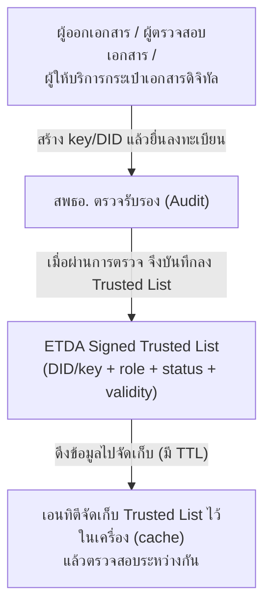
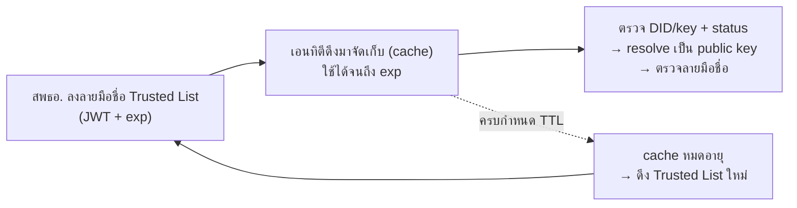
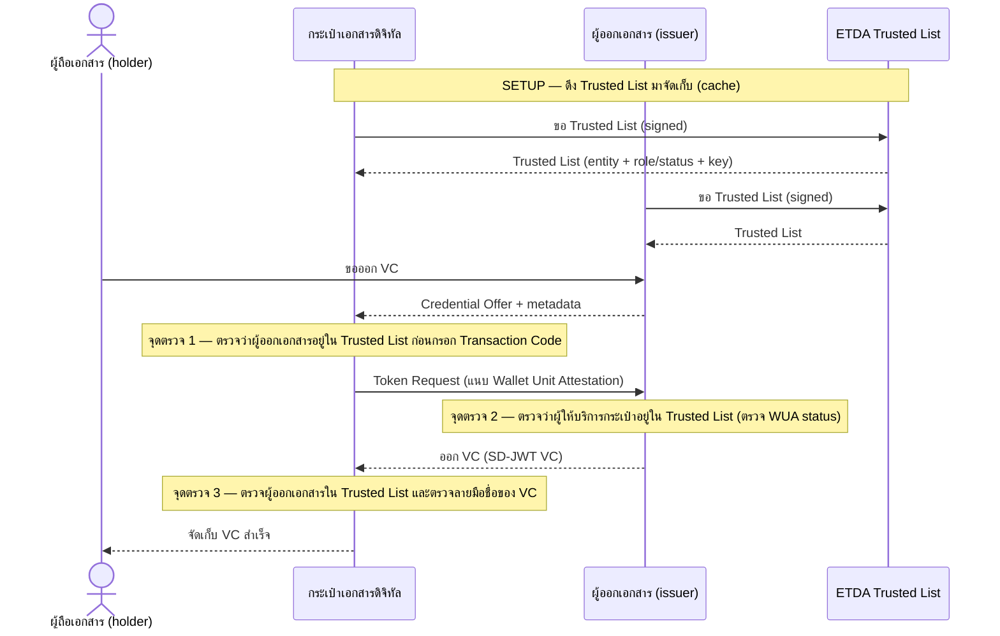
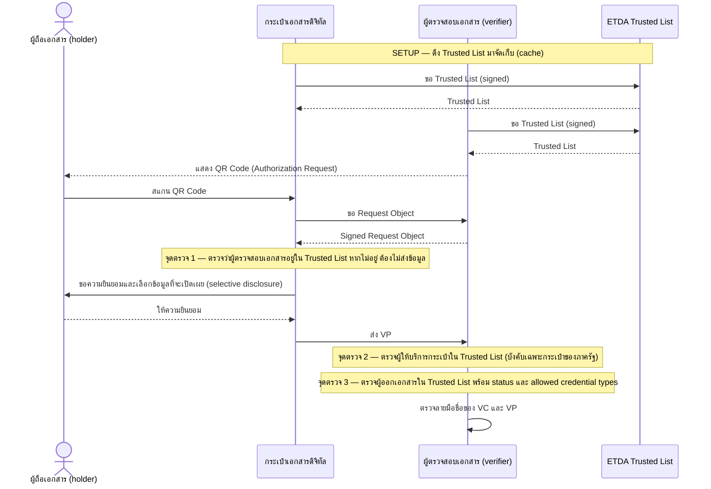

# 9. Trust Model 3 — ระบบรายชื่อที่น่าเชื่อถือแบบกระจายศูนย์ด้วย DID (Decentralized Trusted List)

{/* METADATA (agent-only — not rendered to readers)
> **สถานะ:** 📊 ส่วนขยาย (extension) — จัดทำเพิ่มเติมโดยคณะทำงาน VC มิได้เป็นส่วนหนึ่งของรายงานต้นฉบับ Thai VC ARF เวอร์ชัน 1.1
> **เวอร์ชันเอกสาร:** 1.0.1 (2026-08-06) — ตัดคำว่า "ในระยะที่ 2" ในย่อหน้าการเชื่อมโยงข้ามพรมแดนกับ EU ตามมติให้ยกเลิกการแบ่งระยะ (MASA-157)
> **แหล่งข้อมูล:** สังเคราะห์จากการวิเคราะห์สถาปัตยกรรมความน่าเชื่อถือ [T1] [T2] [T3] Trust Framework Template [T12] คู่มือ Trust Guide (th/public-site/vcdoc) [T8] [T9] [T10] [T11] และมาตรฐาน OID4VCI 1.0 [T4] OID4VP 1.0 [T5] W3C DID Core [T6]
> **เอกสารที่เกี่ยวข้อง:** [§3.3 ระบบทะเบียนเอกสารรับรอง](03-usage-overview.md) · [§6.5 กลไกการสร้างความน่าเชื่อถือ (ภาพรวม Model 1–3)](06.5-trust-building-mechanism.md) · [§6 DID Methodologies](06-did-methodologies.md) · [§7 การทำงานร่วมกันข้ามระบบนิเวศ](07-cross-ecosystem-interoperability.md) · [ดัชนี ARF](README.md)
*/}

---

หัวข้อนี้เป็นส่วนขยายของรายงาน Thai VC ARF เวอร์ชัน 1.1 จัดทำขึ้นเพื่อกำหนดแนวทางการทำงานของระบบรายชื่อที่น่าเชื่อถือ (trustlist) แบบกระจายศูนย์ (decentralized) ซึ่งเติมเต็มส่วนของระบบทะเบียนเอกสารรับรอง (verifiable data registry) ตาม [§3.3](03-usage-overview.md) ที่ระบุว่าระบบทะเบียนอาจจัดเก็บรายชื่อของเอนทิตี (entity) ได้ แต่มิได้กำหนดกลไกการกำกับดูแลและการตรวจสอบความน่าเชื่อถือของรายชื่อดังกล่าวไว้

รายงานฉบับนี้อ้างอิงการวิเคราะห์เปรียบเทียบสถาปัตยกรรมความน่าเชื่อถือ 3 รูปแบบ [T1] [T2] โดยกำหนดให้ Trust Model 3 (Trusted List + DID) เป็นแนวทางหลักในระยะแรก (พ.ศ. 2570–2571) ทั้งนี้ การกำหนดดังกล่าวสอดคล้องกับผลการรับฟังความเห็นของผู้ให้บริการในระบบนิเวศ [T2]

หัวข้อนี้ครอบคลุมหลักการ องค์ประกอบ กระบวนการลงทะเบียน และกระบวนการตรวจสอบความน่าเชื่อถือภายใต้ Trust Model 3 ทั้งนี้ ภาพรวมของแบบจำลองความน่าเชื่อถือทั้ง 3 รูปแบบ ได้แก่ Trust Model 1 (CA Delegation) Trust Model 2 (ETDA SubCA) และ Trust Model 3 (Trusted List + DID) พร้อมทั้งความหมายและประโยชน์ของ Trusted List อยู่ใน [§6.5 กลไกการสร้างความน่าเชื่อถือ](06.5-trust-building-mechanism.md) ซึ่งควรอ่านก่อนหัวข้อนี้ อย่างไรก็ตาม หัวข้อนี้ไม่ครอบคลุมรายละเอียดของ Trust Model 1 และ Trust Model 2 ซึ่งมีรายละเอียดตาม [T1] [T2] และไม่ครอบคลุมการเชื่อมโยงข้ามพรมแดน ซึ่งมีรายละเอียดตาม [T3]

---

## 9.1 หลักการของ Trust Model 3

Trust Model 3 ไม่ใช้ผู้ให้บริการออกใบรับรอง (certification authority: CA) เป็นสายความน่าเชื่อถือหลัก โดยสำนักงานพัฒนาธุรกรรมทางอิเล็กทรอนิกส์ (สพธอ.) ดำเนินการ 2 ประการ ดังนี้

1. ตรวจรับรอง (audit) เอนทิตีที่ประสงค์จะเข้าร่วมระบบ
2. กำกับดูแลและลงลายมือชื่อดิจิทัล (digital signature) กำกับ Trusted List

เอนทิตีแต่ละราย ได้แก่ ผู้ออกเอกสาร (issuer) ผู้ตรวจสอบเอกสาร (verifier) และผู้ให้บริการกระเป๋าเอกสารดิจิทัล (digital document wallet provider) จำเป็นต้องสร้างคู่กุญแจ (key pair) และตัวระบุแบบกระจายศูนย์ (decentralized identifier: DID) ของตนเอง แล้วนำมาลงทะเบียนต่อ สพธอ. เมื่อผ่านการตรวจรับรอง สพธอ. จะจัดเก็บ DID หรือการอ้างอิงกุญแจ (key reference) พร้อมบทบาท (role) สถานะ (status) ชนิดเอกสารที่ออกได้ (allowed credential types) และช่วงเวลาที่มีผลใช้ได้ (validity) ไว้ใน Trusted List

การจัดเก็บรายชื่อของเอนทิตีในลักษณะนี้ เป็นการดำเนินการตาม [§3.3](03-usage-overview.md) โดยเลือกใช้รูปแบบกระจายศูนย์ ทั้งนี้ กุญแจสาธารณะ (public key) ของแต่ละเอนทิตีจัดเก็บในรูปแบบ DID Document ตาม [§6](06-did-methodologies.md) [T6] องค์ประกอบของ Trust Model 3 แสดงได้ดังรูปที่ 9-1



**รูปที่ 9-1 องค์ประกอบและการทำงานของ Trust Model 3**

---

## 9.2 การลงทะเบียนและการตรวจรับรอง (onboarding)

กระบวนการเข้าร่วมระบบภายใต้ Trust Model 3 ประกอบด้วยการยื่นให้ สพธอ. ตรวจรับรองเพื่อบันทึกลง Trusted List โดยเอนทิตีไม่จำเป็นต้องขอใบรับรอง (certificate) จาก CA ก่อน บทบาท คู่กุญแจ และข้อมูลที่จัดเก็บของแต่ละเอนทิตี เป็นดังนี้

| เอนทิตี | สร้าง key/DID เอง | การใช้งานกุญแจ | ข้อมูลที่จัดเก็บใน Trusted List |
|---------|:---:|------|------|
| ผู้ออกเอกสาร (issuer) | ต้อง | ลงลายมือชื่อ VC | DID/key + role + status + allowed credential types |
| ผู้ตรวจสอบเอกสาร (verifier) | ต้อง | ลงลายมือชื่อคำขอ VP | DID/key + role + status |
| ผู้ให้บริการกระเป๋าเอกสารดิจิทัล | ต้อง | ลงลายมือชื่อ Wallet Unit Attestation (WUA) | DID/key + role + status |
| กระเป๋าเอกสารดิจิทัล (wallet unit) | ต้อง (device key) | ผูกผู้ถือเอกสารกับอุปกรณ์ (holder/device binding) | ไม่จัดเก็บโดยตรง ตรวจสอบผ่าน WUA และ status ของผู้ให้บริการ |
| สพธอ. | — | ตรวจรับรองและลงลายมือชื่อ Trusted List | เป็นผู้กำกับดูแลและลงลายมือชื่อ Trusted List |

บทบาทของเอนทิตีข้างต้นเป็นไปตาม [§3.1](03-usage-overview.md)

---

## 9.3 กลไกการทำงานของ Trusted List

สพธอ. ลงลายมือชื่อดิจิทัลกำกับ Trusted List ในรูปแบบ JWT ที่มีการกำหนดเวลาหมดอายุ (`exp`) เอนทิตีแต่ละรายดึงข้อมูล Trusted List มาจัดเก็บไว้ในเครื่อง (local cache) แล้วตรวจสอบระหว่างกันโดยไม่จำเป็นต้องเรียกไปยัง สพธอ. ทุกครั้ง กลไกการทำงานแสดงได้ดังรูปที่ 9-2



**รูปที่ 9-2 กลไกการลงลายมือชื่อ การจัดเก็บ และการตรวจสอบ Trusted List**

ข้อกำหนดสำคัญของกลไกนี้ มีดังนี้

1. ความน่าเชื่อถือของ Trusted List มาจากลายมือชื่อดิจิทัลของ สพธอ. มิใช่จากช่องทางที่ใช้เผยแพร่ ดังนั้น ผู้รับ Trusted List ต้องตรวจสอบลายมือชื่อของ สพธอ. เสมอ แม้เผยแพร่ผ่านโครงข่ายกระจายเนื้อหา (content delivery network: CDN) หรือใช้ API Key ก็ตาม
2. การดึงข้อมูล (resolve) DID ที่เอนทิตีไม่สามารถดำเนินการได้เอง ให้ใช้ Universal Resolver ตาม [§6.3](06-did-methodologies.md) และ [§7](07-cross-ecosystem-interoperability.md)
3. ในระหว่างที่ยังใช้ cache อยู่ เอนทิตีจะไม่สามารถทราบการเพิกถอน (revocation) ที่เกิดขึ้นภายหลังการดึงข้อมูลครั้งล่าสุด ดังนั้น รายงานฉบับนี้กำหนดให้ต้องระบุนโยบายให้ชัดเจนว่า เมื่อ cache หมดอายุและไม่สามารถดึงข้อมูลใหม่ได้ ระบบต้องปฏิเสธไว้ก่อน (fail-closed) หรืออนุญาตให้ดำเนินการต่อ (fail-open)

---

## 9.4 กระบวนการออกเอกสารรับรองดิจิทัล (OID4VCI ร่วมกับ Trusted List)

กระบวนการออก VC ตามมาตรฐาน OID4VCI [T4] มีจุดตรวจสอบความน่าเชื่อถือ 3 จุด ดังรูปที่ 9-3



**รูปที่ 9-3 กระบวนการออก VC ร่วมกับการตรวจสอบ Trusted List**

---

## 9.5 กระบวนการแสดงเอกสารสำแดงดิจิทัล (OID4VP ร่วมกับ Trusted List)

กระบวนการแสดง VP ตามมาตรฐาน OID4VP [T5] กำหนดให้กระเป๋าเอกสารดิจิทัลตรวจสอบผู้ตรวจสอบเอกสารก่อนส่งข้อมูล และผู้ตรวจสอบเอกสารตรวจสอบผู้ออกเอกสารและผู้ให้บริการกระเป๋าภายหลังรับข้อมูล ดังรูปที่ 9-4



**รูปที่ 9-4 กระบวนการแสดง VP ร่วมกับการตรวจสอบ Trusted List**

---

## 9.6 ความสอดคล้องกับส่วนอื่นของรายงาน

Trust Model 3 สอดคล้องและต่อยอดจากส่วนต่าง ๆ ของรายงาน Thai VC ARF ดังนี้

| หัวข้อ | ส่วนที่ Trust Model 3 กำหนดเพิ่มเติม |
|--------|--------------------------------------|
| [§3.1 บทบาทของผู้เกี่ยวข้อง](03-usage-overview.md) | ใช้บทบาทเดิม ไม่เพิ่มบทบาทใหม่ |
| [§3.3 ระบบทะเบียนเอกสารรับรอง](03-usage-overview.md) | กำหนดรายชื่อของเอนทิตีให้เป็นรูปธรรมในรูปแบบกระจายศูนย์ คือ ETDA Signed Trusted List |
| [§5 มาตรฐานและข้อปฏิบัติ](05-standards-and-compliance.md) | ใช้ OID4VCI OID4VP และ SD-JWT VC เดิม โดยเพิ่มจุดตรวจสอบ Trusted List |
| [§6 DID Methodologies](06-did-methodologies.md) | ใช้ DID และ DID Document เป็นที่จัดเก็บ public key ของเอนทิตี |
| [§7 การทำงานร่วมกันข้ามระบบนิเวศ](07-cross-ecosystem-interoperability.md) | ใช้ Universal Resolver ในการ resolve DID ข้ามระบบนิเวศ |

การเชื่อมโยงข้ามพรมแดนกับสหภาพยุโรป (EU) จำเป็นต้องดำเนินการเพิ่มเติม โดยจัดทำ bridge จาก DID ไปเป็น X.509 และจัดทำ List of Trusted Entities (LoTE) ตามมาตรฐาน ETSI TS 119 602 [T7] ทั้งนี้ มีรายละเอียดตาม [T3]

---

## 9.7 ข้อกำหนดที่ต้องระบุให้ชัดเจน

จากการวิเคราะห์ความเสี่ยงและการรับฟังความเห็นของผู้ให้บริการ [T2] รายงานฉบับนี้กำหนดให้ต้องระบุเรื่องต่อไปนี้ให้ชัดเจนตั้งแต่ระยะเริ่มต้น

1. นโยบายการจัดการกุญแจ (key management) — ต้องกำหนด proof-of-possession การหมุนกุญแจ (key rotation) และบังคับใช้ฮาร์ดแวร์ความมั่นคงปลอดภัย (hardware security module: HSM) ที่ผ่านการรับรองอย่างน้อยระดับ FIPS 140-2 Level 3 เป็นเกณฑ์ขั้นต่ำ และยอมรับ FIPS 140-3 Level 3 เป็นมาตรฐานสืบทอด [T13] ทั้งนี้ ควรจัดทำบัญชีผู้ให้บริการ HSM และการเก็บรักษากุญแจ (key custody) ที่ได้รับการรับรอง โดยรายละเอียดเกณฑ์และการอ้างอิง NIST อยู่ใน [§12.2 และ §12.10](12-key-management-and-trustlist-deployment.md)
2. ความพร้อมใช้งานสูง (high availability) ของ Trusted List และ Universal Resolver — ควรจัดให้มี replicated endpoint, local cache, fallback resolver และกำหนดเป้าหมายระดับการให้บริการ (service level agreement: SLA) ที่ชัดเจน
3. ค่า TTL และนโยบาย fail-open/fail-closed — ต้องกำหนดเป็นค่าที่แน่นอน
4. สถานะทางกฎหมาย — ควรพิจารณาว่าลายมือชื่อที่ตรวจสอบผ่าน DID และ Trusted List เข้าเกณฑ์ลายมือชื่ออิเล็กทรอนิกส์ที่เชื่อถือได้ตามพระราชบัญญัติว่าด้วยธุรกรรมทางอิเล็กทรอนิกส์ พ.ศ. 2544 มาตรา 9 มาตรา 26 และมาตรา 28 หรือไม่
5. แผนรองรับการเข้ารหัสลับยุคหลังควอนตัม (post-quantum cryptography: PQC) — ควรจัดทำแผนปรับเปลี่ยนไปสู่มาตรฐาน FIPS 203 FIPS 204 และ FIPS 205
6. ข้อจำกัดสิทธิของผู้ถือเอกสาร — ผู้ถือเอกสารอาจถูกจำกัดมิให้ส่งเอกสารรับรองให้แก่ผู้ตรวจสอบเอกสารที่อยู่นอก Trusted List ดังนั้น ควรออกแบบแนวทางรองรับกรณีดังกล่าว

---

## 9.8 โครงสร้างข้อมูลของ Trusted List (Trusted List Schema)

รายงานฉบับนี้กำหนดให้ Trusted List จัดกลุ่มข้อมูลตามองค์กร (organization-centric) โดย 1 entry หมายถึง 1 องค์กร ซึ่งประกอบด้วยรายการบทบาท (`services[]`) ที่องค์กรนั้นลงทะเบียนไว้ แต่ละบทบาทประกอบด้วย 1 DID และ 1 คู่กุญแจ (`signing_pubkey`) ทั้งนี้ องค์กรเดียวอาจลงทะเบียนได้หลายบทบาท เช่น เป็นทั้งผู้ออกเอกสารและผู้ตรวจสอบเอกสาร โดยแต่ละบทบาทสามารถระงับ (suspend) หรือเพิกถอน (withdrawn) แยกจากกันได้ [T8]

Trusted List ฉบับเผยแพร่ต้องเป็น JWT ที่ลงลายมือชื่อตาม ETSI TS 119 602 และเผยแพร่ผ่าน CDN โดยไม่ต้องใช้ API key ความน่าเชื่อถือของรายการมาจากลายมือชื่อของ สพธอ. ผู้เข้าร่วมดึงรายการเมื่อจำเป็นต้องตัดสินความน่าเชื่อถือ ไม่ต้อง polling อยู่เบื้องหลัง หากดึงรายการหรือตรวจลายมือชื่อไม่ได้ ให้ปฏิเสธการเชื่อมต่อนั้น (fail closed) การเพิกถอนระดับองค์กรจะมีผลต่อผู้ใช้เมื่อดึง Trusted List ฉบับถัดไป [บทสรุปความสอดคล้องขั้นต่ำ](00-minimal-interoperability-reference.md)

โครงสร้างระดับบนสุด (root wrapper) ประกอบด้วยเขตข้อมูล ดังนี้ [T8]

| เขตข้อมูล | ชนิด | จำเป็น | คำอธิบาย |
|-----------|------|:---:|----------|
| `@context` | String | ต้อง | URL ของ schema ที่ระบุเวอร์ชันของ Trusted List |
| `id` | String | ต้อง | ตัวระบุ Trusted List ในรูปแบบ URN |
| `issuer` | String | ต้อง | DID ของ สพธอ. ที่ลงลายมือชื่อ Trusted List |
| `issued` | ISO8601 | ต้อง | วันที่เผยแพร่ |
| `next_update` | ISO8601 | ต้อง | วันที่จะเผยแพร่เวอร์ชันถัดไป |
| `entities` | Array | ต้อง | รายการองค์กรที่ลงทะเบียน |

เขตข้อมูลระดับองค์กร (entity-level) และระดับบทบาท (service-level) ที่สำคัญ มีดังนี้ [T8]

| ระดับ | เขตข้อมูล | คำอธิบาย |
|-------|-----------|----------|
| องค์กร | `id` `name_th` `name_en` | รหัสและชื่อองค์กร โดย `name_th` ใช้แสดงในกระเป๋าเอกสารดิจิทัล |
| องค์กร | `status` | สถานะรวม `active` / `suspended` / `withdrawn` หากองค์กรถูกเพิกถอน บทบาททั้งหมดใช้ไม่ได้ |
| บทบาท | `type` | ประเภทบทบาท `credential_issuer` / `wallet_provider` / `verifier` |
| บทบาท | `did` | DID ของบทบาท ทั้งนี้ ผู้ตรวจสอบเอกสารอาจใช้ `client_id` แทนได้ |
| บทบาท | `signing_pubkey` หรือการอ้างอิง DID Document | public key ที่ สพธอ. ตรวจ ณ วันลงทะเบียน อาจประกาศโดยตรงหรืออ้างอิงผ่าน DID Document ใช้ตรวจลายมือชื่อของ VC, WUA และคำขอ VP |
| บทบาท | `status` | สถานะเฉพาะบทบาท ซึ่งอาจต่างจากสถานะระดับองค์กร |
| บทบาท | `valid_from` `valid_until` | ช่วงเวลาที่มีผลใช้ได้ |

> _ข้อสังเกต:_ ผู้ตรวจสอบข้อมูล (consumer) ต้องตรวจทั้ง `status` ระดับองค์กรและระดับบทบาท หากสถานะใดมิใช่ `active` ต้องปฏิเสธ [T8]

Trusted List เป็นแหล่งตัดสินว่าเอนทิตีมีสิทธิ์กระทำการใด ส่วน DID Document ใช้ประกาศกุญแจสำหรับตรวจลายมือชื่อเท่านั้น และไม่ใช่แหล่งอนุญาตสิทธิ์ ดังนั้น consumer ต้องตรวจทั้งตัวตน กุญแจ สถานะ ช่วงเวลา และขอบเขตสิทธิ์จาก Trusted List ก่อนดำเนินการ [บทสรุปความสอดคล้องขั้นต่ำ](00-minimal-interoperability-reference.md)

ขอบเขตสิทธิ์ต้องระบุแยกตามบทบาท ดังนี้ [บทสรุปความสอดคล้องขั้นต่ำ](00-minimal-interoperability-reference.md)

| บทบาท | ข้อมูลขอบเขตสิทธิ์ขั้นต่ำ | เงื่อนไขการใช้งาน |
|--------|-----------------------------|-------------------|
| `credential_issuer` | ประเภท VC และ claims ที่ออกได้ เช่น `credential_type` และ `issuable_claims` | ออกได้เฉพาะประเภทและ claims ที่ลงทะเบียนไว้ |
| `verifier` | claims ที่ขอได้และวัตถุประสงค์ เช่น `allowed_claims` และ `use_case[]` | ขอได้เฉพาะ claims และวัตถุประสงค์ที่ลงทะเบียนไว้ |
| `wallet_provider` | สถานะบทบาทและช่วงเวลาที่มีผล รวมถึงกุญแจที่ใช้ลงลายมือชื่อ WUA | ต้องมีสถานะ `active` ทั้งระดับองค์กรและระดับบทบาท |

การลงลายมือชื่อ Trusted List ของ สพธอ. ควรดำเนินการจาก HSM ระดับ FIPS 140-3 Level 3 โดยใช้เกณฑ์อนุมัติแบบ M-of-N เช่น 3-of-5 และมีกุญแจฉุกเฉินที่เก็บแบบออฟไลน์ [บทสรุปความสอดคล้องขั้นต่ำ](00-minimal-interoperability-reference.md)

ตัวอย่างข้อมูลของผู้ออกเอกสาร (issuer) ในรูปแบบ JSON เป็นดังนี้ [T9]

```json
{
  "id": "org-10001",
  "name_th": "กรมการปกครอง",
  "name_en": "Department of Provincial Administration",
  "status": "active",
  "services": [
    {
      "did": "did:web:dopa.go.th",
      "type": "credential_issuer",
      "credential_issuer": "https://issuer.dopa.go.th",
      "status": "active",
      "credential_type": "ThaiNationalIDCredential",
      "signing_pubkey": "MFkwEwYHKoZIzj0CAQYIKoZIzj0DAQcDQgAEQ7X4...",
      "issuable_claims": ["citizen_id", "name_th", "name_en", "birth_date", "address", "photo"],
      "protocols": ["OID4VCI_1.0"],
      "valid_from": "2026-09-01T00:00:00Z",
      "valid_until": "2028-09-01T00:00:00Z"
    }
  ]
}
```

สำหรับบทบาทผู้ตรวจสอบเอกสาร (verifier) เขตข้อมูล `use_case[]` ระบุวัตถุประสงค์ (`purpose_th` / `purpose_en`) และรายการ claims ที่มีสิทธิ์ขอ (`allowed_claims`) เพื่อป้องกันการขอข้อมูลเกินสิทธิ์ [T9]

---

## 9.9 การลงทะเบียนและ ETDA Trust Gateway

เอนทิตีทุกรายต้องลงทะเบียนต่อ สพธอ. ก่อนเข้าร่วมระบบ เมื่อผ่านการตรวจ (audit) แล้วจึงถูกเพิ่มเข้า Trusted List [T10]

การดึง Trusted List ใช้รูปแบบ CDN: แต่ละ entity ดึง Trusted List ที่เซ็นแล้วจาก **CDN** (`cache.etda.or.th`) ได้โดยตรง **ไม่ต้องใช้ API Key** เพราะความน่าเชื่อถือมาจากลายมือชื่อของ Trusted List (ตาม §9.3) ไม่ใช่จากการควบคุมการเข้าถึง [T12]

ส่วน **API Key** ที่ได้รับตอนลงทะเบียน ใช้เฉพาะเรียก **ETDA API Gateway** (`trust.etda.or.th`) เพื่อ resolve custom DID ที่ Resolver ส่วนกลางยังไม่รองรับเท่านั้น — ไม่เกี่ยวกับการดึง Trusted List [T12]

รายงานฉบับนี้กำหนดระดับความเชื่อมั่นของผู้ตรวจสอบเอกสาร (verifier) เป็น 2 ระดับ [T10] ดังนี้

1. ระดับทั่วไป (standard) — ไม่จำเป็นต้องพิสูจน์กระเป๋าเอกสารดิจิทัล
2. ระดับเข้มงวด (enhanced) — จำเป็นต้องพิสูจน์กระเป๋าเอกสารดิจิทัล

กรณีเอนทิตีประสงค์จะใช้ DID Method ที่ Resolver ส่วนกลางยังไม่รองรับ (custom DID) สพธอ. กำหนดทางเลือกการเชื่อมต่อไว้ 2 รูปแบบ [T10] ได้แก่ (1) เอนทิตีจัดส่ง DID Driver ให้ สพธอ. ติดตั้งใน Resolver ส่วนกลาง และ (2) เอนทิตีให้บริการ Resolver ของตนเอง แล้วอนุญาต IP ของ ETDA Gateway (whitelist)

---

## 9.10 หลักการตรวจสอบความปลอดภัยพื้นฐาน (Core Security Rules)

การตรวจสอบในทุก flow แบ่งตามต้นทุนได้ 3 ประเภท ได้แก่ (1) การเทียบข้อมูลใน Trusted List ที่จัดเก็บไว้ในเครื่อง (2) การตรวจลายมือชื่อ (cryptographic verification) และ (3) การเรียกผ่านเครือข่าย (network) เช่น การ resolve DID หรือการดึง Status List [T11]

รายงานฉบับนี้กำหนดหลักการสำคัญว่า หากการเทียบข้อมูลใน Trusted List (ประเภทที่ 1) ไม่ผ่าน เอนทิตีต้องปฏิเสธทันที โดยไม่ต้องเรียกผ่านเครือข่าย (ประเภทที่ 3) ต่อ เพื่อมิให้สิ้นเปลืองทรัพยากรและมิให้เกิดความเสี่ยงจากการส่งคำขอไปยังปลายทางที่ไม่น่าเชื่อถือ [T11]

จุดตรวจสอบ Trusted List ตลอดกระบวนการออกและแสดงเอกสาร สรุปได้ดังนี้ [T11]

| จุดตรวจ | กระบวนการ | ผู้ตรวจ | ตรวจอะไร | เมื่อไม่ผ่าน |
|:---:|------|---------|----------|-------------|
| 1 | ออก VC | กระเป๋าเอกสารดิจิทัล | ผู้ออกเอกสารอยู่ใน Trusted List | หยุด ไม่ส่ง Transaction Code |
| 2 | ออก VC | ผู้ออกเอกสาร | ผู้ให้บริการกระเป๋าอยู่ใน Trusted List | ไม่ออก VC |
| 3 | ออก VC | กระเป๋าเอกสารดิจิทัล | ผู้ออกเอกสารอยู่ใน Trusted List | ไม่บันทึก VC |
| 4 | แสดง VP | กระเป๋าเอกสารดิจิทัล | ผู้ตรวจสอบเอกสารอยู่ใน Trusted List | ไม่ส่งข้อมูล |
| 5 | แสดง VP | ผู้ตรวจสอบเอกสาร | ผู้ให้บริการกระเป๋าอยู่ใน Trusted List (บังคับเฉพาะกระเป๋าภาครัฐ) | ปฏิเสธ |
| 6 | แสดง VP | ผู้ตรวจสอบเอกสาร | ผู้ออกเอกสารอยู่ใน Trusted List พร้อม status และสิทธิ์การออกเอกสาร | ไม่เชื่อถือข้อมูล |

---

{/* METADATA (agent-only — not rendered to readers)
## บรรณานุกรม (References)

- [T1] คณะทำงาน VC, "Trust Architecture: 3 โมเดลตรวจสอบความน่าเชื่อถือ" — [research/32-trustlist-3models.md](../research/32-trustlist-3models.md)
- [T2] คณะทำงาน VC, "3 Trust Architecture Models — Fact-Based Analysis" — [research/33-trust-architecture-models-factbase-analysis.md](../research/33-trust-architecture-models-factbase-analysis.md)
- [T3] คณะทำงาน VC, "Trusted List สำหรับ Domestic และ Cross-Border" — [research/34-trustlist-domestic-and-crossborder.md](../research/34-trustlist-domestic-and-crossborder.md)
- [T4] OpenID Foundation, "OpenID for Verifiable Credential Issuance 1.0", Final — https://openid.net/specs/openid-4-verifiable-credential-issuance-1_0.html
- [T5] OpenID Foundation, "OpenID for Verifiable Presentations 1.0", Final — https://openid.net/specs/openid-4-verifiable-presentations-1_0.html
- [T6] World Wide Web Consortium (W3C), "Decentralized Identifiers (DIDs) v1.0", 19 July 2022 — https://www.w3.org/TR/did-core/
- [T7] European Telecommunications Standards Institute (ETSI), "ETSI TS 119 602 — Lists of Trusted Entities (LoTEs)" — https://www.etsi.org/deliver/etsi_ts/119600_119699/119602/
- [T8] คู่มือ Trust Guide, "§5.1 ข้อกำหนดทางเทคนิค และ Trusted List Schema" — [trust-guide/05-trust-infrastructure/01-technical-requirements-and-schema.md](../public-site/vcdoc/docs/trust-guide/05-trust-infrastructure/01-technical-requirements-and-schema.md)
- [T9] คู่มือ Trust Guide, "§5.3 ตัวอย่าง TL JSON" — [trust-guide/05-trust-infrastructure/02-tl-json-examples.md](../public-site/vcdoc/docs/trust-guide/05-trust-infrastructure/02-tl-json-examples.md)
- [T10] คู่มือ Trust Guide, "§6.1 ระดับความเชื่อมั่นของ Verifier และการลงทะเบียน" — [trust-guide/06-security-and-privacy/01-verifier-confidence-and-registration.md](../public-site/vcdoc/docs/trust-guide/06-security-and-privacy/01-verifier-confidence-and-registration.md)
- [T11] คู่มือ Trust Guide, "ภาคผนวก ก — Core Security Rules" — [trust-guide/09-appendix/01-core-security-rules.md](../public-site/vcdoc/docs/trust-guide/09-appendix/01-core-security-rules.md)
- [T12] คณะทำงาน VC, "Trust Framework Template — §5 (CDN Trusted List serving: ดึงจาก CDN ไม่ต้องใช้ API key; Gateway สำหรับ custom DID เท่านั้น)" — [th/draft/trust-framework-template.md](../draft/trust-framework-template.md)
- [T13] NIST, "FIPS PUB 140-2 — Security Requirements for Cryptographic Modules", พฤษภาคม ค.ศ. 2001 และ "FIPS PUB 140-3", มีนาคม ค.ศ. 2019 — https://csrc.nist.gov/pubs/fips/140-3/final

---
*/}

**การนำทาง:** [⬅️ บทที่ 8 — Implementation Guidelines (OID4VCI / OID4VP)](08-implementation-guidelines.md) · [⬆️ สารบัญ ARF](README.md) · [บทที่ 10 — Wallet Unit Attestation (WUA) ➡️](10-wallet-unit-attestation.md)
