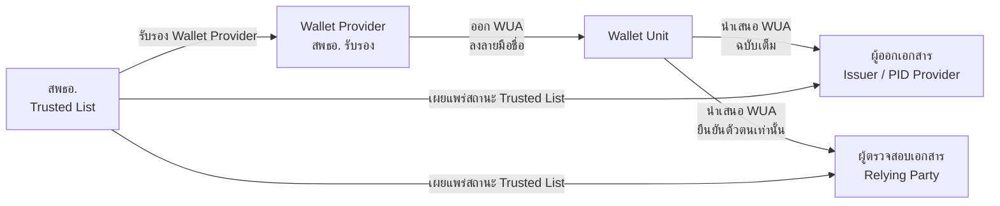
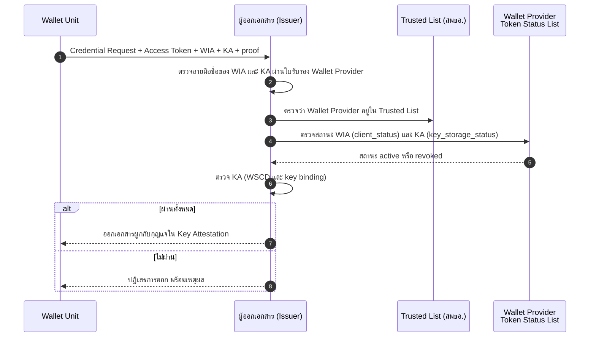
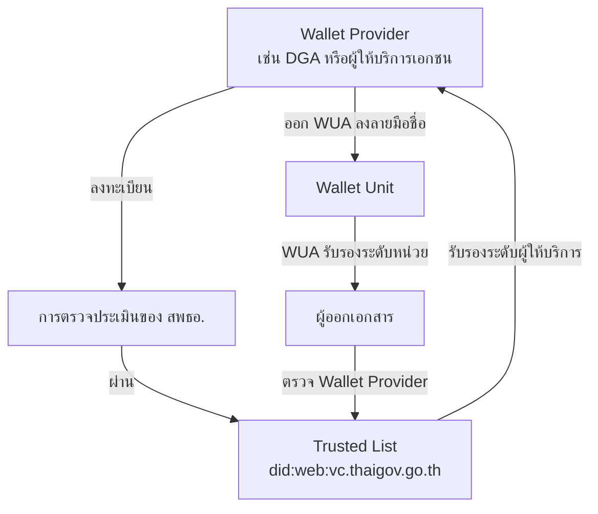
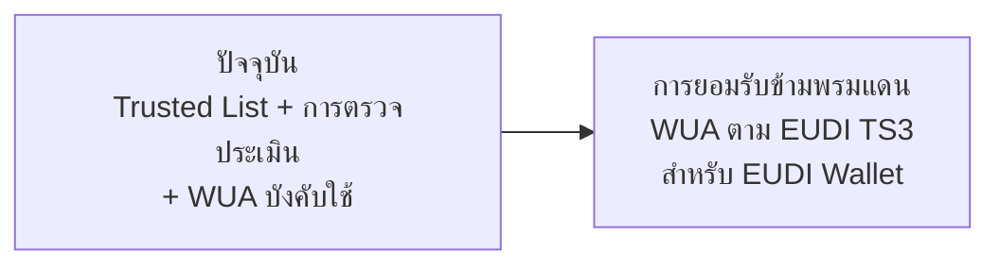

# 10. Wallet Unit Attestation (WUA)

{/* METADATA (agent-only — not rendered to readers)
> **สถานะ:** 📐 Specification
> **เวอร์ชันเอกสาร:** 1.7 (2026-08-07) — ประวัติการแก้ไขทั้งหมดอยู่ในภาคผนวก §ก.4 บันทึกการเปลี่ยนแปลง
> **แหล่งข้อมูลปฐมภูมิ (ต้นฉบับที่ระบบของไทยอ้างอิง):**
> - EUDI ARF 2.9.0 — Topic 9 / Discussion Topic C: Wallet Unit Attestation (WUA) and Key Attestation — [eudi.dev/2.9.0/discussion-topics/c-wallet-unit-attestation](https://eudi.dev/2.9.0/discussion-topics/c-wallet-unit-attestation/)
> - EUDI ARF 2.9.0 — Technical Specification TS3: Wallet Unit Attestations — [eudi.dev/2.9.0/technical-specifications/ts3-wallet-unit-attestation](https://eudi.dev/2.9.0/technical-specifications/ts3-wallet-unit-attestation/)
> - Commission Implementing Regulation (EU) 2024/2979 — Wallet requirements and Wallet Unit Attestations
> - OpenID for Verifiable Credential Issuance 1.0 (Final) — Annex D (Key Attestation), Annex E (Wallet Attestation)
>
> **เอกสารที่เกี่ยวข้อง:** [ดัชนีเอกสาร ARF](README.md), [บทที่ 8 — Implementation Guidelines (OID4VCI/OID4VP)](08-implementation-guidelines.md), [บทที่ 9 — Trust Model 3](09-trust-model-3.md), [บทที่ 12 — Key Management และ Trusted List Deployment](12-key-management-and-trustlist-deployment.md), [บทที่ 13 — VC Status และการเพิกถอน](13-vc-status-and-revocation.md), [00-glossary.md](../../00-glossary.md)
*/}

---

Wallet Unit Attestation (WUA) เป็นแนวคิดที่กำหนดขึ้นโดยกรอบ EU Digital Identity Wallet Architecture and Reference Framework (EUDI ARF) และมีฐานทางกฎหมายใน eIDAS 2.0 (Regulation (EU) 2024/1183) และ Commission Implementing Regulation series (CIR 2024/2977, 2024/2979, 2024/2982) รายงานฉบับนี้ **นำ WUA มาใช้ตามมาตรฐานของ EUDI** เพื่อรับรองผู้ให้บริการกระเป๋าเอกสารดิจิทัล (wallet provider) และหน่วยกระเป๋าเอกสารดิจิทัล (wallet unit) มิได้คิดค้นหรือกำหนดกลไกใหม่ขึ้นเอง

บทนี้มุ่งอธิบายเฉพาะ **วิธีที่ระบบของไทยใช้ WUA ในกระแสงาน OID4VCI และ OID4VP** และความสัมพันธ์ระหว่าง WUA กับ Trusted List ของสำนักงานพัฒนาธุรกรรมทางอิเล็กทรอนิกส์ (สพธอ.) ส่วนรายละเอียดเชิงมาตรฐาน ได้แก่ โครงสร้างข้อมูล ข้อกำหนดระดับสูง (High-Level Requirements) และฐานทางกฎหมายฉบับเต็ม รายงานฉบับนี้ไม่กล่าวซ้ำ แต่ให้ผู้อ่านศึกษาจากต้นฉบับของ EUDI ตามที่ระบุใน [ภาคผนวก ก](#ภาคผนวก-ก--เอกสารอ้างอิงและการอ่านเพิ่มเติม)

---

## 10.1 ขอบข่ายและที่มา

### 10.1.1 ที่มาของ WUA

WUA เป็นกลไกที่ EUDI ARF กำหนดให้ wallet provider ออกให้แก่ wallet unit ของตน เพื่อให้ผู้พึ่งพา (เช่น ผู้ออกเอกสาร หรือผู้ตรวจสอบเอกสาร) ตรวจสอบได้ว่า wallet unit นั้นมาจาก wallet provider ที่เชื่อถือได้ และผูกกับกุญแจที่จัดเก็บในอุปกรณ์เข้ารหัสลับที่ได้รับการรับรอง ระบบของไทยนำกลไกนี้มาใช้เพื่อวัตถุประสงค์เดียวกันสองประการ ได้แก่

1. **รับรองผู้ให้บริการกระเป๋าเอกสารดิจิทัล (wallet provider)** ผ่านการที่ สพธอ. ตรวจประเมินและลงรายการใน Trusted List
2. **รับรองหน่วยกระเป๋าเอกสารดิจิทัล (wallet unit)** ผ่านการที่ wallet provider ลงลายมือชื่อ WUA และหน่วยกระเป๋านำเสนอ WUA ในขั้นตอนการทำงาน (runtime)

กลไกทั้งสองทำงานร่วมกัน มิใช่ทางเลือกทดแทนกัน โดย Trusted List รับรองในระดับผู้ให้บริการ ส่วน WUA รับรองในระดับหน่วยกระเป๋า

### 10.1.2 ขอบเขตของบทนี้

รายงานฉบับนี้กำหนดให้ระบบของไทยใช้ WUA **ตามที่ EUDI กำหนดไว้** โดยไม่ดัดแปลงนิยามหรือโครงสร้าง บทนี้ครอบคลุมเฉพาะ

- วิธีที่ wallet unit นำเสนอ WUA และวิธีที่ผู้พึ่งพาตรวจสอบ WUA ในกระแสงาน OID4VCI (การออกเอกสาร) และ OID4VP (การแสดงเอกสาร)
- ความสัมพันธ์ระหว่าง WUA กับ Trusted List ของ สพธอ.
- การเพิกถอนและการเผยแพร่สถานะของ WUA ในบริบทของระบบไทย

บทนี้ **ไม่ครอบคลุม** รายละเอียดต่อไปนี้ ซึ่งให้อ้างอิงต้นฉบับของ EUDI แทน

- โครงสร้างข้อมูลและการเข้ารหัสฉบับเต็มของ WIA และ KA (ตาม EUDI Technical Specification TS3)
- ข้อกำหนดระดับสูง (HLR) รายข้อของ EUDI ARF Topic 9
- ถ้อยคำของกฎหมายลูก (CIR) รายมาตรา

---

## 10.2 นิยามและบทบาทโดยย่อ

### 10.2.1 นิยามศัพท์

ศัพท์ที่ใช้ในบทนี้สอดคล้องกับ [00-glossary.md](../../00-glossary.md) และนิยามในข้อ 2.24 ของ [บทที่ 2 — บทนิยาม](02-definitions.md) รายละเอียดฉบับเต็มให้อ้างอิง EUDI ARF 2.9.0

| ศัพท์ | คำเต็มภาษาอังกฤษ | ความหมายโดยย่อ |
|------|-------------------|---------------|
| **WUA** | Wallet Unit Attestation | คำรวม (umbrella term) ของหลักฐานที่ wallet provider ออกให้แก่ wallet unit ประกอบด้วยสองประเภท ได้แก่ WIA และ KA ตาม EUDI ARF 2.9.0 TS3 |
| **WIA** | Wallet Instance Attestation | ประเภทหนึ่งของ WUA รับรองความเป็นของแท้และความสมบูรณ์ของ wallet instance (ตัวโปรแกรมกระเป๋า) ตรงกับ Wallet Attestation ใน OID4VCI 1.0 Annex E |
| **KA** | Key Attestation | ประเภทหนึ่งของ WUA รับรองว่ากุญแจของ wallet unit ถูกสร้างและจัดเก็บใน WSCD ที่ได้รับการรับรอง และระบุระดับความมั่นคงปลอดภัยของกุญแจ ตรงกับ Key Attestation ใน OID4VCI 1.0 Annex D |
| **Wallet Unit** | Wallet Unit | หน่วยของกระเป๋าเอกสารดิจิทัล ประกอบด้วย wallet instance พร้อม WSCA และอุปกรณ์ที่เกี่ยวข้อง |
| **Wallet Provider** | Wallet Provider | ผู้ให้บริการ wallet unit ที่มีหน้าที่ออกและเพิกถอน WUA ทั้ง WIA และ KA |

### 10.2.2 บทบาทที่เกี่ยวข้องกับ WUA

WUA มีบทบาทต่างกันตามผู้รับ ผู้ออกเอกสารได้รับ WUA ฉบับที่มีข้อมูลความสามารถของอุปกรณ์ (EUDI เรียกว่า Use Case 2) ขณะที่ผู้ตรวจสอบเอกสารได้รับเฉพาะข้อมูลยืนยันตัวตนของ wallet unit (Use Case 1) เพื่อรักษาความเป็นส่วนตัว รายละเอียดของทั้งสอง Use Case ให้อ้างอิง EUDI ARF 2.9.0 Topic 9

### 10.2.3 WUA เป็นคำรวม ประกอบด้วย WIA และ KA

WUA เป็นคำรวม (umbrella term) มิใช่หลักฐานฉบับเดียว ตาม EUDI ARF 2.9.0 Technical Specification TS3 WUA ประกอบด้วยหลักฐานสองประเภทที่แยกหน้าที่กัน ได้แก่

1. **Wallet Instance Attestation (WIA)** รับรองว่า wallet instance คือตัวโปรแกรมกระเป๋า เป็นของแท้ มาจาก wallet provider ที่เชื่อถือได้ และไม่ถูกดัดแปลง
2. **Key Attestation (KA)** รับรองว่ากุญแจที่ wallet unit ใช้ผูกกับเอกสารถูกสร้างและจัดเก็บใน WSCD ที่ได้รับการรับรอง พร้อมระบุระดับความมั่นคงปลอดภัยของกุญแจนั้น

หลักฐานทั้งสองประเภทมีวงจรชีวิตและกลไกสถานะแยกจากกัน ระบบของไทยนำการแบ่งประเภทและกลไกดังกล่าวมาใช้ตามที่ EUDI กำหนด มิได้กำหนดขึ้นเอง การแยกบทบาทของ WIA และ KA แสดงได้ดังนี้

| ประเภท | คำเต็ม | รับรองอะไร | หลักฐานคู่ขนานใน OID4VCI |
|--------|--------|-----------|--------------------------|
| WIA | Wallet Instance Attestation | ความเป็นของแท้และความสมบูรณ์ของ wallet instance | Wallet Attestation (Annex E) |
| KA | Key Attestation | การจัดเก็บกุญแจใน WSCD และระดับความมั่นคงปลอดภัยของกุญแจ | Key Attestation (Annex D) |

รายละเอียดการเพิกถอนและสถานะของ WIA และ KA อยู่ใน [§10.5](#105-อายุการใช้งาน-การเพิกถอน-และสถานะของ-wua) ส่วนรายละเอียดโครงสร้างข้อมูลฉบับเต็ม ให้อ้างอิง EUDI ARF 2.9.0 TS3

---

## 10.3 การใช้ WUA ในกระแสงานของระบบไทย

หัวข้อนี้เป็นสาระสำคัญของบท โดยอธิบายว่า WUA ปรากฏอยู่ที่จุดใดในกระแสงานมาตรฐาน กระแสงานฉบับเต็มพร้อมแผนภาพลำดับ (sequence diagram) และจุดตรวจ (checkpoint) ทั้งหมดอยู่ใน [บทที่ 8 — Implementation Guidelines](08-implementation-guidelines.md)

### 10.3.1 การออกเอกสาร (OID4VCI)

ในกระแสงานการออกเอกสารตาม OID4VCI ตาม [บทที่ 8 §8.2](08-implementation-guidelines.md) wallet unit ต้องนำเสนอ WUA ต่อผู้ออกเอกสารในคำขอออกเอกสาร (Credential Request) พร้อมกับ proof of possession ของกุญแจ

- wallet unit ส่ง WIA ในรูป **Wallet Attestation** ตาม OID4VCI 1.0 Annex E เพื่อพิสูจน์ว่า wallet instance เป็นของแท้ และส่ง KA ในรูป **Key Attestation** ตาม Annex D เพื่อพิสูจน์ว่ากุญแจของเอกสารที่จะออกถูกจัดเก็บใน WSCD ที่ได้รับการรับรอง
- พารามิเตอร์ในคำขอใช้รูปพหูพจน์ `wallet_attestations` ตาม OID4VCI 1.0 Final
- ผู้ออกเอกสารต้องดำเนินการตรวจสอบตามลำดับ ดังนี้

การตรวจสถานะของ WUA เป็นแบบคงความเป็นส่วนตัว (privacy-preserving) โดยเรียกจุดตรวจสอบของ wallet provider มิใช่ระบุตัวผู้ใช้เป็นรายเครื่อง สอดคล้องกับ CIR 2024/2979 Art. 7 จุดตรวจนี้ตรงกับจุดตรวจ TC-2 ใน [บทที่ 8 §8.2.5](08-implementation-guidelines.md)

### 10.3.2 การแสดงเอกสาร (OID4VP)

ในกระแสงานการแสดงเอกสารตาม OID4VP ตาม [บทที่ 8 §8.3](08-implementation-guidelines.md) wallet unit ควรนำเสนอ WUA ต่อผู้ตรวจสอบเอกสารในรูปแบบยืนยันตัวตนเท่านั้น (Use Case 1)

- wallet unit ส่ง wallet attestation แนบไปกับ `vp_token` ในการตอบกลับ (response) เพื่อให้ผู้ตรวจสอบเอกสารยืนยันได้ว่ากระเป๋ามาจาก wallet provider ที่เชื่อถือได้
- ผู้ตรวจสอบเอกสาร **ต้องไม่** ได้รับข้อมูลความสามารถของอุปกรณ์ (Use Case 2) ตามข้อกำหนดความเป็นส่วนตัวของ EUDI ARF (HLR WUA_24)
- การตรวจสอบของผู้ตรวจสอบเอกสารตรงกับจุดตรวจ TC-1 และ TC-4 ใน [บทที่ 8 §8.3](08-implementation-guidelines.md)

### 10.3.3 ข้อมูลที่แต่ละบทบาทเข้าถึงได้

| ผู้รับ WUA | ข้อมูลที่เข้าถึง | ที่มา (EUDI) |
|-----------|-----------------|--------------|
| ผู้ออกเอกสาร (Issuer / PID Provider) | ยืนยันตัวตน และความสามารถของอุปกรณ์และกุญแจ (Use Case 1 และ 2) | EUDI ARF 2.9.0 Topic 9 |
| ผู้ตรวจสอบเอกสาร (Relying Party) | ยืนยันตัวตนของ wallet unit เท่านั้น (Use Case 1) | HLR WUA_24 |

---

## 10.4 ความสัมพันธ์กับ Trusted List ของ สพธอ.

### 10.4.1 แบบจำลองความน่าเชื่อถือสองระดับ

### 10.4.2 การลงทะเบียน Wallet Provider

การลงทะเบียนเป็นไปตาม [`../policy/01-verifier-registration-policy.md`](../policy/01-verifier-registration-policy.md) โดย สพธอ. ตรวจประเมิน 3 ด้าน ได้แก่ (ก) ความปลอดภัยของซอฟต์แวร์ (ข) การจัดการกุญแจ และ (ค) การคุ้มครองข้อมูลส่วนบุคคล เมื่อผ่านการประเมิน สพธอ. เพิ่ม wallet provider ใน Trusted List พร้อมข้อมูลที่ผู้ออกเอกสารใช้ตรวจสอบ WUA ได้แก่

1. DID ของ wallet provider
2. ใบรับรองสำหรับตรวจลายมือชื่อ WUA
3. รายการ wallet solution ที่ได้รับการรับรอง
4. ตำแหน่งจุดตรวจสอบสถานะการเพิกถอน WUA

ข้อกำหนดด้านการจัดเก็บและจัดการกุญแจของ wallet provider ให้อ้างอิง [บทที่ 12 — Key Management และ Trusted List Deployment](12-key-management-and-trustlist-deployment.md)

---

## 10.5 อายุการใช้งาน การเพิกถอน และสถานะของ WUA

### 10.5.1 อายุการใช้งานของ WUA (WUA เป็นหลักฐานอายุสั้น)

WUA เป็นหลักฐานที่มีอายุการใช้งานสั้นโดยหลักการ มิใช่หลักฐานถาวร ตาม EUDI ARF 2.9.0 (HLR WUA_09) wallet provider ต้องพิจารณาปัจจัยด้านการใช้งานแบบออฟไลน์ การทำงานร่วมกัน (interoperability) และความเสี่ยงที่ WUA จะกลายเป็นตัวติดตามผู้ใช้ (linkability) ในการกำหนดอายุของ WUA และอาจใช้ WUA อายุสั้นเพื่อลดความเสี่ยงดังกล่าว

เพื่อลดความเสี่ยงด้าน linkability ตามแนวทางของ EUDI (Discussion Topic A) wallet provider ควรออก WUA ในลักษณะใช้ครั้งเดียว (once-only) หรือออกเป็นชุด (batch) แล้วให้หน่วยกระเป๋าหมุนเวียนใช้ WUA คนละฉบับในแต่ละธุรกรรม ด้วยแนวทางนี้ WUA แต่ละฉบับจึงหมดอายุไปเองในเวลาอันสั้น การควบคุมวงจรชีวิตหลักของ WUA จึงเป็น **การหมดอายุระยะสั้น** เป็นด่านแรก ส่วนการเพิกถอน (revocation) เป็นด่านสำรองสำหรับกรณีที่ต้องยกเลิกก่อนหมดอายุ เช่น อุปกรณ์สูญหายหรือกุญแจรั่วไหล

_ข้อสังเกต:_ ด้วยเหตุที่ WUA มีอายุสั้น ผลของการยกเลิกในทางปฏิบัติจึงมักเกิดจากการที่ wallet provider หยุดออก WUA ฉบับใหม่ให้หน่วยกระเป๋าที่ถูกยกเลิก มากกว่าการประกาศสถานะเพิกถอนของ WUA ฉบับเดิมที่ใกล้หมดอายุอยู่แล้ว

### 10.5.2 การเพิกถอนและสถานะของ WIA และ KA

WUA ประกอบด้วย WIA และ KA ซึ่งมีกลไกสถานะแยกจากกัน ระบบของไทยนำกลไกการเพิกถอนของทั้งสองประเภทมาใช้ตามที่ EUDI กำหนด มิได้กำหนดกลไกใหม่ ตาม EUDI ARF 2.9.0 TS3 การเพิกถอน WIA และ KA **ต้อง**ใช้ IETF Token Status List (draft-ietf-oauth-status-list) เป็นกลไกสถานะ โดยมีรายละเอียดดังนี้

**การเพิกถอนและสถานะของ WIA**

- WIA มี object ชื่อ `client_status` ที่อ้างถึงรายการสถานะ (status list) ของ WIA
- `client_status.status` ชี้ไปยัง IETF Token Status List ที่ wallet provider เผยแพร่ เพื่อประกาศว่า wallet instance ใดถูกเพิกถอน เช่น กรณีผู้ใช้ร้องขอ หรือพบปัญหาด้านความปลอดภัย
- ผู้ออกเอกสารตรวจสถานะของ WIA จากรายการนี้ก่อนออกเอกสาร

**การเพิกถอนและสถานะของ KA**

- KA มี object ชื่อ `key_storage_status` ที่อ้างถึงรายการสถานะของ KA
- `key_storage_status.status` ชี้ไปยัง IETF Token Status List ที่ wallet provider เผยแพร่ ซึ่งประกาศสถานะได้สองระดับ ได้แก่ (ก) สถานะของ WSCD หรือ keystore ทั้งประเภท โดย KA ทุกฉบับของประเภทเดียวกันใช้ index ร่วมกัน หรือ (ข) สถานะของ WSCD หรือ keystore ของ wallet unit แต่ละหน่วยแยกราย
- ผู้ออกเอกสารตรวจสถานะของ KA จากรายการนี้เพื่อยืนยันว่ากุญแจที่จะผูกกับเอกสารยังอยู่ในอุปกรณ์ที่เชื่อถือได้

การใช้ IETF Token Status List คงความเป็นส่วนตัวโดยธรรมชาติ เนื่องจากสถานะแต่ละรายการเป็นเพียง index ในรายการรวม มิได้ระบุตัวผู้ใช้เป็นรายบุคคล จึงสอดคล้องกับข้อกำหนดการเผยแพร่สถานะแบบคงความเป็นส่วนตัวใน CIR 2024/2979 Art. 7 ทั้งนี้ อำนาจการเพิกถอน WIA และ KA เป็นของ wallet provider ที่ออกหลักฐานนั้นเท่านั้น การลงลายมือชื่อ WIA, KA และ Token Status List ใช้อัลกอริทึม ES256, ES384 หรือ ES512 ตาม EUDI ARF 2.9.0 TS3

เงื่อนไขและการแจ้งเตือนการเพิกถอนสรุปได้ดังนี้

| ประเด็น | ข้อกำหนด |
|--------|----------|
| ผู้มีอำนาจเพิกถอน | เฉพาะ wallet provider ที่ออก WIA หรือ KA นั้น |
| เงื่อนไข | ผู้ใช้ร้องขอ (เช่น อุปกรณ์สูญหาย) กุญแจรั่วไหล การเปลี่ยนสถานะรับรองใน Trusted List หรือ wallet unit ไม่เป็นไปตามข้อกำหนดทางเทคนิค |
| การแจ้งผู้ใช้ | wallet provider ต้องแจ้งผู้ได้รับผลกระทบภายใน 24 ชั่วโมง พร้อมเหตุผล |
| การเผยแพร่สถานะ | IETF Token Status List ที่ wallet provider เผยแพร่ ผ่าน `client_status` สำหรับ WIA และ `key_storage_status` สำหรับ KA |
| ผลต่อเอกสารที่ผูกไว้ | เมื่อ WIA หรือ KA ถูกเพิกถอน ผู้ออกเอกสารที่เคยออกเอกสารให้ wallet unit นั้นต้องเพิกถอนเอกสารที่ผูกไว้ |

### 10.5.3 ความแตกต่างระหว่างรายการสถานะของ WUA กับรายการสถานะของเอกสารรับรอง

WIA, KA และเอกสารรับรอง (VC/PID/attestation) ต่างใช้รูปแบบ IETF Token Status List เหมือนกัน แต่เป็น **คนละรายการกัน** มีผู้เผยแพร่และวัตถุประสงค์ต่างกัน ผู้พัฒนาต้องไม่สับสนระหว่างรายการเหล่านี้

| รายการสถานะ | ผู้เผยแพร่ | ติดตามสถานะของ | ผู้ตรวจสถานะ |
|------|----------------|---------|--------------|
| สถานะ WIA (`client_status`) | wallet provider ที่ออก WIA | wallet instance คือตัวโปรแกรมกระเป๋า | ผู้ออกเอกสาร (กระแสงาน OID4VCI) |
| สถานะ KA (`key_storage_status`) | wallet provider ที่ออก KA | WSCD หรือ keystore ที่เก็บกุญแจ | ผู้ออกเอกสาร (กระแสงาน OID4VCI) |
| สถานะเอกสารรับรอง (VC/PID/attestation) | ผู้ออกเอกสารแต่ละราย | เอกสารรับรองที่ออกให้ผู้ถือ | ผู้ตรวจสอบเอกสาร (กระแสงาน OID4VP) |

ความสัมพันธ์แบบต่อเนื่อง (cascade) มีดังนี้ เมื่อ wallet provider เพิกถอน WIA หรือ KA ผ่านรายการสถานะของตน ผู้ออกเอกสารที่เคยออกเอกสารให้ wallet unit นั้นต้องเพิกถอนเอกสารที่ผูกไว้ผ่าน IETF Token Status List **ของผู้ออกเอกสารเอง** ตาม CIR 2024/2977 Art. 5(4)(b) กล่าวคือ รายการสถานะของ WUA ใช้กับ wallet instance และกุญแจ ส่วนรายการสถานะของผู้ออกเอกสารใช้กับเอกสารที่ผูกกับ wallet unit นั้น ด้วยเหตุนี้ ผู้ออกเอกสารจึงต้องติดตามสถานะของ WIA และ KA ที่ตนเคยตรวจไว้เป็นระยะ เช่น รายวัน เพื่อเพิกถอนเอกสารที่ผูกกับ wallet unit ที่ถูกเพิกถอนแล้ว

แผนภาพลำดับของ cascade นี้ (wallet provider เพิกถอน WIA/KA → ผู้ออกเอกสารเพิกถอน VC ที่ผูกไว้ → ผู้ตรวจสอบเอกสารรับรู้ผ่านสถานะ VC) อยู่ใน [บทที่ 13 §13.7.5](13-vc-status-and-revocation.md) พร้อมตารางสรุปรูปแบบการเพิกถอนทั้งหมดใน §13.7.6 รายละเอียดกลไกสถานะและการเพิกถอนเอกสารรับรอง ให้อ้างอิง [บทที่ 13 — VC Status และการเพิกถอน](13-vc-status-and-revocation.md) ส่วนรายละเอียดโครงสร้างและ field ของ WIA และ KA รวมถึงรายการสถานะ ให้อ้างอิง EUDI ARF 2.9.0 TS3

---

## 10.6 สถานะการบังคับใช้ในระบบของไทย

**ปัจจุบัน — WUA เป็นข้อบังคับ (MANDATORY):**

- สพธอ. ใช้ Trusted List และการตรวจประเมินรับรอง wallet provider
- wallet provider ทุกรายต้องออก WUA ให้ทุก wallet unit ตาม CIR 2024/2979 Art. 6(1)
- wallet unit ต้องส่ง WUA ในทุกกระแสงานการออกเอกสาร (OID4VCI) และนำเสนอในรูปแบบยืนยันตัวตนต่อผู้ตรวจสอบเอกสาร (OID4VP) ตาม [บทที่ 8](08-implementation-guidelines.md) และ [บทที่ 9](09-trust-model-3.md)

**การยอมรับข้ามพรมแดน — แนวทางในอนาคต:**

- ระบบของไทยจะปรับรูปแบบ WUA ให้เป็นไปตาม EUDI Technical Specification TS3 เมื่อ EUDI เผยแพร่ฉบับสมบูรณ์
- WUA ที่ออกในระบบของไทยจะได้รับการยอมรับข้ามพรมแดนกับ EUDI Wallet เมื่อมีข้อตกลงความน่าเชื่อถือ (trust agreement) ระหว่างไทยกับสหภาพยุโรป

> **หมายเหตุเชิงประวัติ:** ฉบับร่างก่อนหน้าของโครงการใช้คำว่า Wallet Trust Evidence (WTE) รายงานฉบับนี้เปลี่ยนมาใช้ WUA ตาม EUDI ARF 2.9.0 การอ้างถึง WTE ให้ถือเป็นคำที่เลิกใช้แล้ว บันทึกการเปลี่ยนผ่านอยู่ใน [บทที่ 15 — ภาคผนวก §ข.3.4](15-appendix.md)

---

{/* METADATA (agent-only — not rendered to readers)
## ภาคผนวก ก — เอกสารอ้างอิงและการอ่านเพิ่มเติม

### ก.1 อ่านรายละเอียดฉบับเต็มของ WUA ได้ที่ EUDI

ผู้อ่านที่ต้องการรายละเอียดเชิงลึกของ WUA ได้แก่ โครงสร้างข้อมูล ข้อกำหนดระดับสูง ฐานทางกฎหมาย และ Use Case ให้ศึกษาจากต้นฉบับของ EUDI ดังนี้

1. **EUDI ARF 2.9.0 — Discussion Topic C: Wallet Unit Attestation (WUA) and Key Attestation** — [https://eudi.dev/2.9.0/discussion-topics/c-wallet-unit-attestation/](https://eudi.dev/2.9.0/discussion-topics/c-wallet-unit-attestation/)
2. **EUDI ARF 2.9.0 — Technical Specification TS3: Wallet Unit Attestations** — [https://eudi.dev/2.9.0/technical-specifications/ts3-wallet-unit-attestation/](https://eudi.dev/2.9.0/technical-specifications/ts3-wallet-unit-attestation/) — นิยาม WUA เป็นคำรวมของ WIA และ KA พร้อม field สถานะ `client_status` (WIA) และ `key_storage_status` (KA) และกำหนดให้ใช้ IETF Token Status List เป็นกลไกเพิกถอนของทั้งสองประเภท ฉบับเต็มอยู่ที่ [eu-digital-identity-wallet/eudi-doc-standards-and-technical-specifications — docs/technical-specifications/ts3-wallet-unit-attestation.md](https://github.com/eu-digital-identity-wallet/eudi-doc-standards-and-technical-specifications/blob/main/docs/technical-specifications/ts3-wallet-unit-attestation.md)
3. **EUDI ARF 2.9.0 — Annex 2 (High-Level Requirements) Topic 9** — [https://eudi.dev/2.9.0/main/](https://eudi.dev/2.9.0/main/)

### ก.2 มาตรฐานโปรโตคอลและกฎหมายที่ WUA อ้างอิง

4. **OpenID for Verifiable Credential Issuance 1.0 (Final) — Annex D (Key Attestation), Annex E (Wallet Attestation)** — [https://openid.net/specs/openid-4-verifiable-credential-issuance-1_0.html](https://openid.net/specs/openid-4-verifiable-credential-issuance-1_0.html)
5. **OpenID4VC High Assurance Interoperability Profile 1.0 — §4.4.1 Wallet Attestation, §4.5.1 Key Attestation** — [https://openid.net/specs/openid4vc-high-assurance-interoperability-profile-1_0-04.html](https://openid.net/specs/openid4vc-high-assurance-interoperability-profile-1_0-04.html)
6. **Regulation (EU) 2024/1183 (eIDAS 2.0)** — Article 5a(4)(a)(viii), 5a(8), 5a(9)
7. **CIR (EU) 2024/2977** — PID issuance — Article 3(5), 3(9), 5(4)(b)
8. **CIR (EU) 2024/2979** — Wallet requirements and Wallet Unit Attestations — Article 6, 7
9. **CIR (EU) 2024/2982** — Protocols and interfaces — Article 3, 4

### ก.3 เอกสารภายในที่เกี่ยวข้อง

10. [บทที่ 2 — บทนิยาม §2.24](02-definitions.md) — นิยาม WUA
11. [บทที่ 8 — Implementation Guidelines](08-implementation-guidelines.md) — กระแสงาน OID4VCI/OID4VP ฉบับเต็ม
12. [บทที่ 9 — Trust Model 3](09-trust-model-3.md) — แบบจำลองความน่าเชื่อถือ
13. [บทที่ 12 — Key Management และ Trusted List Deployment](12-key-management-and-trustlist-deployment.md) — การจัดการกุญแจและ WSCD
14. [บทที่ 13 — VC Status และการเพิกถอน](13-vc-status-and-revocation.md) — กลไกสถานะ
15. [00-glossary.md](../../00-glossary.md) — อภิธานศัพท์

### ก.4 บันทึกการเปลี่ยนแปลง (Changelog)

| เวอร์ชัน | วันที่ | การเปลี่ยนแปลง |
|---------|-------|----------------|
| 1.7 | 7 สิงหาคม 2569 | แก้ถ้อยคำ "คำร่ม" เป็น **"คำรวม"** ทุกจุด — คำว่า "คำร่ม" เป็นการแปลตรงตัว (calque) จาก umbrella term ซึ่งไม่ปรากฏในพจนานุกรมฉบับราชบัณฑิตยสถาน กฎการห้ามแปลตรงตัวเพิ่มไว้ใน `.agents/thai-regulator-writing-style.md` §7.5 (MASA-167) |
| 1.6 | 6 สิงหาคม 2569 | เพิ่ม cross-reference จาก §5.3 ไปยังแผนภาพลำดับ (sequence diagram) ของ cascade การเพิกถอน WIA/KA และตารางสรุปรูปแบบการเพิกถอนใน [บทที่ 13 §13.7.5–§13.7.6](13-vc-status-and-revocation.md) ตามข้อสังเกตของผู้ทบทวนที่ขอแผนภาพลำดับของทุกรูปแบบการเพิกถอน (MASA-158) |
| 1.5 | 6 สิงหาคม 2569 | แยก WUA เป็นคำรวม (umbrella term) ที่ประกอบด้วย Wallet Instance Attestation (WIA) และ Key Attestation (KA) — เพิ่ม WIA/KA ใน §2.1 เพิ่ม §2.3 อธิบายการแบ่งประเภท และเขียน §5.2–§5.3 ใหม่ให้การเพิกถอนและสถานะของ WIA และ KA เป็นไปตาม EUDI (IETF Token Status List ผ่าน field `client_status` และ `key_storage_status` ลงลายมือชื่อด้วย ES256/384/512) ตาม EUDI ARF 2.9.0 TS3 แก้ข้อความในเวอร์ชัน 1.4 ที่ระบุว่า WUA มิได้ใช้ IETF Token Status List ให้ถูกต้อง (สถานะ WUA ใช้ Token Status List แต่เป็นคนละรายการกับสถานะเอกสารรับรอง) (MASA-158) |
| 1.4 | 6 สิงหาคม 2569 | แก้ §5 ให้ถูกต้อง — เพิ่ม §5.1 อายุการใช้งานของ WUA (WUA เป็นหลักฐานอายุสั้น ใช้ครั้งเดียว/ออกเป็นชุด เพื่อลด linkability ตาม HLR WUA_09 และ Topic A) และเพิ่ม §5.3 แยกกลไกสถานะ WUA (กลไกของ wallet provider แบบ privacy-preserving ตาม EUDI TS3) ออกจากกลไกสถานะเอกสารรับรอง (IETF Token Status List) แก้ข้อความเดิมที่ระบุว่าสถานะ WUA สอดคล้องกับ IETF Token Status List ให้ถูกต้อง (MASA-158) |
| 1.3 | 6 สิงหาคม 2569 | ยุบเนื้อหาให้กระชับ ปรับกรอบให้ WUA เป็นแนวคิดของ EUDI ที่ไทยนำมาใช้ ตัดการกล่าวซ้ำรายละเอียดเชิงมาตรฐาน (ฐานกฎหมายรายมาตรา โครงสร้างข้อมูล ตาราง HLR การเปรียบเทียบ WTE) และชี้ไปยังต้นฉบับ EUDI คงเฉพาะการใช้งานในกระแสงาน OID4VCI/OID4VP และความสัมพันธ์กับ Trusted List (MASA-158) |
| 1.2 | 6 สิงหาคม 2569 | ปรับสถานะ WUA เป็นข้อบังคับ (MANDATORY) ในขั้นปัจจุบัน (MASA-157) |
| 1.1 | 6 สิงหาคม 2569 | ตัดการอ้างถึง Phase 2/Phase 3 และยุบแผนแบ่งระยะ (MASA-157) |
| 1.0 | 4 สิงหาคม 2569 | ฉบับร่างแรก — แทนที่ WTE ด้วย WUA ตาม EUDI ARF 2.9.0 (MASA-127) |

---
*/}

**การนำทาง:** [⬅️ บทที่ 9 — Trust Model 3 (Trusted List + DID)](09-trust-model-3.md) · [⬆️ สารบัญ ARF](README.md) · [บทที่ 11 — Cryptographic Suites ➡️](11-cryptographic-suites.md)
