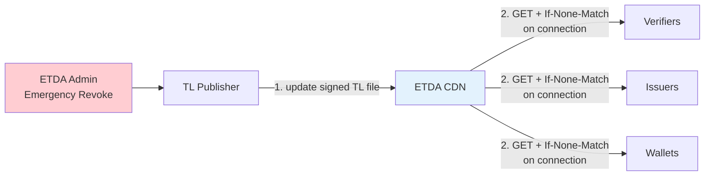

# 12. Key Management, Key Rotation และ Trusted List Deployment

{/* METADATA (agent-only — not rendered to readers)
> **สถานะ:** 📐 Specification — Draft สำหรับการทบทวนเชิงกำกับดูแล (S8, MASA-129 → MASA-153)
> **เวอร์ชันเอกสาร:** 1.2.5 (2026-09-23) — ประวัติการแก้ไขทั้งหมดดูได้ที่ §12.11 บันทึกการเปลี่ยนแปลง
> **แหล่งข้อมูล:** เอกสารสถาปัตยกรรมภายใต้ `th/architecture/` และงานวิจัยภายใน `th/research/` — ดู §12.10 References
> **ขอบเขต:** เอกสารกำกับดูแลและข้อกำหนดสำหรับการตรวจประเมิน ห้ามตีความเป็นผลทดสอบ production
> **เอกสารที่เกี่ยวข้อง:** [11-cryptographic-suites.md](11-cryptographic-suites.md), [13-vc-status-and-revocation.md](13-vc-status-and-revocation.md), [ดัชนีเอกสาร ARF](README.md)
*/}

---

บทที่ 12 กำหนดข้อกำหนดการจัดการกุญแจ (key management) การหมุนเวียนกุญแจ (key rotation) และการวางระบบ Trusted List (Trusted List deployment) รวมถึงการควบคุมระดับเครือข่ายและการดึง Trusted List ผ่าน CDN ด้าน cryptographic suites อยู่ในบทที่ 11 และการเพิกถอน VC ด้วย status list อยู่ในบทที่ 13

---

## 12.1 ขอบเขตและการจำแนกข้อความ

หัวข้อนี้รวมข้อกำหนดด้านการจัดการกุญแจและการวางระบบ Trusted List คือ (1) Key Management และ Key Rotation (2) Resolver และ Network Controls และ (3) การดึง Trusted List แบบ lazy ผ่าน CDN ด้วย HTTP `GET`

**กฎการอ้างอิงของหัวข้อนี้:** ข้อกำหนดทุกข้อ **MUST** สืบย้อนไปยังไฟล์ภายใต้ `th/architecture/` มาตรฐานภายนอกอ้างผ่านไฟล์สถาปัตยกรรมที่ระบุมาตรฐานนั้นไว้แล้ว หัวข้อนี้ **MUST NOT** สร้างข้อกำหนดใหม่ที่ไม่มีฐานในเอกสารสถาปัตยกรรม

การจำแนกข้อความ:

| ป้าย | ความหมาย |
|------|----------|
| **[ข้อเท็จจริง]** | ข้อความที่ปรากฏในเอกสารสถาปัตยกรรมโดยตรง พร้อมเลขอ้างอิง |
| **[ข้อวิเคราะห์]** | การประมวลข้อเท็จจริงหลายแหล่งเข้าเป็นข้อกำหนดเชิงกำกับดูแล |
| **[ช่องว่าง]** | ประเด็นที่เอกสารสถาปัตยกรรมยังขัดกันเองหรือยังไม่กำหนด ต้องมีมติก่อนบังคับใช้ |

คำ **MUST / MUST NOT / SHOULD / MAY** ใช้ตามความหมายเชิงข้อกำหนด: ต้อง / ห้าม / ควร / อาจ

---

## 12.2 ข้อกำหนดการเก็บกุญแจ

**[ข้อเท็จจริง]** ข้อกำหนดการจัดการกุญแจแยกตามผู้ถือกุญแจสี่กลุ่ม ได้แก่ ผู้ออกเอกสาร (issuer) ระบบ Trusted List ของ สพธอ. กระเป๋าเอกสารดิจิทัลของผู้ถือเอกสาร (holder) และผู้ตรวจสอบเอกสาร (verifier) ทั้งนี้ ผู้ตรวจสอบเอกสารต้องมีกุญแจของตนเองเช่นกัน เนื่องจากต้องลงลายมือชื่อ Request Object คือ `client_metadata_jwt` ในคำขอ VP ตาม OID4VP เพื่อให้กระเป๋าเอกสารดิจิทัลตรวจได้ว่าคำขอมาจากผู้ตรวจสอบเอกสารตัวจริง [A-ACP §1, §5.2]

| ผู้ถือกุญแจ | ข้อกำหนด | หลักฐาน | ที่มา |
|------------|---------|---------|-------|
| Issuer | กุญแจลงลายมือชื่ออยู่ใน HSM ระดับ FIPS 140-2 Level 3 | ใบรับรอง HSM | [A-ARCH §8 I1] |
| Issuer | พิธีสร้างกุญแจต้องมีพยานและบันทึกวิดีโอ | รายงานพิธี | [A-ARCH §8 I2] |
| Issuer | แผนหมุนเวียนกุญแจประจำปีเป็นเอกสาร | เอกสารนโยบาย | [A-ARCH §8 I3] |
| ETDA (Trusted List) | กุญแจอยู่ใน HSM ที่ export ไม่ได้ ระดับ FIPS 140-3 Level 3 ขึ้นไป | — | [A-TM §T1] |
| ETDA (Trusted List) | การลงลายมือชื่อ TL ต้องใช้ quorum แบบ M-of-N เช่น 3-of-5 | — | [A-TM §T1] |
| ETDA (Trusted List) | มี emergency key แบบ offline air-gapped สำหรับเพิกถอนกุญแจที่ถูก compromise | — | [A-TM §T1] |
| Wallet (Holder) | กุญแจต้องสร้างใน WSCD และ export ไม่ได้ | WSCD attestation chain | [A-TM §W4], [A-KD06] |
| Verifier (RP) | มีกุญแจลงลายมือชื่อ Request Object (`client_metadata_jwt`) เป็นของตนเอง โดยเลือกวิธีเก็บกุญแจตามระดับความเชื่อมั่นที่ §12.2.1 กำหนด | บันทึกวิธีเก็บกุญแจตามตารางใน §12.2.1 | [A-ACP §1, §5.2] |
| Verifier (RP) | public key ที่ใช้ตรวจ Request Object **MUST** ประกาศให้ตรวจสอบได้ ผ่านทางใดทางหนึ่ง คือ (ก) เผยแพร่ใน Trusted List entry ของผู้ตรวจสอบเอกสาร หรือ (ข) เผยแพร่เป็น DID Document ที่ `did:web` resolve ได้ที่ `/.well-known/did.json` | Trusted List entry หรือ DID Document | [A-VRP] |

**[ข้อเท็จจริง]** Issuer **MUST** ปฏิเสธกุญแจที่ไม่มี `key_storage_verified` เป็น `hardware` หรือ `secure_enclave` และ Trusted List **MAY** ตั้ง flag `requires_hardware_key: true` สำหรับกรณีที่ต้องการความเชื่อมั่นสูง [A-TM §W4]

**[ช่องว่าง G-01 — มีมติกำกับดูแลแล้ว]** เอกสารสถาปัตยกรรมกำหนด FIPS 140-2 Level 3 สำหรับ HSM ของ Issuer [A-ARCH §8 I1] แต่กำหนด FIPS 140-3 Level 3 ขึ้นไปสำหรับ HSM ของ ETDA [A-TM §T1] ทั้งสองข้อใช้กับผู้ถือกุญแจต่างกลุ่มจึงไม่ขัดกันในทางเทคนิค รายงานฉบับนี้กำหนดข้อยุติดังนี้ ผู้ถือกุญแจลงลายมือชื่อทุกกลุ่ม **ต้อง** ใช้ HSM ที่ผ่านการรับรองอย่างน้อยระดับ **FIPS 140-2 Level 3** ตาม NIST FIPS PUB 140-2 [N1] เป็นเกณฑ์ขั้นต่ำ ทั้งนี้ เนื่องจาก NIST กำหนดให้ใบรับรองตาม FIPS 140-2 เปลี่ยนสถานะเป็น Historical ตั้งแต่วันที่ 21 กันยายน 2569 (ค.ศ. 2026) [N3] จึงให้ยอมรับ **FIPS 140-3 Level 3** ตาม NIST FIPS PUB 140-3 [N2] เป็นมาตรฐานสืบทอดที่เทียบเท่าหรือสูงกว่า และ HSM ที่ได้รับการรับรองใหม่ภายหลังวันดังกล่าว **ต้อง** เป็น FIPS 140-3 ด้วยเหตุนี้ HSM ของ ETDA ที่กำหนดเป็น FIPS 140-3 Level 3 จึงเป็นไปตามเกณฑ์ขั้นต่ำนี้อยู่แล้ว

### 12.2.1 ทางเลือกการเก็บกุญแจของผู้ตรวจสอบเอกสาร

**[ช่องว่าง G-07 — มีมติกำกับดูแลแล้ว]** เอกสารสถาปัตยกรรมกำหนดให้ผู้ตรวจสอบเอกสารลงลายมือชื่อ Request Object คือ `client_metadata_jwt` ด้วยกุญแจของตนเอง [A-ACP §5.2] และกำหนดสภาพเป้าหมายให้เก็บกุญแจไว้ในฮาร์ดแวร์ที่ปลอดภัย เช่น HSM หรือ Secure Element แต่การบังคับใช้ HSM กับผู้ตรวจสอบเอกสารทุกรายมีต้นทุนสูง [A-HSM §2] ที่ประชุมกำกับดูแลจึงมีมติกำหนดทางเลือกการเก็บกุญแจของผู้ตรวจสอบเอกสาร 3 แบบตามระดับความเชื่อมั่นของกุญแจ (key assurance) โดยผู้ตรวจสอบเอกสาร **อาจ** เลือกใช้แบบใดแบบหนึ่งได้ตามความพร้อมและงบประมาณ ดังนี้

**[ข้อเท็จจริง]** นิยาม WSCD ครอบคลุมอุปกรณ์เข้ารหัสลับที่ปลอดภัยหลายชนิด ได้แก่ Secure Element, StrongBox, Trusted Execution Environment (TEE) และ HSM [บทที่ 2 §2.36](02-definitions.md) ดังนั้นทางเลือกแบบ TEE หรือ WSCD จึงเป็นการเก็บกุญแจด้วยฮาร์ดแวร์ที่ไม่ใช่ HSM เต็มรูปแบบ

| ตัวเลือกการเก็บกุญแจ Verifier | ระดับข้อบังคับ | key assurance | ต้นทุน | การประกาศ public key |
|------------------------------|:-------------:|:-------------:|:------:|----------------------|
| Soft key (software key store) | **MAY** | ต่ำ | ต่ำ | Trusted List entry หรือ `did:web` ที่ `/.well-known/did.json` |
| TEE หรือ WSCD (Secure Element / StrongBox) | **MAY** | กลาง | กลาง | Trusted List entry หรือ `did:web` ที่ `/.well-known/did.json` |
| HSM | **MAY** | สูง | สูง | Trusted List entry หรือ `did:web` ที่ `/.well-known/did.json` |

**[ข้อวิเคราะห์]** ทั้งสามแบบให้ระดับความเชื่อมั่นของกุญแจต่างกัน รายงานฉบับนี้จึงกำหนดข้อยุติดังนี้ (1) ผู้ตรวจสอบเอกสาร **อาจ** ใช้ soft key ได้ในระยะเปลี่ยนผ่านหรือเมื่อยังไม่พร้อมด้านฮาร์ดแวร์ (2) ผู้ตรวจสอบเอกสาร **ควร** ใช้ TEE หรือ WSCD เป็นอย่างน้อยเพื่อยกระดับความเชื่อมั่นของกุญแจ และ (3) ผู้ตรวจสอบเอกสารที่ต้องการความเชื่อมั่นสูงสุด **อาจ** ใช้ HSM ทั้งนี้ HSM ให้ความเชื่อมั่นสูงสุดแต่มีต้นทุนสูงตามที่ [A-HSM §2] ระบุ จึงไม่บังคับกับผู้ตรวจสอบเอกสารทุกราย

**[ข้อวิเคราะห์]** ไม่ว่าผู้ตรวจสอบเอกสารเลือกวิธีเก็บกุญแจแบบใด **ต้อง** ทำตามเงื่อนไขทุกข้อดังนี้

- public key ที่คู่กับกุญแจลงลายมือชื่อ **MUST** ประกาศให้ตรวจสอบได้ ผ่านทางใดทางหนึ่ง คือ (ก) ผูกกับ Verifier entry ใน Trusted List ของผู้ตรวจสอบเอกสาร หรือ (ข) เผยแพร่เป็น DID Document ที่ `did:web` published ที่ `https://<domain>/.well-known/did.json` [A-VRP §7]
- Verifier entry **MUST** อยู่ใน Trusted List และผู้ตรวจสอบเอกสาร **MUST NOT** ใช้ `client_id` แบบ `redirect_uri` ที่ไม่มี DID เพราะกระเป๋าเอกสารดิจิทัลจะถือว่าเป็นผู้ตรวจสอบเอกสารที่ไม่ได้ลงทะเบียน [A-VRP §7]
- ผู้ตรวจสอบเอกสารที่ใช้ soft key **SHOULD** ย้ายไปเก็บกุญแจในฮาร์ดแวร์ที่ปลอดภัย คือ TEE, WSCD หรือ HSM เมื่อพร้อม เพื่อยกระดับความเชื่อมั่นของกุญแจ [A-HSM §2]

---

## 12.3 Rotation Trigger

**[ข้อเท็จจริง]** trigger ที่ทำให้ต้องหมุนเวียนกุญแจ [A-KD08 §1]

| Trigger | การดำเนินการ |
|---------|-------------|
| ครบกำหนดเวลา | หมุนเวียนรายปีสำหรับ Level 1 และหมุนเวียนต่อใบเมื่อ VC ออกใหม่ |
| ผู้ใช้แจ้งอุปกรณ์สูญหาย (compromise) | ล้างข้อมูลฉุกเฉินแล้วกู้คืน |
| OS ยกเลิกกุญแจ (เปลี่ยน biometric) | iOS/Android ยกเลิกกุญแจ จึงต้องออก VC ใหม่ |
| ผู้ใช้ร้องขอ | หมุนเวียนด้วยตนเอง |
| เลิกใช้ algorithm | ย้าย algorithm เช่น `ES256 → ES384` |

---

## 12.4 Lifecycle ตามระดับกุญแจ

**[ข้อเท็จจริง]** นโยบายและผลกระทบของการหมุนเวียนแต่ละระดับ [A-KD08 §2]

| ระดับ | ค่าปริยาย | ผลกระทบ |
|-------|----------|---------|
| Level 0 (Master Seed) | ไม่หมุนเวียน เพราะ mnemonic เป็นค่าถาวร | ถ้าสร้างใหม่เท่ากับได้ตัวตนใหม่ ต้องออก VC ใหม่ทั้งหมด |
| Level 1 (Wallet Identity) | หมุนเวียนรายปี เป็นข้อแนะนำ ไม่บังคับ | ได้ `did:key` หรือ `did:jwk` ใหม่ VC เดิมไม่กระทบ |
| Level 3 (Per-credential `cnf`) | เมื่อ VC ออกใหม่ | สร้างกุญแจใหม่ใน WSCD แล้วขอ VC ใหม่ |

**[ข้อเท็จจริง]** ข้อแลกเปลี่ยนที่บันทึกไว้คือ หมุนเวียนถี่ได้ forward secrecy ดีขึ้นแต่บริการสะดุดและมีต้นทุน หมุนเวียนห่างระบบเสถียรแต่หน้าต่างความเสี่ยงจาก compromise ยาวขึ้น ข้อสรุปที่แนะนำคือหมุนเวียนรายปีสำหรับ Level 1 ร่วมกับหมุนเวียนตาม trigger ต่อใบ [A-KD08 §10]

---

## 12.5 Rotation Endpoint

**[ข้อเท็จจริง]** Issuer **SHOULD** เปิด endpoint `POST /credential/rotate` โดยรับ `old_vc`, `proof` ซึ่งเป็น PoP ที่ลงลายมือชื่อด้วยกุญแจ `cnf` เดิม และ `new_cnf` แล้วส่งกลับ credential ใหม่ [A-KD08 §7]

**[ข้อเท็จจริง]** ลำดับการหมุนเวียนต่อใบคือ Wallet สร้างกุญแจใหม่ใน WSCD ลงลายมือชื่อคำขอด้วยกุญแจเดิมเพื่อพิสูจน์ความเป็นเจ้าของ Issuer ตรวจ PoP ด้วยกุญแจเดิม ออก VC ใหม่ที่ผูกกับ `cnf` ใหม่ แล้ว **mark VC เดิมใน Status List ว่า `rotated`** จากนั้น Wallet ลบ key handle เดิม [A-KD08 §3]

**[ข้อวิเคราะห์]** ขั้นตอน mark VC เดิมเป็น `rotated` **MUST** สำเร็จก่อนที่ Wallet จะลบ key handle เดิม เพราะถ้าลบก่อนแล้วการ mark ล้มเหลว VC เดิมจะยังอยู่ในสถานะใช้ได้ โดยไม่มีผู้ใดถือกุญแจที่จะเพิกถอนได้

---

## 12.6 การจัดการกุญแจที่ถูก Compromise

**[ข้อเท็จจริง]** ข้อกำหนดที่เกี่ยวข้องกับกุญแจ Issuer ที่ถูกขโมย [A-TM §I3, §I7]

- Trusted List **MUST** กำหนด `valid_from` และ `valid_until` **ต่อกุญแจ** ไม่ใช่ต่อ entry
- Wallet **MUST** ตรวจว่า `iat` ของ VC อยู่ในช่วง `valid_from..valid_until` ของกุญแจที่ลงลายมือชื่อ
- การเพิกถอนฉุกเฉิน **MUST** แพร่กระจายภายใน 1 ชั่วโมง
- เมื่อ Issuer แจ้งหมุนเวียนกุญแจ ETDA **MUST** ตรวจแล้วเผยแพร่ TL ใหม่ภายใน 24 ชั่วโมง
- Wallet **MUST NOT** ใช้กุญแจจาก DID Document แทนกุญแจจาก TL แม้ DID Document จะถูกแก้ให้ดูถูกต้อง

**[ข้อเท็จจริง]** การเพิกถอนแบบกลุ่มเมื่อผู้ใช้แจ้งอุปกรณ์สูญหายมีขั้นตอนคือ ผู้ใช้แจ้งผ่านพอร์ทัล ETDA พร้อมพิสูจน์ตัวตน ETDA บันทึกเหตุการณ์แล้วสั่งเพิกถอน VC ทั้งหมดที่ผูกกับ master seed ของผู้ใช้ จากนั้นผู้ใช้กู้คืนด้วย mnemonic บนอุปกรณ์ใหม่แล้วขอออก VC ใหม่ [A-KD08 §5]

**[ข้อเท็จจริง]** เอกสารสถาปัตยกรรมบันทึกข้อกังวลด้าน privacy ไว้เองว่า การเพิกถอนแบบกลุ่มต้องให้ผู้ให้บริการ Wallet เก็บความเชื่อมโยงระหว่าง master seed กับประวัติการออก VC และแนวทางในอนาคตคือใช้ self-attested revocation token แทน [A-KD08 §5]

**[ข้อเท็จจริง]** การปฏิบัติตาม CIR 2024/2979 ที่บันทึกไว้คือ หมุนเวียนกุญแจได้ กุญแจเดิมใช้ซ้ำไม่ได้เพราะ mark เป็น `rotated` ใน Status List มี audit trail จากประวัติ KSN และ rotation log และผู้ใช้ควบคุมการหมุนเวียนได้เอง [A-KD08 §8]

---

## 12.7 Resolver และ Network Controls

**[ข้อเท็จจริง]** ระบบแยกหน้าที่ออกเป็นสองบริการที่ไม่ปะปนกัน (1) Trusted List ของ สพธอ. เป็นแหล่งข้อมูลอ้างอิงหลักของการอนุญาต โดยระบุ `entity_type`, `status`, `certification` และ `scope` ของแต่ละเอนทิตี เมื่อ entry ถูกระงับจะระบุ `status: "suspended"` และเมื่อไม่พบ entry จะระบุว่าเอนทิตีนั้นไม่อยู่ใน Trusted List (2) Universal Resolver ที่ `https://resolver.etda.or.th` ทำหน้าที่ resolve DID Document เฉพาะ custom DID (เช่น `did:ndid`) ที่เอนทิตี resolve เองไม่ได้เท่านั้น และส่งกลับเฉพาะ `didDocument` โดยไม่เกี่ยวข้องกับการค้นหรือการตัดสินสถานะใน Trusted List [A-ARCH §6]

**[ข้อวิเคราะห์]** การตัดสิน trust **MUST** มาจากผลการค้นใน Trusted List ไม่ใช่จากผลการ resolve DID ผู้เรียกใช้ **MUST** ถือว่าการไม่พบ entry ใน Trusted List หรือ entry ที่ `status` ไม่ active คือผลลบ และ **MUST NOT** ใช้ `didDocument` ที่ resolve ได้เป็นหลักฐานการอนุญาต เพราะจะข้าม gate `TL_ENTRY_LOOKUP` และ `ENTRY_STATUS_CHECK` ที่ threat model กำหนดไว้ [A-TM §3.0]

**[ข้อเท็จจริง]** มาตรการระดับเครือข่ายและการเผยแพร่ที่กำหนดไว้

| มาตรการ | ป้องกัน | ที่มา |
|---------|---------|-------|
| บังคับ DNSSEC สำหรับโดเมน `.go.th` ทั้งหมด | did:web hijack จาก DNS poisoning | [A-TM §I1] |
| CAA record และ DNS pinning ใน TL entry | domain takeover | [A-TM §I1] |
| ตรวจ homograph แบบ IDN mixed-script และห้าม UI แสดง raw DID | lookalike DID | [A-TM §I2] |
| ลายมือชื่อ JWT บน TL โดย CDN ไม่ถือกุญแจลงลายมือชื่อ | CDN ถูก compromise | [A-TM §T2] |
| Multi-CDN แบบ primary กับ secondary และ tertiary พร้อม DNS fallback | eclipse attack แบบ DoS | [A-TM §T2, §T3] |
| Graceful degradation โดยแสดงคำเตือนและจำกัดฟีเจอร์ที่ต้องใช้ TL สด | eclipse attack | [A-TM §T3] |
| `client_id_scheme: x509_san_dns` สำหรับ verifier ที่อยู่ใน TL | client_id spoofing | [A-TM §V1] |
| `response_uri` ต้องตรงกับ SAN ของ `client_id` | MITM proxy | [A-TM §V4] |
| `nonce` กับ `aud` ใน VP token และอายุ token ไม่เกิน 5 นาที | cross-verifier replay | [A-TM §V5] |
| Cross-signed bridge TL และตรวจ scope ตามเขตอำนาจ | cross-border TL substitution | [A-TM §T7] |

**[ข้อวิเคราะห์]** เอกสารนี้ **MUST NOT** ถูกใช้เป็นหลักฐานว่ามาตรการข้างต้นทำงานจริง การอนุมัติขึ้นใช้งาน **MUST** มีหลักฐานจากการทดสอบใน staging ได้แก่ signed fixture ผลการทดสอบเชิงลบ และรายงาน fault injection

---

## 12.8 การดึง Trusted List แบบ Lazy ผ่าน CDN

**[ข้อเท็จจริง]** Trusted List เป็นไฟล์ static ที่ลงลายมือชื่อโดย สพธอ. และเผยแพร่ผ่าน CDN ผู้ใช้บริการไม่ต้องเชื่อถือ CDN เพราะต้องตรวจลายมือชื่อของ Trusted List ก่อนใช้งาน [research/41]

**[ข้อกำหนด]** Wallet, Issuer และ Verifier **MUST** ดึง Trusted List ด้วย HTTP `GET` เมื่อเกิด connection หรือก่อนตัดสินใจด้านความน่าเชื่อถือเท่านั้น ระบบ **MUST NOT** ใช้ message broker หรือ background polling เพื่อแจ้งหรือดึงการเปลี่ยนแปลงของ Trusted List [research/41]

### 12.8.1 ขั้นตอนการดึงและตรวจสอบ

1. เรียก `GET /tl-{type}.jwt` ไปยัง CDN พร้อม `If-None-Match` หากมีค่า `ETag` ที่เก็บไว้
2. หาก CDN ตอบ `304 Not Modified` ให้ใช้ไฟล์ใน cache เดิม หากตอบ `200 OK` ให้รับไฟล์ใหม่
3. ตรวจลายมือชื่อ JWT ด้วย public key ของ สพธอ. แล้วตรวจ `seq` ว่าใหม่กว่า cache และ `next_update` ยังไม่หมดอายุ
4. หากตรวจผ่าน ให้บันทึกไฟล์และ `ETag` ใหม่ หากตรวจไม่ผ่าน ให้ปฏิเสธไฟล์และไม่เปลี่ยน cache เดิม

### 12.8.2 Lazy pull มีผลต่อผู้ใช้บริการอย่างไร

| ผู้ใช้บริการ | จุดที่เรียก `GET` | ผลที่ผู้ใช้เห็น |
|---|---|---|
| Wallet | เมื่อรับ VC หรือได้รับ VP Request | ลดการแสดงคำขอจาก Verifier ที่สถานะไม่ active และไม่ต้องเชื่อมต่อเพื่อ polling ระหว่างไม่ได้ใช้งาน |
| Issuer | เมื่อ Wallet ขอรับ VC | ตรวจสอบ Wallet Provider ที่เกี่ยวข้องก่อนออก VC โดยไม่ต้องดูแลช่องทางรับการแจ้งเตือนแยก |
| Verifier | เมื่อรับ VP | ตรวจสอบ Issuer และสถานะที่ใช้ตัดสินใจจากข้อมูลล่าสุดที่ CDN ส่งให้ โดยไม่ต้องติดตั้งช่องทางแจ้งเตือนแยก |

แนวทางนี้เรียกว่า **lazy pulling** เพราะระบบดึงข้อมูลเมื่อมีการใช้งานจริง ไม่ดึงเป็นระยะในช่วงที่ไม่มี connection จึงลดการใช้แบตเตอรี่ CPU bandwidth และ request ของ CDN ขณะเดียวกันการตรวจ Trustlist เกิดตรงจุดที่มีการตัดสินใจจริง [research/41]

**รูปที่ 12-1 ภาพรวมการดึง Trusted List แบบ lazy ผ่าน CDN**

---

## 12.9 ช่องว่างที่เกี่ยวข้อง

**[ข้อวิเคราะห์]** ช่องว่าง G-01 เรื่องระดับการรับรอง HSM ได้ข้อยุติแล้ว โดยกำหนดเกณฑ์ขั้นต่ำเป็น FIPS 140-2 Level 3 และยอมรับ FIPS 140-3 Level 3 เป็นมาตรฐานสืบทอด และช่องว่าง G-07 เรื่องการเก็บกุญแจของผู้ตรวจสอบเอกสารได้ข้อยุติแล้วเช่นกัน โดยกำหนดทางเลือก 3 แบบ คือ soft key, TEE หรือ WSCD, และ HSM ซึ่ง HSM ให้ความเชื่อมั่นสูงสุดแต่มีต้นทุนสูง ทั้งนี้ ไม่ว่าเลือกวิธีเก็บกุญแจแบบใด ผู้ตรวจสอบเอกสาร **ต้อง** ประกาศ public key ให้ตรวจสอบได้ผ่าน Trusted List หรือ DID Document ที่ `did:web` รายละเอียด G-01 ปรากฏใน §12.2 และรายละเอียด G-07 ปรากฏใน §12.2.1

---

{/* METADATA (agent-only — not rendered to readers)
## 12.10 References

### 12.10.1 แหล่งข้อมูลหลัก — เอกสารสถาปัตยกรรมในโครงการ

วันที่เข้าถึงทุกไฟล์: **2026-08-06** โดยอ้างสถานะ repository ณ เวอร์ชันเอกสาร 1.0.0

| รหัส | เอกสาร | เวอร์ชันที่ระบุในไฟล์ |
|------|--------|---------------------|
| A-ARCH | [../architecture/01-architecture.md](../architecture/01-architecture.md) — สถาปัตยกรรมความน่าเชื่อถือแบบ Trusted List | v2.3 |
| A-TM | [../architecture/phase2/trustlist/10-threat-model.md](../architecture/phase2/trustlist/10-threat-model.md) — Trust List Verification: Threat Model & Mitigations | Draft v1.0 |
| A-KD08 | [../architecture/phase2/key-derivation/08-key-rotation-lifecycle.md](../architecture/phase2/key-derivation/08-key-rotation-lifecycle.md) — Key Rotation & Lifecycle | Draft v1.0 |
| A-KD06 | [../architecture/phase2/key-derivation/06-wscd-key-attestation.md](../architecture/phase2/key-derivation/06-wscd-key-attestation.md) — WSCD Key Attestation | Draft v1.0 |
| A-ACP | [../architecture/phase2/trustlist/05-access-certificate-profile.md](../architecture/phase2/trustlist/05-access-certificate-profile.md) — Access Certificate Profile (ETSI TS 119 411-8) | Draft v1.0 |
| A-VRP | [../policy/01-verifier-registration-policy.md](../policy/01-verifier-registration-policy.md) — นโยบายการลงทะเบียนผู้ตรวจสอบ | Draft v1.0 |
| A-HSM | [../policy/07-hsm-and-schema-governance-policy.md](../policy/07-hsm-and-schema-governance-policy.md) — นโยบาย HSM Service Model และ Schema Governance | Draft v1.0 |

### 12.10.2 แหล่งข้อมูลงานวิจัยภายในโครงการ

| รหัส | เอกสาร | เวอร์ชันที่ระบุในไฟล์ |
|------|--------|---------------------|
| research/41 | [../research/41-trustlist-serving-filecdn-etag-binary.md](../research/41-trustlist-serving-filecdn-etag-binary.md) — Trustlist ผ่าน File/Edge CDN และ lazy revalidation | v1.10 |

### 12.10.3 มาตรฐานภายนอกที่อ้างผ่านเอกสารข้างต้น

เอกสารนี้ไม่อ้างมาตรฐานภายนอกโดยตรง รายการต่อไปนี้คือมาตรฐานที่ไฟล์สถาปัตยกรรมและงานวิจัยที่อ้างในหัวข้อ §12.2–§12.8 ระบุไว้เป็นแหล่งข้อมูลของตน

| มาตรฐาน | ส่วนที่อ้าง | ไฟล์ที่อ้าง |
|---------|-----------|-----------|
| IETF Token Status List | `draft-ietf-oauth-status-list-18` (สถานะ `rotated` และการเพิกถอน) | A-KD08, A-TM, research/41 |
| CIR 2024/2979 | ข้อกำหนดการหมุนเวียนกุญแจ | A-KD08 |
| EU eIDAS ARF | §6 WSCD และการจัดการกุญแจ | A-KD08, A-KD06 |
| RFC 4033 | DNSSEC | A-TM §I1 |
| RFC 9162 | Certificate Transparency v2 | A-TM §I4 |
| RFC 5891 และ Unicode TR 39 | IDN และการตรวจ homograph | A-TM §I2 |

### 12.10.4 แหล่งอ้างอิง NIST สำหรับข้อกำหนด HSM

ระดับการรับรอง HSM ในหัวข้อนี้อ้างอิงมาตรฐานของ National Institute of Standards and Technology (NIST) โดยตรง เนื่องจากเอกสารสถาปัตยกรรม [A-ARCH §8 I1] และ [A-TM §T1] ระบุระดับ FIPS ไว้แล้ว รายการนี้จึงระบุแหล่งที่มาที่ตรวจสอบได้ของมาตรฐานดังกล่าว

- [N1] NIST, "FIPS PUB 140-2 — Security Requirements for Cryptographic Modules", พฤษภาคม ค.ศ. 2001 (ปรับปรุงตาม Change Notice ธันวาคม ค.ศ. 2002) — https://csrc.nist.gov/pubs/fips/140-2/upd2/final
- [N2] NIST, "FIPS PUB 140-3 — Security Requirements for Cryptographic Modules", มีนาคม ค.ศ. 2019 — https://csrc.nist.gov/pubs/fips/140-3/final
- [N3] NIST, "Cryptographic Module Validation Program (CMVP) — FIPS 140-2 Transition" — ใบรับรองตาม FIPS 140-2 เปลี่ยนสถานะเป็น Historical ตั้งแต่วันที่ 21 กันยายน ค.ศ. 2026 — https://csrc.nist.gov/projects/cryptographic-module-validation-program

---

## 12.11 บันทึกการเปลี่ยนแปลง

| เวอร์ชัน | วันที่ | รายละเอียด |
|---------|-------|-----------|
| 1.2.5 | 2026-09-23 | เปลี่ยนการกระจาย Trusted List จาก message broker เป็นการดึงด้วย HTTP `GET` แบบ lazy ผ่าน CDN พร้อม `ETag` และเพิ่มผลกระทบต่อ Wallet, Issuer และ Verifier โดยอ้างอิง research/41 |
| 1.2.4 | 2026-08-06 | ลบกุญแจ Level 2 (Pairwise ต่อ Verifier) ออกจากตาราง lifecycle (§12.4) และ rotation trigger (§12.3) และตัดการอ้างถึง Phase 2/Phase 3 ใน §12.5 และ §12.6 ตามมติให้ยกเลิก pairwise DID และการแบ่งระยะ (MASA-157) |
| 1.2.3 | 2026-08-06 | ตัดข้อกำหนดและมาตรการที่อ้างอิงช่องทางสื่อสารแบบ transport ออกจากบทนี้ทั้งหมด เพราะเป็นการควบคุมระดับ transport ไม่ใช่เรื่อง key management บทนี้จึงคงเฉพาะข้อกำหนดการเก็บกุญแจ การประกาศ public key และการหมุนกุญแจ (MASA-153) |
| 1.2.2 | — | ข้ามหมายเลข ไม่มีการออกเวอร์ชันนี้ |
| 1.2.1 | 2026-08-06 | ตัดกลไกประกาศ public key ของผู้ตรวจสอบเอกสารแบบฝังใน Verifier Attestation ออกจากขอบเขต คงไว้สองทางคือ Trusted List entry หรือ DID Document (`did:web`) (MASA-153) |
| 1.2.0 | 2026-08-06 | เพิ่มผู้ตรวจสอบเอกสาร (Verifier) เป็นผู้ถือกุญแจกลุ่มที่ 4 และมติ G-07 ทางเลือกการเก็บกุญแจ 3 แบบ (soft key / TEE-WSCD / HSM) พร้อมกำหนดการประกาศ public key ผ่าน Trusted List หรือ DID Document (`did:web`) และตัดข้อกำหนด Access Certificate ออกจากขอบเขต (MASA-153) |

---

**สถานะเอกสาร:** Living document — ทบทวนพร้อม [A-TM] ทุกไตรมาส หรือเมื่อ Trusted List ขึ้น minor version
**ผู้ดูแล:** ETDA Security Team

---
*/}

**การนำทาง:** [⬅️ บทที่ 11 — Cryptographic Suites](11-cryptographic-suites.md) · [⬆️ สารบัญ ARF](README.md) · [บทที่ 13 — VC Status และ Revocation ➡️](13-vc-status-and-revocation.md)
