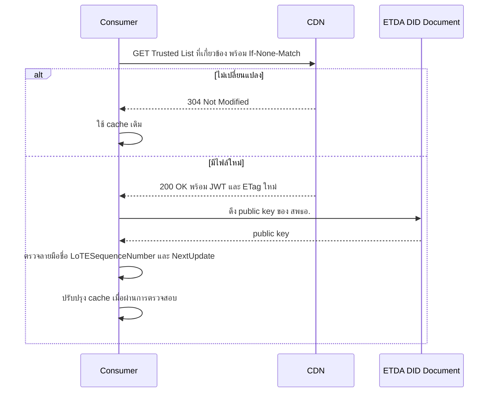

# 12.1 ข้อกำหนดการเผยแพร่ Trusted List

{/* METADATA (agent-only — not rendered to readers)
> **สถานะ:** ส่วนขยายของ Thai VC ARF เวอร์ชัน 2.1 — กำลังย้ายไปใช้ payload แบบ LoTE ใน JWT
> **วัตถุประสงค์:** ระบุประเภท จำนวนไฟล์ รูปแบบ โครงสร้างข้อมูล และตัวอย่างของ Trusted List ที่ใช้ในระบบกระเป๋าเอกสารดิจิทัล (Document Wallet)
> **เอกสารที่เกี่ยวข้อง:** [บทที่ 9 — Trust Model 3](09-trust-model-3.md) · [บทที่ 12 — Key Management และ Trusted List Deployment](12-key-management-and-trustlist-deployment.md) · [บทที่ 13 — VC Status และการเพิกถอน](13-vc-status-and-revocation.md)
*/}

## 12.1.1 ขอบข่าย

เอกสารฉบับนี้สรุปรูปแบบเป้าหมายของ Trust List สำหรับประเทศไทยตาม [ผลการวิเคราะห์ JWT ที่อ้างอิง LoTE](../research/42-trusted-list-lote-jwt-format.md) และ [บทสรุปความสอดคล้องขั้นต่ำ](00-minimal-interoperability-reference.md) โดยแยกข้อมูลที่พบใน JWT ตัวอย่างออกจากเขตข้อมูลที่ Thai profile ยังต้องกำหนดก่อนใช้งานจริง [1][2]

ข้อกำหนดการใช้ Trusted List นี้ใช้ร่วมกันใน Trust Model 1, Trust Model 2 และ Trust Model 3 โดยความแตกต่างของแบบจำลองอยู่ที่วิธีผูกและตรวจสอบกุญแจหรือใบรับรองของเอนทิตี [บทที่ 6.5](06.5-trust-building-mechanism.md)

ดังนั้น ไม่ว่าใช้แบบจำลองใด ระบบต้องดึง Trusted List ที่เกี่ยวข้อง ตรวจลายมือชื่อ JWT ตรวจสถานะ บทบาท และช่วงเวลาที่มีผลใช้ได้ก่อนตัดสินใจเชื่อถือเอนทิตี ห้ามใช้การตรวจสอบสายใบรับรองหรือ DID แทนการตรวจ Trusted List

payload ของ JWT อ้างอิงชื่อและลำดับชั้นข้อมูลของ List of Trusted Entities (LoTE) ตาม ETSI TS 119 602 ส่วนการห่อด้วย JWT จุดเผยแพร่ และกฎรายบทบาทเป็น Thai profile จึงยังไม่อาจกล่าวอ้างความสอดคล้องกับ LoTE ของ EUDI โดยสมบูรณ์ การตรวจสถานะ VC รายฉบับใช้ Token Status List [1][2]

## 12.1.2 ประเภทและจำนวนไฟล์

สพธอ. ต้องเผยแพร่ Trust List จำนวน 3 ไฟล์ โดยแยกตามบทบาทของเอนทิตี เพื่อให้ผู้ใช้งานดึงเฉพาะข้อมูลที่จำเป็นต่อการตัดสินใจด้านความน่าเชื่อถือ [1]

| ลำดับ | Trusted List ที่เกี่ยวข้อง | Endpoint | เอนทิตีที่บันทึก | ผู้เรียกใช้หลัก | เหตุการณ์ที่ใช้ตรวจสอบ |
|:---:|---|---|---|---|---|
| 1 | Issuer Trusted List | `https://trustme.etda.or.th/.well-known/iss.txt` | ผู้ออกเอกสาร (issuer) | Wallet และ Verifier | ก่อนรับหรือก่อนตรวจสอบ VC |
| 2 | Verifier Trusted List | `https://trustme.etda.or.th/.well-known/ver.txt` | ผู้ตรวจสอบเอกสาร (verifier) | Wallet | ก่อนนำเสนอ VP |
| 3 | Wallet Provider Trusted List | `https://trustme.etda.or.th/.well-known/wp.txt` | ผู้ให้บริการกระเป๋าเอกสารดิจิทัล (wallet provider) | Issuer และ Verifier | ก่อนออก VC หรือก่อนตรวจสอบ Wallet Unit |

การแยกไฟล์ดังกล่าวทำให้การเปลี่ยนแปลงข้อมูลของบทบาทหนึ่งไม่กระทบ cache ของอีกบทบาทหนึ่ง และทำให้แต่ละระบบดึงข้อมูลเฉพาะที่เกี่ยวข้องกับหน้าที่ของตน [1]

## 12.1.3 รูปแบบไฟล์และการเผยแพร่

Trusted List ทั้ง 3 รายการมีเนื้อหาเป็น compact JWS ในรูป `header.payload.signature` ซึ่ง สพธอ. ลงลายมือชื่อและเผยแพร่ผ่าน CDN จุดเผยแพร่ที่ระบุใน §12.1.2 ใช้นามสกุล `.txt` โดยเนื้อหาภายในยังคงเป็น compact JWS ผู้ใช้ข้อมูลต้องตรวจลายมือชื่อด้วย trust anchor ของ สพธอ. ก่อนใช้ payload [1][2]

การดึงข้อมูลต้องใช้ HTTP conditional request โดยเก็บค่า `ETag` จากการตอบกลับครั้งก่อนและส่ง `If-None-Match` เมื่อมีการตรวจสอบครั้งถัดไป หากได้รับ `304 Not Modified` ให้ใช้ Trusted List ที่เกี่ยวข้องซึ่งจัดเก็บไว้เดิม หากได้รับ `200 OK` พร้อมไฟล์ใหม่ ให้ดึง Trusted List ที่เกี่ยวข้องฉบับเต็ม ตรวจลายมือชื่อ และตรวจ `LoTE.ListAndSchemeInformation.LoTESequenceNumber` กับ `LoTE.ListAndSchemeInformation.NextUpdate` ก่อนแทนที่ cache ทั้งนี้ การเผยแพร่ระยะปัจจุบันไม่ใช้ API key, delta หรือไฟล์ CBOR [1][2][3]

`ETag` ใช้ตรวจการเปลี่ยนแปลงของไฟล์ ส่วนความถูกต้องและความครบถ้วนของเนื้อหาต้องตรวจจากลายมือชื่อบน JWT [1]

```text
GET https://trustme.etda.or.th/.well-known/iss.txt
If-None-Match: "urn:etda:trusted-list:issuer:2026-v42"

304 Not Modified
```

## 12.1.4 โครงสร้างข้อมูล

payload ที่ถอดรหัสจาก JWT ตัวอย่างใช้ `LoTE` เป็นวัตถุระดับบน มีข้อมูลรายการใน `ListAndSchemeInformation` และมีรายการองค์กรใน `TrustedEntitiesList[]` โดยแต่ละองค์กรมี `TrustedEntityInformation` และ `TrustedEntityServices[]` ตารางต่อไปนี้แสดงเฉพาะชื่อเขตข้อมูลที่พบในตัวอย่าง issuer, verifier และ wallet provider ส่วนฟิลด์บังคับทั้งหมดต้องกำหนดใน Thai profile [1]

| เส้นทางใน payload | ข้อมูลที่พบในตัวอย่าง |
|---|---|
| `LoTE.ListAndSchemeInformation.LoTEVersionIdentifier` | เวอร์ชันของโครงสร้างรายการ |
| `LoTE.ListAndSchemeInformation.LoTESequenceNumber` | ลำดับของรายการ ใช้ตรวจ rollback |
| `LoTE.ListAndSchemeInformation.LoTEType` | ชนิดของรายการ; Thai profile ยังต้องตรึง URI ที่อนุญาต |
| `LoTE.ListAndSchemeInformation.SchemeTerritory` | เขตอำนาจของ scheme เช่น `TH` |
| `LoTE.ListAndSchemeInformation.SchemeName[]` | ชื่อ scheme พร้อมภาษา |
| `LoTE.ListAndSchemeInformation.ListIssueDateTime` | เวลาเผยแพร่รายการ |
| `LoTE.ListAndSchemeInformation.NextUpdate` | เวลาที่ต้องตรวจความสดใหม่ของรายการ |
| `LoTE.TrustedEntitiesList[]` | รายการองค์กร; ตัวอย่าง wallet provider ยังเป็นอาร์เรย์ว่าง |
| `TrustedEntitiesList[].TrustedEntityInformation.TEName[]` | ชื่อองค์กรพร้อมภาษา |
| `TrustedEntitiesList[].TrustedEntityServices[].ServiceInformation.ServiceTypeIdentifier` | ชนิดบริการ; Thai profile ยังต้องตรึง URI ที่อนุญาต |
| `TrustedEntitiesList[].TrustedEntityServices[].ServiceInformation.ServiceName[]` | ชื่อบริการพร้อมภาษา |
| `TrustedEntitiesList[].TrustedEntityServices[].ServiceInformation.ServiceDigitalIdentity.PublicKeyValues[]` | กุญแจสาธารณะของบริการ หากประกาศโดยตรง |
| `TrustedEntitiesList[].TrustedEntityServices[].ServiceInformation.ServiceDigitalIdentity.X509Certificates[]` | ใบรับรอง X.509 ของบริการ; พบในตัวอย่าง issuer |
| `TrustedEntitiesList[].TrustedEntityServices[].ServiceInformation.ServiceDigitalIdentity.OtherIds[]` | ตัวระบุอื่นของบริการ เช่น DID |

OID4VP TC-2 กำหนดให้ Wallet รัฐบาลส่ง WIA/WIA-PoP ส่วน Wallet เอกชนเลือกส่งหรือไม่ส่งได้ ดังนั้น Thai profile ต้องกำหนดข้อมูลที่ Verifier ใช้จำแนก Wallet แต่ละรายการว่าเป็น Wallet รัฐบาลหรือเอกชน โดยข้อมูลดังกล่าวต้องเผยแพร่หรืออ้างอิงจากแหล่งที่เชื่อถือได้ ตรวจสอบความถูกต้องและความสดใหม่ได้ และต้องไม่อาศัยการมีหรือไม่มี WIA เป็นตัวตัดสินประเภท Wallet เอง วิธีบันทึกข้อมูลและชื่อ field ยังไม่ปรากฏในตัวอย่าง Trusted List จึงต้องกำหนดใน profile ก่อนใช้งานจริง หาก Verifier ไม่สามารถตรวจประเภทหรือความสดใหม่ของข้อมูลได้ ให้ปฏิเสธ VP; ห้ามถือว่าข้อมูลที่ขาดหายหมายถึง Wallet เอกชน

หลักการของไทยกำหนดให้ตรวจสถานะระดับองค์กรและระดับบริการเป็น `active` และตรวจขอบเขตสิทธิ์ของ Issuer, Verifier และ Wallet Provider ตามบทบาท แต่ JWT ตัวอย่างทั้งสามยังไม่แสดงฟิลด์สถานะครบทั้งสองระดับ หรือฟิลด์ประเภท VC/claims ของ Issuer และ claims กับวัตถุประสงค์ของ Verifier จึงยังไม่อาจยืนยันชื่อและเส้นทางฟิลด์เหล่านั้นจากตัวอย่างได้ Thai profile ต้องกำหนดฟิลด์ดังกล่าวพร้อมกฎการตรวจสอบก่อนใช้งานจริง [1][2]

ผู้ใช้ข้อมูลต้องปฏิเสธการตัดสินใจด้านความน่าเชื่อถือ หากไม่สามารถยืนยันสถานะระดับองค์กรและระดับบริการ ขอบเขตสิทธิ์ที่จำเป็น ลายมือชื่อ ชนิดรายการ ลำดับรายการ และเวลาที่มีผลใช้ได้จาก profile ที่ประกาศใช้ [1][2]

## 12.1.5 ตัวอย่าง payload

โครงสร้าง Issuer Trusted List ต่อไปนี้เป็นข้อเสนอใน [research/42](../research/42-trusted-list-lote-jwt-format.md) เพื่อแสดงข้อมูลที่ Thai profile ยังต้องกำหนด ส่วน JWT ตัวอย่างฉบับปัจจุบันมี compact JWS ครบสามส่วนและมีบริการออกเอกสาร 3 รายการ แต่ยังไม่มีฟิลด์สถานะและประเภท VC ที่ออกได้ และยังไม่ได้ตรวจลายมือชื่อ ค่า `LoTEType` ใน JWT ตัวอย่างเป็น URI `EUPubEAAProvidersList` ใน namespace ของ ETSI; ค่า `ThaiIssuersList` ด้านล่างเป็น URI ที่เสนอและยังรอการประกาศใช้ [1]

```json
{
  "LoTE": {
    "ListAndSchemeInformation": {
      "LoTEType": "https://uri.etda.or.th/19602/LoTEType/ThaiIssuersList",
      "LoTESequenceNumber": 1,
      "ListIssueDateTime": "2026-09-24T00:00:00Z",
      "NextUpdate": "2026-09-25T00:00:00Z"
    },
    "TrustedEntitiesList": [
      {
        "TrustedEntityInformation": {
          "TEName": [{"lang": "th", "value": "หน่วยงานตัวอย่าง"}]
        },
        "TrustedEntityServices": [
          {
            "ServiceInformation": {
              "ServiceTypeIdentifier": "https://uri.etda.or.th/19602/SvcType/CredentialIssuer",
              "status": "active",
              "ServiceDigitalIdentity": {
                "OtherIds": ["did:web:issuer.example.th"]
              },
              "credential_types": ["https://credentials.dopa.go.th/ThaiNationalIDCredential"]
            }
          }
        ]
      }
    ]
  }
}
```

โครงสร้างการตรวจสอบใช้ลำดับดังรูปแบบต่อไปนี้ โดยการตัดสินใจต้องเกิดภายหลังการตรวจลายมือชื่อและเวลาที่มีผลใช้ได้ของข้อมูลแล้ว [1]



## 12.1.6 ข้อกำหนดสำหรับผู้ใช้ข้อมูล

Wallet, Issuer และ Verifier ต้องใช้เฉพาะ JWT ที่ผ่านการตรวจลายมือชื่อแล้ว ต้องตรวจ `LoTEType`, `LoTESequenceNumber`, `ListIssueDateTime` และ `NextUpdate` ใน `LoTE.ListAndSchemeInformation` ก่อนใช้ข้อมูล และต้องไม่ถือว่า JWT ตัวอย่างที่ยังขาดสถานะหรือขอบเขตสิทธิ์เป็นรายการที่อนุญาตให้ใช้จริง [1][2]

การเปลี่ยนสถานะของเอนทิตีใน Trust List เป็น `suspended` หรือ `withdrawn` ต้องมีผลต่อการตัดสินใจของระบบในครั้งถัดไปที่มีการเชื่อมต่อและตรวจสอบ Trust List ใหม่ ทั้งนี้ การตรวจสอบ Trust List ดำเนินการเมื่อเกิดการเชื่อมต่อที่ต้องมีการตัดสินใจด้านความน่าเชื่อถือ ไม่ใช้การ polling เบื้องหลัง [1]

## 12.1.7 เอกสารอ้างอิง

[1] [การย้ายรูปแบบ Trusted List ไปสู่ JWT ที่อ้างอิง LoTE](../research/42-trusted-list-lote-jwt-format.md), เวอร์ชัน 1.2, 25 กันยายน 2569

[2] [ชุด VC ของประเทศไทย — สรุปหนึ่งหน้า](00-minimal-interoperability-reference.md), หัวข้อ Trusted List

[3] [แนวทางกระจาย Trusted List ผ่าน File/Edge CDN](../research/41-trustlist-serving-filecdn-etag-binary.md), เวอร์ชัน 1.10, 4 กันยายน 2569 (ใช้เฉพาะวิธีเผยแพร่และ ETag)

---

**การนำทาง:** [⬅️ บทที่ 12 — Key Management และ Trusted List Deployment](12-key-management-and-trustlist-deployment.md) · [⬆️ สารบัญ ARF](README.md) · [บทที่ 13 — VC Status และการเพิกถอน ➡️](13-vc-status-and-revocation.md)
