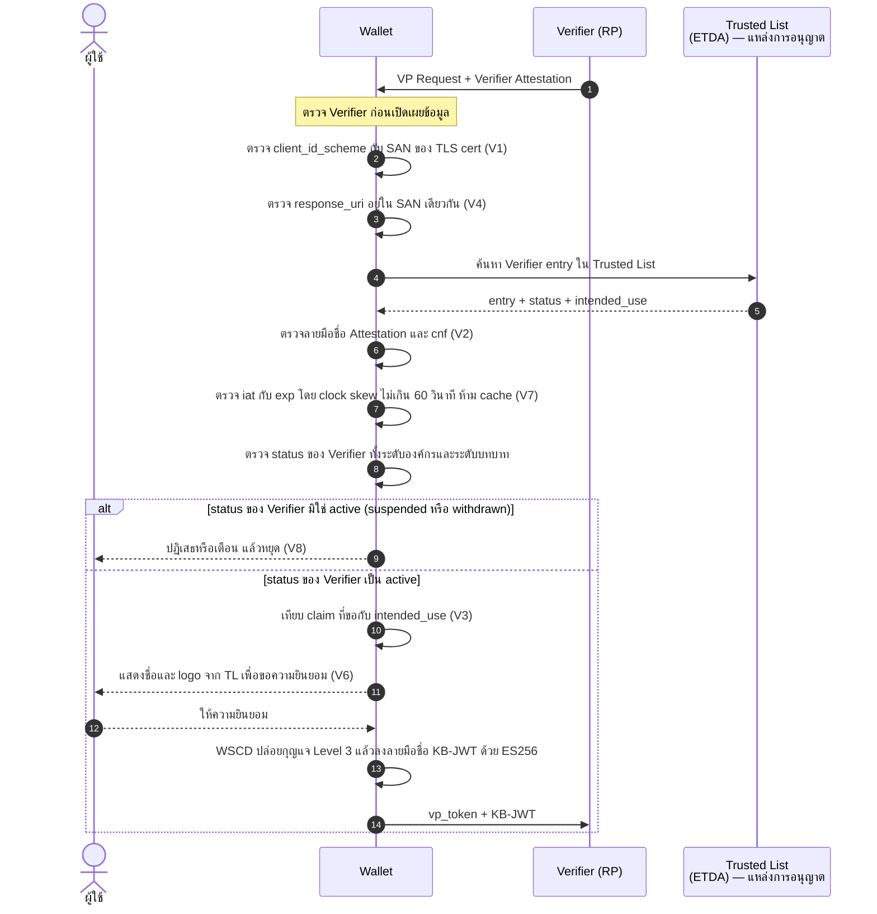
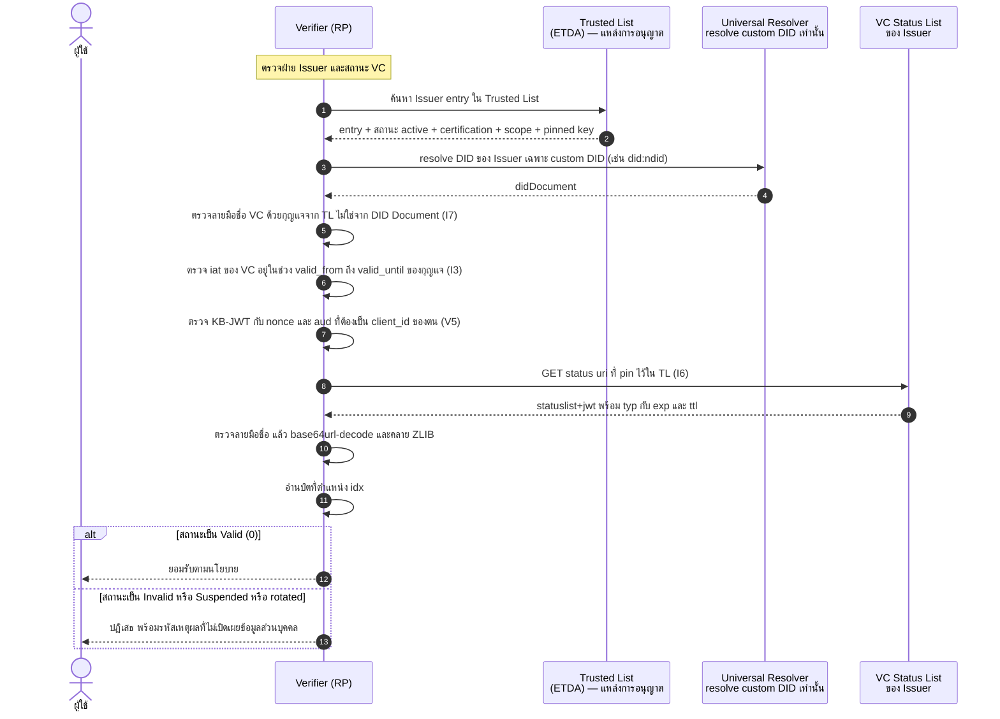
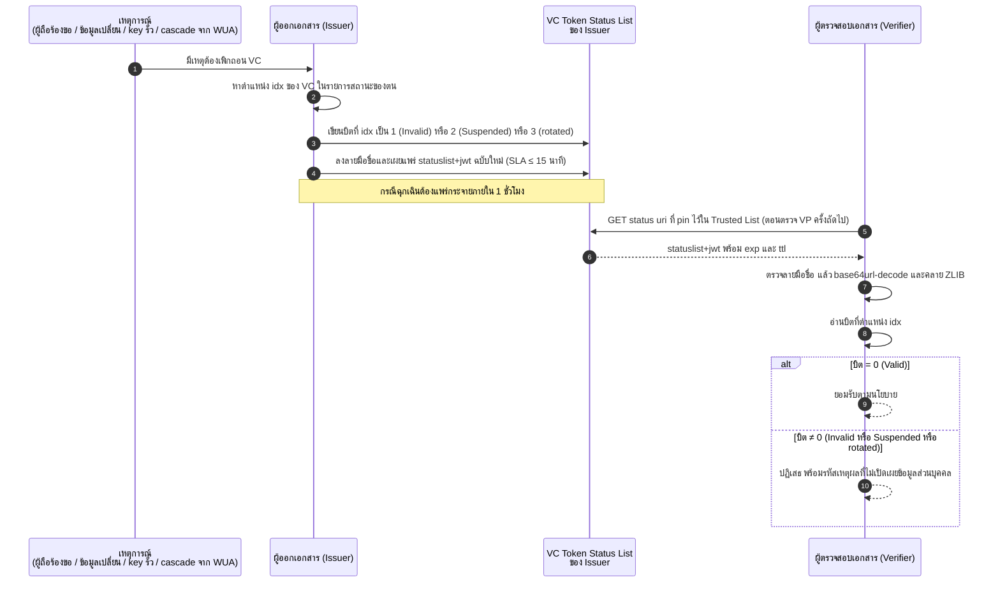
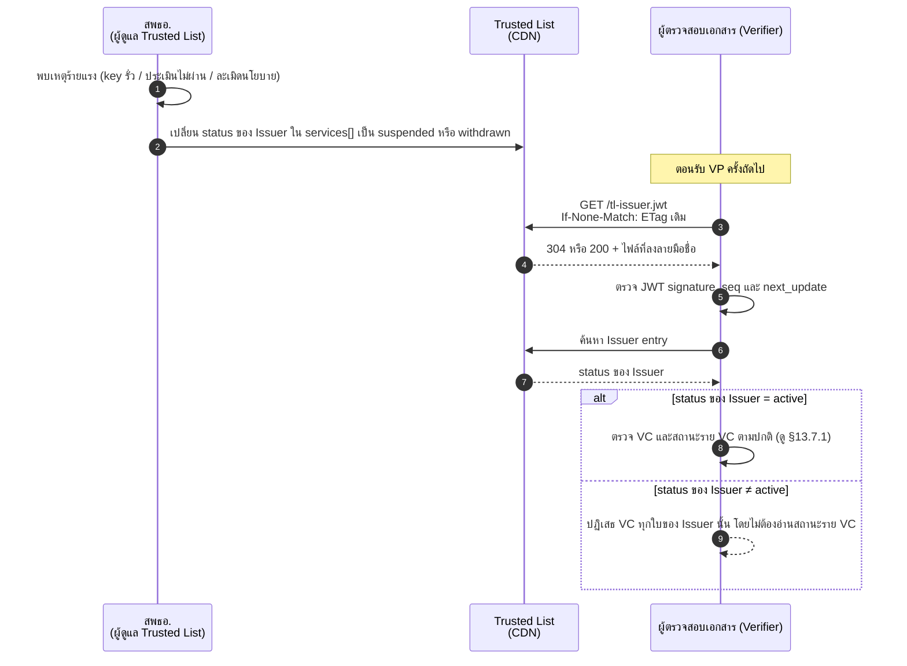
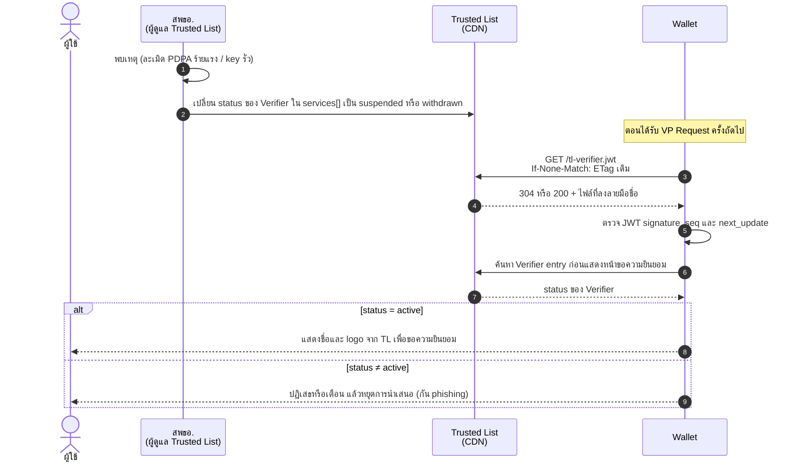
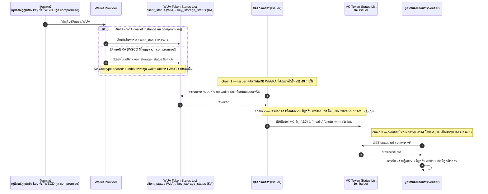
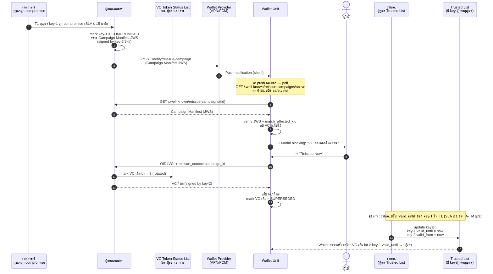

# 13. VC Status และ Revocation

{/* METADATA (agent-only — not rendered to readers)
> **สถานะ:** 📐 Specification — Draft สำหรับการทบทวนเชิงกำกับดูแล (S8, MASA-129 → MASA-150)
> **เวอร์ชันเอกสาร:** 1.3.0 (2026-08-07) — เพิ่ม §13.7.7 ผลกระทบเมื่อผู้ออกเอกสารหมุนเวียนกุญแจลงลายมือชื่อ (4 สถานะของกุญแจ 4 trigger T0–T3, ผลต่อ VC เดิม, กลไก wallet-side notification และ reissue campaign) และเพิ่มแถวในตารางสรุป §13.7.6 (MASA-166) แก้ถ้อยคำแปลตรงตัว "คำร่ม" → "คำรวม" และ "แหล่งความจริงเดียว" → "แหล่งข้อมูลอ้างอิงหลัก" (MASA-167) · เดิม: เพิ่ม §13.7 แผนภาพลำดับของรูปแบบการเพิกถอนทั้ง 5 แบบ (เพิกถอน VC, เพิกถอน Issuer/Verifier ผ่าน Trusted List, wallet provider เพิกถอน WIA/KA พร้อม cascade) และตารางสรุป §13.7.6 (MASA-158)
> **แหล่งข้อมูล:** เอกสารสถาปัตยกรรมภายใต้ `th/architecture/` เท่านั้น — ดู §13.9 References
> **ขอบเขต:** เอกสารกำกับดูแลและข้อกำหนดสำหรับการตรวจประเมิน ห้ามตีความเป็นผลทดสอบ production
> **เอกสารที่เกี่ยวข้อง:** [11-cryptographic-suites.md](11-cryptographic-suites.md), [12-key-management-and-trustlist-deployment.md](12-key-management-and-trustlist-deployment.md), [ดัชนีเอกสาร ARF](README.md)
*/}

---

บทที่ 13 กำหนดกลไกการแสดงสถานะและการเพิกถอนเอกสารรับรองดิจิทัล (VC) ด้วย IETF Token Status List การเพิกถอนผู้ตรวจสอบเอกสาร (verifier) ผ่านการเปลี่ยนสถานะใน Trusted List และลำดับการตรวจสถานะระหว่างการนำเสนอ VP เรื่อง cryptographic suites อยู่ในบทที่ 11 และ key management อยู่ในบทที่ 12

---

## 13.1 ขอบเขตและการจำแนกข้อความ

บทนี้รวมข้อกำหนดด้านการแสดงสถานะและการเพิกถอนที่เกี่ยวข้องกับการนำเสนอ VC สี่เรื่อง คือ (1) การเพิกถอน VC (VC Revocation) ด้วย IETF Token Status List (2) การเพิกถอนผู้ตรวจสอบเอกสาร (verifier) ผ่านการเปลี่ยนสถานะใน Trusted List (3) ลำดับการตรวจสถานะระหว่างการนำเสนอ VP และ (4) ผลกระทบเมื่อผู้ออกเอกสารหมุนเวียนกุญแจลงลายมือชื่อ (Issuer Key Rotation) ตามที่ §13.7.7 อธิบาย

**กฎการอ้างอิงของบทนี้:** ข้อกำหนดทุกข้อ **MUST** สืบย้อนไปยังไฟล์ภายใต้ `th/architecture/` มาตรฐานภายนอกอ้างผ่านไฟล์สถาปัตยกรรมที่ระบุมาตรฐานนั้นไว้แล้ว บทนี้ **MUST NOT** สร้างข้อกำหนดใหม่ที่ไม่มีฐานในเอกสารสถาปัตยกรรม

การจำแนกข้อความ:

| ป้าย | ความหมาย |
|------|----------|
| **[ข้อเท็จจริง]** | ข้อความที่ปรากฏในเอกสารสถาปัตยกรรมโดยตรง พร้อมเลขอ้างอิง |
| **[ข้อวิเคราะห์]** | การประมวลข้อเท็จจริงหลายแหล่งเข้าเป็นข้อกำหนดเชิงกำกับดูแล |
| **[ช่องว่าง]** | ประเด็นที่เอกสารสถาปัตยกรรมยังขัดกันเองหรือยังไม่กำหนด ต้องมีมติก่อนบังคับใช้ |

คำ **MUST / MUST NOT / SHOULD / MAY** ใช้ตามความหมายเชิงข้อกำหนด: ต้อง / ห้าม / ควร / อาจ

---

## 13.2 รูปแบบที่เลือกใช้

**[ข้อเท็จจริง]** ระบบใช้ **IETF Token Status List** revision `draft-ietf-oauth-status-list-18` ไม่ใช่ W3C Bitstring Status List [A-ARCH §2, §3]

**[ข้อเท็จจริง]** เหตุผลที่เลือกตามที่บันทึกไว้คือ ตรงกับ SD-JWT VC spec ที่กำหนด `status.status_list.{idx, uri}` ตรงกับ EUDI Wallet ARF และ media type `application/statuslist+jwt` ลงทะเบียนกับ IANA แล้ว [A-ARCH §3]

**[ข้อเท็จจริง]** ความต่างจาก W3C Bitstring คือ เปลือก VC เปลี่ยนเป็นเปลือก JWT, GZIP เปลี่ยนเป็น ZLIB และ JSON-LD เปลี่ยนเป็น JWT ธรรมดา [A-ARCH §2]

**[ข้อวิเคราะห์]** เอกสารทุกฉบับที่อ้าง Token Status List **MUST** ระบุ revision ให้ชัดเจน เนื่องจาก draft-18 ยังอยู่ในขั้นการประเมินของ IESG ตามที่บันทึกไว้ [A-ARCH §3] การเปลี่ยน revision **MUST** ผ่านการประเมิน breaking change ก่อน

---

## 13.3 โครงสร้าง Status List Token ของ VC

**[ข้อเท็จจริง]** สถานะใน VC อยู่ในรูป `status: { status_list: { idx, uri } }` และ Status List Token มีโครงสร้างดังนี้ [A-ARCH §ลำดับที่ 2B, §ลำดับที่ 3]

```
Header:
{
  "alg": "ES256",
  "kid": "did:web:dopa.go.th#key-2026-001",
  "typ": "statuslist+jwt"
}

Payload:
{
  "sub": "https://status.dopa.go.th/statuslists/1",
  "iat": 1742284800,
  "exp": 1742371200,
  "ttl": 43200,
  "status_list": { "bits": 2, "lst": "eNrbuRgAAhcBXQ" }
}
```

**[ข้อเท็จจริง]** ความหมายของ `exp` กับ `ttl` คือ `exp` (86,400 วินาที = 24 ชั่วโมง) เป็นอายุสูงสุดของ JWT หลังจากนั้นต้อง fetch ใหม่ ส่วน `ttl` (43,200 วินาที = 12 ชั่วโมง) เป็นระยะเวลาที่ Verifier ควร cache และ `ttl` ≤ `exp` เสมอ [A-ARCH §ลำดับที่ 3]

**[ข้อเท็จจริง]** ขั้นตอนการตรวจสถานะสี่ขั้น [A-ARCH §ลำดับที่ 3]

1. ดึง URI ของ status list แล้วได้ JWT พร้อม `Content-Type: application/statuslist+jwt`
2. ตรวจลายมือชื่อ JWT ด้วยกุญแจสาธารณะของผู้ออก
3. base64url-decode ค่า `lst` แล้วคลาย ZLIB จนได้ bitstring
4. อ่านบิตที่ตำแหน่ง `idx` โดยค่า `0` หมายถึงใช้ได้ และ `1` หมายถึงถูกเพิกถอน

---

## 13.4 Status Value

**[ข้อเท็จจริง]** รหัสสถานะที่เอกสาร Key Rotation กำหนดให้ใช้ตาม IETF Token Status List [A-KD08 §9]

| ค่า | สถานะ | ความหมาย |
|:---:|-------|----------|
| 0 | Valid | ใช้งานได้ |
| 1 | Invalid | เพิกถอนทั่วไป |
| 2 | Suspended | ระงับชั่วคราว |
| 3 | Application-specific `rotated` | ถูกแทนที่ด้วย VC ใบใหม่ |

---

## 13.5 ข้อกำหนดการตรวจประเมินที่เกี่ยวกับการเพิกถอน

**[ข้อเท็จจริง]** รายการตรวจสำหรับ Issuer [A-ARCH §8 I7–I9]

| # | ข้อตรวจ | หลักฐาน |
|---|---------|---------|
| I7 | ต้องรองรับ IETF Token Status List (`statuslist+jwt`) | ทดสอบ endpoint |
| I8 | SLA อัปเดต Status List ≤ 15 นาที | เอกสาร SLA |
| I9 | Status List JWT ต้องลงลายมือชื่อด้วยกุญแจผู้ออก และมีทั้ง `exp` กับ `ttl` | ตรวจ token |

**[ข้อเท็จจริง]** รายการตรวจสำหรับ Verifier ข้อ V4 กำหนดว่าต้องตรวจ IETF Token Status List JWT ครบสามขั้น คือตรวจลายมือชื่อ คลายข้อมูล และตรวจบิต [A-ARCH §8 V4]

**[ช่องว่าง G-03 — มีนัยด้านความมั่นคงปลอดภัย]** ค่าความสดของข้อมูลสามค่าในเอกสารสถาปัตยกรรมยังไม่สอดคล้องกัน Issuer มี SLA อัปเดต Status List ≤ 15 นาที [A-ARCH §8 I8] การเพิกถอนฉุกเฉินต้องแพร่กระจายภายใน 1 ชั่วโมง [A-TM §I3] แต่ `ttl` ที่ให้ Verifier cache คือ 12 ชั่วโมง และ `exp` คือ 24 ชั่วโมง [A-ARCH §ลำดับที่ 3] Verifier ที่ cache ตาม `ttl` จะไม่เห็นการเพิกถอนได้นานถึง 12 ชั่วโมง ทำให้ SLA 15 นาทีและเป้าหมาย 1 ชั่วโมงไม่มีผลจริงแบบ end-to-end ETDA **MUST** กำหนดเพดาน cache ของ Verifier ให้สอดคล้องกับเป้าหมายการแพร่กระจาย หรือกำหนดกลไก force refresh สำหรับการเพิกถอนฉุกเฉิน

---

## 13.6 การเพิกถอนผู้ตรวจสอบเอกสาร (verifier) ผ่าน Trusted List

**[ข้อวิเคราะห์]** การเพิกถอนผู้ตรวจสอบเอกสาร (verifier) ดำเนินการผ่านการเปลี่ยนสถานะใน Trusted List เท่านั้น รายงานฉบับนี้ **ไม่ใช้** status list แยกต่างหากสำหรับผู้ตรวจสอบเอกสาร แหล่งข้อมูลอ้างอิงหลักของสถานะการอนุญาตของผู้ตรวจสอบเอกสารคือ Trusted List ของ สพธอ. โครงสร้าง entry และการจัดสถานะตามบทบาทมีรายละเอียดในบทที่ 9

**[ข้อเท็จจริง]** ใน Trusted List แต่ละองค์กรมีรายการบทบาท (`services[]`) และแต่ละบทบาทมีฟิลด์ `status` ที่รับค่า `active` `suspended` หรือ `withdrawn` โดยระงับหรือเพิกถอนแต่ละบทบาทแยกจากกันได้ ผู้ตรวจสอบข้อมูล (consumer) **ต้อง** ตรวจทั้ง `status` ระดับองค์กรและระดับบทบาท หากสถานะใดมิใช่ `active` **ต้อง** ปฏิเสธ [A-ARCH §6]

**[ข้อเท็จจริง]** เมื่อ สพธอ. ระงับผู้ตรวจสอบเอกสาร entry จะระบุ `status: "suspended"` และเมื่อเพิกถอนถาวร entry จะเปลี่ยนเป็น `withdrawn` ซึ่งกลับมาใช้ไม่ได้ ต้องยื่นลงทะเบียนใหม่ เหตุแห่งการระงับและการเพิกถอนผู้ตรวจสอบเอกสารเป็นไปตามนโยบายการลงทะเบียนผู้ตรวจสอบ [A-VRP]

**[ข้อวิเคราะห์]** Wallet **MUST** ตรวจสถานะของผู้ตรวจสอบเอกสารใน Trusted List **ก่อน** แสดงหน้าขอความยินยอมทุกครั้ง หากสถานะมิใช่ `active` Wallet **MUST** ปฏิเสธหรือเตือนผู้ใช้แล้วหยุดการนำเสนอ เนื่องจากการแสดงหน้าขอความยินยอมของผู้ตรวจสอบเอกสารที่ถูกเพิกถอนแล้วเป็นการเปิดช่อง phishing [A-TM §V6, §V8]

**[ข้อวิเคราะห์]** การเพิกถอนผู้ตรวจสอบเอกสารแบบฉุกเฉิน เช่น กรณีละเมิด PDPA ร้ายแรงหรือกุญแจถูก compromise ใช้การดึง Trusted List ด้วย HTTP `GET` จาก CDN เมื่อ Wallet หรือ Verifier มี connection และกำลังจะตัดสินใจ โดยใช้ `If-None-Match` เพื่อตรวจการเปลี่ยนแปลงและตรวจลายมือชื่อของไฟล์ใหม่ [research/41] ทั้งนี้ ระยะเวลาที่ผู้ตรวจสอบเอกสารและ Wallet เห็นการเพิกถอนขึ้นกับจังหวะการเชื่อมต่อและนโยบาย cache ที่กำหนดใน Trusted List

---

## 13.7 แผนภาพลำดับของการตรวจสถานะและการเพิกถอน

หัวข้อนี้รวมแผนภาพลำดับ (sequence diagram) ของการตรวจสถานะระหว่างการนำเสนอ VP และรูปแบบการเพิกถอนทั้งหมดในระบบ ประกอบด้วย 5 แผนภาพ ได้แก่ (1) การนำเสนอ VP พร้อมการตรวจสถานะ (2) การที่ผู้ออกเอกสารเพิกถอน VC (3) การเพิกถอนผู้ออกเอกสารผ่าน Trusted List (4) การเพิกถอนผู้ตรวจสอบเอกสารผ่าน Trusted List และ (5) การที่ wallet provider เพิกถอน WUA คือ WIA และ KA พร้อมผลต่อเนื่อง (cascade) โดยปิดท้ายด้วยตารางสรุปใน §13.7.6 และ §13.7.7 เพิ่มการวิเคราะห์ผลกระทบเมื่อผู้ออกเอกสารหมุนเวียนกุญแจลงลายมือชื่อ ทั้งนี้ ทุกแผนภาพประกอบจากลำดับที่บันทึกไว้ในเอกสารสถาปัตยกรรมและบทที่เกี่ยวข้อง มิได้สร้างข้อกำหนดใหม่

### 13.7.1 การนำเสนอ VP พร้อมการตรวจสถานะ

**[ข้อวิเคราะห์]** แผนภาพนี้ประกอบจากลำดับที่บันทึกไว้ในเอกสารสถาปัตยกรรม คือ ลำดับการตรวจสถานะ VC [A-ARCH §ลำดับที่ 3] การตรวจสถานะผู้ตรวจสอบเอกสารใน Trusted List (ดู §13.6 และบทที่ 9) และ gate การตรวจตาม defense state machine [A-TM §3.0, §4.0]

**Wallet ตรวจ Verifier ก่อนขอความยินยอม**



**Verifier ตรวจ Issuer และสถานะ VC**



**[ข้อวิเคราะห์]** จุดสำคัญสามข้อที่แผนภาพบังคับไว้

1. Wallet **MUST** ตรวจสถานะของ Verifier ใน Trusted List **ก่อน** แสดงหน้าขอความยินยอม ไม่ใช่หลังจากนั้น เพราะการแสดงหน้าขอความยินยอมของ Verifier ที่ถูกเพิกถอนแล้วคือการเปิดช่อง phishing [A-TM §V6, §V8]
2. Verifier **MUST** ดึง status URI จากที่ pin ไว้ใน Trusted List **ไม่ใช่** จาก `status` claim ใน VC เพื่อกัน status endpoint takeover [A-TM §I6]
3. การตรวจลายมือชื่อ **MUST** เกิดก่อนการคลาย ZLIB ทุกครั้ง เพราะการคลายข้อมูลที่ยังไม่ผ่านการตรวจลายมือชื่อคือการประมวลผลข้อมูลที่ผู้โจมตีควบคุมได้

### 13.7.2 การที่ผู้ออกเอกสารเพิกถอน VC

**[ข้อวิเคราะห์]** ผู้ออกเอกสาร (issuer) เพิกถอนเอกสารรับรอง (VC) ของตนด้วยการเขียนบิตในรายการ IETF Token Status List ของตนเอง ตามรูปแบบและขั้นตอนที่กำหนดไว้ใน §13.2–§13.4 [A-ARCH §2, §3; A-KD08 §9] แผนภาพนี้แสดงทั้งการกระทำเพิกถอนและการที่ผู้ตรวจสอบเอกสาร (verifier) รับรู้สถานะนั้นในการนำเสนอ VP ครั้งถัดไป



**[ข้อวิเคราะห์]** อำนาจการเพิกถอน VC เป็นของผู้ออกเอกสารที่ออก VC นั้นเท่านั้น ผู้ตรวจสอบเอกสารรับรู้การเพิกถอนได้เร็วเพียงใดขึ้นกับค่า cache TTL ของรายการสถานะ ซึ่งเป็นช่องว่าง G-03 ที่บันทึกไว้ใน §13.5 ผู้ตรวจสอบเอกสารที่ cache ตาม `ttl` อาจไม่เห็นการเพิกถอนได้นานถึง 12 ชั่วโมง จึง **ควร** มีกลไก force refresh สำหรับการเพิกถอนฉุกเฉิน

### 13.7.3 การเพิกถอนผู้ออกเอกสารผ่าน Trusted List

**[ข้อวิเคราะห์]** การเพิกถอนผู้ออกเอกสาร (issuer) ทั้งราย ต่างจากการเพิกถอน VC รายใบ กล่าวคือ ผู้มีอำนาจคือสำนักงานพัฒนาธุรกรรมทางอิเล็กทรอนิกส์ (สพธอ.) ในฐานะผู้ดูแล Trusted List มิใช่ตัวผู้ออกเอกสารเอง สพธอ. เปลี่ยนสถานะของผู้ออกเอกสารใน Trusted List เป็น `suspended` หรือ `withdrawn` [A-ARCH §6] แล้วเผยแพร่ไฟล์ที่ลงลายมือชื่อผ่าน CDN ผู้ตรวจสอบเอกสารเรียก `GET` พร้อม `If-None-Match` เมื่อรับ VP และก่อนตัดสินใจ [research/41]



**[ข้อวิเคราะห์]** เมื่อผู้ออกเอกสารถูกเพิกถอนใน Trusted List VC ทุกใบที่ผู้ออกเอกสารนั้นเคยออกจะใช้ไม่ได้ในการตรวจสอบ โดยที่บิตในรายการสถานะราย VC ไม่ต้องเปลี่ยน เนื่องจากแหล่งข้อมูลอ้างอิงหลักของสถานะการอนุญาตของผู้ออกเอกสารคือ Trusted List เมื่อสถานะมิใช่ `active` ผู้ตรวจสอบเอกสาร **ต้อง** ปฏิเสธ VC นั้น [A-ARCH §6, §8] ดังนั้น การเพิกถอนผู้ออกเอกสารจึงมีผลครอบคลุมกว่าการเพิกถอน VC รายใบ และไม่ต้องอาศัยการเขียนบิตราย VC

### 13.7.4 การเพิกถอนผู้ตรวจสอบเอกสารผ่าน Trusted List

**[ข้อวิเคราะห์]** การเพิกถอนผู้ตรวจสอบเอกสาร (verifier) ดำเนินการผ่าน Trusted List เท่านั้น ตาม §13.6 ผู้มีอำนาจคือ สพธอ. จุดสำคัญคือ กระเป๋าเอกสารดิจิทัล (wallet) **ต้อง** ตรวจสถานะของผู้ตรวจสอบเอกสาร **ก่อน** แสดงหน้าขอความยินยอมทุกครั้ง เพราะการแสดงหน้าขอความยินยอมของผู้ตรวจสอบเอกสารที่ถูกเพิกถอนแล้วเป็นการเปิดช่อง phishing [A-TM §V6, §V8]



**[ข้อวิเคราะห์]** ระยะเวลาที่ Wallet เห็นการเพิกถอนขึ้นกับจังหวะที่ได้รับ VP Request และผลการตรวจ `GET` จาก CDN ในครั้งนั้น ระบบไม่ใช้ message broker หรือ background polling การตรวจจึงเกิดตรงจุดที่ Wallet ต้องตัดสินใจว่าจะขอความยินยอมจากผู้ใช้หรือไม่ [research/41]

### 13.7.5 การที่ wallet provider เพิกถอน WUA คือ WIA และ KA พร้อมผลต่อเนื่อง

**[ข้อวิเคราะห์]** WUA เป็นคำรวม (umbrella term) ประกอบด้วย Wallet Instance Attestation (WIA) และ Key Attestation (KA) การเพิกถอนและสถานะของทั้งสองประเภทเป็นไปตาม EUDI คือใช้ IETF Token Status List ที่ wallet provider เผยแพร่ ผ่าน field `client_status` (WIA) และ `key_storage_status` (KA) รายละเอียดอยู่ใน [บทที่ 10 §10.5](10-wallet-unit-attestation.md) แผนภาพนี้แสดง 3 ผลต่อเนื่อง (chain) ที่เกิดขึ้นเมื่อ wallet provider เพิกถอน WUA



**[ข้อวิเคราะห์]** แผนภาพนี้ตอบคำถามหลักสองข้อ

1. **ผู้ออกเอกสารต้องเพิกถอน VC ที่ผูกกับ WUA หรือไม่** — **ต้อง** เมื่อ wallet provider เพิกถอน WIA หรือ KA ผู้ออกเอกสารที่เคยออก VC ให้ wallet unit นั้น **ต้อง** เพิกถอน VC ที่ผูกไว้ผ่าน IETF Token Status List **ของผู้ออกเอกสารเอง** ตาม CIR 2024/2977 Art. 5(4)(b) [บทที่ 10 §10.5.3](10-wallet-unit-attestation.md) รายการสถานะของ WUA ใช้กับ wallet instance และกุญแจ ส่วนรายการสถานะของผู้ออกเอกสารใช้กับ VC ที่ผูกกับ wallet unit นั้น จึงเป็นคนละรายการกัน
2. **ผู้ตรวจสอบเอกสารรับรู้ได้อย่างไร** — ผู้ตรวจสอบเอกสาร **ไม่** อ่านสถานะ WUA โดยตรง เพราะผู้ตรวจสอบเอกสารได้รับ WUA เฉพาะรูปแบบยืนยันตัวตน (Use Case 1) ไม่ได้เข้าถึงรายการสถานะของ wallet provider ผู้ตรวจสอบเอกสารรับรู้ผลของการเพิกถอน WUA **โดยอ้อม** ผ่านรายการสถานะ VC ของผู้ออกเอกสาร (chain 3) การตรวจสถานะ WUA โดยตรงเกิดเฉพาะฝั่งผู้ออกเอกสารในกระแสงาน OID4VCI ตาม [บทที่ 10 §10.3.1](10-wallet-unit-attestation.md) มิใช่ฝั่งผู้ตรวจสอบเอกสารในกระแสงาน OID4VP

_ข้อสังเกต:_ กรณี KA แบบ type-shared การเพิกถอน 1 index มีผลต่อ wallet unit ทุกหน่วยที่ใช้ WSCD ประเภทเดียวกัน ผู้ออกเอกสารจึงต้องเพิกถอน VC ทุกใบที่ผูกกับ WSCD ประเภทนั้น ผลต่อเนื่องจึงกว้างกว่าการเพิกถอน WIA รายหน่วยมาก

### 13.7.6 ตารางสรุปรูปแบบการเพิกถอน

**[ข้อวิเคราะห์]** ตารางต่อไปนี้สรุปรูปแบบการเพิกถอนและการหมุนเวียนกุญแจทั้ง 6 แบบใน §13.7.2–§13.7.7 ว่าใครมีอำนาจ ใช้กลไกใด ใครต้องรับรู้ และรับรู้ได้อย่างไร

| รูปแบบการเพิกถอน / การหมุนเวียนกุญแจ | ผู้มีอำนาจ | กลไก / รายการสถานะ | ผู้ที่ต้องรับรู้ และรับรู้ได้อย่างไร | เวลาเป้าหมาย / ช่องว่าง |
|---|---|---|---|---|
| เพิกถอน VC (§13.7.2) | ผู้ออกเอกสารที่ออก VC นั้น | VC Token Status List ของผู้ออกเอกสาร | ผู้ตรวจสอบเอกสาร อ่านบิตตอนตรวจ VP | SLA ≤ 15 นาที (ฉุกเฉิน ≤ 1 ชั่วโมง) จำกัดด้วย cache TTL — ช่องว่าง G-03 |
| เพิกถอนผู้ออกเอกสาร (§13.7.3) | สพธอ. | สถานะใน Trusted List (`suspended`/`withdrawn`) | ผู้ตรวจสอบเอกสารเรียก `GET` จาก CDN ตอนรับ VP และตรวจลายมือชื่อ | ตรวจ ณ จุดตัดสินใจ; ปฏิเสธเมื่อสถานะมิใช่ `active` [research/41] |
| เพิกถอนผู้ตรวจสอบเอกสาร (§13.7.4) | สพธอ. | สถานะใน Trusted List (`suspended`/`withdrawn`) | กระเป๋าเอกสารดิจิทัลเรียก `GET` จาก CDN **ก่อน** แสดงหน้าขอความยินยอม | ตรวจ ณ จุดตัดสินใจ; กัน phishing [A-TM §V6, §V8] |
| เพิกถอน WIA (§13.7.5) | wallet provider ที่ออก WIA | `client_status` list ของ wallet provider | ผู้ออกเอกสาร อ่านตอน OID4VCI และ poll เป็นระยะ → cascade เพิกถอน VC → ผู้ตรวจสอบเอกสารรับรู้ผ่านสถานะ VC | poll เป็นระยะ เช่น รายวัน + SLA ของ VC status |
| เพิกถอน KA (§13.7.5) | wallet provider ที่ออก KA | `key_storage_status` list (รายหน่วย หรือ type-shared) | เหมือน WIA; หาก type-shared จะ cascade ครอบ WSCD ทั้งประเภท | poll เป็นระยะ เช่น รายวัน + SLA ของ VC status |
| หมุนเวียนกุญแจลงลายมือชื่อของผู้ออกเอกสาร (§13.7.7) | ผู้ออกเอกสารเอง (T0–T3) | (ก) DID Document `assertionMethod` (เก็บกุญแจเดิมไว้ตรวจสอบจน VCs หมดอายุ) (ข) Trusted List `keys[]` ระบุ `valid_from`/`valid_until` ต่อกุญแจ [A-TM §I3] (ค) Campaign Manifest ผ่าน `/.well-known/reissue-campaigns/{id}` สำหรับ T1–T3 (ง) VC Token Status List บิต `3` = `rotated` สำหรับ VC ที่ถูกแทน | กระเป๋าเอกสารดิจิทัล: T0 transparent, T1/T2/T3 ผ่าน push (silent notification) + pull (`.well-known/reissue-campaigns/active`) [A-KD08 §7-§8] | T0 transparent (ไม่มี deadline); T1 ≤ 15 นาที push / 6 ชม. pull; T2 ≥ 90 วัน; T3 ≥ 30 วัน |

**[ข้อวิเคราะห์]** จุดที่ผู้พัฒนาต้องไม่สับสน คือ การเพิกถอนสามระดับใช้รายการสถานะคนละชุดกัน ได้แก่ (1) รายการสถานะ VC ของผู้ออกเอกสาร (2) รายการสถานะ WUA ของ wallet provider ผ่าน `client_status` และ `key_storage_status` และ (3) Trusted List ของ สพธอ. สำหรับสถานะการอนุญาตของผู้ออกเอกสารและผู้ตรวจสอบเอกสาร แม้ (1) และ (2) ใช้รูปแบบ IETF Token Status List เหมือนกัน แต่เป็นคนละรายการ มีผู้เผยแพร่และวัตถุประสงค์ต่างกัน ตาม §13.7.5 และ [บทที่ 10 §10.5.3](10-wallet-unit-attestation.md)

### 13.7.7 ผลกระทบเมื่อผู้ออกเอกสารหมุนเวียนกุญแจลงลายมือชื่อ (Issuer Key Rotation)

หัวข้อนี้ตอบคำถามเชิงกำกับดูแลสามข้อเกี่ยวกับการหมุนเวียนกุญแจลงลายมือชื่อของผู้ออกเอกสาร ได้แก่ (1) ผลกระทบต่อเอกสารรับรอง (VC) เดิมที่ลงลายมือชื่อด้วยกุญแจรุ่นก่อน (2) กลไกที่กระเป๋าเอกสารดิจิทัล (wallet unit) ใช้รับรู้ว่ากุญแจถูกหมุนเวียน (3) ความจำเป็นในการออก VC ใหม่ ทั้งนี้ หัวข้อนี้ประกอบจากข้อกำหนดในเอกสารสถาปัตยกรรม [A-KD08 §1–§9], [A-TM §I3, §I7] และงานวิจัยภายใน [research/07], [research/07-1] มิได้สร้างข้อกำหนดใหม่ที่ไม่มีฐานในเอกสารต้นทาง

#### 13.7.7.1 สถานะของกุญแจลงลายมือชื่อผู้ออกเอกสาร 4 สถานะ

**[ข้อเท็จจริง]** วงจรชีวิตของกุญแจลงลายมือชื่อของผู้ออกเอกสารแบ่งเป็น 4 สถานะ ดังนี้ [research/07 §สถานะของกุญแจผู้ออก]

| สถานะ | ลงลายมือชื่อ VC ใหม่ | ตรวจ VC เก่า | อยู่ใน DID Document |
|-------|:---:|:---:|:---:|
| **Created** | ❌ | ❌ | ✅ (กำหนดวันเริ่มใช้ในอนาคต) |
| **Active** | ✅ | ✅ | ✅ (`authentication` + `assertionMethod`) |
| **Inactive** | ❌ | ✅ | ✅ (`assertionMethod` เท่านั้น) |
| **Decommissioned** | ❌ | ❌ | ❌ (ลบ + ทำลายกุญแจลับ) |

**[ข้อวิเคราะห์]** กฎสำคัญคือ กุญแจเดิมต้องอยู่ใน `assertionMethod` จนกว่า VC ทั้งหมดที่ลงลายมือชื่อด้วยกุญแจนั้นจะหมดอายุ การลบกุญแจออกจาก DID Document ก่อนกำหนดจะทำให้ VC ที่ออกด้วยกุญแจนั้นตรวจสอบไม่ได้อีกต่อไป ทั้งนี้ ต้องเสริมด้วยข้อจำกัดของ W3C DID Core ที่ไม่มีช่องบอกสถานะรายกุญแจ สถานะ `Inactive` และ `Created` จึงเป็นวินัยฝั่งผู้ออกเอกสาร ผู้ตรวจสอบเอกสารตรวจข้อนี้โดยตรงไม่ได้ จึงต้องพึ่ง Trusted List ของ สพธอ. เป็นกลไกยืนยันภายนอกตามที่ §13.7.7.3 อธิบาย

#### 13.7.7.2 รูปแบบการหมุนเวียนกุญแจ 4 รูปแบบ (T0–T3)

**[ข้อเท็จจริง]** การหมุนเวียนกุญแจลงลายมือชื่อของผู้ออกเอกสารจำแนกเป็น 4 รูปแบบตาม trigger และความรุนแรง [A-KD08 §1], [research/07-1 §2] ดังนี้

| Trigger | ความรุนแรง | SLA แจ้งเตือน | Grace Period | VC เก่าใช้ได้หรือไม่ |
|---------|:---------:|:-------------:|:------------:|:---------------------:|
| **T0 — Scheduled Rotation** (รายปี ตามนโยบาย [A-KD08 §1]) | 🟢 ปกติ | ไม่ต้องแจ้ง | ไม่กำหนด (จนกว่า VCs จะหมดอายุ) | ✅ ใช้ได้ตราบเท่าที่กุญแจเดิมยังอยู่ใน `assertionMethod` |
| **T1 — Key Compromise** ([A-KD08 §1], [A-TM §I3]) | 🔴 ฉุกเฉิน | ≤ 15 นาที (push) | 0 (ทันที) | ❌ verify fail ทันทีหลัง `valid_until` ของกุญแจถูกปรับ |
| **T2 — Early Decommissioning** (compliance / ยุติใช้ก่อน VCs หมดอายุ) | 🟡 เร่งด่วน | ≥ 90 วันล่วงหน้า | ≥ 90 วัน | ✅ ใช้ได้จนถึง `deadline` |
| **T3 — Coordinated Migration** (algorithm upgrade เช่น `ES256 → EdDSA`) | 🟢 ปกติ | ≥ 30 วันล่วงหน้า | ≥ 30 วัน | ✅ ใช้ได้จนถึง `deadline` |

**[ข้อวิเคราะห์]** ข้อแตกต่างสำคัญระหว่าง T0 กับ T1–T3 คือ T0 เป็นการหมุนเวียนแบบโปร่งใส (transparent) เนื่องจากกุญแจเดิมยังอยู่ใน `assertionMethod` ผู้ตรวจสอบเอกสารยังตรวจ VC เก่าได้ จึงไม่ต้องมีกลไกแจ้ง wallet ส่วน T1–T3 เป็นการหมุนเวียนที่มี deadline หรือเป็นเหตุฉุกเฉิน จำเป็นต้องมีกลไกแจ้ง wallet เพื่อให้ผู้ใช้ออก VC ใหม่ก่อนกุญแจเดิมถูกถอนออกจาก DID Document ตามแนวทาง Campaign Protocol ใน [research/07-1]

#### 13.7.7.3 กลไกที่กระเป๋าเอกสารดิจิทัลใช้รับรู้การหมุนเวียนกุญแจ

**[ข้อเท็จจริง]** กระเป๋าเอกสารดิจิทัล (wallet unit) รับรู้การหมุนเวียนกุญแจของผู้ออกเอกสารผ่าน 4 ช่องทาง ซึ่งทำงานประสานกันเป็น defense in depth [A-KD08 §7], [A-TM §I3, §I7], [research/07], [research/07-1]

| ช่องทาง | สารที่ส่ง | ใช้กับ Trigger | ผู้เผยแพร่ |
|--------|----------|:---------------:|------------|
| (1) DID Document `assertionMethod` | กุญแจเดิมยังอยู่ใน `assertionMethod` หรือถูกถอนออก | T0 (มีอยู่) / T1–T3 (ถูกถอนเมื่อถึง deadline) | ผู้ออกเอกสาร |
| (2) Trusted List `keys[]` พร้อม `valid_from` / `valid_until` ต่อกุญแจ | ช่วงเวลาที่กุญแจแต่ละรุ่นใช้ลงลายมือชื่อได้ | ทุก trigger | สพธอ. |
| (3) Reissue Campaign Manifest ผ่าน `/.well-known/reissue-campaigns/{id}` | campaign id, `affected_kid`, `trigger`, `severity`, `deadline` | T1–T3 | ผู้ออกเอกสาร |
| (4) VC Token Status List บิต `3` = `rotated` | ระบุว่า VC ถูกแทนด้วยใบใหม่แล้ว | T1–T3 (หลังออกใบใหม่) | ผู้ออกเอกสาร |

**[ข้อวิเคราะห์]** กระเป๋าเอกสารดิจิทัล **MUST** ตรวจช่องทาง (2) เป็นด่านแรกในการตรวจ VP เสมอ เนื่องจาก Trusted List กำหนด `valid_from` และ `valid_until` ระดับกุญแจ กระเป๋าเอกสารดิจิทัลจึงตรวจได้ว่า `iat` ของ VC อยู่ในช่วงเวลาที่กุญแจที่ลงลายมือชื่อยังมีผลบังคับใช้ [A-TM §I3] หาก `iat` อยู่นอกช่วง ต้องปฏิเสธทันที ส่วนช่องทาง (1) ผู้ตรวจสอบเอกสารตรวจได้เพียงว่ากุญแจมีอยู่หรือไม่ ไม่สามารถแยกได้ว่ากุญแจอยู่ในสถานะ Active หรือ Inactive จึงไม่เพียงพอที่จะตรวจ T1 ได้แต่เพียงลำพัง

**[ข้อวิเคราะห์]** ช่องทาง (3) เป็นกลไกเฉพาะของ T1–T3 ที่ช่วยให้กระเป๋าเอกสารดิจิทัลรับรู้ล่วงหน้าก่อน deadline และกระตุ้นให้ผู้ใช้ออก VC ใหม่ กลไกนี้ใช้ dual-channel คือ push ผ่าน wallet provider (APN/FCM) สำหรับ T1 ที่ต้องการความเร็ว และ pull ผ่านการเรียก `GET /.well-known/reissue-campaigns/active` เป็นระยะตาม TTL เป็น safety net [research/07-1 §3] ทั้งนี้ Campaign Manifest ต้องลงลายมือชื่อด้วย **กุญแจใหม่** ไม่ใช่กุญแจที่ compromise เพื่อกันผู้โจมตีปลอม campaign ยกเลิกเหตุฉุกเฉิน [research/07-1 §4.3]

#### 13.7.7.4 ผลกระทบต่อ VC เดิม และความจำเป็นในการออก VC ใหม่

**[ข้อเท็จจริง]** ผลกระทบต่อ VC เดิมที่ลงลายมือชื่อด้วยกุญแจรุ่นก่อนหน้า (`key-1`) จำแนกตาม trigger ดังนี้ [A-KD08 §8], [research/07], [research/07-1]

| Trigger | VC เดิม (`key-1`) ตรวจสอบได้หรือไม่ | บิตใน Status List | ต้องออก VC ใหม่หรือไม่ |
|---------|:----------------------------------:|:-----------------:|:------------------------:|
| **T0 — Scheduled Rotation** | ✅ ใช้ได้ตราบเท่าที่ `key-1` อยู่ใน `assertionMethod` และ VC ยังไม่หมดอายุ | คงค่า `0` (Valid) | ❓ ไม่บังคับ แต่แนะนำให้ reissue ตามรอบหมุนเวียนประจำปี เพื่อลดหน้าต่างความเสี่ยงจาก compromise [A-KD08 §10] |
| **T1 — Key Compromise** | ❌ ตรวจไม่ได้ทันทีหลัง สพธอ. ปรับ `valid_until` ของ `key-1` ใน Trusted List (SLA ภายใน 1 ชั่วโมง [A-TM §I3]) | เปลี่ยนเป็น `3` (`rotated`) ทันทีที่ออก VC ใหม่ | ✅ **บังคับ** ต้องออก VC ใหม่ผูกกับ `key-2` และ mark VC เดิมเป็น `rotated` ภายใน 4 ชั่วโมง ตามนโยบายกำกับดูแล |
| **T2 — Early Decommissioning** | ✅ ใช้ได้จนถึง `deadline` ที่กำหนด | คงค่า `0` (Valid) จนกว่าจะถึง `deadline` | ✅ **บังคับ** ต้องออก VC ใหม่ภายใน grace period (≥ 90 วัน) หากต้องการให้ VC ยังใช้งานได้หลัง `deadline` |
| **T3 — Coordinated Migration** | ✅ ใช้ได้จนถึง `deadline` ที่กำหนด | คงค่า `0` (Valid) จนกว่าจะถึง `deadline` | ✅ **แนะนำ** ให้ออก VC ใหม่ภายใน grace period (≥ 30 วัน) เพื่อให้ผู้ใช้พร้อมใช้อัลกอริทึมใหม่ก่อนกุญแจเดิมถูกถอน |

**[ข้อวิเคราะห์]** หลักการตอบคำถาม "ต้องออก VC ใหม่หรือไม่" มีสามประเด็น

1. **T0 Scheduled Rotation** — เป็นทางเลือก ไม่บังคับ เพราะ VC เดิมยังตรวจสอบได้ตราบเท่าที่กุญแจเดิมอยู่ใน `assertionMethod` และ VC ยังไม่หมดอายุ ผู้ออกเอกสาร **SHOULD** กำหนดนโยบายหมุนเวียนประจำปีควบคู่กับ reissue เพื่อลดหน้าต่างความเสี่ยง แต่ไม่จำเป็นต้องออก VC ใหม่ให้ผู้ถือทุกรายทันที [A-KD08 §10]
2. **T1 Key Compromise** — เป็นข้อบังคับ ผู้ออกเอกสาร **MUST** ออก VC ใหม่ให้ผู้ถือที่ได้รับผลกระทบทุกราย และ **MUST** mark VC เดิมเป็น `rotated` (บิต `3`) ใน Status List ของตน เนื่องจากกุญแจถูก compromise ผู้โจมตีอาจปลอม VC ใหม่ที่ลงลายมือชื่อด้วยกุญแจนั้นได้ การเปลี่ยน `valid_until` ของกุญแจใน Trusted List ทำให้ผู้ตรวจสอบเอกสารปฏิเสธ VC เก่าทันทีที่ตรวจครั้งต่อไป [A-TM §I3] ขั้นตอนการ mark VC เดิมเป็น `rotated` **MUST** สำเร็จก่อนที่กระเป๋าเอกสารดิจิทัลจะลบ key handle เดิม เพราะหากลบก่อนแล้วการ mark ล้มเหลว VC เดิมจะยังอยู่ในสถานะใช้ได้โดยไม่มีผู้ถือกุญแจที่จะเพิกถอนได้ [A-KD08 §3]
3. **T2/T3 Planned Scenarios** — เป็นข้อบังคับในเชิงเวลา ผู้ออกเอกสาร **MUST** แจ้ง campaign ล่วงหน้าตาม grace period ที่กำหนด (≥ 90 วัน สำหรับ T2, ≥ 30 วัน สำหรับ T3) กระเป๋าเอกสารดิจิทัล **MUST** แสดง notification ให้ผู้ใช้ทราบตาม milestone (30d / 7d / 1d / deadline) หากผู้ใช้ไม่ดำเนินการภายใน deadline กระเป๋าเอกสารดิจิทัล **MUST** บล็อกการนำเสนอ VC ที่ลงลายมือชื่อด้วยกุญแจรุ่นเก่าที่ถูกถอนออกจาก `assertionMethod` แล้ว

**[ข้อวิเคราะห์]** กระเป๋าเอกสารดิจิทัล **MUST NOT** ลบ VC เดิมก่อนได้รับ VC ใหม่ที่ลงลายมือชื่อด้วยกุญแจรุ่นใหม่ เพราะหาก reissue ล้มเหลว (เช่น issuer down) ผู้ใช้จะไม่มีหลักฐานในกระเป๋าฯ เลย ทั้งนี้ กระเป๋าเอกสารดิจิทัล **SHOULD** เก็บ VC เดิมไว้ในสถานะ "superseded" เป็นเวลาอย่างน้อย 30 วันหลัง reissue สำเร็จ เพื่อใช้อ้างอิงย้อนหลังหากผู้ตรวจสอบเอกสารยังไม่ได้รับ Trusted List ฉบับใหม่

#### 13.7.7.5 แผนภาพลำดับการหมุนเวียนกุญแจ T1 (Key Compromise)

**[ข้อวิเคราะห์]** แผนภาพนี้แสดงกระแสงานเต็มเมื่อกุญแจลงลายมือชื่อของผู้ออกเอกสารถูก compromise (T1) ครอบคลุม (1) การ push campaign จาก issuer ผ่าน wallet provider (2) การ pull campaign manifest โดย wallet (3) การ reissue ผ่าน OID4VCI (4) การ mark VC เดิมเป็น `rotated` และ (5) การอัปเดต Trusted List โดย สพธอ.



**[ข้อวิเคราะห์]** จุดสำคัญสี่ประการที่แผนภาพบังคับไว้

1. ผู้ออกเอกสาร **MUST** ลงลายมือชื่อ Campaign Manifest ด้วยกุญแจใหม่ (`key-2`) ไม่ใช่กุญแจที่ compromise เพราะหากลงด้วย `key-1` ผู้โจมตีจะปลอม campaign "ยกเลิกฉุกเฉิน" ได้ [research/07-1 §4.3, S1]
2. กระเป๋าเอกสารดิจิทัล **MUST** block UI สำหรับ T1 จนกว่าผู้ใช้จะอนุมัติหรือปฏิเสธ เพราะ VC ที่ลงลายมือชื่อด้วยกุญแจที่ compromise มีความเสี่ยงสูงที่จะถูกปลอม
3. การ mark VC เดิมเป็น `rotated` ใน Status List **MUST** สำเร็จก่อนที่กระเป๋าเอกสารดิจิทัลจะลบ key handle เดิม [A-KD08 §3]
4. สพธอ. **MUST** ปรับ `valid_until` ของกุญแจที่ compromise ใน Trusted List ภายใน 1 ชั่วโมง [A-TM §I3] เพื่อให้การตรวจสอบของผู้ตรวจสอบเอกสารที่อาศัย Trusted List เพียงอย่างเดียวก็สามารถปฏิเสธ VC เก่าได้

#### 13.7.7.6 ตารางเปรียบเทียบ 4 รูปแบบการหมุนเวียนกุญแจ

**[ข้อวิเคราะห์]** ตารางต่อไปนี้สรุปมิติสำคัญของการหมุนเวียนกุญแจทั้ง 4 รูปแบบ เพื่อให้ผู้พัฒนาเห็นความแตกต่างชัดเจน

| มิติ | T0 Scheduled | T1 Compromise | T2 Early Decomm. | T3 Migration |
|------|:------------:|:-------------:|:----------------:|:-------------:|
| **Trigger** | นโยบายหมุนเวียนประจำปี | กุญแจรั่วไหล / ถูกขโมย | Compliance / ยุติใช้ | Algorithm upgrade |
| **SLA แจ้งเตือน** | ไม่ต้องแจ้ง | ≤ 15 นาที push / 6 ชม. pull | ≥ 90 วันล่วงหน้า | ≥ 30 วันล่วงหน้า |
| **Grace Period** | ไม่กำหนด | 0 (ทันที) | ≥ 90 วัน | ≥ 30 วัน |
| **Sign Campaign ด้วย key** | ไม่ต้อง sign | key ใหม่ (key-2) | key ใดก็ได้ | key ใดก็ได้ |
| **Push notification** | ไม่ต้อง | ✅ Required | ✅ ที่ 30/7/1 วัน | ✅ ที่ 14/3 วัน |
| **Pull endpoint** | ไม่ต้อง | ✅ Required | ✅ Required | ✅ Required |
| **VC เดิมใช้ได้ไหม** | ✅ จนกว่า VCs จะหมดอายุ | ❌ verify fail ทันที | ✅ จนถึง deadline | ✅ จนถึง deadline |
| **ต้อง reissue หรือไม่** | ❓ ตามนโยบาย | ✅ บังคับ | ✅ บังคับ (ก่อน deadline) | ✅ แนะนำ |
| **Mark VC เดิมเป็น `rotated`** | ไม่บังคับ | ✅ บังคับ (พร้อม reissue) | ✅ บังคับ (เมื่อ reissue) | ✅ แนะนำ (เมื่อ reissue) |
| **TL update `valid_until` ของ key-1** | ไม่บังคับ | ✅ ≤ 1 ชม. [A-TM §I3] | ✅ ตาม deadline | ✅ ตาม deadline |
| **Wallet block UI** | ไม่ | ✅ modal blocking | ไม่ (in-app banner) | ไม่ (in-app banner) |

**[ข้อวิเคราะห์]** ข้อสังเกตที่ผู้พัฒนาต้องไม่สับสน มีดังนี้

1. **T0 transparent** ต่างจาก T1–T3 ตรงที่ไม่มี deadline และไม่มีกลไกแจ้ง wallet เนื่องจาก `key-1` ยังอยู่ใน `assertionMethod` และ VC ที่ลงด้วยกุญแจนี้ยังตรวจสอบได้
2. **T1 มี SLA สั้นที่สุด** (15 นาที) และเป็น trigger เดียวที่ต้อง sign campaign ด้วยกุญแจใหม่ เพราะต้องกันผู้โจมตีปลอม campaign ยกเลิกเหตุฉุกเฉิน
3. **T2 มี grace period ยาวที่สุด** (≥ 90 วัน) เพราะไม่มีเหตุเร่งด่วนด้านความปลอดภัย แต่ต้องการเวลาให้ผู้ถือออก VC ใหม่อย่างทั่วถึง
4. **ทั้ง 4 รูปแบบ** ต้องมี audit log และประวัติ KSN เพื่อให้ตรวจสอบย้อนหลังได้ตาม [A-KD08 §8]

**[ช่องว่าง G-04 — มีนัยด้านการปฏิบัติตามข้อกำหนด]** แม้เอกสารสถาปัตยกรรม [A-TM §I3] จะกำหนด SLA แพร่กระจายการเพิกถอนฉุกเฉินภายใน 1 ชั่วโมงสำหรับกรณี Issuer key compromise แต่กลไก dual-channel (push + pull) ที่บันทึกไว้ใน [research/07-1] อิงกับ push notification ผ่าน wallet provider ซึ่งไม่มีในเอกสารสถาปัตยกรรมระดับ spec ปัจจุบัน ETDA **MUST** กำหนดสัญญาการให้บริการ (SLA) ระหว่าง สพธอ. กับ wallet provider ว่าด้วยเวลาแจ้งเตือน push notification สำหรับ T1 ให้ชัดเจน และ **MUST** กำหนดให้ wallet unit ตรวจ pull endpoint ทุก 6 ชั่วโมงเป็น safety net ก่อนออกข้อกำหนดการตรวจประเมิน

---

## 13.8 ช่องว่างที่เกี่ยวข้อง

**[ช่องว่าง]** ช่องว่าง G-02, G-03 และ G-04 ที่พบในบทนี้มีรายละเอียดอยู่ในหัวข้อข้างต้น (§13.4, §13.5 และ §13.7.7 ตามลำดับ)

---

{/* METADATA (agent-only — not rendered to readers)
## 13.9 References

### 13.9.1 แหล่งข้อมูลหลัก — เอกสารสถาปัตยกรรมในโครงการ

วันที่เข้าถึงทุกไฟล์: **2026-08-07** โดยอ้างสถานะ repository ณ เวอร์ชันเอกสาร 1.0.0 (อัปเดตเพิ่ม research/07 และ research/07-1 สำหรับ §13.7.7)

| รหัส | เอกสาร | เวอร์ชันที่ระบุในไฟล์ |
|------|--------|---------------------|
| A-ARCH | [../architecture/01-architecture.md](../architecture/01-architecture.md) — สถาปัตยกรรมความน่าเชื่อถือแบบ Trusted List | v2.3 |
| A-TM | [../architecture/phase2/trustlist/10-threat-model.md](../architecture/phase2/trustlist/10-threat-model.md) — Trust List Verification: Threat Model & Mitigations | Draft v1.0 |
| A-KD08 | [../architecture/phase2/key-derivation/08-key-rotation-lifecycle.md](../architecture/phase2/key-derivation/08-key-rotation-lifecycle.md) — Key Rotation & Lifecycle | Draft v1.0 |
| A-VRP | [../policy/01-verifier-registration-policy.md](../policy/01-verifier-registration-policy.md) — นโยบายการลงทะเบียนผู้ตรวจสอบ | Draft v1.0 |
| research/41 | [../research/41-trustlist-serving-filecdn-etag-binary.md](../research/41-trustlist-serving-filecdn-etag-binary.md) — Trustlist ผ่าน File/Edge CDN และ lazy revalidation | v1.10 |
| research/07 | [../research/07-issuer-key-rotation.md](../research/07-issuer-key-rotation.md) — Issuer Key Rotation (did:web) — 4 สถานะของกุญแจผู้ออก (Created/Active/Inactive/Decommissioned) และ 3 scenarios ที่สมมุติฐาน transparent พัง | v2.1 |
| research/07-1 | [../research/07-1-issuer-key-rotation-wallet-notification.md](../research/07-1-issuer-key-rotation-wallet-notification.md) — Issuer Key Rotation: Wallet Notification & Re-issue Campaign — Campaign Protocol, FSM M₁₃, API endpoints สำหรับ T1/T2/T3 | v1.0 |
| บทที่ 10 | [10-wallet-unit-attestation.md](10-wallet-unit-attestation.md) — Wallet Unit Attestation (WUA) — บทภายในเล่ม (ARF) แหล่งของ §13.7.5 (การเพิกถอน WIA/KA และ cascade) สืบย้อนไปยัง EUDI ARF 2.9.0 TS3 และ CIR 2024/2977 Art. 5(4)(b) | v1.6 |

### 13.9.2 มาตรฐานภายนอกที่อ้างผ่านเอกสารข้างต้น

เอกสารนี้ไม่อ้างมาตรฐานภายนอกโดยตรง รายการต่อไปนี้คือมาตรฐานที่ไฟล์สถาปัตยกรรมระบุไว้เป็นแหล่งข้อมูลของตน และปรากฏในเนื้อหาของบทนี้

| มาตรฐาน | ส่วนที่อ้าง | ไฟล์ที่อ้าง |
|---------|-----------|-----------|
| IETF Token Status List | `draft-ietf-oauth-status-list-18` (รวม status code `rotated`) | A-ARCH, A-TM §10, A-KD08 §9 |
| OID4VP 1.0 Final | §5.10, §11 Security Considerations, §11.5, §11.6 | A-TM §10, §V1, §V4, §V5 |
| SD-JWT VC (draft-ietf-oauth-sd-jwt-vc) | §4.1 Key Binding JWT, §6 | A-TM §10, §W6 |
| CIR (EU) 2024/2979 | Wallet requirements (Art. 5, 6, 7 — รวมการหมุนเวียนกุญแจ) | A-KD08 §8 |
| CIR (EU) 2024/2977 | PID issuance (Art. 5(4)(b) — cascade revocation เมื่อ wallet unit ถูกยกเลิก) | A-KD08, บทที่ 10 §10.5.3 |
| W3C DID Core | Data Model (ข้อจำกัดเรื่องสถานะรายกุญแจ) | research/07 |

---
*/}

**การนำทาง:** [⬅️ บทที่ 12 — Key Management และ Trusted List Deployment](12-key-management-and-trustlist-deployment.md) · [⬆️ สารบัญ ARF](README.md) · [บทที่ 15 — ภาคผนวก ➡️](15-appendix.md)
