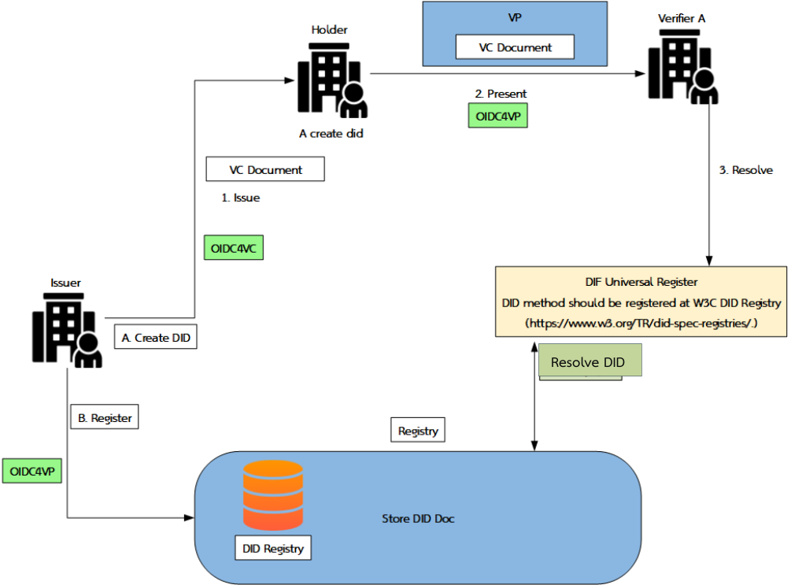

# 15. ภาคผนวก

{/* METADATA (agent-only — not rendered to readers)
> **สถานะ:** 📄 Reference — เอกสารแปลงจาก PDF ต้นฉบับของ สพธอ. (Thai VC ARF v1.1, มกราคม 2568) พร้อมภาคผนวก ข ที่บันทึกการเปลี่ยนแปลงเป็นเวอร์ชัน 2.0
> **แหล่งข้อมูล:** [Thai-VC-ARF-v1-1.pdf](https://www.etda.or.th/getattachment/Our-Service/Digital-Trusted-services-Infrastructure/VC-and-Digital-Document-Wallet/Information/รายงานทางเทคนค-Thai-VC-ARF-v1-1.pdf) — รายงานทางเทคนิค: กรอบแนวทางการทำงานร่วมกันของเอกสารรับรองดิจิทัลสำหรับประเทศไทย
> **เอกสารที่เกี่ยวข้อง:** [ดัชนีเอกสาร ARF](README.md)
*/}

---

ภาคผนวกนี้ประกอบด้วยสองส่วน ได้แก่ ส่วน ก ว่าด้วยการทำงานร่วมกัน (interoperability) ระหว่างผู้ออกเอกสาร (issuer) ผู้ถือเอกสาร (holder) และผู้ตรวจสอบเอกสาร (verifier) และส่วน ข ว่าด้วยบันทึกการเปลี่ยนแปลงจากเวอร์ชัน 1.1 เป็นเวอร์ชัน 2.0

## ก. การทำงานร่วมกัน (Interoperability) ระหว่าง Issuer, Holder และ Verifier

{/* pdf page 53 */}

**รูปที่ 28 ภาพรวมของการศึกษา Digital Document**

การออกแบบแนวทางการ Interoperability ระหว่าง Issuer และ Wallet Holder และ Verifier ในโครงการ แสดงได้ดังรูปที่ 28 โดยมีขั้นตอน ดังนี้

(1) กำหนด Registry สำหรับการทดสอบขึ้นมา 1 Registry เพื่อให้ Issuer ทำการ Register

(2) กำหนด Issuer เพื่อใช้ในการทดสอบ โดย Issuer จะทำการสร้าง DID ไว้ เพื่อใช้สำหรับส่งข้อมูล และทำการ Register กับ Registry ที่ได้ทำการจัดเตรียมไว้

(3) กำหนด Holder เพื่อใช้ในการ Request ข้อมูลกับทาง Issuer และรับข้อมูล VC ที่จะได้จาก Issuer รวมถึงส่งข้อมูลในรูปแบบ VP ให้กับทาง Verifier

(4) กำหนด Verifier เพื่อใช้ในการรับข้อมูล VP จาก Holder พร้อมทั้งต้องตรวจสอบความถูกต้องของข้อมูล ตลอดจนการรับ-ส่งข้อมูลกับทาง DIF Universal Resolver

(5) สร้าง http get เพื่อใช้ในการเข้าถึง Registry พร้อมกับส่งข้อมูลให้กับทาง DIF Universal Resolver

{/* pdf page 54 */}

---

{/* METADATA (agent-only — not rendered to readers)
## ข. บันทึกการเปลี่ยนแปลงจากเวอร์ชัน 1.1 เป็นเวอร์ชัน 2.0

> **ฐานเปรียบเทียบ:** Thai VC ARF เวอร์ชัน 1.1 กับเนื้อหาที่กำหนดสำหรับเวอร์ชัน 2.0 — จัดทำ 4 สิงหาคม 2569

### ข.1 วัตถุประสงค์

บันทึกนี้สรุปการเพิ่มและการเปลี่ยนแปลงสาระสำคัญใน Thai VC ARF เวอร์ชัน 2.0 เพื่อให้ผู้อ่านประเมินผลกระทบต่อการออก การเก็บ และการแสดง Verifiable Credential (VC) ได้โดยไม่ต้องเปรียบเทียบเอกสารทั้งสองฉบับทีละหน้า

คำว่า **ต้อง (MUST)** **ควร (SHOULD)** และ **อาจ (MAY)** ในบันทึกนี้ใช้ตาม RFC 2119 และ RFC 8174 [S01] [S02]

### ข.2 สรุปการเปลี่ยนแปลง

| รหัส | สถานะ | รายการเปลี่ยนแปลง | ผลต่อผู้ดำเนินการ |
|---|---|---|---|
| CHG-01 | เพิ่ม | เพิ่ม Trust Model 3 (Trusted List + DID) เป็นกลไกความน่าเชื่อถือสำหรับ Issuer, Verifier และ Wallet Provider | ผู้เข้าร่วม MUST ตรวจลายมือชื่อ สถานะ บทบาท ช่วงเวลาที่มีผล และสิทธิ์ที่เกี่ยวข้องจาก ETDA Signed Trusted List ก่อนเชื่อถือเอนทิตี |
| CHG-02 | เพิ่ม | เพิ่ม §7 Interoperability อธิบายการทำงานร่วมกันข้าม ecosystem และข้อจำกัดในการเชื่อมโยงกับ EU | ผู้ให้บริการ SHOULD รองรับมาตรฐานเปิดและกำหนด trust mapping ก่อนแลกเปลี่ยนข้อมูลข้าม ecosystem |
| CHG-03 | เพิ่ม | เพิ่ม sequence diagrams สำหรับ OID4VCI และ OID4VP พร้อม trust checkpoints | Implementer MUST ตรวจ trust ก่อนเปิดเผยข้อมูลหรือยอมรับ VC; diagram เป็นคำอธิบายประกอบและไม่แทนข้อกำหนดของมาตรฐานต้นทาง |
| CHG-04 | เปลี่ยน | เปลี่ยนคำและแนวคิดจาก Wallet Trust Evidence (WTE) เป็น Wallet Unit Attestation (WUA) ตาม EUDI ARF 2.9.0 | เอกสารและ implementation ใหม่ MUST ใช้ WUA; การอ้าง WTE เดิม SHOULD ระบุว่าเป็นคำจาก baseline เก่า |
| CHG-05 | เพิ่ม | เพิ่มข้อกำหนด Cryptographic Suites | Profile MUST ระบุ algorithm, key type, curve, key identifier (`kid`) และเงื่อนไขยกเลิกใช้อย่างชัดเจน; ห้ามอนุมาน interoperability จากชื่อ algorithm เพียงอย่างเดียว |
| CHG-06 | เพิ่ม | เพิ่ม Key Management และ Key Rotation | ผู้ควบคุมกุญแจ MUST กำหนด lifecycle, cryptoperiod, overlap, emergency rotation, audit trail และการป้องกัน private key |
| CHG-07 | เพิ่ม | เพิ่ม VC Revocation และ status checking โดยอ้าง IETF Token Status List | Verifier MUST ตรวจ credential status ตาม policy และ MUST กำหนดพฤติกรรมเมื่อข้อมูลสถานะหมดอายุหรือเข้าถึงไม่ได้ |
| CHG-08 | เพิ่ม | เพิ่มบทนิยามใหม่ โดยคงความหมายของนิยามเดิมในเวอร์ชัน 1.1 | ผู้จัดทำ profile SHOULD ใช้คำตามบทนิยามเดียวกันเพื่อลดความคลาดเคลื่อนระหว่างเอกสารและระบบ |
| CHG-09 | เพิ่ม | เพิ่มหลักการเผยแพร่ Trusted List แบบ signed object ผ่าน CDN และ local cache | Consumer MUST เชื่อถือลายมือชื่อของ Trusted List มิใช่ช่องทางเผยแพร่ และ MUST ตรวจ `exp` หรือ `next_update` ก่อนใช้ cache |
| CHG-10 | เพิ่ม | เพิ่มข้อกำหนดด้าน privacy, selective disclosure และ verifier authorization | Wallet MUST แสดง purpose และ claims ที่ร้องขอแก่ผู้ใช้ก่อนให้ความยินยอม และ MUST ไม่ส่งข้อมูลแก่ Verifier ที่ไม่ผ่าน trust policy |
| CHG-11 | เพิ่มหมายเหตุ | เพิ่มหมายเหตุปรับปรุงมาตรฐานใน [§5](05-standards-and-compliance.md) ให้ชี้ไปยัง SD-JWT VC (`dc+sd-jwt`), OID4VCI 1.0 Final และ OID4VP 1.0 Final (พร้อม DCQL) โดยไม่แก้ถ้อยคำตัวอย่างต้นฉบับ v1.1 | ผู้อ่านที่เปิด §5 โดยตรง MUST เห็นหมายเหตุระบุมาตรฐานปัจจุบันและลิงก์ไปยัง §8/§8.1/§8.2 ก่อนนำตัวอย่างในรายงานต้นฉบับไปใช้งานจริง |

### ข.3 รายละเอียดตามหมวด

#### ข.3.1 Trust Model 3 และ Trusted List

เวอร์ชัน 2.0 เพิ่ม Trust Model 3 ซึ่งใช้ DID หรือ key reference ร่วมกับ ETDA Signed Trusted List แทนการใช้สายใบรับรอง X.509 เป็น trust mechanism หลัก รายละเอียดโครงสร้าง การลงทะเบียน การ cache และจุดตรวจอยู่ใน [§9 Trust Model 3](09-trust-model-3.md)

ข้อกำหนดสำหรับผู้ใช้ Trusted List มีอย่างน้อยดังนี้

1. MUST ตรวจลายมือชื่อของ Trusted List และระบุตัว Trusted List signer ที่เชื่อถือได้
2. MUST ตรวจสถานะระดับองค์กรและระดับ service
3. MUST ตรวจ `valid_from`, `valid_until`, `exp` หรือ `next_update` ตาม schema ที่ประกาศใช้
4. MUST ตรวจ role และ `allowed credential types` ก่อนเชื่อถือการออก VC
5. MUST ปฏิเสธข้อมูลเมื่อ trust check ไม่ผ่าน ก่อนเรียก network service อื่นโดยไม่จำเป็น

#### ข.3.2 Interoperability

เวอร์ชัน 2.0 เพิ่มการวิเคราะห์ผลของ Trusted List ต่อ interoperability ในประเทศและข้ามพรมแดนตาม [§7](07-cross-ecosystem-interoperability.md) การใช้ OID4VCI, OID4VP, SD-JWT VC และ DID ร่วมกันช่วยให้แลกเปลี่ยนข้อความมาตรฐานได้ แต่ **มิได้ทำให้เกิดการยอมรับความน่าเชื่อถือข้ามเขตอำนาจโดยอัตโนมัติ**

ผู้ดำเนินการข้าม ecosystem MUST กำหนด trust mapping, governance, liability, status semantics และ assurance level ให้ตรงกันก่อนเปิดใช้งาน ส่วนการเชื่อมโยง EU MAY ใช้ bridge หรือ certificate wrapping ตาม profile ที่ได้รับอนุมัติ แต่ยังไม่ถือว่า Trust Model 3 ได้รับการยอมรับข้ามพรมแดนโดยปริยาย

#### ข.3.3 OID4VCI และ OID4VP

เวอร์ชัน 2.0 เพิ่ม sequence diagrams สำหรับ issuance และ presentation เพื่อแสดงจุดที่ระบบต้องตรวจ Trusted List, WUA, issuer key, verifier authorization และ credential status

- OID4VCI flow MUST ตรวจ Issuer และ Wallet Provider ตาม trust policy ก่อนออกหรือบันทึก VC
- OID4VP flow MUST ตรวจ Verifier ก่อนเปิดเผยข้อมูล และ Verifier MUST ตรวจ Issuer, credential status และ holder binding ก่อนยอมรับผล
- ทุก flow MUST มี timeout, error path และพฤติกรรมที่กำหนดไว้เมื่อข้อมูล trust หรือ status ไม่พร้อมใช้งาน

#### ข.3.4 WTE เปลี่ยนเป็น WUA

คำว่า Wallet Trust Evidence (WTE) ใน baseline เดิมถูกแทนด้วย Wallet Unit Attestation (WUA) ตาม EUDI ARF 2.9.0 [S07] WUA ใช้ยืนยันคุณลักษณะและสถานะที่เกี่ยวข้องกับ Wallet Unit ตาม profile ที่กำหนด การเปลี่ยนชื่อไม่อนุญาตให้ระบบข้ามการตรวจ issuer, validity, key binding หรือ status ของ WUA

ข้อความใหม่ MUST ใช้คำว่า WUA การเก็บคำว่า WTE ไว้ MAY ทำได้เฉพาะในเชิงประวัติหรือการอ้างเอกสารเวอร์ชัน 1.1 โดยต้องระบุว่าเป็นคำที่เลิกใช้ในเวอร์ชัน 2.0

#### ข.3.5 Security

เวอร์ชัน 2.0 เพิ่มหมวด security ตามข้อเสนอจากการรับฟังความเห็นอุตสาหกรรม [S10]

- Cryptographic profile MUST ระบุชุดอัลกอริทึมที่อนุญาตและวิธี algorithm negotiation/downgrade prevention
- Private signing key MUST ได้รับการป้องกันตามระดับความเสี่ยง และการใช้กุญแจ MUST มี audit trail ที่ตรวจสอบย้อนหลังได้
- Key rotation MUST รองรับ `kid`, overlap และ emergency revocation โดยไม่ทำให้การตรวจ VC ที่ออกก่อนหน้าผิดพลาดเกิน policy
- Status mechanism MUST ป้องกัน replay ของข้อมูลสถานะเก่า และ Verifier MUST ตรวจ freshness ก่อนตัดสินใจ
- การใช้ local cache MAY ทำได้ภายในอายุที่กำหนดเท่านั้น; policy MUST ระบุ fail-open หรือ fail-closed แยกตามระดับความเสี่ยง

#### ข.3.6 หมายเหตุปรับปรุงมาตรฐานใน §5 (MASA-169)

[§5](05-standards-and-compliance.md) เดิมคงถ้อยคำและตัวอย่างจากรายงานต้นฉบับ v1.1 ไว้ทั้งหมด (JSON-LD VC/VP, OID4VC draft 13, OID4VP draft 20) โดยยังไม่มีหมายเหตุชี้ว่ามาตรฐานที่ประกาศใช้จริงในเวอร์ชัน 2.0 เปลี่ยนไปแล้ว (ต่างจาก [§8](08-implementation-guidelines.md) ที่ปรับตามงาน MASA-158 ไปก่อนหน้า) งาน MASA-169 แก้ช่องว่างนี้โดยเพิ่มหมายเหตุกำกับในบทดังกล่าว (ไม่แก้ถ้อยคำตัวอย่างต้นฉบับ ตามหลักการเดียวกับที่ใช้ในบทที่ 1–8 อื่น ๆ) ระบุว่าเวอร์ชัน 2.0 ใช้:

- **SD-JWT VC (`dc+sd-jwt`)** [12] แทนเค้าร่าง JSON-LD — เพิ่มเป็น §5.1.1 และ §5.2.1
- **OID4VCI 1.0 Final** [10] แทน OID4VC draft 13 — เพิ่มหมายเหตุใน §5.3
- **OID4VP 1.0 Final พร้อม DCQL** [11] แทน OID4VP draft 20 — เพิ่มหมายเหตุใน §5.4

ทุกหมายเหตุชี้กลับไปยัง [§8](08-implementation-guidelines.md), [§8.1](08.1-issuance-full-flow-detail.md) และ [§8.2](08.2-oid4vp-full-flow-detail.md) ซึ่งเป็นแหล่งรายละเอียดทางเทคนิคระดับ field-by-field ของเวอร์ชัน 2.0 อยู่แล้ว จึงไม่มีการเขียนตัวอย่างซ้ำใน §5

> **หมายเหตุ:** แนวทางแบบ "เพิ่มหมายเหตุกำกับ" ในข้อ ข.3.6 ถูกแทนที่ด้วยแนวทาง "แทนที่เนื้อหาทั้งบท" ตามข้อ ข.3.7 ด้านล่าง (MASA-170) รายละเอียดในข้อนี้คงไว้เป็นบันทึกประวัติการเปลี่ยนแปลงตามกฎ Version History Protection มิใช่สถานะปัจจุบันของ [§5](05-standards-and-compliance.md)

#### ข.3.7 แทนที่เนื้อหา §5 ทั้งบทด้วยมาตรฐานเวอร์ชัน 2.0 (MASA-170)

หลังจากงาน MASA-169 เพิ่มหมายเหตุกำกับตามข้อ ข.3.6 คณะกรรมการทบทวนเห็นว่าแนวทาง "คงถ้อยคำเดิมพร้อมหมายเหตุ" ทำให้ผู้อ่านต้องเทียบสองมาตรฐานพร้อมกันในบทเดียว (SD-JWT VC กับ JSON-LD, OID4VCI 1.0 Final กับ OID4VC draft 13, OID4VP 1.0 Final กับ OID4VP draft 20) ทั้งที่ระบบใช้งานจริงเพียงชุดเดียว จึงมีมติให้ **แทนที่เนื้อหาทั้งบทแทนการเพิ่มหมายเหตุ** งาน MASA-170 จึงเขียน [§5](05-standards-and-compliance.md) ใหม่ทั้งหมดตามหลักการนี้:

- **ไม่คงตัวอย่างหรือถ้อยคำจากรายงานต้นฉบับเวอร์ชัน 1.1** — เค้าร่างเอกสาร JSON-LD ในตัวอย่างที่ 1–2 (§5.1–§5.2 เดิม) และการอ้างอิง OID4VC draft 13 / OID4VP draft 20 (§5.3–§5.4 เดิม) ถูกลบออกทั้งหมด แทนที่ด้วยตัวอย่างและคำอธิบายของมาตรฐานที่ประกาศใช้จริงโดยตรง
- **§5.1–§5.2** เขียนใหม่ให้ใช้ **SD-JWT VC (`dc+sd-jwt`)** [12] เป็นเค้าร่างเดียว อธิบายโครงสร้าง Issuer-signed JWT / Disclosures / Key Binding JWT (KB-JWT) พร้อมตัวอย่าง JSON ที่ตัดตรงจากมาตรฐาน แทนที่ตัวอย่าง JSON-LD เดิม และปรับขั้นตอนตรวจสอบ VP ให้ตรงกับกลไก selective disclosure ของ SD-JWT
- **§5.3** เขียนใหม่ให้ใช้ **OID4VCI 1.0 Final** [10] โดยตรง (ลบข้อความ "draft Version 13" ทั้งหมด) และปรับตัวอย่าง Metadata/Credential Request ให้ใช้ `format: "dc+sd-jwt"`, `credential_configuration_id` และโครงสร้าง `claims` ตามที่ [§8.1](08.1-issuance-full-flow-detail.md) ใช้งานจริง
- **§5.4** เขียนใหม่ให้ใช้ **OID4VP 1.0 Final พร้อม DCQL** [11] โดยตรง (ลบข้อความ "draft 20" และ Presentation Exchange ทั้งหมด) และปรับตัวอย่าง Authorization Request/Response ให้ใช้ `dcql_query` แทน `presentation_definition`/`presentation_definition_uri` ตามที่ [§8.2](08.2-oid4vp-full-flow-detail.md) ใช้งานจริง
- **เหตุผลที่เปลี่ยน** ระบุไว้ในกล่องเหตุผลที่ต้นบท [§5](05-standards-and-compliance.md): SD-JWT VC รองรับ selective disclosure ระดับ field โดยไม่ต้องสังเคราะห์ VP ทั้งฉบับ และเป็นรูปแบบเดียวที่ OID4VCI/OID4VP ฉบับทางการรองรับโดยตรง ส่วน OID4VCI/OID4VP 1.0 Final เป็นฉบับทางการที่แทนที่ฉบับร่างที่ใช้ในรายงานต้นฉบับแล้ว
- **ไม่กระทบ** [§8](08-implementation-guidelines.md), [§8.1](08.1-issuance-full-flow-detail.md), [§8.2](08.2-oid4vp-full-flow-detail.md) และ [§11](11-cryptographic-suites.md) ซึ่งใช้มาตรฐานชุดนี้อยู่แล้วตั้งแต่ก่อนงาน MASA-158 — งานนี้ทำให้ [§5](05-standards-and-compliance.md) สอดคล้องกับบทเหล่านั้น

#### ข.3.8 แก้ไขข้อความอ้างอิง W3C VC Data Model v1.1 ที่ตกค้าง (MASA-170)

หลังจากงาน MASA-170 แทนที่เนื้อหา [§5](05-standards-and-compliance.md) ทั้งบทตามข้อ ข.3.7 คณะกรรมการทบทวนตรวจพบว่ายังมีประโยคตกค้างจากรายงานต้นฉบับ 5 จุดที่ระบุว่ารายงานฉบับนี้ "อ้างอิงโครงสร้างตาม W3C VC Data Model v1.1" หรือ "ตามมาตรฐานของ World Wide Web Consortium (W3C)" ซึ่งขัดแย้งกับเนื้อหาส่วนอื่นของบทเดียวกันที่ระบุว่าเค้าร่างเอกสารรับรองเปลี่ยนเป็น SD-JWT VC แล้ว จึงแก้ไขให้สอดคล้องกันทั้งบท ดังนี้:

- ย่อหน้าเปิดบท (ก่อน §5.0): ตัดข้อความ "จะอ้างอิงรูปแบบเอกสารรับรองตามโครงสร้าง W3C VC Data Model v1.1 [5]" ออก ระบุแทนว่ารายงานฉบับนี้**ไม่**อ้างอิงโครงสร้างดังกล่าวอีกต่อไป
- §5.1 และ §5.2 (โครงสร้าง VC และ VP): แก้ประโยค "อ้างอิงโครงสร้างตาม World Wide Web Consortium (W3C) [5]" เป็นระบุตรงว่าทั้ง 3 ส่วนบันทึกตามเค้าร่าง IETF SD-JWT VC (`dc+sd-jwt`) [12] ไม่ใช่โครงสร้าง W3C VC Data Model v1.1 [5]
- §5.1 ข้อเปรียบเทียบ claim `vct`: ระบุชัดว่า `type` ตามโครงสร้าง W3C VC Data Model v1.1 เป็นคุณสมบัติที่รายงานต้นฉบับเวอร์ชัน 1.1 เคยใช้ และไม่ใช้แล้วในเวอร์ชัน 2.0
- §5.3 (OID4VCI): ตัดวลี "รองรับมาตรฐานเอกสารรับรองหลากหลายรูปแบบ รวมถึง W3C Verifiable Credentials" ระบุแทนว่ารายงานฉบับนี้เลือกใช้เฉพาะ SD-JWT VC เพียงรูปแบบเดียว
- กล่องเหตุผลที่ต้นบท: เพิ่มประโยคยืนยันชัดเจนว่าไม่อ้างอิง W3C VC Data Model v1.1 อีกต่อไป

การแก้ไขนี้ไม่เปลี่ยนแปลงเนื้อหาทางเทคนิคที่ประกาศใช้จริง (ยังเป็น SD-JWT VC, OID4VCI 1.0 Final, OID4VP 1.0 Final พร้อม DCQL ตามข้อ ข.3.7 เดิม) เป็นเพียงการแก้ถ้อยคำอ้างอิงที่ไม่สอดคล้องกันภายในบทเดียวกันให้ถูกต้องตรงกันทั้งหมด

> **สถานะปัจจุบันของ 2.0 DRAFT 0:** ข้อความใน ข.3.6–ข.3.8 บันทึกการแก้ไขเอกสารในอดีต ไม่ใช่ข้อกำหนดให้เลิกใช้ JSON-LD VC ระบบยังรองรับรูปแบบเดิมตาม W3C VC Data Model ควบคู่กับ SD-JWT VC (`dc+sd-jwt`) โดย [§5](05-standards-and-compliance.md) แสดงตัวอย่างโปรไฟล์ SD-JWT เป็นหลัก

### ข.4 Traceability

> **อัปเดต 4 สิงหาคม 2569 (รอบตรวจ QA gate ครั้งที่ 2):** S2–S8 ทั้งหมดถูกรวมเข้า canonical tree `th/thai-vc-arf/` + `en/thai-vc-arf/` แล้วผ่านคอมมิต integration (`docs(arf-v2.0): integrate S0,S1,S3,S4,S5,S6,S9`) และคอมมิต fix ตามหลัง (S6/S8 gap recovery, cross-language link fix) ตารางด้านล่างปรับสถานะและ path ให้ตรงกับ repository จริง ณ เวลาที่ตรวจ ไม่ใช่สถานะเมื่อครั้งจัดทำฉบับร่างแรก

| รหัส | หัวข้อในเวอร์ชัน 2.0 | แหล่งภายใน | แหล่งมาตรฐานหลัก | สถานะการรวม ณ วันที่จัดทำ |
|---|---|---|---|---|
| CHG-01 | Trust Model 3 | [§9](09-trust-model-3.md) | W3C DID Core [S05] | รวมแล้ว (S2, MASA-123) |
| CHG-02 | Interoperability | [§7](07-cross-ecosystem-interoperability.md) | OID4VCI [S03], OID4VP [S04] | รวมแล้ว (S4, MASA-125) |
| CHG-03 | OID4VCI/OID4VP sequences | [§8](08-implementation-guidelines.md) | OID4VCI [S03], OID4VP [S04] | รวมแล้ว (S5 รายละเอียดและ S7 ภาพรวมวงจรชีวิต end-to-end รวมอยู่ที่ §8, MASA-126/128) |
| CHG-04 | WUA | [§10](10-wallet-unit-attestation.md) | EUDI ARF 2.9.0 [S07] | รวมแล้ว (S6, MASA-127); ย้ายจากคำอธิบายใน §9.2 มาเป็นบทเฉพาะ §10 |
| CHG-05 | Cryptographic Suites | [§11](11-cryptographic-suites.md) | JOSE/JWS และ profile ที่อนุมัติ [S08] | รวมแล้ว (S8, MASA-129 → MASA-135 → แยกบทที่ MASA-150) |
| CHG-06 | Key Management/Rotation | [§12](12-key-management-and-trustlist-deployment.md) | NIST SP 800-57 Part 1 Rev.5 [S09] | รวมแล้ว (S8, MASA-129 → MASA-135 → แยกบทที่ MASA-150) |
| CHG-07 | VC Revocation | [§13](13-vc-status-and-revocation.md) | IETF Token Status List [S06] | รวมแล้ว (S8, MASA-129 → MASA-135 → แยกบทที่ MASA-150) |
| CHG-08 | Definitions | [§2](02-definitions.md) | คำศัพท์จาก [S03]–[S07] | รวมแล้ว (S3, MASA-124); นิยามเดิมคงอยู่ เพิ่มข้อ 2.23–2.42 |
| CHG-09 | CDN/cache | [§9.3 และ §9.9](09-trust-model-3.md) | Signed-object security model [S08] | รวมแล้ว |
| CHG-10 | Privacy/authorization | [§8](08-implementation-guidelines.md) | OID4VP [S04] | รวมแล้ว; ผ่าน QA gate อัตโนมัติ (traceability/RFC2119/mermaid/link/README/KNOWLEDGE.yaml) — ดู ข.4.1 |
| CHG-11 | แทนที่เนื้อหา §5 ทั้งบทด้วยมาตรฐานเวอร์ชัน 2.0 | [§5](05-standards-and-compliance.md) | OID4VCI 1.0 Final [10], OID4VP 1.0 Final [11], SD-JWT VC [12] | รวมแล้ว (MASA-169 เพิ่มหมายเหตุ → MASA-170 แทนที่เต็มรูปแบบ → MASA-170 แก้ข้อความ W3C VC Data Model v1.1 ตกค้าง) — ดู ข.3.6, ข.3.7, ข.3.8 |

#### ข.4.1 QA gate ล่าสุด

- รัน `scripts/qa/run_all.sh` วันที่ 4 สิงหาคม 2569 เวลา 08:51 UTC — ผลลัพธ์ ✅ PASS (Critical 0, Major 0, Minor 7, Suggestion 0)
- ข้อค้นพบระดับ Minor ที่เหลือเป็นสำนวนภาษาไทยในเนื้อหาฐานเวอร์ชัน 1.1 (§5 และ §6) ซึ่งคงไว้ตรงตามต้นฉบับ PDF เพื่อรักษาความตรง 1:1 กับต้นฉบับ จึงไม่ปรับถ้อยคำในส่วนนี้ ไม่กระทบความถูกต้องเชิงเทคนิค
- `link_check`, `mermaid_syntax_check`, `traceability_check`, `readme_sync_check`, `knowledge_yaml_sync_check` ผ่านทั้งหมดโดยไม่มีข้อค้นพบ

> **ข้อเท็จจริง:** ตารางนี้ระบุสถานะไฟล์ใน repository ณ วันที่จัดทำ ไม่ใช่ผลรับรอง conformance ของระบบจริง

### ข.5 การจัดประเภทข้อความ

#### ข้อเท็จจริง

- OID4VCI 1.0 และ OID4VP 1.0 เป็น Final Specification ของ OpenID Foundation [S03] [S04]
- W3C DID Core 1.0 เป็น W3C Recommendation ลงวันที่ 19 กรกฎาคม 2022 [S05]
- EUDI ARF มีเอกสารเวอร์ชัน 2.9.0 ที่ใช้คำว่า Wallet Unit Attestation [S07]
- IETF Token Status List ยังเป็น Internet-Draft ณ วันที่เข้าถึง จึงอาจเปลี่ยนแปลงก่อนเป็น RFC [S06]

#### ข้อวิเคราะห์

- Trust Model 3 ลดการพึ่ง CA สำหรับ entity trust ภายในประเทศ แต่ยังต้องมี trust anchor, governance, audit และ revocation ที่ตรวจสอบได้
- การรองรับ protocol เดียวกันไม่เพียงพอต่อ cross-border trust หาก assurance, liability และ trusted-list semantics ไม่ตรงกัน
- อายุ cache ที่ยาวขึ้นเพิ่ม availability แต่ทำให้ช่วงเวลาที่ระบบอาจไม่เห็นการเพิกถอนยาวขึ้น

#### สมมติฐานและช่องว่าง

- สมมติให้ สพธอ. เป็นผู้กำกับดูแลและลงลายมือชื่อ Trusted List; รูปแบบอำนาจตามกฎหมายและ operating model ต้องได้รับมติแยกต่างหาก
- ค่า TTL, cryptoperiod, overlap, fail-open/fail-closed และ assurance mapping ยังต้องได้รับอนุมัติจากผู้มีอำนาจกำกับ
- เนื้อหาจาก S2–S8 รวมเข้า canonical tree ครบแล้ว ณ วันที่ตรวจปรับปรุงนี้ (4 สิงหาคม 2569); ตาราง traceability ใน §ข.4 ปรับให้ตรงกับสถานะปัจจุบัน อย่างไรก็ตาม MASA-131 (QA Gate ก่อนเผยแพร่จริง) และ MASA-132 (Publish/build Docusaurus + เปิด MR) ยังอยู่ระหว่างดำเนินการ — เอกสารนี้จึงยังเป็นสถานะ **Draft for approval** จนกว่าทั้งสอง milestone จะปิด

### ข.6 แนวทางย้ายจากเวอร์ชัน 1.1

1. ผู้ดูแลเอกสาร MUST เปลี่ยนคำ WTE เป็น WUA ในข้อกำหนดที่มีผลบังคับ และคง WTE ไว้เฉพาะข้อความเชิงประวัติ
2. ผู้ให้บริการ MUST จัดทำรายการ trust checkpoints ของ OID4VCI และ OID4VP ให้สอดคล้องกับ §9
3. ผู้ให้บริการ MUST เพิ่ม key lifecycle และ credential status policy ก่อนประกาศ conformance กับเวอร์ชัน 2.0
4. ผู้ให้บริการ SHOULD ตรวจ interoperability กับ profile คู่เชื่อมต่อโดยใช้ test evidence ที่ตรวจสอบย้อนกลับได้
5. ผู้ดูแลเอกสาร MUST ปิดรายการ “รอรวม” ใน §ข.4 และ QA ลิงก์ Mermaid และ reference ก่อนเผยแพร่

### ข.7 แหล่งอ้างอิง

- [S01] IETF, **RFC 2119 — Key words for use in RFCs to Indicate Requirement Levels**, March 1997, https://www.rfc-editor.org/rfc/rfc2119 — เข้าถึง 4 สิงหาคม 2569
- [S02] IETF, **RFC 8174 — Ambiguity of Uppercase vs Lowercase in RFC 2119 Key Words**, May 2017, https://www.rfc-editor.org/rfc/rfc8174 — เข้าถึง 4 สิงหาคม 2569
- [S03] OpenID Foundation, **OpenID for Verifiable Credential Issuance 1.0**, Final, 16 September 2025, https://openid.net/specs/openid-4-verifiable-credential-issuance-1_0.html — เข้าถึง 4 สิงหาคม 2569
- [S04] OpenID Foundation, **OpenID for Verifiable Presentations 1.0**, Final, 9 July 2025, https://openid.net/specs/openid-4-verifiable-presentations-1_0.html — เข้าถึง 4 สิงหาคม 2569
- [S05] W3C, **Decentralized Identifiers (DIDs) v1.0**, W3C Recommendation, 19 July 2022, https://www.w3.org/TR/did-core/ — เข้าถึง 4 สิงหาคม 2569
- [S06] IETF OAuth Working Group, **Token Status List**, Internet-Draft (current draft at URL), https://datatracker.ietf.org/doc/draft-ietf-oauth-status-list/ — เข้าถึง 4 สิงหาคม 2569
- [S07] European Commission, **European Digital Identity Wallet Architecture and Reference Framework**, version 2.9.0, https://eudi.dev/2.9.0/main/ — เข้าถึง 4 สิงหาคม 2569
- [S08] IETF, **RFC 7515 — JSON Web Signature (JWS)**, May 2015, https://www.rfc-editor.org/rfc/rfc7515 — เข้าถึง 4 สิงหาคม 2569
- [S09] NIST, **SP 800-57 Part 1 Rev.5 — Recommendation for Key Management: Part 1 — General**, May 2020, https://csrc.nist.gov/pubs/sp/800/57/pt1/r5/final — เข้าถึง 4 สิงหาคม 2569
- [S10] คณะทำงาน VC, **Trusted List 3 Models Industry Survey**, repository revision ณ 4 สิงหาคม 2569 — [research/37-trustlist-3models-industry-survey.md](../research/37-trustlist-3models-industry-survey.md) — เข้าถึง 4 สิงหาคม 2569 (ยืนยันแล้วว่าไฟล์อยู่ใน branch `docs/arf-v2.0` / `origin/main` ปัจจุบัน)

---
*/}

**การนำทาง:** [⬅️ บทที่ 13 — VC Status และ Revocation](13-vc-status-and-revocation.md) · [⬆️ สารบัญ ARF](README.md) · [บทที่ 16 — บรรณานุกรม ➡️](16-bibliography.md)
